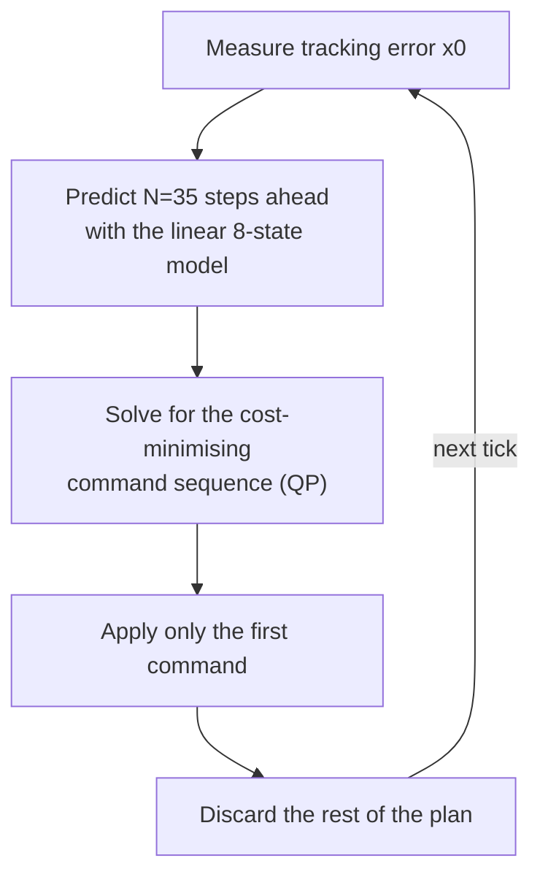

# The LTV-QP Controller (LMPC)

Reference for `MPCController`, the project's original controller: a linear time-varying model predictive controller solved as one convex quadratic program (QP) per tick. The nonlinear alternative is in [nmpc.md](nmpc.md) and the non-predictive one in [stanley.md](stanley.md). The by-hand arithmetic behind `e_y` and `e_psi` is in [error_states.md](../reference/error_states.md).

## What it does

**What it does.** Every 50 ms the controller measures how far the car is from the path, predicts the next 1.75 s with a simplified linear model of the car, and picks the steering and acceleration sequence that keeps the error small without jerking the controls. It applies only the first command and re-plans next tick. Because it re-plans from a fresh measurement each time, the simplified model does not need to be exact.

**Which runs use it.** NMPC is selected by `use_nmpc`, so the answer depends on the layer:

| Where | Controller | Source |
|---|---|---|
| `ros2/launch_all.sh` (`USE_NMPC=true`) | NMPC | launch arg overrides the defaults below |
| `NMPCParams.use_nmpc` dataclass and `fsae_params.yaml` | LMPC | `false` |
| Offline rollout and tuner (`settings.USE_NMPC`) | LMPC | `False` in `settings/nmpc.py` |

**Known weakness.** The model treats the road ahead as pointing the same way for the whole horizon, so with the car on line and a corner coming it plans "stay on line". It cannot begin turning before real error exists. NMPC exists to close that gap and turns in earlier (see the measured pair in [nmpc.md](nmpc.md)). The linear controller stays useful as the fast, convex, well-understood baseline and as the plant for the offline tuner.

## Why linear, and why a QP

- **Why a QP:** a quadratic cost with linear constraints is a QP, a class with fast solvers and a guaranteed global optimum every tick. The cost is built from squared errors for exactly this reason.
- **Why the car model is linearised:** the real plant ([vehicle_physics.md](../reference/vehicle_physics.md)) has saturating tyres and weight transfer. Planning against it directly would give a nonlinear program with no guaranteed optimum and unpredictable solve times. A linear model that is re-linearised at the current speed every tick is good near the current operating point, and the plant is used only to simulate what the real car does.
- **What the linearisation costs:** the model contains no path curvature, which is the weakness above. Workarounds that reweighted today's cost from a forward scan were tried and deleted, see [retired_mechanisms.md](../reference/retired_mechanisms.md).

## How it works

### The controller re-plans every tick and applies the first step



Terms used below:

- **State `x`:** the numbers that describe where things stand. Here it is error relative to the path, not map position.
- **Input `u`:** what the controller chooses each tick, a steering angle command and an acceleration command.
- **Model:** the rule "given `x` and `u`, what is the state one step later". Here a bicycle model, one wheel per axle on the centreline.
- **Cost function:** one number that scores how bad a candidate plan is. The solver searches for the input sequence that minimises it.

The tick is 0.05 s (20 Hz). `MPCController(dt=0.05, N=35)` is built with the horizon hardcoded in `mpc_controller.py`. Offline the horizon is `settings.N_HORIZON = 35`. Both must match for tuned weights to transfer.

### The state is an 8-vector of path errors

```
x = [e_y, e_y_dot, e_psi, e_psi_dot, e_v, e_a, delta_act, a_act]
u = [delta_cmd, a_cmd]
```

| # | Symbol | Meaning | Units |
|---|---|---|---|
| 0 | `e_y` | lateral distance of the front axle from the path (positive left) | m |
| 1 | `e_y_dot` | rate of change of `e_y` | m/s |
| 2 | `e_psi` | heading error, car yaw minus path tangent | rad |
| 3 | `e_psi_dot` | measured yaw rate `r` (named `r` in the live code) | rad/s |
| 4 | `e_v` | speed error, current speed minus target speed | m/s |
| 5 | `e_a` | placeholder, always driven toward 0 | m/s squared |
| 6 | `delta_act` | steering angle reached so far, after actuator lag | rad |
| 7 | `a_act` | acceleration reached so far, after actuator lag | m/s squared |

- **Why states 6 and 7:** a real steering rack and throttle ease toward a command with a first-order lag (`tau_delta = 0.08 s`, `tau_a = 0.02 s`). Tracking the lagged value lets the model predict the car's motion correctly.
- **State 3 is the raw yaw rate.** The reference frame's own rotation is absent, which is the structural weakness above. NMPC uses `r - kappa*s_dot` instead.
- **State 5 exists for structure only.** It has no target and no lever, so `Q[5,5]` stays 0.
- **`e_v`'s target is frozen for the horizon.** One `desired_speed` is computed per solve and baked into `x0[4]`. Nothing in the matrices re-references it at later steps, so the cost penalises deviation from the same target at every predicted step. The solve repeats every 50 ms with a fresh target, so a stale in-horizon reference corrects within a tick. It matters when debugging speed behaviour approaching a corner whose onset falls inside the horizon.
- **Live target-speed filter:** the live `compute()` low-passes `desired_speed` with a hardcoded alpha of 0.08 before use. No matching filter exists in the offline linear path (see the parity list below).

#### How the error vector is measured

`_error_state()` finds the nearest path point to the car's front axle (`car_pos + lf*[cos(yaw), sin(yaw)]`, `lf = 0.70`), takes the path tangent there, and projects the offset onto the tangent's perpendicular for the signed `e_y`. `e_psi` is car yaw minus tangent heading, wrapped to `[-pi, pi]`. `e_y_dot = v_x*sin(e_psi) + v_y*cos(e_psi)`. It also samples curvature `kappa` about 1 m ahead for the gain schedule. Offline the same job is done by `plant_to_tracking_error()` in `model/vehicle_physics/tracking.py`.

This is a Frenet-frame measurement (distance along the path plus offset across it). NMPC measures its current error the same way. The difference between the controllers is what happens to that error across the horizon, see [nmpc.md](nmpc.md).

### The prediction model blends a kinematic and a dynamic bicycle

`ẋ = A·x + B·u`, where `A` (8 by 8) and `B` (8 by 2) are tables of fixed multipliers. Entry `A[row, col]` says how much state `col` feeds the rate of change of state `row`. Two physical assumptions give two versions of `A`, and `B` is the same for both. The offline copy is `model/bicycle_model.py`. The live copy is `_discrete_model()` in `fsae_control/lmpc/controller.py`.

#### Kinematic model, below 1 m/s

At crawling speed tyres have built no sideways grip and the car turns by geometry, like a shopping trolley.

```
ė_y   = v_x · e_psi
ė_psi = v_x · delta_act / L        (L = lf + lr)
```

Sideways drift needs forward motion to convert heading error into it, and a longer wheelbase turns more slowly for the same steering angle.

```
        e_y   e_y_dot  e_psi  e_psi_dot   e_v    e_a   delta_act  a_act
e_y   [  0      0      v_x       0         0      0        0        0   ]
e_y_dot[ 0      0       0        0         0      0        0        0   ]
e_psi [  0      0       0        0         0      0      v_x/L      0   ]
e_psi_dot[0     0       0        0         0      0        0        0   ]
e_v   [  0      0       0        0         0      1        0        0   ]
e_a   [  0      0       0        0         0      0        0        1   ]
delta_act[0     0       0        0         0      0     -1/tau_δ    0   ]
a_act [  0      0       0        0         0      0        0    -1/tau_a]
```

```python
A_kin[0, 2] = v_x_safe          # ė_y = v_x * e_psi
A_kin[2, 6] = v_x_safe / L      # ė_psi = v_x/L * delta_act  (Ackermann geometry)
```

#### Dynamic model, above 2.5 m/s

Tyre grip (cornering stiffness times slip angle) dominates. This is the standard linearised bicycle model from Newton's laws for a rigid body in a plane, assuming small slip angles.

```
ë_y   = -(2Cf+2Cr)/(m·vx) · ė_y  +  (2Cf+2Cr)/m · e_psi
        + (-2Cf·lf+2Cr·lr)/(m·vx) · e_psi_dot  +  (2Cf)/m · delta_act

ë_psi = (-2Cf·lf+2Cr·lr)/(Iz·vx) · ė_y  +  (2Cf·lf-2Cr·lr)/Iz · e_psi
        - (2Cf·lf²+2Cr·lr²)/(Iz·vx) · e_psi_dot  +  (2Cf·lf)/Iz · delta_act
```

`Cf` and `Cr` are front and rear cornering stiffness (N/rad), `lf` and `lr` are the distances from the centre of mass to each axle, `m` is mass and `Iz` is yaw inertia. The 1/vx terms exist because at higher speed the same sideways drift gives a smaller slip angle, so grip builds more gradually.

```python
A_dyn[0, 1] = 1.0                                          # ė_y = e_y_dot
A_dyn[1, 1] = -(2*Cf + 2*Cr) / (m * v_x_safe)              # lateral damping
A_dyn[1, 2] = (2*Cf + 2*Cr) / m                             # heading error -> lateral accel
A_dyn[1, 3] = (-2*Cf*lf + 2*Cr*lr) / (m * v_x_safe)         # yaw rate -> lateral accel
A_dyn[1, 6] = (2*Cf) / m                                    # steering -> lateral force
A_dyn[2, 3] = 1.0                                           # ė_psi = e_psi_dot
A_dyn[3, 1] = (-2*Cf*lf + 2*Cr*lr) / (Iz * v_x_safe)        # lateral velocity -> yaw moment
A_dyn[3, 2] = (2*Cf*lf - 2*Cr*lr) / Iz                      # heading error -> yaw moment
A_dyn[3, 3] = -(2*Cf*lf**2 + 2*Cr*lr**2) / (Iz * v_x_safe)  # yaw damping, both axles
A_dyn[3, 6] = (2*Cf * lf) / Iz                               # steering -> yaw moment
```

The lateral equation is second order, so `e_y_dot` needs its own row (`ė_y = e_y_dot`, entry `[0,1] = 1`) before row 1 can say how it accelerates. That is why the dynamic model needs `e_y` and `e_y_dot` as separate states while the kinematic model barely uses `e_y_dot`.

#### Shared rows and the input matrix

Rows 4 to 7 are identical in both models:

```python
A[4, 5] = 1.0                 # ė_v = e_a
A[5, 7] = 1.0                 # ė_a = a_act (structural)
A[6, 6] = -1.0 / tau_delta    # delta_act decays toward 0 with no input
A[7, 7] = -1.0 / tau_a
B[6, 0] = 1.0 / tau_delta     # delta_cmd pulls delta_act toward the command
B[7, 1] = 1.0 / tau_a         # a_cmd pulls a_act toward the command
```

Rows 6 of `A` and `B` together give the first-order lag `d(delta_act)/dt = (delta_cmd - delta_act) / tau_delta`. All other `B` entries are 0.

#### Blending and discretising

```python
alpha = clip((v_x - 1.0) / (2.5 - 1.0), 0.0, 1.0)
A_c   = (1.0 - alpha) * A_kin + alpha * A_dyn
```

A single linear model cannot cover the speed range. The kinematic model breaks once tyres slide, and the dynamic model's 1/vx terms blow up near zero speed. A linear blend avoids a visible jump at a switch-over speed. `B` needs no blending.

The controller acts once per `dt = 0.05 s` and holds the command between ticks. The exact discretisation for a held input is zero-order hold, computed with one matrix exponential of an augmented matrix, which avoids inverting `A_c`:

```python
M[:8, :8] = A_c
M[:8, 8:] = B_c
Md = scipy.linalg.expm(M * dt)
Ad, Bd = Md[:8, :8], Md[:8, 8:]      # x[k+1] = Ad x[k] + Bd u[k]
```

The zero-order-hold form is exact for this input pattern. A plain Euler step accumulates error at every step.

#### Sparsity: matrices start at 1e-12, not zero

OSQP analyses which entries are nonzero on its first solve and caches that pattern. If a later solve produces an entry that rounds to exactly zero where it was nonzero before (terms like 1/vx shrink as speed changes), the cached factorisation is invalid and OSQP throws a reallocation error. Initialising every entry to `1e-12` keeps the pattern identical at every speed.

### The cost and constraints define the QP

Over the horizon each solve minimises:

```
min  sum_i || sqrt(Q) * x[:,i] ||²                       tracking error, all N+1 states
   + sum_i || sqrt(R) * u[0,i] ||²                       steering effort
   + r_a_accel * sum pos(u[1,i])² + r_a_brake * sum neg(u[1,i])²    accel / brake effort
   + sum_i || sqrt(R_rate) * du[:,i] ||²                 change from one step to the next
   + (terminal_q_scale - 1) * || sqrt(Q) * x[:,N] ||²    extra terminal weight (1.0 = none)
   + W_slack * || slack ||²                              soft lane-boundary violation, W_slack = 10000

subject to
   x[:,0] = x0                                  start at the measured state
   x[:,k+1] = Ad x[:,k] + Bd u[:,k]             obey the linear model
   u_min <= u <= u_max                          steering +-25 deg, a_cmd in [-7.0, 12.0]
   |u[:,k] - u[:,k-1]| <= du_max                hard slew limit, including step 0 against u_prev
   -3.5 - slack <= e_y <= 3.5 + slack           soft +-3.5 m corridor
```

- **Weights are given as square roots** (`sqrtQ` and so on) so the cost can use `cp.sum_squares`, which CVXPY maps onto OSQP's quadratic form. `||sqrt(w)*x||² = w*x²`, so this is a numerical convenience, not a change in what is penalised.
- **Accel and brake are split by sign.** `pos(x)² + neg(x)² = x²`, so equal weights reproduce a single effort cost exactly. Splitting lets braking be tuned independently of acceleration. `R[1,1]` is a nominal value only and no longer read for `a_cmd`.
- **Two rate-cost pieces.** Step 0 compares against the last command sent (`u_prev`). Steps 1 to N-1 compare each step against the previous predicted step (`cp.diff`).
- **Slew limit:** `du_max = [180 deg/s * 0.05 s, 0.6]` per tick, on both sides. The offline value comes from `VehicleParams.max_steer_rate * DT`. Without it the tuner would optimise against a plant whose steering could change arbitrarily fast while the real car stays clamped. The limit is a lower-bound estimate of the real actuator. Do not raise it without re-measuring ([control_mechanisms.md](../reference/control_mechanisms.md)).
- **Why the boundary is soft:** with `W_slack = 10000` the solver essentially never violates the corridor when a compliant solution exists. A hard constraint would make the QP infeasible while the car is already outside the corridor, leaving the solver with nothing to return.
- **Which states are tuned.** The offline tuner exposes `Q` entries 0 to 4 and both entries of `R` and `R_rate`. `Q[5,5]` stays 0 because state 5 has no target. `Q[6,6]` and `Q[7,7]` stay 0 because they are measurements of where the actuators are, not errors, and command effort is already priced through `R` and `R_rate`.
- **The parameterised trick.** Variables, constraints and cost are built once from `cp.Parameter` placeholders. Each tick only updates the values (`Ad`, `Bd`, `x0`, weights) and re-solves the same compiled problem. That lets OSQP reuse its factorisation and warm-start, and avoids rebuilding the expression graph every tick, roughly 10 times slower.

### The solver is OSQP with a Clarabel fallback

- **OSQP (primary):** exploits sparsity and warm starts from last tick's solution. Consecutive solves differ by one horizon step, so the previous answer is a good start. Live settings are `eps_abs = eps_rel = 1e-5`, `max_iter = 8000`. Solve time at the current `N = 35` is not re-measured. The `1-5 ms at N=25` figure in older comments refers to a shorter horizon.
- **Clarabel (fallback):** interior-point, slower but more robust. Used only when OSQP returns infeasible, unbounded or hits numerical trouble.
- **If both fail:** the live controller holds the last steering command and commands full brake (`[u_prev[0], -a_max_brake]`), because braking is the safer default than coasting on a stale plan. The offline solver returns `None` and the caller holds the previous command.
- **`OPTIMAL_INACCURATE`** (OSQP answered but not to full tolerance) is accepted and used. Refusing it would be worse than a slightly under-converged answer at 20 Hz. The offline tuner counts these and inflates the score by 10% per occurrence up to 5 (`sim/scoring.py`), so weight sets that cause them are discouraged without being discarded.

### Gain scheduling reacts to the current state only

The tuned `Q`, `R` and `R_rate` are optimised for an average operating point. A few functions rescale them every tick from the curvature and error measured now. None scans ahead. `adaptive_gains.py` (live) and `controller/model_utils.py` (offline) hold the same functions.

#### Corner-factor scheduler

```
corner_factor   = 1 - 1 / (1 + corner_factor_k * |kappa|)               0 straight, 1 full corner
low_speed_boost = corner_factor * max_extra * v_half / (v_half + |v|)
corner_frac     = clip(corner_factor + low_speed_boost, 0, 1)
```

`corner_frac` drives a linear blend between a straight and a corner value for four weights, using `MPCParams` endpoints:

| Weight | Straight | Corner | Fields |
|---|---|---|---|
| `Q[0,0]` (`e_y`) | 4.5 | 9.0 | `q_ey_straight`, `q_ey_corner` |
| `Q[2,2]` (`e_psi`) | 1.5 | 3.0 | `q_epsi_straight`, `q_epsi_corner` |
| `Q[3,3]` (yaw rate) | 1.0 | 0.5 | `q_r_straight`, `q_r_corner` |
| `R_rate[0,0]` (steering) | 2.0 | 1.25 | `rrate_steer_straight`, `rrate_steer_corner` |

`R[0,0]` blends toward a middle value `r_steer_corner_mid = 1.35`, not an extreme, so turn-in is not made maximally cheap where saturation risk is highest. Defaults: `corner_factor_k = 8.0`, `low_speed_corner_boost_v_half = 4.0`, `low_speed_corner_boost_max_extra = 0.3`.

- **Base weights for those four entries never reach the QP.** `compute()` copies `Q` and overwrites entries 0, 2 and 3, and it overwrites `R_rate[0,0]`, with the blend result. So `q_e_y`, `q_e_psi`, `q_r` and `r_rate_delta` (and the offline `Q_diag[0]`, `Q_diag[2]`, `Q_diag[3]`, `R_rate_diag[0]`) have no effect on the linear controller. Only the straight and corner endpoints matter. NMPC does read those base fields. Tune the endpoints when tuning this controller.
- **Symmetry:** `corner_factor` is a pure function of the current `|kappa|`. Entry and exit are exactly symmetric, with no decay timer and no hysteresis state.
- **Why the low-speed boost is gated on `corner_factor`:** a deleted mechanism keyed on speed alone suppressed a car's own turn-in as often as it damped the post-exit wobble it was built for, because nothing distinguished the two.
- **Trace:** every intermediate (`corner_factor`, `low_speed_corner_boost`, `corner_frac`, `Q_ey_base`, `Q_ey_eff`, `Rrate_steer_corner_blend`, and others) is logged each tick.

**Heading-error accel and brake asymmetry** (always on): a fraction of current `|e_psi|` makes acceleration dearer and braking cheaper while heading error is large, so the controller does not keep accelerating through error it should be correcting.

```
frac_epsi     = |e_psi| / (|e_psi| + epsi_ra_half_rad)                    epsi_ra_half_rad = 10 deg
r_a_accel_eff = r_a_accel * (1 + (epsi_ra_accel_boost_max - 1) * frac_epsi)   boost max 2.0
r_a_brake_eff = r_a_brake * (1 - (1 - epsi_ra_brake_floor) * frac_epsi)       floor 0.5
```

#### Speed-dependent steering effort

`adaptive_R_scaling(vx, R)` raises steering effort with speed. `vx` is floored at 0.5.

```
steer_scale = 1 + (1.5 * vx) / (6.0 + vx)      # 1.0 at vx=0, toward 2.5 as vx grows
accel_scale = 1.0                              # fixed
```

- **Why speed:** the same steering angle gives more lateral acceleration at speed (`a_lat ~ vx² * kappa`), so a given command is more destabilising.
- **Why this shape:** the Hill form saturates at 2.5 times the base, so the controller is never locked out of steering at high speed. The half-saturation point (`vx = 6`) is near where the kinematic to dynamic blend finishes.
- **`accel_scale` is fixed at 1.0.** A speed-dependent accel weight rose with speed exactly where corner-entry braking needs to be strongest and relaxed as the car slowed on approach, fighting the braking weight tuning. `R[1,1]` follows `R_diag[1]` alone. The function returns a copy, so the tuned base weights are never mutated.

#### Optional current-state mechanisms

| Mechanism | Field | Default (dataclass, offline) | `ros2/launch_all.sh` | What it does |
|---|---|---|---|---|
| `adaptive_Q_scaling` | `adaptive_q_scaling_enabled` | true, `ADAPTIVE_Q_SCALING_ENABLED = True` | **false** (`MPC_ADAPTIVE_Q_SCALING_ENABLED`) | Scales `Q[0,0]` from 0.5 (at `abs(e_y) <= 0.05 m`) up to 1.0 (at `abs(e_y) >= 0.3 m`) to reduce hunting near the centreline |
| `steer_rate_anti_hunt` | `steer_rate_anti_hunt_enabled` | true, `STEER_RATE_ANTI_HUNT_ENABLED = True` | not set | Multiplies `R_rate[0,0]` up to `anti_hunt_boost_max = 6.0` when straight, centred and aligned |
| Reversal penalty | `reversal_penalty_enabled` | false, `REVERSAL_PENALTY_ENABLED = False` | **true** | Boosts `R_rate[0,0]` up to 4.0 times when last tick's steering was near zero, which discourages a sign flip |

So a `launch_all.sh` run of this controller differs from an offline default run in two switches (Q scaling off, reversal penalty on).

**Anti-hunt.**

```
boost_kappa = 1 / (1 + 30 * |kappa|)
boost_ey    = 1 / (1 + 15 * |e_y|)
boost_epsi  = 1 / (1 + 11.5 * |e_psi|)
scale = 1 + (boost_max - 1) * boost_kappa * boost_ey * boost_epsi
```

- **Continuous, not thresholded:** each factor falls toward 1 as its input grows, so the boost fades smoothly. A discontinuous cutoff previously caused QP iteration spikes.
- **Why `e_psi` is in it:** without it a car entering a straight misaligned (large `e_psi`, small `e_y`) gets the full boost and the correction it needs is made expensive.
- **Constants:** half-fade at about 0.033 1/m curvature, 6.7 cm lateral error and 5 deg heading error. They are half the original 60, 30 and 23, relaxed because the original faded out too fast on gentle curves.
- **Status:** experimental, not validated live.

**Adaptive Q scaling.** Steering sign-reversal rate was observed rising as `abs(e_y)` fell on the live car, the car darting across the centreline. A quadratic cost pulls with the same proportional strength however small the error. It has not been reproduced on the offline recorded-map rollout, where reversal rate rises with `abs(e_y)`, so it may be a live-only effect of sensor noise, delay compensation or near-zero-slip plant behaviour.

**Reversal penalty.** A reversal cannot be detected inside one convex solve, because it depends on the tick's own decision. The penalty targets the precondition: steering near zero last tick. It is keyed on `u_prev`, a known constant, not on `u[0,0]`, a decision variable, which would make the cost non-convex. Half-boost sits at about 7.2 deg of previous steering (`reversal_penalty_k = 8.0`).

**Composition caution.** The corner blend sets the base of `R_rate[0,0]`, so every multiplier computed before it (anti-hunt, reversal) must be multiplied in on that same line. An assignment that omits one silently discards that mechanism while still logging its multiplier. This class of bug recurred more than once. Do not add a new `R_rate[0,0]` multiplier without threading it through that line, on both sides.

### Speed target, delay compensation and the tracking gate wrap the solve

**Precomputed shaped heading-lead profile** (`use_precomputed_heading_profile`): instead of reweighting given an existing error, `e_psi` is measured against a precomputed reference (`psi_target`) that already leads the geometric tangent by the yaw the car can achieve at its planned speed. It changes what is true at `k = 0`, which avoids the wrong-direction transient of the deleted curvature-forcing term. Live-tested with a high-variance, inconclusive result and shipped off (`USE_PRECOMPUTED_HEADING_PROFILE=false`). NMPC ignores it. Details in [control_mechanisms.md](../reference/control_mechanisms.md).

**Delay compensation** (`predict_ahead()`, `_update_n_delay()`, live only): the real perception to actuation latency is unknown and varies, unlike the offline fixed `DELAY_STEPS`.

- **Mechanism:** each solve is told the pose's age (`pose_age_s`, from the pose message timestamp), converts it to a step count, and rolls the error state forward through that many recent commands before solving.
- **Why filtered first:** the raw `round(pose_age_s / dt)` flips between adjacent integers with ordinary loop jitter, and each flip changes the rollforward depth discontinuously, injecting a step disturbance at the control rate. The age is low-passed (`pose_age_lp_alpha = 0.15`) and hysteresis-gated (`n_delay_hysteresis = 0.25`).
- **Why capped:** `predict_ahead` iterates the linear model with no ground-truth correction, so pose noise compounds with depth and the QP tracks the jitter into the steering command. The cap is `max_delay_compensation_steps = 3`, with a small-angle clip on `e_psi` (`predict_epsi_clip = 0.5 rad`, about 28.6 deg). Disabling compensation outright was tried and was worse.
- **Related failure:** a stalled pose inflates `pose_age_s` and pins the step count at its cap, which is implicated in a spin-out described in [periodic_pose_teleport_investigation.md](../logs/periodic_pose_teleport_investigation.md).

**Tracking-error speed gate** (`control_utils.tracking_error_speed_gate()`, node level): `curvature_speed()` sees only path shape, not whether the car is near the path. The gate ramps the speed target down linearly once `abs(e_y)` (from 0.5 m) or `abs(e_psi)` (from 20 deg) grows, floored at 0.3 so the car keeps enough speed to steer. A rise-rate limiter (7.0 m/s squared) caps how fast the target may rise. Falls are never limited, so braking is not delayed.

### Reference-heading rate limit

`ref_heading_rate_limit_enabled` (default false, `REF_HEADING_RATE_LIMIT_ENABLED = False`) caps how fast the tracked reference heading may change per tick at `ref_heading_rise_rate_deg_s = 90.0`. It is disabled because holding the reference back during turn-in leaves a larger heading deficit to recover later and worsens steering saturation.

## Tuning and pitfalls

- **Tune the endpoints, not the base fields.** See the note under the corner-factor scheduler: four base weights are overwritten every tick. The offline tuner still searches multipliers for `Q` entries 0 to 4 and `R_rate` entry 0, so with `USE_NMPC` false its search dimensions for `Q[0]`, `Q[2]`, `Q[3]` and `R_rate[0]` are no-ops and those dimensions do not change the score.
- **Keep the two copies identical.** The live class re-implements `_discrete_model`, the adaptive functions and `_build_qp` as local copies so the ROS node has no simulator dependency. A change to the cost or constraint structure in one place must be made in the other, or weights tuned by `tuner/offline_tuner.py` will not transfer. The field-by-field map is in [offline_live_parity.md](../reference/offline_live_parity.md).
- **`MPCParams` has 69 fields and `NMPCParams` 35** (104 total, counted from the dataclasses). Every `MPCParams` field has a matching constant in `settings/`.
- **Weights are not unit-normalised.** Each raw weight multiplies its raw-unit error (`q_e_y` on metres squared, `q_e_psi` on radians squared), unlike the scoring metrics, which are divided by a typical magnitude first.
- **Do not compare an offline score alone.** Live saturates about four times more often than the sim. See [simulator_fidelity.md](../reference/simulator_fidelity.md).
- **Tuning procedure and history:** [tuning.md](../guides/tuning.md). Removed lookahead mechanisms: [retired_mechanisms.md](../reference/retired_mechanisms.md).

## Where the code lives

| Piece | Offline | Live (`fsds_simulator/control/fsae_control/fsae_control/`) |
|---|---|---|
| Prediction model | `model/bicycle_model.py` | `lmpc/controller.py` (`_discrete_model`) |
| QP build | `controller/lmpc/build.py` (`init_parameterized_mpc`) | `lmpc/controller.py` (`_build_qp`) |
| QP solve and fallback | `controller/lmpc/solve.py` (`solve_mpc`) | `lmpc/controller.py` (`_solve_qp`) |
| Gain scheduling | `controller/model_utils.py` | `lmpc/adaptive_gains.py` |
| Delay compensation | `sim/rollout/delay.py` | `lmpc/predict.py` |
| Per-tick weight assembly | `sim/rollout/tick_solve.py` | `lmpc/controller.py` (`compute`) |
| Limits (`MAX_STEER_RAD`, `MAX_ACCEL`, `MAX_BRAKE`) | `model/vehicle_physics/params.py` | `lmpc/constants.py` |
| Parameters | `settings/lmpc.py` | `mpc/mpc_params.py` |
