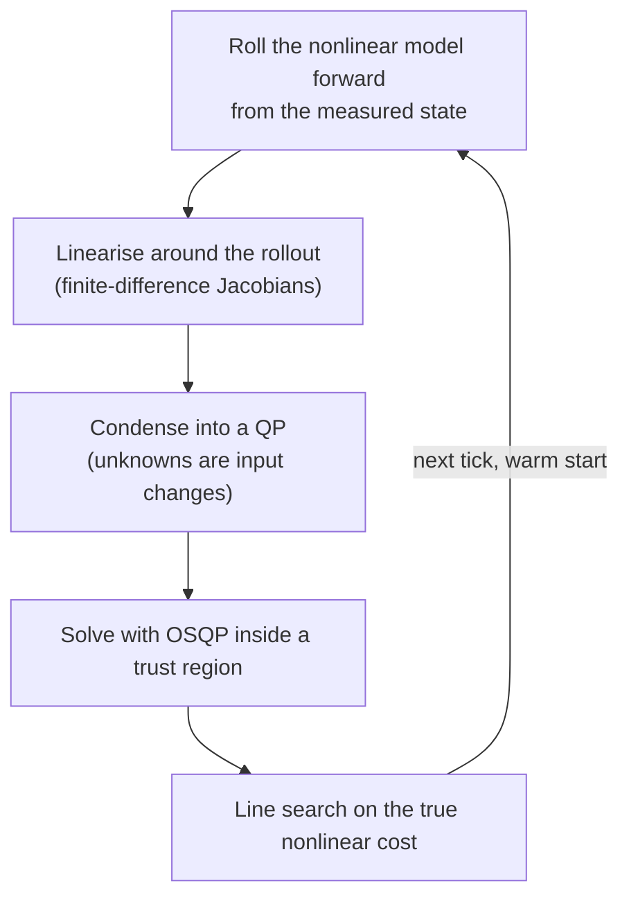

# The Nonlinear MPC Controller (NMPC)

Reference for `NMPCController`, the Frenet-frame nonlinear model predictive controller. It is one of three selectable controllers, alongside the linear one in [lmpc.md](lmpc.md) and the non-predictive one in [stanley.md](stanley.md).

## What it does

**What it does.** Every 50 ms the controller looks 1.0 s ahead, guesses the steering and throttle sequence that keeps the car on the path with the least fuss, applies only the first step, and repeats. Its internal model knows the road bends. A corner 10 steps ahead already shapes the steering this tick, so the car starts turning in before heading error builds up.

**Why it matters.** The linear controller in [lmpc.md](lmpc.md) treats the road ahead as pointing the same way for the whole horizon. With the car on line and a corner ahead, it plans "stay on line" and commands exactly zero steering until real error appears. NMPC removes that blind spot by putting arc length along the path into the prediction state. Curvature is looked up at each predicted position instead of being sampled once.

**Selection.** The switch is the node parameter `use_nmpc`. The value depends on where it is read:

| Layer | Value | Where |
|---|---|---|
| `NMPCParams.use_nmpc` dataclass default | `False` | `fsds_simulator/control/fsae_control/fsae_control/mpc/nmpc_params.py` |
| `controller:` block of `fsae_params.yaml` | `false` | `fsds_simulator/common/fsae_bringup/config/fsae_params.yaml` |
| `ros2/launch_all.sh` (`USE_NMPC`, passed as a launch arg, overrides both) | `true` | `ros2/launch_all.sh` |
| Offline `settings.USE_NMPC` | `False` | `settings/nmpc.py` |

A run started through `ros2/launch_all.sh` uses NMPC. An offline rollout uses the linear controller unless `USE_NMPC` is set before the tuner or rollout imports `settings`.

## Why it exists

**The structural limit.** The linear controller predicts error in coordinates where the reference frame never rotates, so its heading-error rate is the raw yaw rate `r`. NMPC predicts `r - kappa(s) * s_dot`, the yaw rate minus the rate at which the path direction itself turns. A single Frenet measurement (nearest path point plus perpendicular offset) is used by both controllers at the current tick. The difference is what happens to that error across the horizon.

- **Linear controller:** curvature is read once, about 1 m ahead of the car, and held for all 35 steps. On line with a bend ahead, the rollout predicts staying on line forever. Measured: exactly 0.000 deg commanded 24 m before a 20 m radius bend with zero tracking error (Part 6b of [late_turn_in_investigation.md](../logs/late_turn_in_investigation.md)).
- **NMPC:** curvature and reference heading are looked up at each predicted arc length, so a bend inside the horizon appears in the prediction.
- **Consequence:** a family of lookahead gain-scheduling workarounds was built for the linear controller and later deleted. The argument for why reweighting today's cost cannot substitute for a model that sees the bend is in [retired_mechanisms.md](../reference/retired_mechanisms.md).

**Measured benefit.** A matched same-day live pair on `comp_test_map_3`, both with the weights of that day (older than the current defaults, before the rate zone and jerk terms below):

| | Linear controller | NMPC |
|---|---|---|
| lap time | 54.72 s | 52.35 s |
| steering saturation | 6.45% | 0.58% |
| RMSE lateral | 0.455 m | 0.378 m |
| peak lateral error | 1.636 m | 1.179 m |

Source: section 16.9 of [late_turn_in_investigation.md](../logs/late_turn_in_investigation.md). One matched pair, not a sweep.

## How it works

### Each tick is one Gauss-Newton step, warm-started

State `x = [s, e_y, e_psi, v_x, v_y, r, delta_act, a_act]`, input `u = [delta_cmd, a_cmd]`. Horizon `nmpc_horizon = 20` steps of 0.05 s (1.0 s).

1. **Roll forward.** Shift last tick's input plan one step and simulate the nonlinear model from the measured state.
2. **Linearise.** Get the sensitivity of every predicted state to every input, by finite differences.
3. **Condense.** Fold the whole horizon into one dense QP (quadratic program) whose unknowns are input changes only.
4. **Solve with OSQP** inside a trust region that limits how far one step may move.
5. **Line search.** Try the full step, then half, then a quarter (`nmpc_backtrack_max = 2` halvings) against the true nonlinear cost. Keep the first that does not raise the cost. If none does, keep the shifted plan from last tick.
6. **Ship the first input** of the plan, clipped to the input limits and the per-tick slew limit.

`nmpc_sqp_iters = 1`, so steps 1 to 5 run once per tick. This is the real-time-iteration scheme. Consecutive ticks differ by one horizon step, so the warm start is already close and one step per tick tracks the moving optimum. A wall-clock budget (`nmpc_solve_budget_ms = 25.0`) stops iterating early. OSQP runs with `nmpc_osqp_max_iter = 500`, `nmpc_osqp_eps = 1e-4`, warm starting on, polishing off. The looser tolerances are deliberate: the QP result is a step direction that the line search validates, not a final answer.



Solve time is not re-measured for the current defaults. A measurement taken when the Jacobian pass still used one substep gave a mean of 9.56 ms. Raising both substep counts to 4 roughly doubled it to 18.63 ms with a maximum past the 25 ms budget (see [nmpc_low_speed_accel_stall_investigation.md](../logs/nmpc_low_speed_accel_stall_investigation.md)). The speed gates described below were added afterwards to cut that cost. Watch `solve_ms` and `nmpc_iters` in the log if the budget or substeps change.

### The state is measured along the path, not on the map

`s` is distance travelled along the path. `e_y` is the signed lateral offset of the front axle from the path (positive left). `e_psi` is car yaw minus path yaw. The car's map position is recovered from `s` and `e_y` when needed and is never a state.

Progress along a curved path is not the plain forward speed. A car on the inside of a bend covers less path length per metre travelled. The exact relations are:

```
s_dot     = (v_x*cos(e_psi) - v_y*sin(e_psi)) / (1 - kappa(s)*e_y)
e_y_dot   = v_x*sin(e_psi) + v_y*cos(e_psi)
e_psi_dot = r - kappa(s)*s_dot
```

- **Metric factor `1 - kappa*e_y`:** equals 1 on a straight. Offset toward the inside of a bend it drops below 1, so `s_dot` exceeds the raw forward speed.
- **`e_psi_dot`:** yaw rate minus how fast the path direction rotates. This is the term the linear controller drops.
- **Guard `_DENOM_FLOOR = 0.25`:** the denominator is floored without flipping its sign. A sign flip would reverse the predicted direction of travel. On this car the singularity sits at `e_y = 1/kappa`, 4.8 m at the tightest logged corner (`kappa` 0.21), outside the 3.5 m track half-width, so the floor is inert in normal driving.

The from-scratch worked arithmetic is in [error_states.md](../reference/error_states.md).

### The prediction model is a bicycle with a saturating tyre

`dynamics.py` (`_f`, vectorised over stages, and `_f_scalar`, a hand-mirrored scalar copy for the sequential rollout) gives `x_dot = f(x, u)`.

**Tyre forces.** Linear-tyre slip angles per axle, then a smooth cap at FSDS's lateral-acceleration ceiling:

```
alpha_f = atan((v_y + lf*r) / v_safe) - delta_act        v_safe = max(|v_x|, 2.5)
alpha_r = atan((v_y - lr*r) / v_safe)
F_yf = -2*Cf*alpha_f       F_yr = -2*Cr*alpha_r
a_y  = (F_yf*cos(delta_act) + F_yr) / m
ceil = max(7.5, 0.47*|v_x| + 2.46)
sat  = tanh(|a_y|/ceil) / (|a_y|/ceil)          both axle forces scaled by sat
```

- **Why the cap exists:** a linear tyre has no upper force bound, so an uncapped model believes it can hold any corner at any speed. The plant cannot (FSDS enforces a sustained ceiling near 7.5 m/s squared). The controller then demanded yaw that never arrived, saw the error persist and demanded more, which showed up offline as a large steering oscillation and then a spin (section 16.6 of [late_turn_in_investigation.md](../logs/late_turn_in_investigation.md)).
- **Why `tanh`:** `tanh(x)/x` is 1 to second order at 0, so the linear region that the weights were tuned in is unchanged. Beyond the ceiling the curve bends over smoothly, not with a hard corner that would make the sensitivity jump to zero. Both axles use the same factor, which preserves the front/rear force ratio and so the understeer character.
- **Constants:** `lf = 0.70`, `lr = 0.85`, `m = 255`, `Iz = 150`, `tau_delta = 0.08`, `tau_a = 0.02`, `Cf`, `Cr` and the ceiling law are hardcoded in `_Plant`. They are plant constants, not tuning weights. Switch: `nmpc_alat_ceiling_enabled` (default true). How the ceiling was measured and modelled is in [simulator_fidelity.md](../reference/simulator_fidelity.md).

**Low-speed blend.** Same breakpoints as the linear controller: `blend = clip((v_x - 1.0) / 1.5, 0, 1)`. Below 1 m/s the model is kinematic (`r_kin = v_x*tan(delta)/L`, `v_y_kin = lr*r_kin`, differentiated with the steering lag supplying `delta_dot`). Above 2.5 m/s it is dynamic. The tyre force itself is multiplied by `blend` before it enters the dynamic branch.

- **Why the force is blended at the source:** the slip-angle denominator is floored to avoid dividing by zero, so a stationary tyre's slip angle would track the steering command directly and predict a large cornering force from steering alone. A real tyre with no rolling velocity makes about zero force. Unblended, that phantom force produced a fictitious predicted excursion (`e_y` -1.9 m at the horizon end with the car still stopped), and the steering snapped to the 25 deg lock in the first 0.5 to 0.7 s of every standing start. Blending only the branch output downstream is too late, because the force has already leaked into intermediate terms.

**Discretisation.** Each 0.05 s step is RK4 (4th-order Runge-Kutta) with `n_sub` sub-steps. The two actuator lag states are then overwritten with their exact zero-order-hold values. RK4 alone leaves `a_act` visibly short, because `tau_a = 0.02 s` against `dt = 0.05 s` puts `lambda*dt` at -2.5, near RK4's real-axis stability edge of about 2.78. `v_x` is floored at 0 so the prediction never runs into reverse.

### Sub-step counts are speed-gated because the model is stiff at low speed

The `(v_y, r)` dynamics stiffen as 1/v_x. With too few RK4 sub-steps the integration diverges (not merely loses accuracy) at low speed. The linearised eigenvalue times `dt` is about 10.5 at 2 m/s, against RK4's limit of about 2.78. A divergent Jacobian compounds through the condensing loop into a Hessian whose only solution is zero, so the car commands no throttle in the 2.5 to 6 m/s band.

| Pass | Below gate | At or above gate | Gate (m/s) | Gate measured on |
|---|---|---|---|---|
| Rollout (`_rollout`) | `nmpc_rk_substeps = 4` | `nmpc_rk_substeps_fast = 3` | `nmpc_rk_gate_speed = 4.0` | each predicted stage's own `v_x` |
| Jacobian (`_jacobians`) | `nmpc_jac_substeps = 4` | `nmpc_jac_substeps_fast = 2` | `nmpc_jac_gate_speed = 8.0` | slowest stage in the horizon |

- **Rollout fast value is 3, not 2:** 2 is the one count confirmed unstable (up to about 260 times perturbation growth) across 2.25 to 3.75 m/s.
- **Jacobian fast value is 2, not 1:** 1 does not diverge at speed but is inaccurate (1.30 against a converged 3.85 at 10 m/s).
- **An analytic Jacobian would not help:** the variational equation propagated through RK4 has the same stability region as the nominal ODE, so the substep floor belongs to RK4, not to finite differencing.
- **Why the Jacobian gate uses the slowest stage:** it then changes rarely. A per-tick flip in Jacobian fidelity would perturb the warm start and become its own disturbance.
- **History:** both counts were once 2 and 1. The earlier argument that the Jacobian only sets a step direction was sound about accuracy and wrong about stability. Full derivation and the measurement tables are in [nmpc_low_speed_accel_stall_investigation.md](../logs/nmpc_low_speed_accel_stall_investigation.md).
- **Keep `nmpc_jac_substeps` equal to `nmpc_rk_substeps`,** and set `nmpc_jac_substeps_fast = nmpc_jac_substeps` to disable the gate exactly.

### Finite-difference Jacobians give the step direction

For each horizon stage `k`, `A_k = d x_{k+1} / d x_k` and `B_k = d x_{k+1} / d u_k` come from forward differences with a per-variable perturbation (`_FD_EPS_X`, `_FD_EPS_U`, about 1e-6 times the variable's typical size). The pass is vectorised over stages, so it costs 10 batched one-step integrations (8 states, 2 inputs), not `10*N` scalar ones. Output Jacobians `C_k = d h / d x` ride along on the same technique.

Finite differences were chosen over a hand derivative because the model has `atan`, `tanh`, a curvature lookup and a floored denominator, all tedious to differentiate by hand and keep in step with `_f`. Rationale for not using automatic differentiation is not recorded.

### Condensing turns the horizon into one dense QP

Because the rollout starts at the measured state, the linearised dynamics have zero defect, so the sensitivities alone define the subproblem. With `dx_0 = 0`:

```
S[0] = 0
S[k+1] = A_k @ S[k] + (B_k placed in input slot k)
dx_k = S[k] @ dU_flat
```

**Cost rows.** The residual `h(x) = [e_y, e_y_dot, e_psi, e_psi_dot, v_x - v_ref]` at every stage, with terminal-stage weight scaled by `nmpc_terminal_scale`. `G = sqrt(W) C S` and `g = sqrt(W) h`, giving the Gauss-Newton Hessian `G'G`. Second derivatives of `h` are dropped, which keeps the subproblem a QP.

**Other cost terms** (all exactly quadratic, so no approximation):

| Term | Weight | What it charges |
|---|---|---|
| Effort | `r_delta`, `r_a_accel`, `r_a_brake` | size of the command. Accel and brake weights are chosen per stage by the sign of the current iterate's `a_cmd` |
| Rate | `r_rate_delta`, `r_rate_a`, shaped per stage (see below) | first difference of the input, against `u_prev` at stage 0 |
| Jerk | `nmpc_rjerk_delta`, `nmpc_rjerk_a` | second difference of the input (change in the change) |
| Track slack | `nmpc_slack_weight`, `nmpc_slack_linear_weight` | quadratic plus linear penalty on soft track-bound violation |

**Constraints on `dU_flat`:**

- **Trust region:** `nmpc_trust_delta_rad = 0.157` (9 deg, the same as one tick of the slew limit) and `nmpc_trust_a = 0.6`. Both reuse the hard slew values, not new numbers.
- **Slew rate:** `|u_k - u_{k-1}| <= du_max`, steering 180 deg/s times 0.05 s and acceleration 0.6 per tick.
- **Soft track bound:** `|e_y| <= nmpc_track_halfwidth = 3.35` with slack. Rows are dense in `dU` because stage `k` depends on every earlier input. The linear slack term has no effect while `nmpc_progress_enabled` is false, because nothing else rewards leaving the track.
- **Friction circle (off by default):** a hard per-axle force bound, see the optional features below.

**Jerk anchoring.** A second difference that spans the tick boundary needs the last two applied commands, so the controller carries `_u_prev2` and adds `e_jerk[:NU] -= 2*u_prev - u_prev2` and `e_jerk[NU:2NU] += u_prev`. Without this the term cannot see a reversal that straddles the boundary, which is the case it exists for. `_u_prev2` must advance before `_u_prev`.

**The line-search cost must equal the QP cost.** `_cost()` mirrors the QP term for term, including the shaped per-stage rate weight `_Rr_flat`, the jerk term and the stage-0 damping. A term present in the Hessian but missing from `_cost()` makes the search optimise a different objective than the one solved. That exact bug existed for the rate cost and affected every rate-reshaping flag.

**Standstill steering damping.** At `v_x = 0` steering cannot move the car, yet the horizon cost sums over stages where predicted `v_x` has already left zero. The solver would pre-commit stage 0 to help later stages, and the car would launch already turned (about -6.8 deg measured live). Stage-0 `r_delta` is multiplied by `nmpc_standstill_steer_r_scale = 200.0` below `nmpc_standstill_speed = 0.5` m/s, fading linearly to 1 at `nmpc_standstill_fade_speed = 3.0` m/s. A hard release at one speed put the whole change into a single tick, and steering ran from -1.8 to -12.9 deg over the next six ticks. The scale 200 is a tuning value, not derived, and very stiff values make stage 0 unresponsive. Set fade speed at or below the standstill speed for a hard cutoff.

### The path reference is a spline

`PathReference` builds `kappa(s)` and `psi_ref(s)` from `CubicSpline` fits of `x(s)` and `y(s)` over the raw waypoints. `psi_ref = atan2(y', x')` and `kappa = (x'y'' - y'x'') / (x'^2 + y'^2)^1.5`. Reference heading and curvature come from one reference, so the measured `e_psi` and the model's `e_psi_dot` agree.

- **Why one reference:** measuring `e_psi` off the raw segment tangent quantises it in steps of ds/R, 5.7 deg per 0.5 m waypoint on a 5 m hairpin. The controller read each step as real error and produced a period-2 steering limit cycle (+25 and -25 deg alternating) through the tight corners offline.
- **Switch:** `nmpc_spline_reference_enabled` (default true). False restores the dense-resample, moving-average and finite-difference pipeline (`nmpc_curvature_dense_step = 0.5`, `nmpc_curvature_smooth_w = 3`) for A/B comparison against the known centreline curvature-spike defect.
- **Guards:** `nmpc_kappa_clip = 0.5` (a 2 m radius, inert on any real line). Trailing zero-length duplicate points in a padded live path are dropped, so the horizon does not predict the corner stopping.
- **Live planner only:** `nmpc_kappa_rate_max = 2.0` caps tick-to-tick change of `kappa(s)` at matching arc-length samples. It is structurally inert on a precomputed path. A value of 1.0 was tried and failed (stalled at the same corner with more curvature oscillation).
- **Static path:** the reference is built once at load (`set_static_path`) and looked up by signature each tick, at no per-tick cost.

### Delay compensation rolls the state through the nonlinear model

When `delay_compensation_enabled`, the measured pose age is low-passed (`pose_age_lp_alpha`), converted to a step count with hysteresis (`n_delay_hysteresis`) and capped (`max_delay_compensation_steps`). The measured state is then rolled forward through that many recent commands with the nonlinear model. The linear controller does the same with its linear model (`predict_ahead`). An optional `nmpc_latency_compensation_enabled` (default false) rolls forward by `nmpc_latency_compensation_ms` to cover the solve's own wall-clock time. It was a suspect in a smoothness regression and stays off.

## Shaping the steering rate cost

**Plain version.** A high flat penalty on steering-rate stops the wheel twitching but makes the car reluctant to start a turn. Two mechanisms shape the cost so both hold.

| Mechanism | Default | Effect |
|---|---|---|
| Three-zone rate schedule (`nmpc_rrate_zone_*`) | on: `2.0` straight, `0.8` approach, `0.15` corner | multiplies `r_rate_delta` (100.0) by a factor from current and horizon-peak curvature |
| Input-jerk term (`nmpc_rjerk_delta`) | `150.0` | prices the change in steering rate instead of its size |

**Three-zone schedule.** `_rrate_zone_scale` blends between the three multipliers using `_corner_factor(kappa, k)` of the current curvature (`now`) and of the peak curvature the predicted horizon sees (`ahead`). The lead component `max(0, ahead - now)` moves the multiplier from the straight boost toward the approach ease. As `now` rises, the corner floor takes over. A corner entered from a straight passes boost, then ease, then floor. With `r_rate_delta = 100.0` the effective steering-rate weight is 200 on a straight, 80 on approach and 15 mid-corner.

- **`k` is load-bearing:** `nmpc_corner_factor_k = 27.0`. At the linear controller's inherited `k = 8.0` a track whose tightest corner has `|kappa|` near 0.2 tops `_corner_factor` out near 0.63, so the ease and floor bands are never reached and the schedule degrades into a mild global boost. Check the `m_Rrate_zone` log column against `nmpc_rrate_zone_floor_corner` before concluding the endpoints did anything. If it never approaches the floor, raise `k` rather than lowering the endpoints (`k ~= target / ((1 - target) * kappa_max)`).
- **The intended ease is 0.35 but 0.8 ships:** 0.35 does not complete the recorded-map rollout offline.
- **Live planner caution:** `kappa_ahead` inherits the open centreline curvature-spike defect, and unlike a speed target nothing downstream rate-limits it. Re-validate before trusting the zone with a live planner path.

**Input-jerk term.** Reversals carry about 4.3 times the second difference of same-direction ramps, against about 1.9 times for the first difference, so the second difference separates chatter from turn-in about twice as sharply as a rate penalty does. A steady ramp into a corner is nearly free and a wiggle is not. `E2 = E @ E` reuses the first-difference operator and the OSQP sparsity pattern does not change, because the Hessian block is already a dense upper triangle. Both jerk weights at 0 remove the term entirely.

### Late turn-in on shallow corners: what was tried

The problem: after `r_rate_delta` was raised to stop chatter, shallow corners showed a late, jerky turn-in. The car held a smooth line, refused to turn, then jerked once predicted error overpowered the rate cost. The jerks landed at exactly 9.00 deg per tick, which is the slew limit (180 deg/s times 0.05 s). Cause: one flat rate weight cannot be stiff enough to kill straight-line hunting and compliant enough for a gentle corner's small early input. The tracking cost scales with error squared while the rate cost scales with step size, so their ratio swings about 100 times between a shallow and a sharp corner.

| Option | Outcome |
|---|---|
| Curvature-scheduled rate blend (`nmpc_corner_rrate_blend_enabled`, `k = 20`, straight 52.5, corner 8.0) | rejected live: worse on every metric (slew-limited ticks 1.75% to 2.54%, `\|e_y\|` 0.288 to 0.467, saturation 0.03% to 1.52%). About 27% of jerks show no curvature or error signal one second earlier (14 of 51), so a schedule keyed on current state cannot reach them |
| Curvature scheduling keyed earlier (lookahead) | not built: same signal shifted forward, amplifies planner curvature noise |
| Per-stage rate ramp (`nmpc_rrate_stage_ramp_enabled`) | rejected offline and live: slew-limited ticks rose 8.43% to 12-15% offline and 1.75% to 5.10% live. A cheaper near-stage rate spends more of the slew budget every tick. Kept default off because it is the one change that clears the offline DNF of the shipped config |
| Raise `du_max` | rejected: treats the symptom, and 180 deg/s is a measured lower-bound estimate of the real actuator |
| Lower `r_rate_delta` and filter chatter another way | fallback, not needed |
| Steering-jerk penalty (`nmpc_rjerk_delta`) | shipped at 150.0. Changes what is penalised, not when or where |

The two rejected schedules failed the same way: any weakening that lets turn-in start early also lets oscillation start, trading chatter for compliance at about 1:1. That is the evidence that the rate cost cannot be scheduled into solving this and that the penalised quantity had to change. Measured effect of the jerk term with `r_rate_delta = 52.5` and `nmpc_rjerk_delta = 150.0`: on `centerline.csv` live, 0 saturated ticks, 0 slew-limited ticks and 1 steering reversal over three laps. Offline at the same pair, slew-limited ticks fell 7.80% to 2.77% and chatter 2.825 to 1.686 deg per tick. An earlier live figure of about 4.5% saturation with the same weight belonged to the raceline reference, not to the jerk term.

Two further findings from the same investigation. Jerks at tight corners were partly a speed problem: the car arrived too fast, so the speed-profile cornering limit matters before any steering weight ([reference_path_and_speed.md](../reference/reference_path_and_speed.md)). A "won't turn" report should be checked against lateral-acceleration demand and speed overshoot first. The detailed lever table, current weights and the untested pairing `r_rate_delta = 5.0` with `nmpc_rjerk_delta = 250.0` are in [tuning.md](../guides/tuning.md). Full data is in [steering_chatter_investigation.md](../logs/steering_chatter_investigation.md).

## Feature comparison with the linear controller

| Feature | Linear controller | NMPC | Why |
|---|---|---|---|
| Adaptive gain schedule (`adaptive_R_scaling`, `adaptive_Q_scaling`, corner-blended Q, `r_steer_corner_mid`) | yes | not read | Each compensated for the missing curvature term. Reweighting on top of a model that has it would double-count |
| Heading-error accel/brake asymmetry (`epsi_ra_*`) | yes | not read | Same reason. NMPC uses `r_a_accel` and `r_a_brake` directly |
| `steer_rate_anti_hunt` | on by default | opt-in (`nmpc_steer_rate_anti_hunt_enabled`, default false) | Imported from the linear controller unchanged. Only ever adds damping, so it does not fight the structural fix |
| Reversal penalty | `reversal_penalty_enabled` | opt-in (`nmpc_reversal_penalty_enabled`, default false) | An offline A/B on NMPC was a net regression: reversals barely improved and the score worsened |
| Corner blend of `R_rate` | always | opt-in (`nmpc_corner_rrate_blend_enabled`, default false). Wins over anti-hunt if both set | Live-tested and rejected as a turn-in fix, see above |
| Shaped heading-lead profile (`use_precomputed_heading_profile`) | supported | accepted and ignored, logs one warning | It approximates the curvature term NMPC models directly |
| Delay compensation | linear rollforward | nonlinear rollforward | Same gating fields (`delay_compensation_enabled`, `max_delay_compensation_steps`, `pose_age_lp_alpha`, `n_delay_hysteresis`). `predict_epsi_clip` is linear-only |
| Tracking-error speed gate, speed rate limiters, curvature speed | yes | yes | Node-level, run before either `compute()` |
| Cone-proximity braking, GO gating, stale-path fail-safe | yes | yes | Node-level. NMPC exposes the same `compute()`, `reset()`, `set_static_path()` surface so the node needs no branch |
| Lateral-acceleration ceiling | in the speed profile only | in the speed profile and inside the prediction (`tanh`) | The ceiling shapes what the solver believes is achievable |
| Horizon | 35 steps (1.75 s), set in the node | 20 steps (1.0 s), `nmpc_horizon` | Longer NMPC horizons measured worse (horizon sweep in section 16.7 of [late_turn_in_investigation.md](../logs/late_turn_in_investigation.md)). Do not raise past 20 without re-checking it |
| Solve | one convex QP (CVXPY, OSQP, Clarabel fallback) | one Gauss-Newton step per tick, dense condensed QP (OSQP) | NMPC needs the linearise-and-resolve step because its model is nonlinear |
| Target-speed filter | first-order, alpha 0.08 hardcoded (live only) | `nmpc_v_des_filter_alpha = 0.09` | Raising it repeatedly made performance worse, see [planner_only_lap2_corner_spinout.md](../logs/planner_only_lap2_corner_spinout.md) |
| Telemetry | adaptive-gain `m_*` and `*_eff` columns | eight `nmpc_*` diagnostics (`nmpc_iters` to `nmpc_pred_ey_max_abs`) plus `n_latency`. `m_Rrate_antihunt`, `m_Rrate_zone`, `m_Rrate_reversal`, `corner_frac` and `Rrate_steer_corner_blend` are filled, the LTV-only columns stay empty | Solver diagnostics separate a model or solver problem from a weighting problem |

Weights are inherited from `MPCParams` and overridden per field by the `nmpc_*` fields when they are 0 or above (default -1.0 inherits). `q_r` weights the heading-error rate `r - kappa*s_dot` here, not absolute yaw rate. The full field-by-field map is in [control_mechanisms.md](../reference/control_mechanisms.md).

## Optional and rejected features

| Feature | Default | Status |
|---|---|---|
| `nmpc_spline_reference_enabled` | true | Numerical-quality fix, no new coupling to the solver |
| `nmpc_friction_circle_enabled` | false | Experimental. Adds a hard per-axle bound `abs(F_y) <= m*ceiling(v_x)/2`, additional to the soft `tanh`. Unvalidated live |
| `nmpc_progress_enabled` (with `nmpc_q_progress`, `nmpc_progress_reach`, `nmpc_progress_v_min`) | false | Replaces the two-sided speed error with a speed cap and a progress reward. Attempted and reverted: no lap completed at any setting tried (below about 5 the car never launches, 5 to 6 goes off track near 10% of a lap). Tracking mode completes and scores 0.714. See [nmpc_progress_term_investigation.md](../logs/nmpc_progress_term_investigation.md) |
| Per-stage speed sampling (a target that varies across the horizon) | removed | Tried twice, as a cost term and as a constraint, rejected both times live. Flags and plumbing deleted. See [nmpc_speed_limit_investigation.md](../logs/nmpc_speed_limit_investigation.md) |

The `nmpc_horizon_speed_profile_enabled` field no longer exists. The one-sided speed-cap row only appears in progress mode.

## Tuning and pitfalls

| Field | Default | Note |
|---|---|---|
| `nmpc_horizon` | 20 | Keep at or below 20 |
| `nmpc_sqp_iters` | 1 | Real-time iteration. A too-low `nmpc_solve_budget_ms` silently truncates to one |
| `nmpc_solve_budget_ms` | 25.0 | Half of the 50 ms tick |
| `nmpc_rk_substeps`, `nmpc_jac_substeps` | 4, 4 | Do not lower without the instability tables in the log above |
| `nmpc_track_halfwidth` | 3.35 | Read unconditionally. Narrowing it to 3.0 hurt ordinary tracking and was reverted |
| `nmpc_corner_factor_k` | 27.0 | Read by both the zone schedule and the corner blend |
| `nmpc_rjerk_delta`, `nmpc_rjerk_a` | 150.0, 0.0 | `nmpc_rjerk_a` has never been exercised at a nonzero value |
| `nmpc_standstill_steer_r_scale` | 200.0 | Tuning value, re-check live |
| `nmpc_v_des_filter_alpha` | 0.09 | Smaller is smoother and laggier |

- **Runtime overrides:** `ros2/launch_all.sh` sets `USE_NMPC`, the zone fields, `NMPC_RJERK_DELTA`, `NMPC_CORNER_FACTOR_K` and `NMPC_SLACK_LINEAR_WEIGHT` explicitly. The rest of its NMPC shortlist is commented out, so those fields fall through to the YAML and dataclass defaults above.
- **Field counts:** `MPCParams` has 69 fields and `NMPCParams` has 35, 104 in total, counted from the dataclasses.
- **Weight retunes:** the linear controller's Q, R and R-rate values do not transfer one to one. See [tuning.md](../guides/tuning.md).
- **Live against offline:** the defaults listed in this document match between `settings/nmpc.py` and the live dataclasses. Confirm any other field with [offline_live_parity.md](../reference/offline_live_parity.md) before trusting an offline score.

## Testing the math

- **`python -m tuner.validation.nmpc_offline_check`** (from the repo root, offline port): scalar against vectorised step parity (`_step_scalar == _step`, `kappa_scalar == kappa_at`), monotonic SQP cost decrease from a cold start at four operating points, turn-in and wrong-direction checks against the linear controller, and a closed-loop run.
- **Live-side copy:** `fsds_simulator/control/fsae_control/test/nmpc_offline_check.py`, the same structure against the live modules.
- **`ros2_autonomous/src/fsae_autonomous/control/fsae_control/test/test_nmpc_core_math.py`** (production port): model parity, forward against central finite-difference Jacobians, monotonic SQP convergence and a Frenet round trip (`xy_at` inverts `project`).

A divergence in step parity is a silent wrong-prediction bug. The rollout and the Jacobian path would be consistently wrong the same way, so no closed-loop behaviour test would catch it.

## Where the code lives

The offline port and the live modules use the same file layout and the same method names. They are kept numerically identical by hand.

| Piece | Offline (`controller/nmpc/`) | Live (`fsds_simulator/control/fsae_control/fsae_control/nmpc/`) |
|---|---|---|
| State layout, guards | `layout.py` | `layout.py` |
| Model, RK4 steps | `dynamics.py` | `dynamics.py` |
| Path reference | `reference.py` | `reference.py` |
| Cost rows `h(x)` | `outputs.py` | `outputs.py` |
| Rate zone and stage ramp | `weight_schedule.py` | `weight_schedule.py` |
| QP structure, rollout, Jacobians, cost | `qp_model.py` | `qp_model.py` |
| One SQP step | `sqp_step.py` | `sqp_step.py` |
| `NMPCController`, `compute()` | `solver.py` | `solver.py` |
| Parameters | `settings/nmpc.py` (`NMPC_*`) | `mpc/nmpc_params.py`, `mpc/mpc_params.py` |
