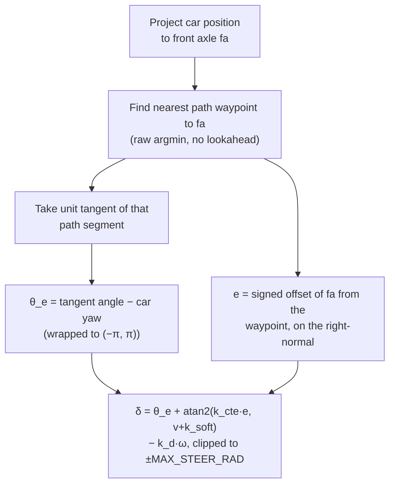

# The Stanley Controller

Reference for the third selectable controller, `stanley_controller.py` (steering law in `control_utils.StanleyController`), chosen with the launch arg `controller:=stanley`. The two MPC controllers are in [lmpc.md](lmpc.md) and [nmpc.md](nmpc.md). The by-hand arithmetic behind `e_y` and `e_psi` is in [error_states.md](../reference/error_states.md). Stanley computes both directly, without a state-space model, and reports them in the same sign convention so a Stanley log and an MPC log plot on one axis.

## What it does

**What it does.** Stanley looks at how far sideways the front wheels are from the path and how much the car's heading disagrees with the path's direction, and steers in proportion to both. There is no prediction and no optimisation, only a formula evaluated fresh every tick.

**Why it exists.** It is a simple, cheap baseline that is easy to reason about (Thrun et al., DARPA Grand Challenge 2005). It gives a reference for judging what the MPC controllers gain from anticipation. It is used only in the live stack. The offline tuner and offline rollout never drive Stanley, and it is not in the tuned parameter set.

**What it costs.** With no model of the future, Stanley cannot start a turn before error exists. It also has no notion of actuator limits or a cost to trade off.

**Which runs use it.** `ros2/launch_all.sh` sets `CONTROLLER=mpc`, so Stanley runs only when that variable or the `controller` launch arg is changed. The `control.launch.py` default is `stanley` and the `sim.launch.py` default is `mpc`.

## How it works

### The steering law

```
δ = θ_e + arctan(k_cte · e / (v + k_soft)) - k_d · ω
```

| Term | Meaning |
|---|---|
| `θ_e` | heading error, path tangent angle minus car yaw (rad), positive when the path turns left of the car |
| `e` | cross-track error, signed distance from the front axle to the nearest path point (m), positive when the axle is to the right of the path |
| `v` | car speed (m/s) |
| `k_cte` | cross-track gain, launch parameter `stanley_gain`, default 1.0. Higher corrects lateral error faster and oscillates more on a fast straight |
| `k_soft` | speed softening, 1.0 m/s. Stops the arctan term saturating steering near zero speed, where a tiny `e` would demand full lock |
| `k_d` | yaw-rate damper gain, 0.1. Subtracts damping proportional to the car's own yaw rate `ω` (positive left) |

Only `stanley_gain` is exposed as a ROS parameter. `k_soft`, `k_d` and the wheelbase (1.5 m) are constructor defaults in `StanleyController`.

Each tick, `StanleyController.compute()`:

1. Projects the control point to the front axle: `fa = car_pos + wheelbase * [cos(yaw), sin(yaw)]`. Stanley is defined at the front axle.
2. Finds the nearest path waypoint to `fa` by a raw `argmin` over Euclidean distance.
3. Takes the unit tangent of the segment leaving that waypoint (or entering it, at the last waypoint).
4. Sets `θ_e` to that tangent's angle minus car yaw, wrapped to `(-π, π)`.
5. Sets `e` to the offset of `fa` from the waypoint projected onto the path's right-normal.
6. Assembles `δ` and clips it to `±MAX_STEER_RAD` (25 deg).



**Why the yaw-rate damper exists.** The textbook cross-track term has no memory of how fast heading is already changing, so it overshoots a correction and induces a left-right sway. Subtracting `k_d · ω` cuts `δ` exactly when the car is already swinging in the commanded direction. It is the primary fix for that sway.

**Why the nearest-point search has no lookahead.** Rationale not recorded. A consequence is that a single noisy path re-fit tick moves the nearest index or tangent straight into a steering spike, with no local averaging between the live planner's frame-to-frame wiggle and the steering command. This matters together with the speed smoothing below.

**Output.** `compute()` returns a steering angle in radians (positive left) and the node publishes it with a target speed as an `AckermannDriveStamped` on `/fsae/control/cmd_vel`. `fsds_bridge` converts speed to throttle and brake and the angle to the normalised steering FSDS expects.

### Speed comes from the same source as the MPC controllers

Stanley does not compute speed itself. Without a precomputed profile it calls `control_utils.curvature_speed()`. With `map_path` set it calls `precomputed_speed_at()` against a `speed_profile.csv`. `map_path` and `path_map_path` mean the same as in `mpc_controller.py`, so a Stanley run and an MPC run on the same track get the same speed target and differ only in steering. The scan-window and braking-distance mechanism is not Stanley-specific, see [control_mechanisms.md](../reference/control_mechanisms.md).

### What Stanley lacks compared to the MPC controllers

- **No fixed control-loop timer.** `mpc_controller.py` runs off a 20 Hz timer (`CONTROL_HZ` in `mpc/node_constants.py`). Stanley's `_control_step` fires from `_pose_cb`, once per incoming `/fsae/slam/car_position` message. Any smoothing added to Stanley cannot assume a fixed tick period.
- **No stale-path or emergency-brake handling.** The MPC node resets its solver and brakes when the path is stale or the pose is missing (`PATH_TIMEOUT = 0.5 s`). Stanley only returns early when the path has fewer than 2 points. Known gap, not the symptom that motivated the smoothing below.
- **No cone-proximity braking.** Stanley publishes a target speed and leaves stopping to `fsds_bridge`.

## Speed-target smoothing

**What it does.** When there is no precomputed speed profile, the live planner rebuilds the path every tick and the path carries a few centimetres of lateral wiggle. Fed straight into a target speed, that wiggle makes the target jump several m/s in one 50 ms tick, even on a straight. Stanley wraps `curvature_speed()` in three limiters so the target changes smoothly.

**Why it exists.** The MPC controllers already had these limiters. Stanley took the raw value into the drive command, and its own steering law reads the same unsmoothed path for `e` and `θ_e`. One bad re-fit tick could spike the speed target and the steering angle together, with nothing to absorb either. The mechanism behind the target collapse is documented for the NMPC in [planner_only_speed_target_oscillation.md](../logs/planner_only_speed_target_oscillation.md). A Stanley-specific live spin-out is the reported reason for the port, but no retained log describes it (not verified).

**How it works.** Active only in the live branch (no precomputed profile):

| Limiter | Value | Effect |
|---|---|---|
| `V_CURV_FALL_RATE` | 7.0 m/s squared | rate-limits how fast `curvature_speed()`'s output may fall. The function has no memory of its previous value |
| `tracking_error_speed_gate(last_e_y, last_e_psi)`, rate-limited by `GATE_RATE_LIMIT` | 2.0 per second, either direction | scales the target down once tracking error grows, so an off-line car is not told to go faster |
| `SPEED_TARGET_RISE_RATE` | 7.0 m/s squared | bounds the composed target's rise, seeded from the car's current speed on the first tick so a standing start does not jump to the full target |

- **Measured `dt`:** with no fixed timer, all three limiters use a `time.perf_counter()` `dt` between ticks, not a `CONTROL_HZ` constant.
- **Never below `v_min`:** the gated target is floored at `v_min` so the car keeps authority to steer back.
- **Reset:** all limiter state (`_v_curv_prev`, `_gate_prev`, `_v_des_prev`, `_last_tick_time`) resets to `None` when the path becomes too short, so a fresh start never inherits a limit computed against a meaningless previous tick.
- **Precomputed profile:** the `precomputed_speed_at()` branch skips all three. It is not re-derived from a noisy live path, so there is nothing to smooth.
- **Gate defaults:** the gate ramps from `abs(e_y)` 0.5 m or `abs(e_psi)` 20 deg to 2.0 m or 60 deg, floored at 0.3. Values are judgement calls, not measurements.

**Status: one run, first positive signal only.** The single logged live run (the file stanley_control_20260916-081934.csv in the outer repo's fsae_logs folder, no precomputed map, 42.2 s) shows `abs(e_y)` up to 1.09 m, `abs(e_psi)` up to 30.0 deg and steering reaching the 25 deg lock. The run ends with the log's partial-score constant (13.0, `score_is_partial=1`), which carries no information about driving quality. Whether the car recovered and completed a lap is not verified from the log. Treat the limiters as unproven, and re-check on more tracks and conditions before treating them as validated the way the dynamic speed cap was.

## Tuning and pitfalls

- **Sign conventions:** `StanleyController` sets `last_e_y = -e`, so its exposed cross-track error is positive left, the same as `last_telemetry['e_y']` in the MPC controllers. `θ_e` already matches (positive when the path turns left of the car). A Stanley CSV and an MPC CSV therefore plot on one axis with no flip, and `tracking_error_speed_gate()` reads `last_e_y` and `last_e_psi` directly.
- **Front-axle offset differs from the MPC:** Stanley projects by a 1.5 m wheelbase from the reported position, while the MPC projects by `lf = 0.70`. The two `e_y` values are therefore not measured at the same point. Whether that is intended is not recorded.
- **Gain:** raise `stanley_gain` for faster lateral correction, lower it if the car sways on a fast straight. The damper `k_d` is the primary anti-sway lever but is not a launch parameter.
- **Telemetry:** set `log_csv` to write a `stanley` CSV. No MPC columns are filled, and there is no horizon accuracy, so predicted-accuracy fields read n/a in summaries.

## Where the code lives

| Piece | File (`fsds_simulator/control/fsae_control/fsae_control/`) |
|---|---|
| Node, speed-target limiters | `stanley_controller.py` |
| `StanleyController`, `curvature_speed`, `tracking_error_speed_gate`, `precomputed_speed_at` | `control_utils.py` |
| Rate-limit constants for the MPC node | `mpc/node_constants.py` |
| Bridge (speed to throttle and brake, angle to normalised steering) | `fsds_bridge.py` |

The files under `fsds_simulator/` are identical to the live tree. Stanley exists in the mirror so it can stand up the full live stack.
