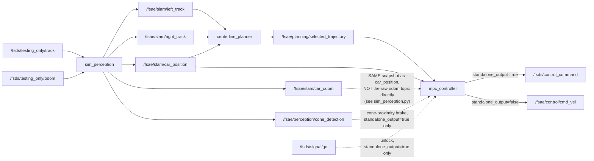

# FSDS Integration Guide

**This doc covers the FSDS/live side only**: running the planning/control
stack against FSDS, the ROS 2 workspace layout, topic map, track
recording/export workflow, and from-scratch Windows/WSL/Docker setup. For
the offline (`fsae_MPCTest`) 2D GUI and tuner, see
[docs/offline_guide.md](../offline_guide.md). For what "FSDS," "offline,"
and "2D GUI" mean and how they relate, see
[docs/reference/simulator_glossary.md](../reference/simulator_glossary.md).

For the high-level picture of how FSDS, the `fsds_ros2_bridge`, and this
project's ROS 2 nodes connect (where each piece runs, what crosses the
bridge), see [fsds_ros_integration.md](fsds_ros_integration.md). This doc
covers the workspace/package layout and setup/operation steps.

## Table of Contents

1. [Workspace layout](#workspace-layout)
2. [Choosing the controller and planner](#choosing-the-controller-and-planner)
3. [Recording, exporting and driving a track](#recording-exporting-and-driving-a-track)
   - [Where a track lives](#where-a-track-lives-tracksname)
   - [1. Record a lap (live, FSDS)](#1-record-a-lap-live-fsds)
   - [2. Export the speed profile and raceline (offline, `fsae_MPCTest`)](#2-export-the-speed-profile-and-raceline-offline-fsae_mpctest)
   - [3. What the live controller reads (live, FSDS)](#3-what-the-live-controller-reads-live-fsds)
   - [4. Switching which track the car drives (live, FSDS)](#4-switching-which-track-the-car-drives-live-fsds)
4. [CSV telemetry logging](#csv-telemetry-logging)
5. [Launching nodes with FSDS on Windows (WSL + Docker)](#launching-nodes-with-fsds-on-windows-wsl--docker)

---

## Workspace layout

`fsds_simulator/` in the `fsae_MPCTest` repo is a full staging mirror of
`fsae_planning`'s own ROS 2 workspace, every package (`fsae_interfaces`,
`fsae_bringup`, `fsae_sim_perception`, `fsae_planning`, `fsae_control`), not
just the control-layer files, e.g. `fsds_simulator/control/fsae_control/
fsae_control/mpc/mpc_core.py` sits at the exact relative path it needs to land at
inside a `fsae_planning` checkout. There are two ways to use it:

- **With an existing `fsae_planning` checkout**, copy everything under
  `fsds_simulator/control/`, `fsds_simulator/perception/`,
  `fsds_simulator/common/`, and `fsds_simulator/planning/` in `fsae_MPCTest`
  over the matching paths inside `fsae_planning` (same relative structure, so
  it's a straight directory copy, not a manual file-by-file paste).
- **Without one**, `fsds_simulator/` alone (plus FSDS and the two message
  repos it depends on) is enough to build a working workspace from scratch,
  see [fsds_simulator/README.md](../../fsds_simulator/README.md).

See [`docs/reference/`](../reference/) for the full
file mapping and what's a deliberate non-mirror. The rest of this section
covers integration when the simulator is already set up with the
`fsae_planning` repo; see
[Launching nodes with FSDS on Windows](#launching-nodes-with-fsds-on-windows-wsl--docker)
below for installing from scratch on Windows.

## Choosing the controller and planner

`fsae_bringup`'s `sim.launch.py` takes `controller` and `planner` as launch
arguments, so it doesn't need editing to switch between them. It also launches
`cone_recorder` alongside the stack by default (see
[Recording, exporting and driving a track](#recording-exporting-and-driving-a-track) below), so
`launch_all.sh` / a bare `ros2 launch fsae_bringup sim.launch.py` gives you
MPC + cone recording in one command, no second terminal needed:

```bash
ros2 launch fsae_bringup sim.launch.py                              # mpc, standalone_output=true (default), cone_recorder on
ros2 launch fsae_bringup sim.launch.py controller:=stanley
ros2 launch fsae_bringup sim.launch.py controller:=mpc standalone_output:=false
ros2 launch fsae_bringup sim.launch.py planner:=skidpad_planner controller:=mpc
ros2 launch fsae_bringup sim.launch.py record_cones:=false          # skip cone_recorder
```

`mpc_controller.py` (the `controller:=mpc` node) has two output modes,
selected by its own `standalone_output` parameter, a single file/executable
rather than two:

- `standalone_output:=false`: `mpc` (like `stanley`) publishes the shared
  `cmd_vel` interface; `fsds_bridge` converts it to `fs_msgs/ControlCommand`
  and owns GO-gating + cone e-braking.
- `standalone_output:=true` (default): publishes `fs_msgs/ControlCommand`
  directly (using the MPC's own throttle/brake), and owns GO-gating +
  cone-braking itself. Skips `fsds_bridge` (the launch file handles that
  automatically).

**Topic map for the control node:**



Note: `mpc_controller` does not subscribe to a desired-speed
topic. It computes `desired_speed` itself every tick from the current path
via `control_utils.curvature_speed()` (see the `v_max`/`v_min` ROS
parameters it declares, which default to `V_MAX`/`V_MIN`). Also note that in
`standalone_output=true` mode, `mpc_controller` publishes
`fs_msgs/ControlCommand` **directly**. It does *not* go through
`fsds_bridge.py` (the shared GO-gating/cone-brake/throttle-conversion layer
that Stanley and `mpc` in `standalone_output=false` mode both use). Don't
launch `fsds_bridge` alongside `mpc` in `standalone_output=true` mode, since they
would both publish to `/fsds/control_command`. (`control.launch.py`'s
`standalone_output:=true` option already handles this, it skips
`fsds_bridge` automatically.)

**Control loop phases** (see `mpc/mpc_controller.py`'s `_control_step`; phases 1
and 4 apply only in `standalone_output=true` mode):

1. **Hold at start line**, full brake until the `/fsds/signal/go` signal is
   received.
2. **Stale-path emergency brake**, full brake (in `standalone_output=true`
   mode; `standalone_output=false` publishes nothing and relies on
   `fsds_bridge`'s own timeout), and `MPCController.reset()`, if no fresh
   path has arrived within `PATH_TIMEOUT` (0.5 s) or the path has fewer than
   2 points. The reset discards the QP's warm start and actuator-lag memory
   so the controller doesn't resume from stale state once the path returns.
3. **Normal MPC solve**: `MPCController.compute()`.
4. **Cone-proximity brake override**, hard-overrides throttle/brake (not
   steering) if a fused cone is inside a dynamic corridor directly ahead.
   After `CONE_RESET_THRESHOLD` (0.3 s) of continuous braking the controller
   is reset once (edge-triggered, re-armed once the brake clears).
5. **Telemetry logging** (optional, `LOG_DIR`), logs the *final*,
   post-override command, so the CSV reflects what was sent to the
   vehicle.
6. **Publish.**

## Recording, exporting and driving a track

This is the full pipeline from "no map of this track exists" to "the car
drives the precomputed line/speed on it": recording, the two export tools,
the on-disk layout they share, and the one switch that puts a track on the
car, chained together in one place. **This workflow spans both sides**:
recording and driving happen live against FSDS; the export step in the
middle runs offline, in the `fsae_MPCTest` repo, and is labeled below. For
the concept rather than the steps: `docs/reference/offline_live_parity.md`'s
parity rule and `tracks/__init__.py`'s module docstring cover *why* the
layout looks like this; this section covers *how* to use it.

### Where a track lives: `tracks/<name>/`

Everything for one track sits in one directory:

```
tracks/<name>/
    cone_map.json      the cone_recorder capture (the source of truth)
    speed_profile.csv  tuner.tools.export_speed_profile output (centreline + oracle speed)
    raceline.csv       tuner.tools.raceline_optimizer output (minimum-time line)
    centerline.csv     tuner.tools.raceline_optimizer --mode centerline output
                       (geometric centre, speed-optimised only)
```

**The physical directory is `ros2/src/fsae_planning/tracks/<name>/`, inside
the separate `fsae_planning` repo, not `fsae_MPCTest`.** This is deliberate:
`fsae_planning` + FSDS must be drivable with no `fsae_MPCTest` checkout at
all, so the track data itself (not just the code that reads it) ships with
`fsae_planning`. `fsae_MPCTest`'s own `tracks/__init__.py` just points its
`TRACKS_DIR` constant at that sibling-repo path, so every tool below
(`export_speed_profile.py`, `raceline_optimizer.py`, `recorded_map_rollout.py`,
etc., all offline tools) reads and writes there transparently when both
repos are checked out side by side. Commands are still typed in
`tracks/<name>/`-shaped form from `fsae_MPCTest/`, but they land across the
repo boundary. `fsae_planning` is a separate git repo with its own remote
(see this project's `docs/reference/`); changes under that path are local
edits to that checkout only.

`comp_test_map_3` is the track every baseline number in this project's docs
(`docs/logs/sim_to_real_investigation.md`, this guide, `docs/reference/`) is
quoted against, so a new recording should get its own name rather than
overwriting it. List what exists with
`python -m tuner.tools.export_speed_profile --list` (offline, from `fsae_MPCTest/`), or
`ls ../ros2/src/fsae_planning/tracks/` (from `fsae_MPCTest/`).

**A brand-new track name gets today's date appended automatically**
(`<name>_<YYYYmmdd>`), whether created via `ros2/launch_all.sh` (its own
`_newest_track`/date-suffix logic, triggered the moment `TRACK_DIR` does not
exist yet) or via `tracks.dated_track_name()` from Python. Re-recording an
EXISTING track (refreshing its cone map in place, same directory) does not
get dated again, only first creation does. This means two recordings under
the same base name on different days land in separate directories instead of
one silently overwriting the other.

**`ros2/launch_all.sh`'s `TRACK=` defaults to the most recently recorded
track** (by the mtime of its `cone_map.json`, not by parsing a date out of
the name), so a fresh recording is driven automatically with no `TRACK=` edit
needed. Set `TRACK=<name>` explicitly to pin a specific one instead, see
`docs/reference/reference_path_and_speed.md`'s "Which file the car actually
loads at launch" for the full resolution mechanism, including how the
geometry file (`PATH_CSV`) is chosen the same way, preferring
`centerline.csv` over `raceline.csv`.

### 1. Record a lap (live, FSDS)

`fsae_planning`'s `cone_recorder` ROS 2 node (in the `fsae_sim_perception`
package) records one lap's worth of accumulated boundary cones from a live
FSDS run and writes them to a JSON file the offline repo can load, see
`sim/track_io.py` and the **Load Recorded Track** button in
[Running the 2D GUI's "Get a path onto the map"](../offline_guide.md#3-get-a-path-onto-the-map).

`sim.launch.py` launches `cone_recorder` automatically (`record_cones:=true`
is the default), so a normal `ros2 launch fsae_bringup sim.launch.py` is
already recording; no second terminal or separate launch command needed.
**But** if `use_precomputed_speed`/`use_precomputed_path` are on (the
default), the car is tracking the *existing* map's line, not driving off the
live planner, recording a new track needs those off, and
`ros2/launch_all.sh` is the easiest place to set that (see step 4 below,
which covers exactly this run). Driving through `sim.launch.py` directly
instead:

```bash
ros2 launch fsae_bringup sim.launch.py controller:=stanley \
    use_precomputed_speed:=false use_precomputed_path:=false \
    cone_out_path:=/path/to/fsae_planning/tracks/<name>/cone_map.json
```

(`cone_recorder.launch.py` still exists standalone for attaching a
recorder to a stack that's already running, any planner/controller works,
since it only subscribes and doesn't affect the pipeline:

```bash
ros2 launch fsae_bringup cone_recorder.launch.py
ros2 launch fsae_bringup cone_recorder.launch.py out_path:=/path/to/cone_map.json
```
)

It starts recording on the first `/fsds/signal/go`, accumulates cones the
same way `cone_map.py`'s `ConeMap` (imported by `centerline_planner.py`)
does, and writes the file once
the car returns near its start pose after having driven at least
`min_lap_dist` (default 8 m) away from it, i.e. one closed lap. If the lap
never closes (e.g. a DNF) it writes anyway after `max_record_time` (default
300 s) and marks the file `"lap_closed": false`, so a partial/failed
recording is still usable but distinguishable from a clean lap.

Writing straight into `tracks/<name>/` (as above) means the export tools in
step 2 need no path argument, just the track name. Recording instead via
a bare `ros2 launch fsae_bringup sim.launch.py` (default output
`~/fsae_logs/cone_map_<timestamp>.json`) requires moving or copying that
file into `tracks/<name>/cone_map.json` before exporting, or passing its
full path to the export tools directly (both accept an explicit path as
well as a track name, see `tracks/__init__.py`'s `resolve_map_arg`).

`ros2/launch_all.sh` writes directly to
`ros2/src/fsae_planning/tracks/$TRACK/cone_map.json` using whatever `TRACK=`
it's currently set to, so setting `TRACK=<name>` there *before* recording is
usually the least fiddly path (see step 4).

`fsae_MPCTest/fsds_simulator/launch_all.sh` (the separate mirror-repo copy)
still writes timestamped files to its own `fsds_simulator/cone_maps/`
instead, a deliberate, pre-existing difference from this repo's script, not
drift to fix. **Load Recorded Track** in the GUI reads both `tracks/*/` and
`fsds_simulator/cone_maps/`, so either script's output is still pickable up
there.

### 2. Export the speed profile and raceline (offline, `fsae_MPCTest`)

Two independent offline tools turn a recorded `cone_map.json` into the CSVs
the live controller can read. Run from `fsae_MPCTest/`:

```bash
python -m tuner.tools.export_speed_profile <name>   # -> ../ros2/src/fsae_planning/tracks/<name>/speed_profile.csv
python -m tuner.tools.raceline_optimizer   <name>    # -> ../ros2/src/fsae_planning/tracks/<name>/raceline.csv
python -m tuner.tools.raceline_optimizer   <name> --mode centerline   # -> .../centerline.csv
python -m tuner.tools.export_speed_profile <name> --corner-slowdown 0.10   # -> .../speed_profile_corner_test.csv
```

The fourth is a third speed-profile variant for low-speed corner testing:
normal speed everywhere, slowed only where curvature crosses a threshold, so
a test run reaches a corner at full pace instead of crawling the whole lap.
See `docs/reference/reference_path_and_speed.md`'s "A third speed profile:
corner-only slowdown" for the mechanism and how to pick the threshold.

**The two exporters do not share a corner-speed limit.**
`export_speed_profile` plans from `CURVATURE_SPEED_A_LAT_MAX`
(`sim/speed_profile.py`); `raceline_optimizer`, both modes, plans from
`alat_ceiling_at(v) × ALAT_MARGIN` in `model/vehicle_physics.py`. So changing
`CURVATURE_SPEED_A_LAT_MAX` changes `speed_profile.csv` only, and re-running
the raceline/centreline export afterwards legitimately reports an unchanged
`v_target` range. See `docs/reference/reference_path_and_speed.md`'s "Speed-profile
aggressiveness".

`--mode centerline` pins the lateral offset to zero, so the exported path is
the reconstructed centreline with only its speed profile optimised. Slower by
construction, and it writes a separate filename so it can never overwrite the
raceline. Use it whenever a logged `|e_y|` needs to mean "distance from the
middle of the track", on a raceline it does not, because the line
intentionally apexes near a boundary. On `comp_test_map_3` it currently also
drives *better* than the raceline; see `docs/reference/reference_path_and_speed.md`'s
"Reference line: raceline vs centreline".

(the output lands in `fsae_planning`'s `tracks/`, not `fsae_MPCTest`'s, see
"Where a track lives" above)

Omitting `<name>` targets the newest recorded track (by the mtime of its
`cone_map.json`, see `tracks.newest_track()`), not a fixed name. Both tools
also accept an explicit `cone_map.json` path in place of a name (for a
capture that isn't under `tracks/` yet), `--list` prints what's available,
and `--no-overwrite` refuses to replace an existing output file instead of
silently overwriting a previous export (overwrite stays the default, since
re-exporting after retuning the same track is the common case).

- `export_speed_profile.py` reconstructs the centreline the same way
  `sim/track_io.load_recorded_track()` does (scipy `CubicSpline` +
  `planning/boundary.build_path_walls()` marched around the lap) and writes
  its `x,y,psi,v_target` as a plain CSV. This is the "oracle path", tracking
  it directly at `e_y=0` matches the pre-`raceline_optimizer` behaviour. The
  speed profile defaults to `closed_loop=True`: the forward/backward
  accel/braking passes wrap point n-1 to point 0 so the profile stays
  continuous across the start/finish line, instead of braking to a stop at
  the last point as if the lap were a one-shot straight-line path. Pass
  `--open-loop` to get the old point-to-point behaviour for a recording that
  isn't a lap.
- `raceline_optimizer.py` takes the same reconstruction and iteratively
  reshapes it within the track width for minimum lap time (widen-entry,
  clip-apex), respecting the physical model's `alat_ceiling` (see `docs/reference/`)
  rather than a flat friction limit. Same CSV format/columns, different
  geometry and generally higher `v_target`.

Both write a `# source_map=<path>` comment line into the CSV, so a stray
export can always be traced back to the map it came from. **Re-run either
tool whenever the recorded map changes**, nothing regenerates these
automatically.

The CSV format is deliberately trivial (4 columns, ~15-line reader, no scipy)
so the live ROS package (`control_utils.load_speed_profile_csv()` /
`load_path_profile_csv()`, in the separate `fsae_planning` repo) doesn't need
to port the reconstruction logic, see `export_speed_profile.py`'s module
docstring for the full reasoning.

### 3. What the live controller reads (live, FSDS)

Two independent ROS launch args, both consumed by `mpc` (regardless of its
own `standalone_output` mode; not `stanley`):

| Launch arg | Default (via `launch_all.sh`) | Effect |
|------|---------|--------|
| `map_path` + `use_precomputed_speed` | newest track's `speed_profile.csv` | Look up target speed from the CSV's oracle profile instead of live `curvature_speed()` per tick |
| `path_map_path` + `use_precomputed_path` | newest track's `centerline.csv` (else `raceline.csv`) | Track the CSV's geometry instead of subscribing to `centerline_planner.py`'s `/fsae/planning/selected_trajectory`, removes the live planner from the control loop entirely |
| `use_nmpc` | see [tuning.md](../tuning.md) and `ros2/launch_all.sh` for the current effective default | Swap `MPCController` (linear QP) for `nmpc_core.NMPCController` (Frenet-frame nonlinear MPC) entirely. `mpc` only, no effect on `stanley`. See `docs/reference/control_mechanisms.md`'s "Nonlinear MPC (`use_nmpc`)" section and `architecture.md`'s "Second controller" section, not covered further here since it's a whole separate controller, not a launch-time data source like the two rows above. |

**`map_path`/`path_map_path` are consumed by both controllers, not only
`mpc`.** `stanley_controller.py` declares and reads both
parameters exactly like the MPC node does, and `control.launch.py` hands
both the identical resolved value (see
`docs/reference/reference_path_and_speed.md`'s "`USE_PRECOMPUTED_SPEED`/`_PATH`
are resolved in the launch file" for the mechanism). This is what lets a
Stanley run and an MPC run on the same track share the identical speed
target and/or path for a directly comparable telemetry CSV. `use_nmpc` is the
one row in this table that is MPC-only, since Stanley has no NMPC
mode to switch into.

Both `use_precomputed_speed`/`use_precomputed_path` default `true`, so a bare `ros2 launch fsae_bringup sim.launch.py`
already drives the default track's precomputed line and speed with the
planner out of the loop. `map_path` and `path_map_path` can point at
different files (e.g. speed from the centreline, geometry from the raceline)
since the toggles are independent, but the common case is both pointing at
the same track, which step 4 sets up in one setting.

If a CSV path doesn't exist (e.g. before the first export), the node logs an
error at startup and falls back to live `curvature_speed()`/the live
planner. It does not crash, but it also silently isn't doing what was
requested, so check the log if a run looks unexpectedly like a
live-planner run.

### 4. Switching which track the car drives (live, FSDS)

**One variable.** In `ros2/launch_all.sh`:

```bash
TRACK=comp_test_map_3    # change this line to any name under fsae_planning's tracks/
```

This expands to both `map_path` and `path_map_path` (and, for a *new*
recording, `cone_out_path`) automatically, no other line in that script
needs editing, and the hardcoded absolute defaults in
`sim.launch.py`/`control.launch.py` never need to be touched (those exist
only as the fallback for a bare `ros2 launch`, not as the thing to edit
day-to-day). The script checks the track's CSVs exist before launching and
fails with a clear message (naming the tracks that *do* exist) rather than
silently falling back to live planning.

To drive a track without going through `launch_all.sh`, pass the same three
args directly:

```bash
ros2 launch fsae_bringup sim.launch.py \
    map_path:=ros2/src/fsae_planning/tracks/<name>/speed_profile.csv \
    path_map_path:=ros2/src/fsae_planning/tracks/<name>/raceline.csv
```

Putting it all together, end to end:

```bash
# 1. Record (live, FSDS; planner-in-loop, so the recording is a real live-driven lap)
#    -- set TRACK=<new-name>, USE_PRECOMPUTED_SPEED=false,
#    USE_PRECOMPUTED_PATH=false, CONTROLLER=mpc (or stanley) in
#    ros2/launch_all.sh, then:
./ros2/launch_all.sh

# 2. Export (offline, from fsae_MPCTest/ -- writes into fsae_planning's tracks/,
#    which requires fsae_MPCTest to be checked out; driving in steps 1 and 3
#    does not)
python -m tuner.tools.export_speed_profile <new-name>
python -m tuner.tools.raceline_optimizer   <new-name>

# 3. Drive it (live, FSDS) -- set TRACK=<new-name>, both toggles back to true
./ros2/launch_all.sh
```

## CSV telemetry logging

Every controller node (`stanley_controller.py`, `mpc_controller.py`, in
either `standalone_output` mode) can optionally write two CSVs per run,
per-control-step telemetry and periodic path snapshots, via
`telemetry_logger.ControlLogger`. **Off by default**, same toggle pattern as
`cone_recorder` above: a ROS parameter, not a separate node or launch flag.

```bash
ros2 launch fsae_bringup sim.launch.py log_csv:=true                          # -> ~/fsae_logs
ros2 launch fsae_bringup sim.launch.py log_csv:=true log_dir:=/path/to/logs   # custom output dir
ros2 launch fsae_bringup sim.launch.py                                        # logging off (default)
```

Or directly on a `ros2 run`/node, when not going through `sim.launch.py`:

```bash
ros2 run fsae_control mpc_controller --ros-args -p log_csv:=true -p log_dir:=/path/to/logs
```

Each run writes `<tag>_control_<timestamp>.csv` (one row per 20 Hz control
step: position, heading, speed, tracking error, commanded steering/accel,
solver health, and the latency-diagnostic columns) and
`<tag>_path_<timestamp>.csv` (path snapshots at ~1 Hz) into `log_dir`
(`~/fsae_logs` if unset). On shutdown, the control CSV is rewritten with a
`#`-commented header holding the run's composite score, computed by the exact
same maths as the offline tuner, see
[The Composite Score](../architecture.md#the-composite-score) and
`fsae_control/telemetry_logger.py`'s module docstring for the full column
reference and units.

When a precomputed speed profile is loaded (`map_path` set), the score header
also includes `lap_time_s`/`optimal_time_s`: `telemetry_logger.LapProgressTracker`
derives real `progress`/`reached_end`/`time_bonus` from the car's position
against the precomputed track path (without this, a live run's composite
score is pinned at the DNF floor regardless of how the car drove), see
`docs/reference/offline_live_parity.md`'s "Live/offline score parity"
section. `stanley_controller.py` supports `map_path` (see
`docs/logs/sim_to_real_investigation.md` §57) alongside the two MPC nodes, so a Stanley
run with a precomputed profile scores fully too. Any run against the live
planner topic instead (no precomputed path, either controller) still has no
known path end, so its score stays partial (`score_is_partial=1`).

Logging and cone recording are independent toggles and can be combined freely
(`log_csv:=true record_cones:=true`), a common pattern for a validation lap
that needs to be both replayed through the CSV telemetry and reloaded into
the offline 2D GUI as a recorded track.

## Launching nodes with FSDS on Windows (WSL + Docker)

This sets up the ROS 2 bridge and planning/control stack from scratch on a
Windows machine, using the precompiled Windows FSDS `.exe` alongside a
Dockerised ROS 2 Jazzy environment running inside WSL. Do the cloning step
in your WSL **home directory**, not inside an existing project folder.

**1. Clone the repo and start a ROS 2 Jazzy container**

```bash
# In WSL Ubuntu, from your home directory
GIT_LFS_SKIP_SMUDGE=1 git clone https://github.com/FS-Driverless/Formula-Student-Driverless-Simulator.git --recurse-submodules

docker run -it \
  --name fsds_ros2_bridge \
  --net=host \
  --privileged \
  -v "$(pwd)":/root/Formula-Student-Driverless-Simulator \
  osrf/ros:jazzy-desktop \
  bash
```

`--net=host` is what makes the WSL-IP handshake in step 3 work, the
container shares WSL's network namespace rather than getting its own.

**2. Build the workspace inside the container**

Install the ROS 2 build tooling and message dependencies the bridge needs:

```bash
apt-get update && apt-get install -y \
  python3-colcon-common-extensions \
  ros-jazzy-cv-bridge \
  ros-jazzy-image-transport \
  ros-jazzy-tf2-geometry-msgs \
  libyaml-cpp-dev
```

FSDS's Windows `.exe` is built on AirSim, and the `/ros2` bridge package
in this repo depends on AirSim's client headers, so AirSim's own external
dependencies need fetching before the bridge will compile:

```bash
apt-get update && apt-get install -y eigen3-devel || apt-get install -y libeigen3-dev
apt-get update && apt-get install -y wget

cd /root/Formula-Student-Driverless-Simulator/AirSim
./setup.sh
```

Then build the ROS 2 workspace.

```bash
cd /root/Formula-Student-Driverless-Simulator/ros2
source /opt/ros/jazzy/setup.bash
colcon build --symlink-install
```

**3. Point the bridge at the Windows-side simulator**

The bridge runs in the Linux/Docker side; the simulator `.exe` runs on
Windows. They talk over AirSim's RPC protocol (port `41451` by default),
so the bridge needs your WSL host's IP address to reach across that
boundary.

Get the IP (run this in a **WSL terminal**, not inside Docker):

```bash
ip route | grep default | awk '{print $3}'
```

Set that IP as the `host` launch argument default in
`fsds_ros2_bridge.launch.py`:

```python
launch.actions.DeclareLaunchArgument(
    'host',
    default_value='xxx.xx.xxx.x',  # your WSL_IP from above
    description='IP address of the Windows host running the simulator'
),
```

**Execution order matters:** always start the Windows `.exe` first (it
opens the RPC port), *then* launch the ROS 2 bridge. Launching the bridge
before the simulator is up will fail to connect. (or use the launch file)

```bash
source /opt/ros/jazzy/setup.bash
source install/local_setup.bash
ros2 launch fsds_ros2_bridge fsds_ros2_bridge.launch.py
```

Once connected, `ros2 topic list` (in a second container terminal) should
show live vehicle telemetry, image, and sensor topics streaming from the
simulator.

**4. Add the `fsae_planning` repo and this project's controller**

```bash
cd /root/Formula-Student-Driverless-Simulator/ros2/src
git clone https://github.com/UOA-FSAE/fsae_planning.git
```

Copy everything under `fsds_simulator/control/`, `fsds_simulator/perception/`,
`fsds_simulator/common/`, and `fsds_simulator/planning/` (in the
`fsae_MPCTest` repo) over the matching paths inside the freshly-cloned
`fsae_planning` checkout. The hierarchy already matches, so this is a
straight directory copy (see [`docs/reference/`](../reference/) for the
exact file mapping, for copying file-by-file instead), then resolve
dependencies and build:

```bash
cd /root/Formula-Student-Driverless-Simulator/ros2
rosdep update
rosdep install --from-paths src --ignore-src -r -y
colcon build --symlink-install
```

**5. Run the closed loop**

With the Windows `.exe` and the bridge already running (steps 3), open a
third terminal into the same container and launch the planning stack:

```bash
docker exec -it fsds_ros2_bridge bash
source /opt/ros/jazzy/setup.bash
cd /root/Formula-Student-Driverless-Simulator/ros2
source install/local_setup.bash

ros2 launch fsae_bringup sim.launch.py

# Prevents core-dump files from being written on crashes:
ulimit -c 0
```

Alternatively, use the provided launch script to bring up the bridge and
planning nodes together (the paths in the launch file must first be
changed to match where the FSDS simulator was installed):

```bash
cd /home/Formula-Student-Driverless-Simulator/ros2/
chmod +x launch_all.sh
./launch_all.sh
```

**Installing solver dependencies (MPC controller) inside the container**

The base `osrf/ros:jazzy-desktop` image doesn't ship the QP solver stack
this controller needs (see [The solver](../lmpc.md#the-solver)). Install it manually
inside a running container:

```bash
apt update && apt install -y python3-pip
pip3 install cvxpy osqp --no-deps --break-system-packages
pip3 install qdldl scs clarabel highspy sparsediffpy jinja2 joblib markupsafe cffi pycparser --no-deps --break-system-packages
pip3 install cvxpy osqp --ignore-installed --break-system-packages
pip3 install "setuptools<80" --break-system-packages
pip3 install matplotlib kiwisolver --ignore-installed --break-system-packages
pip3 install "sparsediffpy<0.4.0" --break-system-packages
```

...or bake all of the above into a reusable custom image instead of
repeating it by hand every time the container is recreated:

```bash
cat << 'EOF' > fsds_ros2_custom.Dockerfile
FROM osrf/ros:jazzy-desktop
ENV DEBIAN_FRONTEND=noninteractive
RUN apt-get update && apt-get install -y --no-install-recommends \
    python3-pip \
    ros-jazzy-ackermann-msgs \
    && rm -rf /var/lib/apt/lists/*
RUN pip3 install cvxpy osqp --no-deps --break-system-packages
RUN pip3 install qdldl scs clarabel highspy sparsediffpy jinja2 joblib markupsafe cffi pycparser --no-deps --break-system-packages
RUN pip3 install cvxpy osqp --ignore-installed --break-system-packages
RUN pip3 install "setuptools<80" --break-system-packages
RUN pip3 install matplotlib kiwisolver --ignore-installed --break-system-packages
RUN pip3 install "sparsediffpy<0.4.0" --break-system-packages
EOF

docker build --no-cache -f fsds_ros2_custom.Dockerfile -t fsds_ros2_custom .
```

**Reopening after a reboot / rebuilding a single package:**

The container itself doesn't persist across a host reboot (only the
volume-mapped repo folder does), so it needs recreating from the custom
image:

```bash
cd /home/Formula-Student-Driverless-Simulator
docker rm -f fsds_ros2_bridge

docker run -it \
    --name fsds_ros2_bridge \
    --net=host \
    --privileged \
    -v "$(pwd)":/root/Formula-Student-Driverless-Simulator \
    fsds_ros2_custom \
    bash
```

To rebuild just the `fsae_planning` package after editing it (e.g. after
re-copying an updated `mpc/mpc_controller.py`/`mpc/mpc_core.py`/
`control_utils.py` from the `fsae_MPCTest` repo's `fsds_simulator/` staging
mirror):

```bash
cd /root/Formula-Student-Driverless-Simulator/ros2
rm -rf build/fsae_planning/ install/fsae_planning/
colcon build --packages-select fsae_planning --symlink-install
```

To edit the workspace files from Windows, open VS Code directly against
the WSL folder rather than editing inside the container:

```bash
cd /home/Formula-Student-Driverless-Simulator/ros2
code .
```
