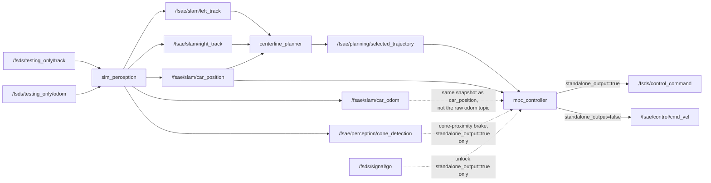

# FSDS Integration Guide

This guide covers the FSDS (live) side only: how to run the planning and control stack against FSDS, the ROS 2 workspace layout, the topic map, the track record, export and drive workflow, CSV logging and the Windows/WSL/Docker setup.

For the offline 2D GUI and tuner, see [offline_guide.md](../guides/offline_guide.md). For what "FSDS", "offline" and "2D GUI" mean, see [glossary.md](../reference/glossary.md). For how FSDS, the bridge and the ROS 2 nodes connect at a high level, see [ros_integration.md](ros_integration.md).

## Table of Contents

1. [Workspace layout](#workspace-layout)
2. [Choosing the controller and planner](#choosing-the-controller-and-planner)
3. [Recording, exporting and driving a track](#recording-exporting-and-driving-a-track)
4. [CSV telemetry logging](#csv-telemetry-logging)
5. [Launching nodes with FSDS on Windows (WSL + Docker)](#launching-nodes-with-fsds-on-windows-wsl--docker)

## Workspace layout

The live workspace is `ros2/src/fsae_planning/` in the outer FSDS repo. It is its own git repo and holds five packages: `fsae_interfaces`, `fsae_bringup`, `fsae_sim_perception`, `fsae_planning` and `fsae_control`.

`fsds_simulator/` in this repo is a snapshot mirror of that workspace, at the same relative paths. There are two ways to use it:

- **With an existing `fsae_planning` checkout**: copy `fsds_simulator/control/`, `perception/`, `common/` and `planning/` over the matching paths in the checkout. The structure matches, so this is a directory copy, not a file-by-file paste.
- **Without one**: `fsds_simulator/` alone, plus FSDS and the two message packages, builds a working workspace. See [fsds_simulator/README.md](../../fsds_simulator/README.md).

The file mapping and what is deliberately not mirrored are in [offline_live_parity.md](../reference/offline_live_parity.md). Installing from scratch on Windows is covered at the end of this guide.

## Choosing the controller and planner

`sim.launch.py` (package `fsae_bringup`) takes `controller` and `planner` as launch arguments, so switching needs no file edit. It also launches `cone_recorder` by default.

```bash
ros2 launch fsae_bringup sim.launch.py                              # mpc, standalone_output=true, cone_recorder on
ros2 launch fsae_bringup sim.launch.py controller:=stanley
ros2 launch fsae_bringup sim.launch.py controller:=mpc standalone_output:=false
ros2 launch fsae_bringup sim.launch.py planner:=skidpad_planner controller:=mpc
ros2 launch fsae_bringup sim.launch.py record_cones:=false          # skip cone_recorder
```

`controller:=mpc` starts one node, `mpc_controller`, which runs either the LTV-QP (LMPC) or the NMPC solver depending on `use_nmpc`. `use_nmpc` is an `NMPCParams` field with dataclass default `false`. `ros2/launch_all.sh` sets `USE_NMPC=true`, so a launch through the script runs NMPC. Check that line before assuming which solver is live.

### Two output modes

`mpc_controller` has two output modes, chosen by its `standalone_output` parameter.

- **`standalone_output:=true`** (launch default): the node publishes the `fs_msgs` `ControlCommand` message directly with the MPC's own throttle and brake. It also owns GO gating and cone braking. `fsds_bridge` is not launched.
- **`standalone_output:=false`**: the node publishes the shared `cmd_vel` interface, like `stanley`. `fsds_bridge` converts it to `ControlCommand` and owns GO gating and cone e-braking.

Never run `fsds_bridge` next to a `standalone_output:=true` node. Both would publish to `/fsds/control_command`. The launch file skips `fsds_bridge` in that mode.

Rationale for the two modes: the `true` mode keeps the MPC's own longitudinal output, which is what the offline tuner tunes. The `false` mode routes speed through `fsds_bridge`'s separate speed-error P-loop and discards the MPC's throttle and brake. The historical reason the `false` mode exists is not recorded.

### Topic map



- `car_odom` carries the pose and the speed and yaw rate from one atomic odom sample. The controller reads speed from it so the state vector never mixes samples from two ticks. See `sim_perception.py`'s module docstring.
- The node has no desired-speed topic. It derives `desired_speed` each tick from the current path with `control_utils.curvature_speed()`, or looks it up in a precomputed CSV (see [what the live controller reads](#3-what-the-live-controller-reads)). The `v_max` and `v_min` parameters bound the live curvature speed.
- With `use_precomputed_path` on (launch default) `planning.launch.py` is not included, so nothing publishes `/fsae/planning/selected_trajectory`. The node loads the CSV path and publishes it once, latched, on `/fsae/control/static_reference_path` for the debug viewer.

### Control loop phases

Source: `_control_step` in `mpc/control_step.py`, constants in `mpc/node_constants.py`. Phases 1 and 4 apply only when `standalone_output=true`.

1. **Hold at start line**: full brake until `/fsds/signal/go` arrives.
2. **Stale-path emergency brake**: if no fresh path has arrived within `PATH_TIMEOUT` (0.5 s) or the path has under 2 points, brake fully and call `reset()`. With `standalone_output=false` the node publishes nothing here and relies on `fsds_bridge`'s own timeout. The reset discards the solver's warm start and actuator-lag memory so the controller does not resume from stale state.
3. **Solve**: `compute()` on the LMPC or NMPC controller.
4. **Cone-proximity brake override**: a fused cone inside a corridor directly ahead overrides throttle and brake, not steering. The corridor depth is `car_speed * 0.25` clipped to 0.6 to `CONE_BRAKE_DIST` (2.0 m), half-width `CONE_BRAKE_WIDTH` (0.18 m). After `CONE_RESET_THRESHOLD` (0.3 s) of continuous braking the controller is reset once. The reset re-arms when the brake clears.
5. **Telemetry logging**: optional, logs the final post-override command.
6. **Publish.**

## Recording, exporting and driving a track

The pipeline goes from "no map of this track" to "the car drives the precomputed line and speed". Recording and driving run live against FSDS. The export step runs offline from this repo.

### Where a track lives: `tracks/<name>/`

```
tracks/<name>/
    cone_map.json      cone_recorder capture (source of truth)
    speed_profile.csv  tuner.tools.export_speed_profile output (centreline + oracle speed)
    raceline.csv       tuner.tools.raceline_optimizer output (minimum-time line)
    centerline.csv     tuner.tools.raceline_optimizer --mode centerline output
```

The physical directory is `ros2/src/fsae_planning/tracks/<name>/`, inside the `fsae_planning` repo, not this one. Track data ships with `fsae_planning` so FSDS plus `fsae_planning` can drive with no checkout of this repo. `tracks/__init__.py` here points `TRACKS_DIR` across the repo boundary, so the export tools and the GUI read and write there when both repos sit side by side. Changes under that path are local edits to the `fsae_planning` checkout.

- `comp_test_map_3` is the track the baseline numbers in the docs are quoted against. A new recording gets its own name.
- List tracks with `python -m tuner.tools.export_speed_profile --list` or `ls ../ros2/src/fsae_planning/tracks/` from this repo.
- A brand-new track name gets the date appended (`<name>_<YYYYmmdd>`), by `launch_all.sh` when `TRACK_DIR` does not exist yet, or by `tracks.dated_track_name()`. Re-recording an existing track keeps its directory and name.
- Two recordings under one base name on different days therefore land in separate directories.

**`launch_all.sh` picks the track from `TRACK=`.** If `TRACK` is unset the script picks the newest track by `cone_map.json` mtime. The script currently sets `TRACK=comp_test_map_3` uncommented, so it is pinned, not following the newest recording. Comment that line out to follow the newest. Geometry comes from `centerline.csv` when present, else `raceline.csv`. See [reference_path_and_speed.md](../reference/reference_path_and_speed.md) for the resolution mechanism.

### 1. Record a lap (live, FSDS)

`cone_recorder` (package `fsae_sim_perception`) accumulates boundary cones during a live run and writes a JSON map that the offline side can load through `sim/track_io.py` and the GUI's **Load Recorded Track** button.

- It starts on the first `/fsds/signal/go`.
- It writes once the car returns near its start pose after travelling at least `min_lap_dist` (8 m) away, which is one closed lap.
- If the lap never closes it writes after `max_record_time` (300 s) and sets `"lap_closed": false`.

`sim.launch.py` starts it by default (`record_cones:=true`). Recording a new track needs the live planner in the loop, so `use_precomputed_speed` and `use_precomputed_path` must be off. The easiest place to set that is `ros2/launch_all.sh` (see step 4). Directly:

```bash
ros2 launch fsae_bringup sim.launch.py controller:=stanley \
    use_precomputed_speed:=false use_precomputed_path:=false \
    cone_out_path:=/path/to/fsae_planning/tracks/<name>/cone_map.json
```

`cone_recorder.launch.py` also runs standalone to attach a recorder to a stack that is already running:

```bash
ros2 launch fsae_bringup cone_recorder.launch.py
ros2 launch fsae_bringup cone_recorder.launch.py out_path:=/path/to/cone_map.json
```

- Writing straight into `tracks/<name>/` means the export tools need only the track name.
- The default output is `~/fsae_logs/cone_map_<timestamp>.json`. Move it into `tracks/<name>/cone_map.json`, or pass its full path to the export tools. Both accept a name or a path (`tracks.resolve_map_arg`).
- `ros2/launch_all.sh` always passes `cone_out_path:=<track dir>/cone_map.json` for the current `TRACK`. Setting `TRACK=<name>` before a recording is the least fiddly route. Because `record_cones` is on by default, any run started this way also writes that file when a lap closes. Whether this overwrites an existing map on a normal driving run is not verified.
- `fsds_simulator/launch_all.sh` is currently byte-identical to `ros2/launch_all.sh`. It resolves tracks under its own `src/fsae_planning/tracks/`, so it works only from a workspace laid out that way. `fsds_simulator/cone_maps/` holds one older capture, and **Load Recorded Track** reads both `tracks/*/` and `fsds_simulator/cone_maps/`.

### 2. Export the speed profile and raceline (offline)

Run from this repo:

```bash
python -m tuner.tools.export_speed_profile <name>                        # -> speed_profile.csv
python -m tuner.tools.raceline_optimizer   <name>                        # -> raceline.csv
python -m tuner.tools.raceline_optimizer   <name> --mode centerline      # -> centerline.csv
python -m tuner.tools.export_speed_profile <name> --corner-slowdown 0.10 # -> speed_profile_corner_test.csv
```

All outputs land in `ros2/src/fsae_planning/tracks/<name>/`.

- The fourth command writes a low-speed corner-test variant: normal speed everywhere, slowed only where curvature crosses the threshold. See [reference_path_and_speed.md](../reference/reference_path_and_speed.md).
- The two exporters do not share a corner-speed limit. `export_speed_profile` plans from `CURVATURE_SPEED_A_LAT_MAX` (`sim/speed_profile.py`, 4.75). `raceline_optimizer`, in both modes, plans from `alat_ceiling_at(v)` (`VehicleParams` in `model/vehicle_physics/params.py`) times its own `ALAT_MARGIN` (0.85). Changing `CURVATURE_SPEED_A_LAT_MAX` changes `speed_profile.csv` only.
- `--mode centerline` pins the lateral offset to zero, so the path is the reconstructed centreline with only the speed optimised. It writes a separate file and cannot overwrite the raceline. Use it when a logged `|e_y|` must mean distance from the middle of the track. On a raceline it does not, because the line apexes near a boundary.
- Omitting `<name>` targets the newest track (`tracks.newest_track()`). `--list` prints what exists. `--no-overwrite` refuses to replace an existing output. Overwrite is the default because re-exporting after a retune is the common case.
- `export_speed_profile` rebuilds the centreline like `sim/track_io.load_recorded_track()` (scipy `CubicSpline` plus `planning/boundary.build_path_walls()`). It writes `x,y,psi,v_target`. The speed profile is closed-loop by default, so it stays continuous across the start line. `--open-loop` gives point-to-point behaviour for a recording that is not a lap.
- `raceline_optimizer` reshapes the same reconstruction inside the track width for minimum lap time, against the plant's `alat_ceiling`. Same CSV format, different geometry.
- Both write a `# source_map=<path>` comment line. **Re-run them whenever the recorded map changes.** Nothing regenerates the CSVs automatically.
- The CSV format is trivial by design so the live package (`control_utils.load_speed_profile_csv()` and `load_path_profile_csv()`) needs no scipy and no port of the reconstruction code.

### 3. What the live controller reads

<a id="3-what-the-live-controller-reads"></a>

Three launch arguments control the data source. The first two are consumed by both `mpc` and `stanley`, which lets a Stanley run and an MPC run share the same speed target and path for comparable telemetry. `use_nmpc` is MPC only.

| Launch arg | Default via `launch_all.sh` | Effect |
|---|---|---|
| `map_path` + `use_precomputed_speed` | newest or pinned track's `speed_profile.csv` | Look up the target speed from the CSV instead of live `curvature_speed()` |
| `path_map_path` + `use_precomputed_path` | `centerline.csv`, else `raceline.csv` | Track the CSV geometry instead of the planner's `/fsae/planning/selected_trajectory`. The live planner is not launched |
| `use_nmpc` | `true` (set in `launch_all.sh`), dataclass default `false` | Swap the LTV-QP for the Frenet-frame NMPC. See [nmpc.md](../controllers/nmpc.md) |

- Both `use_precomputed_*` toggles default to `true` in `sim.launch.py`. A bare launch drives the default track's precomputed line and speed.
- `map_path` and `path_map_path` can point at different files. The usual case is one track for both.
- If a CSV path does not exist the node logs an error at startup and falls back to live `curvature_speed()` and the live planner. It does not crash, but it also does not do what was requested. Check the log if a run looks like a live-planner run.
- The `map_path` and `path_map_path` defaults in `sim.launch.py` are absolute paths to `comp_test_map_3`. They are the fallback for a bare `ros2 launch`. Day-to-day, set `TRACK=` in `launch_all.sh`.

### 4. Switching the track the car drives

One variable, in `ros2/launch_all.sh`:

```bash
TRACK=comp_test_map_3    # any name under ros2/src/fsae_planning/tracks/
```

It expands to `map_path`, `path_map_path` and, for a new recording, `cone_out_path`. The script checks the CSVs exist before launch and fails with a message naming the tracks that do exist, instead of silently falling back to live planning.

Without the script, pass the arguments directly:

```bash
ros2 launch fsae_bringup sim.launch.py \
    map_path:=ros2/src/fsae_planning/tracks/<name>/speed_profile.csv \
    path_map_path:=ros2/src/fsae_planning/tracks/<name>/raceline.csv
```

End to end:

```bash
# 1. Record (live). In ros2/launch_all.sh set TRACK=<new-name>, USE_PRECOMPUTED_SPEED=false,
#    USE_PRECOMPUTED_PATH=false, CONTROLLER=mpc or stanley, then:
./ros2/launch_all.sh

# 2. Export (offline, from fsae_MPCTest/; needs this repo checked out)
python -m tuner.tools.export_speed_profile <new-name>
python -m tuner.tools.raceline_optimizer   <new-name>

# 3. Drive (live). Set TRACK=<new-name> and both toggles back to true:
./ros2/launch_all.sh
```

## CSV telemetry logging

The controller nodes (`stanley_controller.py` and `mpc_controller.py`) can write two CSVs per run through `telemetry.ControlLogger` (package `fsae_control/telemetry/`).

- The node parameter `log_csv` defaults to `false`, so `ros2 run` and `control.launch.py` log nothing by default.
- `sim.launch.py` declares `log_csv` with default `true`, so a launch through `sim.launch.py` or `launch_all.sh` logs by default. `launch_all.sh` passes `log_dir:=<repo>/fsae_logs`.

```bash
ros2 launch fsae_bringup sim.launch.py log_csv:=false                         # logging off
ros2 launch fsae_bringup sim.launch.py log_dir:=/path/to/logs                 # custom output dir
ros2 run fsae_control mpc_controller --ros-args -p log_csv:=true -p log_dir:=/path/to/logs
```

- `<tag>_control_<timestamp>.csv`: one row per 20 Hz control step (position, heading, speed, tracking error, commanded steering and accel, solver health, latency diagnostics).
- `<tag>_path_<timestamp>.csv`: path snapshots at about 1 Hz.
- `log_dir` defaults to `~/fsae_logs`. Files accumulate with no retention policy.
- On shutdown the control CSV is rewritten with a `#`-commented header holding the composite score, computed by the same maths as the offline tuner (`telemetry/scoring.py`). Column reference: `telemetry/columns.py`. Score formula: [architecture.md](../reference/architecture.md).
- With a precomputed path loaded, `telemetry/lap_progress.py`'s `LapProgressTracker` derives real progress, completion and time bonus from the car position against the path. The header then also carries `lap_time_s` and `optimal_time_s`. Without it a live score would sit at the DNF floor regardless of driving. A run against the live planner topic has no known path end and stays partial (`score_is_partial=1`). See [offline_live_parity.md](../reference/offline_live_parity.md).
- `stanley_controller.py` also supports `map_path`, so a Stanley run with a precomputed profile scores fully. See [sim_to_real_investigation.md](../logs/sim_to_real_investigation.md) section 57.

Logging and cone recording are independent and can be combined.

## Launching nodes with FSDS on Windows (WSL + Docker)

This sets up the bridge and the planning/control stack from scratch on Windows. The simulator is the prebuilt Windows `.exe`. ROS 2 Jazzy runs in a Docker container inside WSL. Clone in the WSL home directory, not inside an existing project folder. These steps are an external procedure and were not re-run when this guide was rewritten.

`ros2/launch_all.sh` automates most of it. It uses the host's native ROS 2 install when `ros2` and `install/local_setup.bash` exist, and otherwise runs through the Docker container `fsds_ros2_bridge`.

### 1. Clone the repo and start a ROS 2 Jazzy container

```bash
# In WSL Ubuntu, from the home directory
GIT_LFS_SKIP_SMUDGE=1 git clone https://github.com/FS-Driverless/Formula-Student-Driverless-Simulator.git --recurse-submodules

docker run -it \
  --name fsds_ros2_bridge \
  --net=host \
  --privileged \
  -v "$(pwd)":/root/Formula-Student-Driverless-Simulator \
  osrf/ros:jazzy-desktop \
  bash
```

`--net=host` makes the container share WSL's network namespace, which the host-IP step below relies on.

### 2. Build the workspace inside the container

```bash
apt-get update && apt-get install -y \
  python3-colcon-common-extensions \
  ros-jazzy-cv-bridge \
  ros-jazzy-image-transport \
  ros-jazzy-tf2-geometry-msgs \
  libyaml-cpp-dev
```

The bridge compiles against AirSim's client headers, so AirSim's own dependencies must be fetched first:

```bash
apt-get update && apt-get install -y eigen3-devel || apt-get install -y libeigen3-dev
apt-get update && apt-get install -y wget

cd /root/Formula-Student-Driverless-Simulator/AirSim
./setup.sh
```

Then build:

```bash
cd /root/Formula-Student-Driverless-Simulator/ros2
source /opt/ros/jazzy/setup.bash
colcon build --symlink-install
```

Use `--symlink-install`. A plain `colcon build` copies Python files into `install/`, so later edits to `src/` stay invisible to `ros2 launch` until a rebuild.

### 3. Point the bridge at the Windows-side simulator

The bridge (Linux side) reaches the simulator (Windows side) over AirSim's RPC port `41451`. Under WSL2 the simulator is a different machine from the bridge's point of view, and `localhost` does not reach it. The Windows host is reachable through WSL's default gateway, an address assigned per boot.

The bridge launch file (`ros2/src/fsds_ros2_bridge/launch/fsds_ros2_bridge.launch.py`) reads the address from the environment. Do not hardcode it in the file.

- The `host` launch argument defaults to `$FSDS_HOST_IP`, else `localhost`.
- Set the variable, or pass `host:=<ip>` on the command line:

```bash
export FSDS_HOST_IP=$(ip route show default | awk '{print $3}')
```

- `ros2/launch_all.sh` exports `FSDS_HOST_IP` itself when it runs natively (no Docker) and the variable is unset. It uses the same gateway lookup, and also probes `$FSDS_HOST_IP:41451` to wait for the simulator. On the Docker path the script does not set it. Export it inside the container before launching the bridge.

Start order matters. Start the Windows `.exe` first, since it opens the RPC port. Then launch the bridge. A bridge started early fails to connect (`launch_all.sh` waits up to 120 s for the port).

```bash
source /opt/ros/jazzy/setup.bash
source install/local_setup.bash
ros2 launch fsds_ros2_bridge fsds_ros2_bridge.launch.py
```

`ros2 topic list` in a second terminal should now show vehicle, image and sensor topics from the simulator.

### settings.json

The bridge launch file reads camera definitions from FSDS's `settings.json` (`Vehicles.FSCar.Cameras`, and each camera's `CaptureSettings[0].ImageType`, where `2` selects the depth-camera mode). It finds the file in this order:

1. `$FSDS_SETTINGS`, an explicit path.
2. `settings.json` four directories above the launch file's source location. This resolves only with `colcon build --symlink-install`.
3. `~/Formula-Student-Driverless-Simulator/settings.json`.

If none exists the launch fails and lists the paths tried. The repo's `settings.json` defines the `FSCar` vehicle with IMU, GPS, two lidars and a GSS sensor and two cameras (`cam1`, `cam2`). Where the Windows `.exe` itself reads its settings from is not verified here.

### 4. Add the `fsae_planning` repo and this project's controller

```bash
cd /root/Formula-Student-Driverless-Simulator/ros2/src
git clone https://github.com/UOA-FSAE/fsae_planning.git
```

Copy `fsds_simulator/control/`, `perception/`, `common/` and `planning/` from this repo over the matching paths in the fresh clone (see [offline_live_parity.md](../reference/offline_live_parity.md) for the file mapping), then resolve dependencies and build:

```bash
cd /root/Formula-Student-Driverless-Simulator/ros2
rosdep update
rosdep install --from-paths src --ignore-src -r -y
colcon build --symlink-install
```

### 5. Run the closed loop

With the `.exe` and the bridge running, open a third terminal in the container:

```bash
docker exec -it fsds_ros2_bridge bash
source /opt/ros/jazzy/setup.bash
cd /root/Formula-Student-Driverless-Simulator/ros2
source install/local_setup.bash

ros2 launch fsae_bringup sim.launch.py

# Prevents core-dump files on crashes:
ulimit -c 0
```

Or use the launch script, which brings up the simulator, the bridge and the stack together. `WINDOWS_SIM_PATH` and the `cmd.exe` line inside it hardcode one machine's Windows install path and window size. Edit them first.

```bash
cd /home/Formula-Student-Driverless-Simulator/ros2/
chmod +x launch_all.sh
./launch_all.sh
```

### Solver dependencies inside the container

The base image lacks the QP solver stack (see [lmpc.md](../controllers/lmpc.md)). Install it in a running container:

```bash
apt update && apt install -y python3-pip
pip3 install cvxpy osqp --no-deps --break-system-packages
pip3 install qdldl scs clarabel highspy sparsediffpy jinja2 joblib markupsafe cffi pycparser --no-deps --break-system-packages
pip3 install cvxpy osqp --ignore-installed --break-system-packages
pip3 install "setuptools<80" --break-system-packages
pip3 install matplotlib kiwisolver --ignore-installed --break-system-packages
pip3 install "sparsediffpy<0.4.0" --break-system-packages
```

Or bake it into a reusable image. The same recipe is in `fsds_simulator/fsds_ros2_custom.Dockerfile`:

```bash
cat << 'EOF' > fsds_ros2_custom.Dockerfile
FROM osrf/ros:jazzy-desktop
ENV DEBIAN_FRONTEND=noninteractive
RUN apt-get update && apt-get install -y --no-install-recommends \
    python3-pip \
    ros-jazzy-ackermann-msgs \
    && rm -rf /var/lib/apt/lists/*
RUN pip3 install cvxpy osqp --no-deps --break-system-packages
RUN pip3 install qdldl scs clarabel highspy sparsediffpy jinja2 joblib markupsafe cffi pycparser --no-deps --break-system-packages
RUN pip3 install cvxpy osqp --ignore-installed --break-system-packages
RUN pip3 install "setuptools<80" --break-system-packages
RUN pip3 install matplotlib kiwisolver --ignore-installed --break-system-packages
RUN pip3 install "sparsediffpy<0.4.0" --break-system-packages
EOF

docker build --no-cache -f fsds_ros2_custom.Dockerfile -t fsds_ros2_custom .
```

### Reopening after a reboot and rebuilding one package

The container does not survive a host reboot. Only the volume-mapped repo folder does. Recreate it from the custom image:

```bash
cd /home/Formula-Student-Driverless-Simulator
docker rm -f fsds_ros2_bridge

docker run -it \
    --name fsds_ros2_bridge \
    --net=host \
    --privileged \
    -v "$(pwd)":/root/Formula-Student-Driverless-Simulator \
    fsds_ros2_custom \
    bash
```

To rebuild only the control package after editing it:

```bash
cd /root/Formula-Student-Driverless-Simulator/ros2
rm -rf build/fsae_control/ install/fsae_control/
colcon build --packages-select fsae_control --symlink-install
```

To edit files from Windows, open VS Code against the WSL folder instead of editing inside the container:

```bash
cd /home/Formula-Student-Driverless-Simulator/ros2
code .
```
