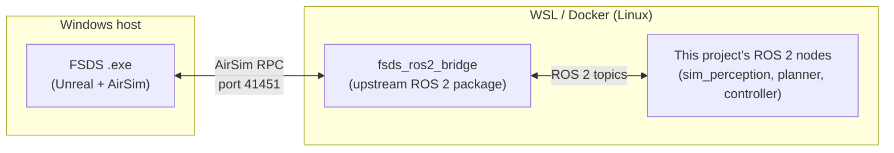
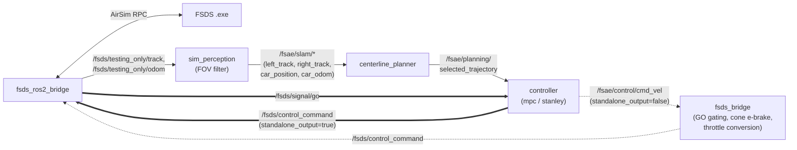

# FSDS to ROS 2 to Control: How the Pieces Connect

This is the high-level map of how [FSDS](https://github.com/FS-Driverless/Formula-Student-Driverless-Simulator) (the Unreal and AirSim simulator) reaches this project's planning and control nodes, and back. It covers where each piece runs, what crosses the bridge and what this project expects from it.

The bridge package `fsds_ros2_bridge` is upstream code. This project does not maintain a fork. The local edits are confined to its launch file (`ros2/src/fsds_ros2_bridge/launch/fsds_ros2_bridge.launch.py`): the simulator host comes from `$FSDS_HOST_IP` and `settings.json` is located through `$FSDS_SETTINGS` and fallbacks. Details are in the [integration guide](integration_guide.md#3-point-the-bridge-at-the-windows-side-simulator).

This is an FSDS-only document. For how it relates to the offline side see [glossary.md](../reference/glossary.md). For build steps see the [Windows and WSL setup](integration_guide.md#launching-nodes-with-fsds-on-windows-wsl--docker). For the control node's topic map see [choosing the controller and planner](integration_guide.md#choosing-the-controller-and-planner).

## Where each piece runs

- The simulator and the ROS 2 workspace are separate processes on two sides of a network boundary, even when both run on one machine (Windows host plus WSL).
- The bridge is the only piece that speaks AirSim RPC. Everything else sees plain ROS 2 topics.
- The RPC server listens on port `41451`. Under WSL2 the bridge reaches it through the host IP in `FSDS_HOST_IP`, because `localhost` inside WSL is not the Windows host.
- **Start order matters.** The `.exe` opens the RPC port, so it must be running before the bridge starts. `ros2/launch_all.sh` waits for the port (up to 120 s) before starting the bridge.

## What the bridge hands off, and to what

This diagram shows the shape only. The [integration guide](integration_guide.md#choosing-the-controller-and-planner) has the full topic map, including why the controller reads `car_odom` and not the raw odom topic, and the cone-proximity brake.

- **The bridge translates and does not decide.** It turns AirSim's sensor and state RPCs into ROS 2 messages, and turns the `fs_msgs` `ControlCommand` message back into AirSim throttle, steering and brake calls. Perception, planning and control all live in this project's nodes.
- **Two return paths reach the bridge.** With `standalone_output=true` the controller publishes the `fs_msgs` `ControlCommand` message directly. With `standalone_output=false` it publishes `cmd_vel` and `fsds_bridge.py` owns GO gating, cone e-braking and throttle conversion. `fsds_bridge.py` is a different node from `fsds_ros2_bridge` and is easy to confuse by name. Never run both paths into `/fsds/control_command` at once.

## Working with the bridge in practice

- **Treat the bridge as a black box.** If a topic looks wrong, check what this project's own nodes do with it first.
- **Check the simulator side first.** `ros2 topic list` and `ros2 topic hz` on `/fsds/testing_only/*` and `/fsds/signal/go` show whether the simulator is connected and publishing, before suspecting this project's nodes.
- **A known transport stall sits at the bridge and is not fixed.** Odom, `/clock` and IMU stall together on a period of about 31.7 to 34 s. The stall lives in a shared RPC or transport layer, not in one call, and the exact layer is unidentified. It inflates the controller's `pose_age_s` and can cause a spin-out. See [periodic_pose_teleport_investigation.md](../logs/periodic_pose_teleport_investigation.md). `ros2/launch_all.sh` still starts the diagnostic captures for it.
- **The bridge knows nothing about `standalone_output`, GO gating or cone braking.** Those belong to `mpc_controller.py` and `fsds_bridge.py`, downstream of it.
