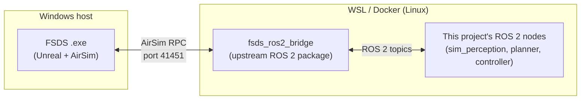
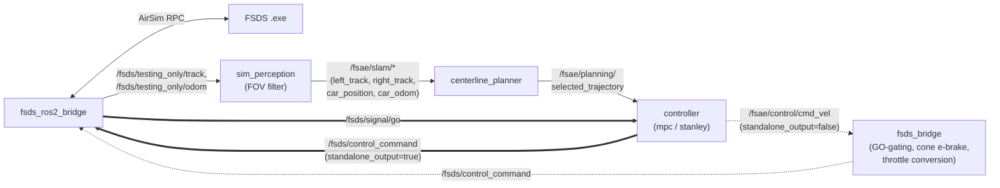

# FSDS ↔ ROS 2 ↔ Control: How the Pieces Connect

High-level map of how [FSDS](https://github.com/FS-Driverless/Formula-Student-Driverless-Simulator)
(the Unreal/AirSim simulator) reaches this project's planning/control
nodes, and back. The bridge itself (`fsds_ros2_bridge`) is upstream code,
not something this project builds or modifies — this doc only covers how
to work with it: what it publishes, what this project's nodes expect from
it, and where each side actually runs. For build/install steps (Windows/
WSL/Docker), see
[developer_guide.md's Launching nodes with FSDS on Windows](developer_guide.md#launching-nodes-with-fsds-on-windows-wsl--docker).
For the planning/control topic map on the ROS 2 side, see
[developer_guide.md's Simulator integration](developer_guide.md#simulator-integration).

## Where each piece actually runs

The simulator and the ROS 2 workspace are two separate processes on two
sides of a network boundary (even when both run on the same physical
machine, e.g. Windows host + WSL). The bridge is the only thing that talks
AirSim's RPC protocol; everything on the Linux side, including this
project's nodes, only ever sees plain ROS 2 topics. **Start order matters**:
the `.exe` opens the RPC port, so it must be running before the bridge
launches, or the bridge fails to connect.

## What the bridge hands off, and to what

This is the same topic map [developer_guide.md](developer_guide.md#simulator-integration)
covers in full detail (exact message types, why `car_odom` and not the raw
`/fsds/testing_only/odom`, cone-proximity braking, etc.) — this diagram is
only the shape of it. Two things worth calling out here specifically:

- **The bridge is a translation layer, not a decision-maker.** It converts
  AirSim's own sensor/state RPCs into ROS 2 messages and converts
  `fs_msgs/ControlCommand` back into AirSim throttle/steer/brake calls. All
  perception, planning, and control logic lives entirely in this project's
  own nodes downstream of it.
- **Two return paths to the bridge**, selected by the controller's
  `standalone_output` parameter: the controller can publish
  `fs_msgs/ControlCommand` directly (using its own throttle/brake), or
  publish the shared `cmd_vel` interface and let `fsds_bridge.py` (a
  *different* node from `fsds_ros2_bridge`, easy to conflate by name) own
  GO-gating, cone e-braking, and throttle conversion instead. Never run
  both into the same output at once, see the note in
  [developer_guide.md](developer_guide.md#simulator-integration).

## Working with the bridge in practice

- **It's a black box by design.** Nothing in this project patches or
  extends `fsds_ros2_bridge` itself; if a topic looks wrong, check what
  this project's own nodes do with it first (see the "Two return paths"
  note above and
  [docs/logs/periodic_pose_teleport_investigation.md](logs/periodic_pose_teleport_investigation.md)
  for a known, unexplained periodic pose discontinuity traced to the
  bridge's own `getCarState()` RPC path but never fixed there).
- **`ros2 topic list`/`ros2 topic hz`** against the bridge's own topics
  (`/fsds/testing_only/*`, `/fsds/signal/go`) is the fastest way to check
  whether the simulator side is actually connected and publishing, before
  suspecting anything in this project's own nodes.
- **The bridge doesn't know about `standalone_output` mode, GO-gating
  logic, or cone braking** — those are entirely this project's own
  `mpc_controller.py`/`fsds_bridge.py`, downstream of the bridge. See
  [developer_guide.md's Simulator integration](developer_guide.md#simulator-integration)
  for that logic.
