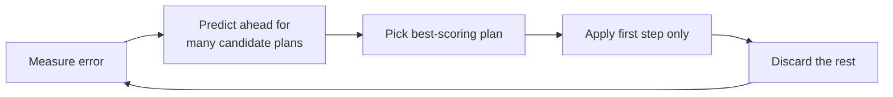

# Getting Started: the MPC Path-Tracking Controller

**Designer:** Martin Jin\
**Design leader:** N/A\
**CTO:** Jonty Clark\
**Supervisor:** Siva Sriram\
**Timeline:** 20/06/2026 - 26/08/2026

This is the onboarding tutorial. It explains how the MPC controller works, how to tune it, and how to run it in FSDS. Each section ends by pointing at the reference doc that holds the full detail.

## What you will learn

- How an MPC controller works, from the maths to the code.
- How to use the MPC controller in `fsae_MPCTest`.
- The key features of this implementation (adaptive gain scheduling and others).
- How to tune the controller by hand, and how to use the automatic tuner instead.
- How to run the controller live in the FSDS simulator for validation.

### Suggested reading order

| Step | Read | Time |
|---|---|---|
| 1 | This page, sections 1 to 5 | 30 min |
| 2 | [offline_guide.md](offline_guide.md), run the GUI once | 20 min |
| 3 | [tuning.md](tuning.md), before changing any weight | as needed |
| 4 | [lmpc.md](../controllers/lmpc.md) or [nmpc.md](../controllers/nmpc.md), the controller you work on | as needed |
| 5 | [glossary.md](../reference/glossary.md), for any unfamiliar term | as needed |

## Overview

### What the controller is for

The car runs a track in two laps. Lap 1 maps it: a live planner rebuilds the track from cones as the car drives, and records the result. Lap 2 drives the same track using that recorded map. The whole path is known in advance, so a controller can plan ahead instead of only reacting. That second lap is what the MPC (Model Predictive Control) controller is for.

MPC runs alongside the Stanley controller (a simple reactive steering law), not as a replacement. All three controllers (Stanley, LMPC, NMPC) stay selectable.

The core idea: every tick, ask "if the car did X for the next second or so, where would it end up, and how well would that track the path?" for many candidate X, then pick the best. Two properties follow:

- **Physical limits are respected.** The optimisation never asks for more steering angle than the rack can provide.
- **"Good driving" is tunable.** It lives in the weights of a cost function, not in hard-coded reactive rules.

### Two simulators, neither validated against the car

FSDS is the AirSim/UE4 3D simulator this project targets. It is the closest available stand-in for the real car, but it is not confirmed accurate against the real car either.

`fsae_MPCTest` (this repo) has its own offline tools: a 2D matplotlib GUI and a headless rollout used for automatic tuning. Their dynamics do not match FSDS. Treat any offline result as a rough signal, and check it in FSDS before trusting it. See [glossary.md](../reference/glossary.md) for which doc covers which side, and [section 6.2](#62-two-vehicle-models) for how the models compare.

### Which controller is better

NMPC beats LMPC on the measured comparisons (section 3.3). LMPC has a structural disadvantage: it cannot see the road bend ahead, which shows up as late corner turn-in (section 2.3). No measured ranking of Stanley against the MPC controllers is recorded in these docs, so none is claimed here.

All comparisons use one composite score computed the same way for every run (section 5.3). The logic lives in `sim/scoring.py`. An earlier steering-chatter problem once skewed a comparison, see [steering_chatter_investigation.md](../logs/steering_chatter_investigation.md).

### What this project delivers

- **A working MPC controller:** takes odometry (position, heading, speed) and outputs a throttle and steering command.
- **A 2D simulator:** a matplotlib GUI to visualise and manually test the controller against a drawn or loaded path.
- **An automatic tuner:** searches the controller's cost weights (9 numbers for the LMPC weights, plus 5 NMPC fields, see section 5.1) instead of tuning by hand. It runs a headless closed-loop rollout against the 25-state vehicle model in `model/vehicle_physics/`. That model is an approximation with no measured accuracy figure. Offline tuning checks that the control maths behaves sensibly and gets weights into the right range. It does not predict real-world performance. Further tuning in FSDS (section 7) and on the real car is still required.
- **ROS 2 nodes:** drop-in replacements for the Stanley controller node, used to test the MPC in FSDS.
- **Documentation:** the repo [README](../../README.md) and these docs.

## 1. How MPC works

MPC drives by repeatedly asking "if the car did X for the next second or so, where would it end up, and how well would that track the path?" for many X, and picking the best. This section covers the mechanics every MPC controller here shares. Sections 2 and 3 cover the two controllers built on it, LMPC and NMPC.

### 1.1 Receding horizon control

Every tick (20 Hz, so every 0.05 s), the controller plans a whole sequence of future commands, applies only the first, discards the rest, and re-plans from a fresh measurement next tick:

This is **receding horizon control**. Any prediction error in the internal model is corrected on the next tick. That is why MPC tolerates a simplified internal model instead of the full complexity of a real car.

### 1.2 State: error relative to the path

The controller does not track raw (X, Y) position. It tracks **error relative to the path**, so behaviour is the same wherever the car is on the track. Each tick it finds the closest path point to the car, then measures sideways distance and heading difference from there. This is a **Frenet-frame** conversion, the standard approach for a controller that must stay close to a curve.

| Symbol | What it is | Units |
|---|---|---|
| $e_y$ / $\dot{e}_y$ | Sideways offset from the path, and its rate of change | m / m/s |
| $e_\psi$ / $\dot{e}_\psi$ | Heading error, and its rate (LMPC uses absolute yaw rate here) | rad / rad/s |
| $e_v$ | Speed error against the target | m/s |
| $\delta_{act}$ / $a_{act}$ | Actual (lagged) steering and throttle/brake position, not the last command sent | rad / m/s² |

$\delta_{act}$ and $a_{act}$ track where the actuator is, not what was last commanded, because a real steering rack or throttle eases toward a new value instead of snapping to it. See [error_states.md](../reference/error_states.md) for the full derivation.

### 1.3 Cost function: what "good driving" means

Each solve minimises a weighted sum over the whole planning horizon:

| Knob | Penalises | Tuning effect |
|---|---|---|
| $Q$ | How far off the path the car is predicted to be | Higher: hugs the path tighter |
| $R$ | How much steering/throttle effort is used | Higher: gentler inputs |
| $R_{rate}$ | How jerky the commands are, tick to tick | Higher: smoother, less abrupt changes |
| Slack | Crossing the lane boundary (soft, last resort) | Discourages leaving the corridor without making the problem infeasible |

$Q$, $R$ and $R_{rate}$ are the weights the tuner searches (section 5). Every term is a non-negative weight times a squared error, so the LMPC cost is **convex**: the solver finds the global best answer, not a merely locally good one.

These weights are not unit-normalised. Each raw weight multiplies a raw-unit error (`q_e_y` on metres squared, `q_e_psi` on radians squared). Do not compare two weights by size alone.

### 1.4 The solver

A quadratic cost with linear constraints is a **Quadratic Program (QP)**, a well-studied problem class with fast purpose-built solvers. LMPC formulates the QP in CVXPY and solves it with [OSQP](https://osqp.org/) first, warm-started from the previous tick's answer, with [Clarabel](https://clarabel.org/) as a fallback. Rationale for choosing these two solvers is not recorded.

Measured offline solve time, LMPC (35-step horizon): 7.4 ms mean, 9.9 ms p95, 40.5 ms max, from the LTV-QP row of the A/B table in [late_turn_in_investigation.md](../logs/late_turn_in_investigation.md). Older docs quote 1 to 5 ms, which does not match that measurement.

If both solvers fail:

- **Offline:** the rollout holds the previous command. `MAX_FAILS` (5) consecutive failures end the run as a DNF (did not finish).
- **Live LMPC:** the node holds the last steering angle and commands full brake, the safer default on hardware.

### 1.5 Adaptive gain scheduling and safety features

The tuned weights are optimised for one average operating point. A few small functions rescale $Q$, $R$ and $R_{rate}$ every tick, on a fresh copy so the tuned weights are never modified, to match how the car's needs change with speed and cornering:

- **Steering gets more conservative at higher speed.** The same angle gives more lateral acceleration, so the steering cost rises smoothly with speed (`adaptive_R_scaling`). The acceleration cost is deliberately not scaled with speed.
- **The smoothness penalty relaxes in corners and stiffens on straights.** It is floored, not removed, in a tight corner via the corner-factor blend. It stiffens again once the car is straight, centred and aligned, to stop small unnecessary corrections (`steer_rate_anti_hunt`).
- **The lateral-error cost softens near the centreline.** This prevents a correct-then-overcorrect cycle just where the car should settle onto the line (`adaptive_Q_scaling`).
- **Delay compensation** rolls the tracking error forward through commands already in flight, so the controller plans against where the car will be, not where it was measured. Both the live node and the offline rollout do this (`predict_ahead`).
- **Tracking-error speed gate** slows the car when it is far from the path it is following, independent of the path's own shape. Both sides implement it.

Full detail: [control_mechanisms.md](../reference/control_mechanisms.md).

### 1.6 Two kinds of MPC: linear and nonlinear

LMPC and NMPC share everything in section 1: receding horizon, error state, cost function, solver framework. They differ in the internal model used to predict "if the car did X, where would it end up". That is what "linear" and "nonlinear" mean here:

- **A linear model's predictions scale proportionally.** Every entry in its matrices is a fixed multiplier, so doubling an error input doubles its predicted effect at any speed or state. This keeps the optimisation a single QP with a guaranteed answer (section 1.4).
- **A nonlinear model's predictions do not scale proportionally.** Some quantity depends on another state-dependent quantity, for example two things multiplied together that both change as the car moves. It is more accurate in principle, but it can no longer be solved as one QP. It is re-linearised and solved iteratively (section 3.2), which costs more time per tick and gives up the QP's solve-time guarantee.

**LMPC** (section 2) uses a linear model. **NMPC** (section 3) uses a nonlinear one specifically to fix a blind spot the linear model cannot represent (section 2.3). Section 4 compares them.

## 2. LMPC: the linear controller

**LMPC (linear MPC)**, also called LTV-QP (linear time-varying QP) in other docs, was the project's original controller. NMPC (section 3) fixes a structural blind spot LMPC has and performs better on corner turn-in. Both remain available, selected by one flag (`use_nmpc`). Full reference: [lmpc.md](../controllers/lmpc.md).

### 2.1 The model

LMPC models the car as a **bicycle model** (one wheel per axle, on the centreline) with 8 states and entirely **linear** equations. Below 1 m/s it uses pure geometry (Ackermann steering). Above 2.5 m/s tyre grip dominates and the model switches to a linearised dynamic form. Between the two it blends smoothly. Linearity keeps the optimisation a fast, guaranteed-solvable QP.

### 2.2 Why linear is good enough

A real tyre's grip is not linear: it bends and saturates as slip grows. LMPC's model does not capture that, because receding-horizon replanning (section 1.1) corrects the prediction error next tick anyway.

The trade is a small, bounded loss of prediction accuracy for a large gain in solve speed and reliability. A nonlinear model turns the QP into a nonlinear program with no guaranteed optimum and unpredictable solve times, and a controller due for an answer every 50 ms cannot risk that.

### 2.3 LMPC's blind spot: it cannot see the road bend

LMPC's model knows how the car moves in response to its own state and commands. Nothing in it represents "the path itself is turning". Put the car exactly on the centreline, pointed the right way, with a sharp corner ahead, and the model predicts zero error forever, however sharply the path bends beyond the horizon.

The controller reacts only once real error appears, partway into the corner. This shows up as **late turn-in**: straight for too long, then a lot of steering at once.

Feeding curvature into the cost as a lookahead signal does not fix this. The solver can defer paying for it, or steer briefly the wrong way first, because the dynamics themselves did not change. NMPC fixes it at the model level. The lookahead approaches that were tried and rejected are in [retired_mechanisms.md](../reference/retired_mechanisms.md).

## 3. NMPC: the nonlinear controller

**NMPC (nonlinear MPC)** is the second controller. It fixes LMPC's cornering problem (section 2.3). Both controllers exist offline and live, selected by one flag, `use_nmpc`. The defaults differ by side:

| Where | Default | Source |
|---|---|---|
| Offline (`settings/nmpc.py`) | `USE_NMPC = False` (LMPC) | `settings/nmpc.py` |
| Live dataclass and YAML | `use_nmpc` false (LMPC) | `mpc/nmpc_params.py`, `fsae_params.yaml` |
| Live via `ros2/launch_all.sh` | `USE_NMPC=true` (NMPC) | launch override |

Check the launch configuration for which controller a live run uses, since a launch-script override beats the dataclass default. Full reference: [nmpc.md](../controllers/nmpc.md).

### 3.1 The fix

NMPC changes what the model tracks. Its state includes **`s`, the distance travelled along the path**, and the path's curvature at that distance feeds directly into the heading-error equation. `s` is predicted forward using the car's predicted speed, so a bend at some future distance is "seen" the moment it enters the horizon. There is no separate signal for the solver to defer paying for. The bend is in the dynamics, not bolted onto the cost.

### 3.2 Solving it

That equation is **nonlinear** (it multiplies two state-dependent quantities), so it cannot be solved as one convex QP. NMPC re-linearises around its own predicted trajectory and solves a sequence of QPs that converge toward the nonlinear optimum. This is **Sequential Quadratic Programming (SQP)**. It costs more per tick than LMPC but stays inside the 50 ms budget.

Solve time depends on the RK4 sub-step counts (`nmpc_rk_substeps`, `nmpc_jac_substeps`), which changed after a low-speed stall fix:

| Configuration | Mean | p95 | Source |
|---|---|---|---|
| Original defaults (`nmpc_jac_substeps=1`) | 8.9 ms | 11.6 ms | [late_turn_in_investigation.md](../logs/late_turn_in_investigation.md) |
| `nmpc_jac_substeps=1` versus `4`, full lap | 9.56 ms versus 18.63 ms | 14.05 ms versus 23.61 ms | [nmpc_low_speed_accel_stall_investigation.md](../logs/nmpc_low_speed_accel_stall_investigation.md) |

The shipped defaults are now `nmpc_rk_substeps=4` and a speed-gated Jacobian (`nmpc_jac_substeps=4` below the gate speed, `nmpc_jac_substeps_fast=2` above). No solve-time measurement of that exact configuration is recorded, so the current figure is not verified. The soft per-iteration budget `nmpc_solve_budget_ms` is 25 ms.

### 3.3 Does it help

Yes, offline and live, on the setups below:

| Setting | Metric | LMPC | NMPC |
|---|---|---|---|
| Offline, `comp_test_map_3`, oracle path | Steering saturation | 12.5% | 0.8% |
| Offline, same run | Corner turn-in | starts after the corner begins on 6 of 7 corners | starts before it on 7 of 7, median 25.6 m earlier |
| Live FSDS, matched same-day pair | Steering saturation | 6.45% | 0.58% |
| Live FSDS, same pair | Lap time | 54.72 s | 52.35 s (2.37 s faster) |

The live figures are one matched pair, not repeated runs. Sources: sections 16.6 and 16.9 of [late_turn_in_investigation.md](../logs/late_turn_in_investigation.md). Those offline numbers were measured with the original sub-step defaults.

### 3.4 Optional refinements

NMPC carries two optional refinements on top of the core fix:

- **A smoother spline-fitted curvature reading** (`nmpc_spline_reference_enabled`): on by default, no known trade-off.
- **A friction-circle hard constraint on tyre force** (`nmpc_friction_circle_enabled`): off by default and experimental, pending a telemetry fix and a looser force bound.

A third idea, sampling a precomputed speed profile per horizon step, was tried as a cost term and then as a hard per-stage constraint. Both failed live tests for different reasons (a corner overspeed in the first, the same overspeed surviving in the second because the constraint checked the solver's own prediction, not the real car). It was removed, not left as an off-by-default option.

Full detail: "Three MPCC-inspired additions" in [control_mechanisms.md](../reference/control_mechanisms.md).

## 4. LMPC versus NMPC

| | **LMPC** | **NMPC** |
|---|---|---|
| Sees the road bend ahead? | No: predicts zero error forever if it starts at zero | Yes: curvature is part of the dynamics |
| Solved as | One convex QP per tick | A sequence of QPs (SQP) per tick |
| Solve time | 7.4 ms mean, 9.9 ms p95 (offline, section 1.4) | 8.9 to 18.6 ms mean depending on sub-steps (section 3.2) |
| Horizon | 35 steps (1.75 s) | 20 steps (1.0 s) |
| Adaptive gain scheduling (section 1.5) | Active | Inert, except `nmpc_steer_rate_anti_hunt_enabled` (opt-in) |
| Delay compensation, speed gate, e-braking, GO-gating | Shared | Shared |
| Yaw-rate weight | `q_r` penalises absolute yaw rate | `nmpc_q_epsi_dot` penalises yaw rate relative to what the corner demands |
| Live code | `lmpc/` package (`controller.py`, `predict.py`, `adaptive_gains.py`, `constants.py`) | `nmpc/` package |
| Offline code | `model/bicycle_model.py`, `controller/lmpc/` | `controller/nmpc/` |

Why the adaptive gains are inert under NMPC: they exist to compensate for LMPC's blind spot, which NMPC's model does not have, so reweighting on top would double-count the effect. The NMPC horizon is 20 steps because a horizon sweep chose it, see the "Defaults therefore: N=20" passage in [late_turn_in_investigation.md](../logs/late_turn_in_investigation.md).

The delay compensation, speed gate, e-braking and GO-gating are computed by the ROS 2 node upstream of either controller, and by the offline rollout for the first two.

For exact formulas and the full feature-by-feature comparison see [nmpc.md](../controllers/nmpc.md) and [error_states.md](../reference/error_states.md).

## 5. Tuning the controller

Section 1's cost function has weights ($Q$, $R$, $R_{rate}$) that decide what "good driving" means to the solver. This section covers why hand-tuning is hard, the automatic tuner, how a candidate weight set is scored, and how to run the tuner.

Tuning runs headless against the 25-state `model/vehicle_physics/` model. It does not run against the 2D GUI, FSDS or the real car, and that model's dynamics do not match FSDS. A tuned weight set is a starting point. Validate it in FSDS (section 7) before trusting it on the car.

### 5.1 Why an automatic tuner

$Q$, $R$ and $R_{rate}$ hold 9 tunable numbers: `Q_diag[0:5]`, `R_diag[0:2]`, `R_rate_diag[0:2]`. Hand-tuning 9 interacting numbers across many corner shapes is slow, and a change that helps one corner can hurt another. `tuner/offline_tuner.py` searches automatically, running thousands of simulated laps and minimising one composite score.

One well-defined score also makes "is this weight set better?" an objective, repeatable question. The same score compares runs from the GUI, the tuner and the real car.

The search vector is longer than 9. `TUNABLE_NMPC` in `tuner/offline_tuner.py` appends 5 NMPC fields (`rjerk_delta`, `corner_factor_k`, `rrate_zone_boost_straight`, `rrate_zone_ease_approach`, `rrate_zone_floor_corner`), so the default search has 14 dimensions. Those 5 only change the score when `USE_NMPC` is true. With the LMPC default, they are wasted dimensions. Empty `TUNABLE_NMPC` to restore the 9-parameter search.

### 5.2 How the tuner works (CMA-ES)

The tuner uses **CMA-ES**, an evolutionary algorithm in the genetic-algorithm family. It keeps a population of candidate weight sets, scores each by a rollout, and shifts the next generation toward whatever scored best. No formula for "which direction improves the score" is needed.

- **Why this type of algorithm:** "how well did the car drive" has no clean formula from weight to score, and the score is somewhat noisy. Evolutionary search needs only the ability to score a candidate, not differentiate it.
- **Pro:** needs no gradients; explores a wide space of weight combinations in parallel.
- **Con:** needs thousands of rollouts, and offers no guarantee of the global best.

Each candidate is scored on every shape in `VALIDATION_SUITE` (5 shapes), from a perfect start and from a slightly-off one (0.2 m lateral, 0.05 rad heading), to test recovery as well as tracking. The objective is 70% weighted mean plus 30% of a high quantile of the per-task scores (`settings.TAIL_QUANTILE`). The tail term punishes a weight set that fails badly on one shape, so the tuner cannot win by driving one shape perfectly and another badly. A hard maximum was rejected because one borderline DNF would then swamp the objective.

### 5.3 How a run gets scored

Every rollout is scored by the same logic: the tuner, **Show Metrics** and **Benchmark All Paths** in the GUI, and the real car (the ROS 2 package carries a copy of the same formula with the constants inlined). Scores from any of them are directly comparable, with one caveat for the car. It cannot measure `offtrack` (no ground-truth track edges) or a lap-time optimum, so a live run has no lap-time bonus reference and the log header records `score_is_partial=1`.

#### 5.3.1 The 13 raw metrics

Accumulated every simulation step:

| # | Metric | What it measures |
|---|---|---|
| 0 | `rmse` | Combined tracking error (lateral and heading), root-mean-squared, the most important signal |
| 1 | `yaw_rms` | How much the heading wobbled overall |
| 2 | `smooth_rms` | How jerky the steering/throttle changes were, step to step |
| 3 | `steer_rms` | Overall steering effort |
| 4 | `accel_rms` | Overall throttle/brake effort |
| 5 | `max_steering` | The largest steering command in the run |
| 6 | `steering_sat_ratio` | How often steering was within 95% of its limit |
| 7 | `jerk_rms` | How abruptly the rate of change itself changed |
| 8 | `max_yaw_rate` | The fastest the heading ever spun |
| 9 | `steering_reversal_rms` | Magnitude-weighted steering direction flip-flops (a small trim wiggle barely counts, a large swing dominates) |
| 10 | `peak_lateral_error` | The single worst sideways error (safety-margin check) |
| 11 | `speed_rmse` | How well actual speed tracked the target |
| 12 | `accel_reversal_rms` | Same construction as metric 9, applied to throttle/brake |

#### 5.3.2 Combining into one score, in three steps

A single weighted sum of all 13 metrics has a limit: some good behaviours become unreachable whatever the weights (a "hunting" gain set that wobbles the steering constantly can beat a sensible one if line-hugging dominates the sum). Scoring asks three questions in order instead:

| Step | Question | Effect |
|---|---|---|
| 1. Completion | Did the run count? | A crash, off-track excursion or DNF lands above `CONSTRAINT_FLOOR` (10.0), where no good driving elsewhere can reach it. Getting further before failing still scores a little better |
| 2. Lap time | How much slower than physically possible? | The real goal, in real units: `time_cost = 0.15` means the lap took about 18% longer than physically possible. Wobbling cannot buy lap time, so this rules out the hunting cheat |
| 3. Smoothness | Tie-breaker between similarly fast laps | Decides between runs already close on time, does not decide the winner outright |

A feasible run scores `TIME_OBJECTIVE_WEIGHT * time_cost + QUALITY_WEIGHT * quality` (1.0 and 0.35 by default), where `quality` is the weighted sum of the normalised metrics.

Completion is judged by `reached_end`, not `progress`. `progress` comes from a search that stops just short of the final point, so even a perfect lap reports about 0.90.

#### 5.3.3 Normalising and weighting the metrics

The 13 metrics have very different natural sizes (`steering_reversal_rms` about 0.007, `speed_rmse` about 2.5). Two settings do two jobs:

- `METRIC_SCALES` divides each metric by "a normal amount of this" before weighting, correcting for typical size.
- `SCORE_WEIGHTS` then sets how much each normalised metric matters. It sums to 1.0, so a run sitting exactly at every reference scale has `quality = 1.0`.

Both live in `settings/scoring.py`. The old completion and time bonuses (`COMPLETION_BONUS_WEIGHT`, `TIME_BONUS_WEIGHT`) no longer affect the score. Time is now the primary objective and completion a hard requirement. DNF penalties (`DNF_PENALTY`, plus `DNF_OFFTRACK_PENALTY` for leaving the track) set how far above the floor a failed run lands.

**Lower is better.** A good finishing run typically scores 0.4 to 1.0. Anything above 10.0 means the run crashed, left the track or did not finish.

#### 5.3.4 Where results are logged

Every tuning run appends an entry to `docs/logs/tuning_history.txt`: timestamp, the three weight arrays (copy-pasteable), the `SCORE_WEIGHTS` in force, duration, the tuner's own score, Optuna pre-pass details and the git commit hash. It also writes an `Overall score` line pre-filled with "Haven't been tested." Replace that by hand once the weights have been tested in FSDS, since the offline score does not predict real-world performance. The file's header marks entries before 2026-08-06 as a closed book: they were produced under different scoring and are not comparable with later ones.

### 5.4 Running the tuner

`python -m tuner.offline_tuner` runs it. Stop early with **Ctrl+C**: it finishes the current generation and reports the best weights so far. On completion it prints `Q_diag`, `R_diag` and `R_rate_diag` to copy in.

**Apply the result to both sides.** They are not linked and are kept in sync by hand:

- Offline: `Q_diag`, `R_diag` and `R_rate_diag` in `settings/lmpc.py`.
- Live: the matching `MPCParams` fields in `mpc_params.py` under `ros2/src/fsae_planning/control/fsae_control/fsae_control/mpc/`.

Two gaps to know about:

- The tuner prints and logs only the 9 Q/R/R_rate weights. The values it finds for the 5 NMPC fields are not printed or logged, so an NMPC tuning result is not recoverable from the run output.
- `R_diag[1]` (the accel weight) is nominal only. The QP's acceleration and braking costs read `R_A_ACCEL` and `R_A_BRAKE`, so the tuner's `R_diag[1]` has no effect on the score. Set those two by hand.

The full field-by-field parity mapping is in [offline_live_parity.md](../reference/offline_live_parity.md). Full tuner usage is in [offline_guide.md](offline_guide.md).

### 5.5 Manual tuning guide

Hand-editing individual entries is not recommended. They interact, so an apparent improvement in one corner can quietly break another. Prefer the tuner. If a value must be nudged by hand:

- **Change one number at a time**, by no more than 20 to 30%, then re-test. Small changes can have large effects.
- **Test against multiple corner shapes**, using **Benchmark All Paths** in the GUI, not only **Show Metrics** on one run.
- **Watch for these symptoms:**

| Symptom | What to check |
|---|---|
| Car oscillates left-right, especially at low speed | `R_rate` too low (steering may change too abruptly), or too much weight on $e_y$ relative to $\dot e_y$ |
| Car cuts corners short or understeers into apexes | `Q[e_y]` too low relative to `Q[e_psi]`, or the corner speed target is too high for the assumed tyre grip |
| Car is sluggish to accelerate or stuck at low speed | `R_A_ACCEL` too high, or the friction constants in `model/vehicle_physics/params.py` need adjusting first |
| Solver frequently fails or returns `OPTIMAL_INACCURATE` | See [section 6.5](#65-key-settings-reference) and [debugging_tools.md](debugging_tools.md). Usually weight scaling or solver tolerance, not driving behaviour |
| Good on one path, bad on another | Overfitting to one corner shape. Add more paths to `VALIDATION_SUITE` and re-run the tuner instead of hand-patching |

Per-weight guidance and known constraints: [tuning.md](tuning.md).

### 5.6 Adding a new test track

Add a new synthetic corner shape in `build_synthetic_paths()` in `tuner/offline_tuner.py`, then add its key to `VALIDATION_SUITE` in `settings/scoring.py` to have the tuner optimise against it. Step-by-step: [offline_guide.md](offline_guide.md).

## 6. Repo contents (`fsae_MPCTest`)

`fsae_MPCTest` is the offline half of the project: developing, tuning and testing the MPC without FSDS running. It holds:

- A fast **2D simulator** for visualising and closed-loop testing a controller against a path.
- **Debugging tools** (for example `tuner/tools/plot_playback.py`) that graph logged run data after the fact.
- The **automatic tuner** (section 5).

### 6.1 Which tree is which

Four places hold code. Only one is the live ROS 2 tree:

| Path | Role |
|---|---|
| `ros2/src/fsae_planning/` (outer FSDS repo) | The live ROS 2 tree: the code that runs in FSDS. Edit here for a live change |
| `fsae_MPCTest/fsds_simulator/` | A staging mirror of that tree for pull requests. A snapshot, not the live tree, and not imported by anything offline |
| `fsae_MPCTest/` (rest) | Offline simulator, tuner, GUI |
| `ros2_autonomous/src/fsae_autonomous/` | The production repo for the real car. Not covered here |

The live and offline copies of the planning/control logic must stay numerically identical, because weights tuned offline are only valid on the car if the live code matches. A one-sided edit is an incomplete change. See [offline_live_parity.md](../reference/offline_live_parity.md).

### 6.2 Two vehicle models

Two separate vehicle models exist, each for a different job:

- **LMPC's internal model** (section 2) is a simplified linear 8-state bicycle model, simple because the solver evaluates it many times per second. It is what the controller thinks the car is.
- **The offline simulator's plant** is a detailed 25-state nonlinear model (`model/vehicle_physics/`): tyre curves, suspension, weight transfer, aerodynamics. It stands in for the real car. It is still an approximation.

The controller only receives the plant's tracking error, never its internal state, exactly as a real controller has odometry but no view into the tyres. Testing the simple model against the detailed one is what "developing and tuning offline" means here. The plant's dynamics are not confirmed to match FSDS or the real car, so a weight set that scores well offline still needs FSDS validation (section 7) and then the car.

> When importing new tyre data, the linear cornering stiffnesses `Cf` and `Cr` (used by the LMPC internal model) must match the new curve's initial slope. Offline they are computed from the Pacejka coefficients in `model/vehicle_physics/params.py`, so they follow automatically. The live LMPC hardcodes them in `lmpc/controller.py` (`self.Cf`, `self.Cr`), so those two constants must be updated by hand. If they are missed, the internal model stops matching the plant, and tracking degrades with no obvious cause. See [vehicle_physics.md](../reference/vehicle_physics.md).

### 6.3 The GUI

`gui/simulation.py` is the interactive matplotlib GUI: draw or load a path, run one closed-loop rollout, scrub through it frame by frame, and score it (**Show Metrics**, **Benchmark All Paths**, section 5.3). Step-by-step: [offline_guide.md](offline_guide.md). A keyboard-driven manual drive mode (`gui/manual_drive.py`) is rarely needed, see the same guide.

`python -m gui.launcher` opens a tabbed launcher for the live sim, log playback, the offline sim and settings. See [debugging_tools.md](debugging_tools.md).

### 6.4 Module reference

| Path | What it is for |
|---|---|
| `gui/simulation.py` | Interactive GUI: draw or load a path, run one rollout, scrub, view scores |
| `gui/manual_drive.py` | Keyboard-driven open-loop drive mode, no controller |
| `gui/launcher/` | Tabbed Tk launcher package (`python -m gui.launcher`) |
| `sim/rollout/` | The one closed-loop rollout loop, shared by the GUI and the tuner (`core.py`, plus `reference.py`, `speed_target.py`, `delay.py`, `tick_solve.py`) |
| `sim/scoring.py` | The 13-metric accumulation and composite score, single source of truth |
| `sim/speed_profile.py` | Curvature-based target speed for a path |
| `sim/perception.py`, `sim/planner.py` | Cone placement, simulated perception and simulated planner (mirror the ROS 2 nodes) |
| `sim/track_io.py` | Loads a recorded cone map as a path |
| `sim/sensor_noise.py` | SLAM noise, cone noise and pose-feed-hold models |
| `model/bicycle_model.py` | Builds LMPC's linear 8-state internal model (section 2) |
| `model/vehicle_physics/` | The 25-state nonlinear plant, split into `state`, `params`, `tyres`, `plant_step`, `tracking` (an approximation, see [vehicle_physics.md](../reference/vehicle_physics.md)) |
| `controller/lmpc/` | LMPC QP construction (`build.py`) and per-tick solve (`solve.py`) |
| `controller/nmpc/` | Offline NMPC port: `solver.py` plus `qp_model.py`, `sqp_step.py`, `dynamics.py`, `reference.py`, `outputs.py`, `weight_schedule.py`, `layout.py` |
| `controller/model_utils.py` | Adaptive gain scheduling shared by both controllers (section 1.5) |
| `tuner/offline_tuner.py` | CMA-ES tuner and synthetic path library (section 5) |
| `tuner/performance_stats.py` | Powers Show Metrics and Benchmark All Paths |
| `tuner/validation/` | Correctness checks: `recorded_map_rollout`, `nmpc_offline_check`, `plant_openloop_validation` |
| `tuner/investigations/`, `tuner/tools/` | One-off diagnostics, and reusable tools such as `plot_playback.py` |
| `settings/` | Every tuning, scoring and DNF constant (section 6.5) |
| `planning/` | Cone-sorting, boundary and path-building code shared with `fsae_planning` |
| `fsds_simulator/` | Staging mirror of the live ROS 2 workspace (section 6.1) |

A per-file breakdown: [offline_sim.md](../modules/offline_sim.md).

### 6.5 Key settings reference

`settings/` is a package. Each constant has a plain-English comment directly above it. Read that before changing anything. Find a constant with `grep -rn "^NAME" settings/`. Code reads settings via `import settings; settings.X`, so a runtime override reaches every consumer. The table is a quick reference:

| Setting (file) | What it does | Typical adjustment |
|---|---|---|
| `N_HORIZON` (`general.py`) | Steps the LMPC plans ahead, 0.05 s each (35 is 1.75 s). Must match the live `MPCController(N=35)` in `mpc/mpc_controller.py` | 5 steps at a time |
| `USE_PLANNER` (`general.py`) | `True`: test with the simulated cone-perception pipeline. `False` (default, faster): the perfect precomputed reference path and speed profile | Leave `False` unless testing perception or planner mistakes |
| `DELAY_STEPS`, `DELAY_JITTER_STEPS` (`general.py`) | Simulated command lag (default 1 step), and how wrong the car's estimate of its own lag may be (default 0.2 step, matching measured loop jitter) | Change `DELAY_STEPS` for the scenario tested. Leave the jitter at 0.2 |
| `SLAM_NOISE_ENABLED` and `SLAM_*` (`noise.py`) | Off by default. Adds jitter and slow drift to the pose the controller sees | Enable to test localisation robustness, not for normal tuning |
| `MAX_FAILS` (`general.py`) | Consecutive solver failures before the run is abandoned as a DNF (default 5) | 1 to 2 at a time |
| `OFFTRACK_LIMIT` (`general.py`) | Lateral error beyond which the car is off track: `TRACK_HALF_WIDTH * 1.3` | Change `TRACK_HALF_WIDTH` in `sim/perception.py` instead |
| `ROLLOUT_EPS`, `ROLLOUT_MAX_ITER` (`solver.py`) | Solver tolerance and iteration cap during tuning only (looser is faster) | Factor of 2 to 10 at a time |
| `MAX_EVALS` (`solver.py`) | Rollout budget for one tuning run (default 1500) | Double or halve to change tuning time |
| `PATH_N_POINTS` (`solver.py`) | How finely each synthetic track is resampled (default 1000) | 200 to 500 at a time |
| `SCORE_WEIGHTS`, `METRIC_SCALES` (`scoring.py`) | The two 13-entry arrays behind the composite score (section 5.3) | Move 0.01 to 0.03 between `SCORE_WEIGHTS` entries |
| `VALIDATION_SUITE` (`scoring.py`) | Which synthetic corner shapes the tuner scores against | Add or remove one at a time |
| `TIME_OBJECTIVE_WEIGHT`, `QUALITY_WEIGHT` (`scoring.py`) | Balance of lap time against smooth driving (default 1.0 and 0.35) | 0.05 at a time on `QUALITY_WEIGHT` |
| `CONSTRAINT_FLOOR` (`scoring.py`), `DNF_PENALTY`, `DNF_OFFTRACK_PENALTY` (`solver.py`) | The failed-run score band and how much worse a crash is than not finishing | Rarely. 0.5 to 1.0 at a time on the penalties |
| `FAST_TEST_MODE` (`solver.py`) | Shrinks everything for a roughly 1 minute smoke test after a code change. Never paste weights tuned with it on into `Q_diag`: it is a correctness check, not a tuning result | `True` only for quick development iteration |

## 7. Running against the FSDS simulator

The live ROS 2 code is the `fsae_control` package under `ros2/src/fsae_planning/control/fsae_control/`. This is the live tree. `fsae_MPCTest/fsds_simulator/` holds a staged copy of the same package for pull requests, and can drift from it.

`fsae_control` ships two console-script controllers and a shared bridge node. They are wired together in `ros2/src/fsae_planning/common/fsae_bringup/launch/control.launch.py`:

| Executable | Backing file | What it does |
|---|---|---|
| `controller` (`controller:=stanley`) | `stanley_controller.py` | The reactive Stanley controller. Publishes `cmd_vel`, which `fsds_bridge` converts |
| `mpc_controller` (`controller:=mpc`) | `mpc/mpc_controller.py` (loop in `mpc/control_step.py`), using the `lmpc/` or `nmpc/` package | Its `standalone_output` parameter (default `true`) picks an output mode, see below |

`standalone_output` modes for `mpc_controller`:

- **`false`:** publishes only steering through the shared `cmd_vel` interface. `fsds_bridge` computes throttle and brake from a simple speed-error loop, as for Stanley.
- **`true`:** publishes the `fs_msgs` `ControlCommand` message directly with the MPC's own throttle and brake. This preserves the offline-tuned longitudinal behaviour, since the offline rollout also drives the plant with the MPC's own commanded acceleration (`sim/rollout/core.py`).

`fsds_bridge` converts `cmd_vel` into the `fs_msgs` `ControlCommand` message and owns GO-gating and cone-proximity e-braking for Stanley and for `mpc` with `standalone_output=false`. With `standalone_output=true` the MPC node owns all of that itself and talks to FSDS directly, so `fsds_bridge` is skipped automatically.

Defaults differ by entry point. `control.launch.py` defaults to `controller:=stanley`. `sim.launch.py` defaults to `controller:=mpc` with `standalone_output=true`. `ros2/launch_all.sh` sets `CONTROLLER=mpc`, `STANDALONE_OUTPUT=true` and `USE_NMPC=true` at the time of writing, and those values win over the defaults.

For the full topic map, including the perception-to-planning chain upstream of the controller, see [integration_guide.md](../fsds/integration_guide.md). In short, `mpc_controller` in `standalone_output=true` mode subscribes to the planner's centreline, the car's pose/odometry, the race-start signal and cone-proximity detections, and publishes the `fs_msgs` `ControlCommand` message. It does not subscribe to a desired-speed topic. It computes `desired_speed` itself every tick from the current path with `curvature_speed()`, or looks it up from a precomputed profile.

### 7.1 Control loop phases

`_control_step` in `mpc/control_step.py` runs at 20 Hz. Phases 1 and 4 apply only in `standalone_output=true` mode:

| Phase | What happens |
|---|---|
| 1. Hold at start line | Full brake until `/fsds/signal/go` arrives |
| 2. Stale-path or pose emergency brake | Full brake and controller reset if no fresh trajectory arrived within `PATH_TIMEOUT` (0.5 s), the trajectory has fewer than 2 points, or no SLAM pose has arrived. A static precomputed path skips the staleness test |
| 3. Normal MPC solve | Speed target from the path (gated and rate-limited), then the MPC compute |
| 4. Cone-proximity brake override | Overrides throttle and brake (not steering) if a fused cone is inside a dynamic corridor ahead. Resets the controller once after continuous braking, and re-arms when the brake clears |
| 4a. Telemetry logging (optional) | Logs the final, post-override command |
| 5. Publish | Sends the command |

For the full Windows/WSL/Docker setup (cloning FSDS, building the ROS 2 bridge, installing the solver stack in the container, rebuilding after edits), see "Launching nodes with FSDS on Windows" in [integration_guide.md](../fsds/integration_guide.md). It is a long mechanical procedure and is kept there.

### 7.2 Driving a precomputed track instead of the live planner

`mpc` (either output mode) can skip the live planner and track a precomputed path and speed CSV recorded from an earlier lap. This isolates controller and plant tracking error from planner-induced path error, or drives a known track on its offline-computed minimum-time line.

Each track lives in its own `tracks/<name>/` directory (cone map plus exported CSVs) inside `ros2/src/fsae_planning/`, so FSDS plus `fsae_planning` alone can drive any recorded track with no `fsae_MPCTest` checkout. Switch tracks by setting `TRACK=` near the top of `ros2/launch_all.sh`.

Record, export and drive steps, the CSV format and every launch argument: "Recording, exporting and driving a track" in [integration_guide.md](../fsds/integration_guide.md).
