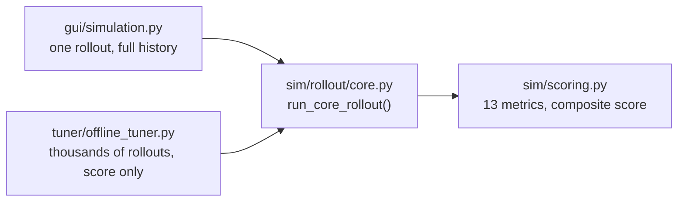

# Offline Guide: 2D GUI, Tuner, Manual Drive

This guide covers the offline (`fsae_MPCTest`) tools: the 2D matplotlib GUI, the CMA-ES auto-tuner, manual drive mode, and the offline dependencies and extension points. None of it runs against FSDS or the real car.

**What the offline tools are and are not.** The offline rollout checks that the control maths behaves sensibly and gets weights into the right range. Its plant is an approximation with no measured accuracy figure against FSDS or the car. A result here is a starting point, not a validated one. See [glossary.md](../reference/glossary.md) and [simulator_fidelity.md](../reference/simulator_fidelity.md).

Related docs:

| Need | Doc |
|---|---|
| New to the project | [getting_started.md](getting_started.md) |
| What each weight does and how to tune it | [tuning.md](tuning.md) |
| Diagnostic tools and the launcher | [debugging_tools.md](debugging_tools.md) |
| Design of the offline system | [architecture.md](../reference/architecture.md) |
| Per-file module reference | [offline_sim.md](../modules/offline_sim.md) |
| FSDS and live setup | [integration_guide.md](../fsds/integration_guide.md) |

## Contents

1. [How the offline pieces fit together](#how-the-offline-pieces-fit-together)
2. [Install dependencies](#install-dependencies)
3. [Running the 2D GUI](#running-the-2d-gui)
4. [Running the offline tuner](#running-the-offline-tuner)
5. [Overriding settings safely](#overriding-settings-safely)
6. [The tuner package layout](#the-tuner-package-layout)
7. [Manual drive mode](#manual-drive-mode)
8. [Extending the offline simulator](#extending-the-offline-simulator)

## How the offline pieces fit together

**In plain terms:** one closed-loop rollout function drives a simulated car around a path with the MPC at the wheel and returns a score. The GUI calls it once and shows the result. The tuner calls it thousands of times and searches for better weights.



**Why one rollout function.** The GUI and the tuner each once had their own copy of the per-step logic, and the copies drifted, so Show Metrics scores stopped matching tuner scores. `run_core_rollout()` is now the only implementation. It imports nothing GUI-related, so it is safe inside the tuner's worker processes.

Each tick of `run_core_rollout()` runs roughly these steps, split across the `sim/rollout/` modules:

| Step | What happens | Code |
|---|---|---|
| Pose corruption | Optional SLAM noise, then the pose-feed hold (the controller sees a stale pose for a few ticks) | `sim/sensor_noise.py` |
| Reference and tracking error | Oracle path, or perception plus planner rebuilding the centreline from cones. Then the error state | `sim/rollout/reference.py`, `sim/perception.py`, `sim/planner.py` |
| Speed target | Curvature-based target, tracking-error gate, rate limit | `sim/rollout/speed_target.py` |
| Delay compensation | Roll the error forward through commands in flight | `sim/rollout/delay.py` |
| MPC solve | LMPC (`controller/lmpc/`) or NMPC (`controller/nmpc/`) | `sim/rollout/tick_solve.py` |
| Plant step | The 25-state nonlinear plant | `model/vehicle_physics/` |
| Metrics and termination | Accumulate the 13 metrics, check DNF conditions | `sim/scoring.py`, `sim/rollout/core.py` |

The main defaults: `USE_PLANNER = False` (oracle path, faster), `USE_NMPC = False` (LMPC), `POSE_HOLD_ENABLED = True`, `SLAM_NOISE_ENABLED = False`. The live launch script defaults to NMPC, so the offline default does not match the live default.

## Install dependencies

```bash
pip install numpy scipy matplotlib cvxpy cma
pip install cvxpy[osqp] cvxpy[clarabel]
pip install optuna  # optional: only for USE_OPTUNA_PRESEARCH
```

| Package | Purpose |
|---|---|
| `numpy` | All numerical computation |
| `scipy` | ZOH discretisation (`expm`), spline fitting (`CubicSpline`) |
| `matplotlib` | 2D GUI and manual-drive GUI |
| `cvxpy` | LMPC QP formulation |
| `osqp` | Primary QP solver (via CVXPY, also used directly by NMPC) |
| `clarabel` | Fallback QP solver (via CVXPY) |
| `cma` | CMA-ES optimiser (`fmin_lq_surr2`, BIPOP with surrogate) |
| `optuna` | Optional TPE pre-search that seeds CMA-ES (needed only if `USE_OPTUNA_PRESEARCH = True`) |

No requirements file or version pin exists for the offline side. A working development environment has numpy 2.5, scipy 1.18, matplotlib 3.11, cvxpy 1.9, osqp 1.1, clarabel 0.11 and cma 4.4. Older minimum versions previously listed here were never enforced and are not verified.

The ROS 2 packages (`rclpy`, `fs_msgs`, `fsae_interfaces`, `nav_msgs`, `geometry_msgs`) are needed only for the live nodes, not for anything in this guide. The `fsds_simulator/` staging mirror carries its own pip list in `fsds_simulator/requirements.txt`.

## Running the 2D GUI

The 2D GUI (`gui/simulation.py`) is an interactive matplotlib tool. Draw or load a path, run one closed-loop MPC rollout against the nonlinear plant, and review the result frame by frame. Its dynamics do not match FSDS or the car. Use it for visualisation and prototyping, not as a prediction of live behaviour.

### 1. Launch

```bash
cd fsae_MPCTest
python -m gui.simulation
```

Or open the tabbed launcher (live sim, log playback, offline sim, settings editing):

```bash
python -m gui.launcher
```

See [debugging_tools.md](debugging_tools.md) for the launcher tabs.

### 2. Get a path onto the map

One of:

- **Draw one.** Click and drag on the map, at least 6 points. On release the path is splined, headings are computed and a speed profile is generated.
- **Load a synthetic one.** **Load Test Path** cycles through the 10 built-in Formula Student style paths: `PATH_SUDDEN_TURN`, `PATH_S_BEND`, `PATH_SPIRAL`, `PATH_MICRO_SLALOM`, `PATH_OFFSET_CHICANE`, `PATH_ACCELERATION`, `PATH_HAIRPIN`, `PATH_CHICANE`, `PATH_FS_CORNER`, `PATH_MIXED`. Each click advances to the next. The camera frames the path with a 15 m margin.
- **Load a recorded track.** **Load Recorded Track** cycles, newest first, through `tracks/*/cone_map.json` and the older `fsds_simulator/cone_maps/*.json` captures. These are cone maps written by the `cone_recorder` ROS 2 node after a live FSDS lap, see "Recording, exporting and driving a track" in [integration_guide.md](../fsds/integration_guide.md).

Recorded tracks differ from synthetic ones in two ways:

- The cones drawn are the actual recorded cones, not `place_cones()` output. They are resimulated as `SimPerception` and `SimPlanner` would see them live.
- The centreline drawn on load is a reconstruction (`sim/track_io.py`) used for the oracle reference path and initial camera framing. With `USE_PLANNER = True`, the driving line comes from `SimPlanner` rebuilding it cone by cone. With the default `False`, the rollout tracks the reconstructed oracle path and speed profile directly, matching the live side's precomputed-path mode.

Recorded tracks are stored in `ros2/src/fsae_planning/tracks/`. The `tracks/` package in this repo only points at that directory (`TRACKS_DIR`) and holds no data.

### 3. Optional initial conditions

Once a path exists, two sliders appear:

- **Initial Lat Error** (plus or minus 4 m): start offset sideways from the path.
- **Initial Yaw Error** (plus or minus 30 degrees): start pointing the wrong way.

Use them to stress recovery instead of always starting on the line.

### 4. Run and review

- **Start Sim** runs the rollout synchronously. There is no live animation while it solves, and a long path can take a few seconds. When it finishes the title turns green and a **Time** scrub slider appears.
- Drag **Time** to replay frame by frame. The trail, the cyan MPC horizon prediction, the car marker and the telemetry panel (speed, position, heading, tracking errors, steering and acceleration commands) update together.

### 5. Score it

- **Show Metrics** prints the full 13-metric breakdown to the console and puts a one-line summary in the plot title. The metrics and composite score are explained in [getting_started.md](getting_started.md#53-how-a-run-gets-scored).
- **Benchmark All Paths** runs every synthetic path 3 times with the current weights and prints a per-path score table. Use it to check a weight set generalises instead of working on one path only.

### 6. Reset

**Reset Environment** clears everything.

## Running the offline tuner

The tuner (`tuner/offline_tuner.py`) searches for cost weights that minimise the composite score across a library of synthetic corner shapes, using CMA-ES. It has no GUI. It is a long-running batch job. Design and rationale of the search: [architecture.md](../reference/architecture.md).

**A tuned result is a starting point.** The tuner scores candidates with the headless rollout, which is rough validation only. A weight set found here still needs FSDS validation and then the car.

### 1. Check the settings first

Confirm these constants (in the `settings/` package, find one with `grep -rn "^NAME" settings/`):

| Constant (file) | Check |
|---|---|
| `VALIDATION_SUITE` (`scoring.py`) | The corner shapes to optimise for. Default: `PATH_SPIRAL`, `PATH_SUDDEN_TURN`, `PATH_HAIRPIN`, `PATH_FS_CORNER`, `PATH_MICRO_SLALOM` |
| `MAX_EVALS` (`solver.py`) | The budget. Default 1500. A good run takes 20 minutes to a few hours depending on cores and budget |
| `USE_PLANNER` (`general.py`) | `True` tests the full perception and planning pipeline. `False` (default) drives the perfect reference line and is faster |
| `USE_NMPC` (`nmpc.py`) | Default `False` (LMPC). Set `True` before import to tune NMPC, see the note below |
| `USE_OPTUNA_PRESEARCH` (`solver.py`) | Default `True`. `False` skips the short Optuna TPE search that seeds CMA-ES and starts from the fixed geometric midpoint. Needs `optuna` installed |
| `Q_diag`, `R_diag`, `R_rate_diag`, `SCORE_WEIGHTS`, `METRIC_SCALES` | The weights and scoring the tuner works against. See [tuning.md](tuning.md) |

**The search vector has 14 numbers, not 9.** 9 are multipliers on the Q, R and R_rate weights. The other 5 are the NMPC fields in `TUNABLE_NMPC` (`rjerk_delta`, `corner_factor_k`, `rrate_zone_boost_straight`, `rrate_zone_ease_approach`, `rrate_zone_floor_corner`). They change the score only when the rollout runs NMPC. With `USE_NMPC = False` they are dead dimensions that waste population. Set `USE_NMPC = True` before importing the tuner to tune NMPC, or empty `TUNABLE_NMPC` to tune LMPC only.

### 2. Launch

```bash
cd fsae_MPCTest
python -m tuner.offline_tuner
```

The tuner uses all CPU cores but one. With `USE_OPTUNA_PRESEARCH` on, the Optuna pass runs first (10% of `MAX_EVALS`, 150 trials by default) and prints one line per trial, then a summary:

```
[Optuna TPE] trial   12/ 150 | score 0.3120 | best 0.1896
[Offline Tuner] Optuna pre-pass done in 8.42 min | trials run: 150/150 | best score: 0.1896
  x0 (Optuna-seeded): [...]
```

CMA-ES then starts from that seeded point and prints one line per generation:

```
[lq-CMA-ES] gen    5 | true_evals    90 | gen_best 0.2341 | overall_best 0.1892 | sigma 6.123e-01
```

- `gen_best`: this generation's best score.
- `overall_best`: best score so far.
- `sigma`: CMA-ES's current search radius, shrinking as it converges.
- Lower is better throughout.

**Ctrl+C is safe.** The tuner finishes the current generation and reports the best weights so far.

### 3. Read the result

On completion or early stop the tuner prints the best weights, then a list of improvement milestones (the true-evaluation count at which each meaningfully better score appeared):

```
Replace your gui/simulation.py weights with:
Q_diag      = [9.35, 22.2, 18.9, 49.8, 10.8, 0.0, 0.0, 0.0]
R_diag      = [49.3, 45.4]
R_rate_diag = [50.0, 49.6]
```

The numbers are illustrative. The banner text names `gui/simulation.py`, which is stale: the weights live in `settings/lmpc.py`.

### 4. Apply the weights

Copy into both sides:

| Side | Where | Fields |
|---|---|---|
| Offline | `settings/lmpc.py` | `Q_diag`, `R_diag`, `R_rate_diag` |
| Live | `mpc_params.py` in `ros2/src/fsae_planning/control/fsae_control/fsae_control/mpc/` | `MPCParams`: `q_e_y`, `q_e_yd`, `q_e_psi`, `q_r`, `q_e_v`, `r_delta`, `r_rate_delta`, `r_rate_a` |

Mapping between the two: `Q_diag[0:5]` maps to `q_e_y`, `q_e_yd`, `q_e_psi`, `q_r`, `q_e_v`. `R_diag[0]` maps to `r_delta`. `R_rate_diag` maps to `r_rate_delta`, `r_rate_a`.

Notes:

- The live LMPC builds its weights from `self.params.*` at construction (`lmpc/controller.py`) with no hardcoded weights. Edit `mpc_params.py`, not the controller.
- `R_diag[1]` is nominal only. The QP reads `R_A_ACCEL` and `R_A_BRAKE` (`settings/lmpc.py`, live `r_a_accel` and `r_a_brake`), so the tuner's second R entry has no effect on the score. Set those by hand.
- The tuner prints and logs only the 9 Q, R and R_rate weights. The values found for the 5 NMPC fields are not printed or logged.
- The two sides have no shared import, because the live node has no simulator dependency. They stay in sync by hand. The field-by-field table is in [offline_live_parity.md](../reference/offline_live_parity.md).
- `python -m tuner.tools.sync_mpc_params` copies live params (not `settings/`) from the live tree to the `fsds_simulator/` mirror and `fsae_autonomous`. It does not touch offline settings.

### 5. Log the result

Every run appends an entry to `docs/logs/tuning_history.txt` automatically: timestamp, the three weight arrays, the `SCORE_WEIGHTS` in force, duration, tuner score, Optuna pre-pass details and the git commit hash. The `Overall score` line is pre-filled with "Haven't been tested." Replace it by hand once the weights have been tested in FSDS or on the car, since the offline score does not predict real-world performance. The file's header marks entries before 2026-08-06 as not comparable to later ones (different scoring and planner).

### Constants that control the run

| Constant | Where | Effect |
|---|---|---|
| `MAX_EVALS` | `settings/solver.py` | Total true-rollout budget. The surrogate makes the effective search roughly 3 to 10 times larger |
| `VALIDATION_SUITE` | `settings/scoring.py` | Corner shapes the tuner scores against |
| `sigma0`, `max_restarts` | near the bottom of `tuner/offline_tuner.py`'s `__main__` block | CMA-ES initial search radius (0.65) and BIPOP restart budget (7). Algorithm internals, not project settings |

## Overriding settings safely

**In plain terms:** a settings override reaches code that reads `settings.X` when it runs, and misses values that were computed once at import. Set overrides before importing the rollout or tuner, and the question does not arise.

Rules:

- In-repo consumers read `import settings; settings.X`, so a runtime `setattr(settings, name, value)` reaches them. `settings/__init__.py` re-exports every name. A consumer that imported from a submodule (`from settings.lmpc import Q_diag`) would hold its own reference and never see an override. `python -m tuner.tools.doc_lint` flags that pattern in code.
- Values evaluated at import time miss a later override. Examples: default arguments of `run_core_rollout()` (`use_planner=settings.USE_PLANNER`, `use_nmpc=settings.USE_NMPC`, `n_horizon`, `eps`, `max_iter`), `EVAL_TASKS` and `SYNTHETIC_PATHS` in `tuner/offline_tuner.py` (built from `VALIDATION_SUITE` and `PATH_N_POINTS`), and the module-level globals in `gui/simulation.py`.
- A script that overrides settings must therefore do so before the first import of `sim.rollout.core` or `tuner.offline_tuner`, in a fresh process. `tuner/investigations/steering_chatter_check.py` does this with `--set NAME=VALUE`.
- To try NMPC from a script, pass `use_nmpc=True` to `run_core_rollout()` instead of mutating `settings.USE_NMPC` after import.
- For NMPC rate-shaping fields, pass `nmpc_overrides={...}` to `run_core_rollout()`. One process can then evaluate many configurations. Keys are not validated, so a typo is silently ignored. Check that a swept field moves the score before trusting a null result.

## The tuner package layout

`tuner/` holds the CMA-ES tuner, its scoring companion, reusable tools and one-off diagnostics, in four tiers:

**`tuner/` root:**

| File | Purpose |
|---|---|
| `offline_tuner.py` | CMA-ES weight search (this guide) |
| `performance_stats.py` | Scoring and benchmarking a fixed weight set across the paths. Powers Show Metrics and Benchmark All Paths |
| `csv_log.py` | Shared CSV parsing helpers (comment-header stripping, malformed-row filtering, column loading) used by every script that reads a telemetry CSV |

**`tuner/validation/`: correctness checks, run from `fsae_MPCTest/` with the commands below:**

| Command | Purpose |
|---|---|
| `python -m tuner.validation.recorded_map_rollout` | Headless rollout on the default recorded map (about 2 minutes). Reproduces the offline column of the sim-to-real comparison table. Run after any change to weights, the plant or scoring |
| `python -m tuner.validation.nmpc_offline_check` | NMPC self-consistency: model parity, turn-in sign, SQP convergence, closed-loop LMPC-versus-NMPC A/B. Run after touching `controller/nmpc/` |
| `python -m tuner.validation.plant_openloop_validation` | Replays the open-loop system-ID experiments through the plant. Run after any change to `model/vehicle_physics/` |

**`tuner/tools/`: reusable standalone tools:**

| File | Purpose |
|---|---|
| `plot_playback.py` | Time-scrubbing map and telemetry viewer, see [debugging_tools.md](debugging_tools.md) |
| `export_speed_profile.py` | Exports a recorded cone map's oracle path and speed profile to CSV, see "Export the speed profile and raceline" in [integration_guide.md](../fsds/integration_guide.md) |
| `raceline_optimizer.py` | Minimum-time racing line optimiser with the same CSV output. `--mode centerline` exports the centreline instead |
| `sync_mpc_params.py` | One-way copy of live param files to `fsae_autonomous` and the `fsds_simulator/` mirror |
| `doc_lint.py` | Flags docs that break the project's writing conventions |

**`tuner/investigations/`: one-off and reusable diagnostics from sim-to-real debugging** (`steering_chatter_check.py`, `reference_heading_geometry_check.py`, `live_vs_sim_diagnostics.py` and others). See [debugging_tools.md](debugging_tools.md) for which question each answers, and [sim_to_real_investigation.md](../logs/sim_to_real_investigation.md) for the history behind them.

`DEFAULT_MAP`, the recorded map every validation and investigation script defaults to, lives in `tracks/__init__.py`.

### Plotting and scrubbing exported CSV telemetry

`tuner/tools/plot_playback.py` turns one or more control CSVs from a live or FSDS run into an interactive time-scrubbing map and telemetry viewer. Usage, flags and the auto-search folder are in [debugging_tools.md](debugging_tools.md). The CSV format is in "CSV telemetry logging" in [integration_guide.md](../fsds/integration_guide.md).

## Manual drive mode

`gui/manual_drive.py` is a small standalone app for driving the nonlinear plant by hand. Use it to build intuition for the vehicle's handling limits, eyeball track and cone geometry, or generate a human reference trace to compare against MPC runs on the same path. It shares the 25-state plant and the synthetic path library with the 2D GUI, but it is open-loop: no tracking error, no MPC solve, nothing scored.

```bash
python -m gui.manual_drive
```

**Controls:** `W` and `S` throttle and brake, `A` and `D` steer left and right, `SPACE` full brake (overrides throttle). Inputs ramp toward the key-held target so taps feel analog instead of a step.

**Workflow:** **Load Test Path** cycles the synthetic library and places cones, **Start Driving** spawns the plant at the path start, drive, then **Reset** stops and clears the trail.

## Extending the offline simulator

### Modifying vehicle parameters

`VehicleParams` in `model/vehicle_physics/params.py` is the single source of truth for the plant. See [vehicle_physics.md](../reference/vehicle_physics.md) for what each parameter does.

When importing new Pacejka tyre data, the linear cornering stiffnesses `Cf` and `Cr` must match the new curve's initial slope. The offline `VehicleParams` derives them from the Pacejka coefficients, so offline follows automatically. The live LMPC hardcodes them (`self.Cf`, `self.Cr` in `lmpc/controller.py`) and needs the new values pasted in by hand. Missing that makes the MPC's internal model diverge from the plant it controls, with no error raised.

After any change to `model/vehicle_physics/`, run `python -m tuner.validation.plant_openloop_validation`, then `python -m tuner.validation.recorded_map_rollout`.

### Adding a new synthetic path

1. In `tuner/offline_tuner.py`, open `build_synthetic_paths()`.
2. Define the segments: `_make_arc(cx, cy, radius, theta_start_deg, theta_end_deg, n=20)` for constant-radius corners, `np.linspace()` for straights.
3. Concatenate the segment arrays and pass them through `_resample_path(waypoints_x, waypoints_y)`.
4. Add the resulting tuple to the `paths` dictionary under a new key.
5. Optional: add that key to `VALIDATION_SUITE` in `settings/scoring.py` so the tuner optimises against it.

### Working with NMPC (`USE_NMPC`)

To try the nonlinear controller offline, set `settings.USE_NMPC = True` before importing the rollout, or pass `use_nmpc=True` to `run_core_rollout()`. See [Overriding settings safely](#overriding-settings-safely).

Before trusting a result, run `python -m tuner.validation.nmpc_offline_check`. It re-verifies model parity, turn-in sign, SQP convergence and a closed-loop LMPC-versus-NMPC A/B on every call, so a broken change fails loudly.

If the LMPC solver fails (`consecutive_solver_failures`, `OPTIMAL_INACCURATE`) or the NMPC SQP misbehaves (non-improving steps, oscillation), see "Debugging solver failures" in [debugging_tools.md](debugging_tools.md). For NMPC specifically, check `nmpc_solve_budget_ms` and `nmpc_sqp_iters` against the horizon, and check that a weight override (`NMPC_Q_E_Y` and others in `settings/nmpc.py`, where `-1` inherits the base weight) is not pushing the cost out of scale. Model and weight-mapping details: "Nonlinear MPC" in [control_mechanisms.md](../reference/control_mechanisms.md). Tuning surface: [tuning.md](tuning.md).
