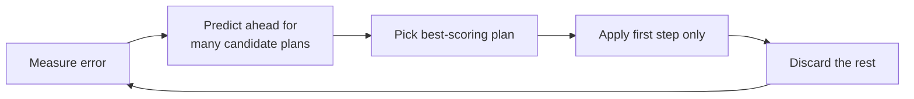

# Junior Project: MPC Path Tracking Controller

**Designer:** Martin Jin
**Design leader:** N/A
**CTO:** Jonty Clark
**Supervisor:** Siva Sriram
**Timeline:** 20/06/2026 - 26/08/2026

## Skills covered

- How an MPC controller works, from the maths behind it to the actual code.
- How to use the MPC controller in `fsae_MPCTest`.
- The key features built into this specific implementation (adaptive gain scheduling, etc).
- How to tune the MPC controller by hand, and how to use the automatic tuner instead.
- How to run the MPC controller live in the FSDS simulator for validation.

## Overview

The car runs a track in two laps. The first lap maps it: a live planner reconstructs the track from cones as the car drives, recording the result. The second lap drives the same track again using that recorded map — and because the whole path is now known in advance instead of being discovered lap-by-lap, a controller can plan ahead instead of only reacting. That second lap is what this project's MPC (Model Predictive Control) controller is for. MPC runs alongside the existing Stanley controller, not as a replacement for it — both remain available options on the second lap.

The core idea behind MPC: every tick, ask "if the car did X for the next second or so, where would it end up, and how well would that track the path?" for lots of possible X, and pick the best one. Two properties fall out of that naturally:

- **Physical limits are respected properly** — the optimisation never asks for more steering angle than the rack can actually provide.
- **"Good driving" becomes tunable** through a cost function's weights, rather than hard-coded reactive rules.

### Controller comparison

Early on, both MPC variants (LMPC and NMPC, introduced in Sections 2 and 3) had noticeably noisier steering than Stanley — small-amplitude chatter, not a tracking failure, but enough to rank Stanley ahead overall on the composite score. Two causes were found and fixed: the steering-rate cost was badly undertuned, and the tracked reference line was asking for more grip than the car has. See `docs/logs/steering_chatter_investigation.md` for the investigation. With both fixed, NMPC and Stanley now perform similarly.

That chatter fix is unrelated to NMPC's other advantage over LMPC: a structural difference in what the two controllers' models can represent, specifically around corner turn-in (Section 4). Fixing the chatter did not change that difference — it removed a separate, noisier symptom that was masking the comparison.

### What this project delivers

- **A working MPC controller**: takes in odometry (position, heading, speed) and outputs a throttle + steering command.
- **A working 2D simulator**: used to visualise and test the controller, and to run the offline tuner against. (This is a separate, lightweight simulator from FSDS — see [Section 6](#6-repo-contents-fsae_mpctest) for how the two compare.)
- **A working auto-tuner**: the controller's cost function has ~9 numbers that need tuning for it to drive well; this searches for good values automatically instead of by hand.
- **Working ROS 2 nodes**: drop-in replacements for the old Stanley controller nodes in the FSDS/planning stack, so the MPC can be validated against the real simulator.
- **Documentation**: the repo [README](https://github.com/Martin-Jin/fsae_MPCTest) and this docs page.

## Index

- [Junior Project: MPC Path Tracking Controller](#junior-project-mpc-path-tracking-controller)
  - [Skills covered](#skills-covered)
  - [Overview](#overview)
    - [What this project delivers](#what-this-project-delivers)
  - [Index](#index)
  - [1. How MPC Works](#1-how-mpc-works)
    - [1.1 Receding Horizon Control](#11-receding-horizon-control)
    - [1.2 State: Error Relative to the Path](#12-state-error-relative-to-the-path)
    - [1.3 Cost Function: What "Good Driving" Means](#13-cost-function-what-good-driving-means)
    - [1.4 The Solver](#14-the-solver)
    - [1.5 Adaptive Gain Scheduling and Safety Features](#15-adaptive-gain-scheduling-and-safety-features)
  - [2. LMPC: The Linear Controller](#2-lmpc-the-linear-controller)
    - [2.1 The Model](#21-the-model)
    - [2.2 Why Linear Is Good Enough](#22-why-linear-is-good-enough)
    - [2.3 LMPC's Blind Spot: It Can't See the Road Bend](#23-lmpcs-blind-spot-it-cant-see-the-road-bend)
  - [3. NMPC: The Nonlinear Controller](#3-nmpc-the-nonlinear-controller)
    - [3.1 The Fix](#31-the-fix)
    - [3.2 Solving It](#32-solving-it)
    - [3.3 Does It Help?](#33-does-it-help)
    - [3.4 Optional Refinements](#34-optional-refinements)
  - [4. LMPC vs. NMPC, Compared](#4-lmpc-vs-nmpc-compared)
  - [5. Tuning the Controller](#5-tuning-the-controller)
    - [5.1 Why an Automatic Tuner?](#51-why-an-automatic-tuner)
    - [5.2 How the Tuner Works (CMA-ES)](#52-how-the-tuner-works-cma-es)
    - [5.3 How a Run Gets Scored](#53-how-a-run-gets-scored)
    - [5.4 Running the Tuner](#54-running-the-tuner)
    - [5.5 Manual Tuning Guide](#55-manual-tuning-guide)
    - [5.6 Adding a New Test Track](#56-adding-a-new-test-track)
  - [6. Repo Contents (`fsae_MPCTest`)](#6-repo-contents-fsae_mpctest)
    - [6.1 Two Deliverables, Two Repos](#61-two-deliverables-two-repos)
    - [6.2 Two Vehicle Models, On Purpose](#62-two-vehicle-models-on-purpose)
    - [6.3 The GUI](#63-the-gui)
    - [6.4 Module Reference](#64-module-reference)
    - [6.5 Key Settings Reference](#65-key-settings-reference)
  - [7. Running Against the Real FSDS Simulator](#7-running-against-the-real-fsds-simulator)
    - [7.1 Driving a Precomputed Track Instead of the Live Planner](#71-driving-a-precomputed-track-instead-of-the-live-planner)

## 1. How MPC Works

MPC ("Model Predictive Control") drives by repeatedly asking "if the car did X for the next second or so, where would it end up, and how well would that track the path?" for many possible X, picking the best one. This section covers the mechanics every MPC controller in this project shares. Sections 2 and 3 cover the two controllers built on top of it — LMPC and NMPC — and how they differ.

### 1.1 Receding Horizon Control

Every tick (20 Hz), the controller predicts a whole sequence of future commands, but only ever applies the first one, then throws the rest away and re-plans from scratch next tick:

This is called **receding horizon control**. Because every tick re-plans from a fresh measurement, any prediction error the internal model makes gets caught and corrected on the very next tick — this is what makes MPC robust to using a simplified internal model rather than the full complexity of a real car.

### 1.2 State: Error Relative to the Path

The controller doesn't track the car's raw (X, Y) position — it tracks **error relative to the path**, which keeps behaviour the same no matter where on the track the car is. Every tick, it finds the closest point on the path to the car, then measures sideways distance and heading difference from there — a **Frenet-frame** conversion, the standard approach for any controller whose job is staying close to a curve.

| Symbol | What it is | Units |
|---|---|---|
| $e_y$ / $\dot{e}_y$ | Sideways offset from the path, and its rate of change | m / m/s |
| $e_\psi$ / $\dot{e}_\psi$ | Heading error, and yaw rate | rad / rad/s |
| $e_v$ | Speed error vs. target | m/s |
| $\delta_{act}$ / $a_{act}$ | Actual (lagged) steering and throttle/brake position, not just the last command sent | rad / m/s² |

$\delta_{act}$/$a_{act}$ track the actuator's *actual* position rather than the last command, since a real rack or throttle eases toward a new value rather than snapping to it. See [`error_state_reference.md`](https://github.com/Martin-Jin/fsae_MPCTest/blob/main/docs/error_state_reference.md) for the full derivation.

### 1.3 Cost Function: What "Good Driving" Means

Each solve minimises a weighted sum of a few things, over the whole planning horizon:

| Knob | Penalises | Tuning effect |
|---|---|---|
| $Q$ | How far off the path the car is predicted to be | Higher = hugs the path tighter |
| $R$ | How much steering/throttle effort is used | Higher = gentler, less aggressive inputs |
| $R_{rate}$ | How jerky the commands are, tick to tick | Higher = smoother, less abrupt changes |
| Slack | Crossing the track's lane boundary (soft, last resort) | Discourages leaving the corridor without making the problem infeasible |

$Q$/$R$/$R_{rate}$ are exactly the weights the tuner searches for (Section 5). Because every term is a non-negative weight times a squared error, the cost can only ever grow as things get worse, never shrink — which is also what makes the whole problem **convex**, guaranteeing the solver finds the actual best answer rather than a merely locally-good one.

### 1.4 The Solver

A quadratic cost with linear constraints is a **Quadratic Program (QP)** — a well-studied problem class with fast, purpose-built solvers. The controller uses [OSQP](https://osqp.org/) (primary, ~1-5ms per solve, *warm-started* from the previous tick's answer) with [Clarabel](https://clarabel.org/) as a slower, more robust fallback. If both fail, the simulator holds the previous command; the live controller applies a full brake instead, since that's the safer default on real hardware.

### 1.5 Adaptive Gain Scheduling and Safety Features

The tuned weights are optimised for one "average" operating point. A handful of small functions rescale $Q$/$R$/$R_{rate}$ every tick (on a fresh copy — the tuned weights are never permanently modified) to compensate for how the car's needs change with speed and cornering:

- **Steering gets more conservative at higher speed** — the same angle produces more lateral acceleration, so steering cost scales up smoothly with speed.
- **Smoothness penalty relaxes in corners, and stiffens on straights** — full smoothness cost on a straight, floored (not removed) in a tight corner; stiffened again once the car is already straight, centred, and aligned, to stop small unnecessary corrections.
- **Lateral-error cost softens near the centreline** — prevents a correct-overcorrect cycle right where the car should be settling onto the line.
- **Delay compensation** (live controller only) — rolls the tracking error forward through commands already in flight, so the controller plans against where the car will actually be, not where it was measured.
- **Tracking-error speed gate** — slows the car down when it's not actually near the path it's trying to follow, independent of the path's own shape.

Full detail on each of these: [`docs/reference/control_mechanisms.md`](https://github.com/Martin-Jin/fsae_MPCTest/blob/main/docs/reference/control_mechanisms.md).

## 2. LMPC: The Linear Controller

**LMPC (linear MPC)** is this project's main, default controller.

### 2.1 The Model

LMPC models the car as a **bicycle model** (one wheel per axle, on the centreline) whose equations are entirely **linear**: every entry of its internal matrices is a fixed multiplier, so doubling an error exactly doubles its predicted effect, at any speed. Below 1 m/s it uses pure geometry (Ackermann steering); above 2.5 m/s tyre grip dominates and the model switches to a linearised dynamic form; between the two it blends smoothly. That linearity is what keeps the optimisation a fast, guaranteed-solvable QP (Section 1.4).

### 2.2 Why Linear Is Good Enough

A real tyre's grip isn't actually linear — it bends and saturates as slip grows. LMPC's model doesn't need to capture that, because MPC's receding-horizon replanning (Section 1.1) corrects any prediction error on the very next tick regardless. The trade is a small, bounded loss of prediction accuracy for a large, guaranteed win in solve speed and reliability — worthwhile because the alternative, a nonlinear model, turns the QP into a much harder nonlinear program with no guaranteed optimum and unpredictable solve times, which a controller due for an answer every 50ms can't risk.

### 2.3 LMPC's Blind Spot: It Can't See the Road Bend

LMPC's model only knows how the *car* moves in response to its own state and commands — nothing in it represents "the path itself is turning." Put the car exactly on the centreline, pointed the right way, with a sharp corner ahead, and the model predicts zero error forever, no matter how sharply the real path bends just beyond the horizon. The controller only reacts once the car is already partway into the corner and real error has appeared — showing up as **late turn-in**: straight for too long, then a lot of steering all at once to catch up.

Feeding curvature into the cost function as a lookahead signal doesn't fix this properly either — the solver is free to defer paying for it, or even steer briefly the wrong way first, since nothing in the dynamics themselves changed. NMPC (Section 3) exists specifically to fix this at the model level. See [`removed_mechanisms.md`](https://github.com/Martin-Jin/fsae_MPCTest/blob/main/docs/removed_mechanisms.md) for the lookahead approaches that were tried and rejected.

## 3. NMPC: The Nonlinear Controller

**NMPC (nonlinear MPC)** is a second controller, built on the live ROS 2 side, switched on with a flag (`use_nmpc`, off by default).

### 3.1 The Fix

NMPC fixes LMPC's blind spot by changing what the model tracks: instead of the car's raw position, its state includes **`s`, distance travelled along the path**, and the path's curvature at that distance is fed directly into the heading-error equation. Because `s` is predicted forward using the car's own predicted speed, a bend at some future distance is automatically "seen" the moment it enters the horizon — there's no separate signal for the solver to defer paying for, because the bend is now built into the dynamics themselves, not bolted onto the cost.

### 3.2 Solving It

That equation is genuinely **nonlinear** (it multiplies two state-dependent quantities together), so it can't be solved as one convex QP. Instead NMPC re-linearises around its own predicted trajectory and solves a sequence of QPs that converge toward the nonlinear optimum — **Sequential Quadratic Programming (SQP)** — costing more per tick (~9ms vs. LMPC's ~1-5ms) but still comfortably inside the 50ms budget.

### 3.3 Does It Help?

Yes, both offline and live:

- **Offline**, steering saturation (the classic symptom of reacting too late) dropped from 12.5% of ticks to 0.8%, with corner turn-in averaging 25 metres earlier on the harder corners.
- **Live in FSDS**, on a matched same-day pair on the same track, saturation dropped from 6.45% to 0.58% and lap time improved by about 2.4 seconds — the same direction and similar size as offline.

The fix described in Section 3.1 is the core mechanism. NMPC also carries three smaller, optional refinements on top of it, covered next.

### 3.4 Optional Refinements

These three are independent of each other and of the core fix above — each can be switched on or off without affecting the others:

- **A smoother spline-fitted curvature reading** — on by default, strictly better, no trade-off.
- **An experimental per-point lookahead speed profile** — off by default, still being validated.
- **A backup hard speed-limit check** — off by default, unvalidated.

Full detail: [`docs/reference/README.md`](https://github.com/Martin-Jin/fsae_MPCTest/blob/main/docs/reference/README.md)'s "Three MPCC-inspired additions" section.

## 4. LMPC vs. NMPC, Compared

| | **LMPC** | **NMPC** |
|---|---|---|
| Sees the road bend ahead? | **No** — predicts zero error forever if it starts at zero | **Yes** — curvature is part of the dynamics, not bolted on |
| Solved as | One convex QP per tick | A sequence of QPs (SQP), re-solved per tick |
| Solve time (measured) | ~1-5 ms | ~9 ms mean, ~12 ms p95 |
| Horizon length | 35 steps (1.75 s) | 20 steps (1.0 s) — a tuning choice reflecting the higher per-tick cost |
| Adaptive gain scheduling (Section 1.5) | Active | Mostly inert — it exists to compensate for LMPC's blind spot, which NMPC doesn't have. `steer_rate_anti_hunt` is the one exception, opt-in on NMPC |
| Delay compensation, speed gate, e-braking, GO-gating | Shared — computed by the ROS 2 node itself, upstream of either controller | Shared |
| Yaw-rate cost weight | `q_r` penalises **absolute** yaw rate | `nmpc_q_epsi_dot` penalises yaw rate *relative to what the corner demands* — penalising absolute yaw rate here would fight the cornering it's built to enable |
| Where it lives | `model/bicycle_model.py` (`fsae_MPCTest`) + `mpc_core.py` (live) | `nmpc_core.py` (live) + `controller/nmpc_optimiser.py` (`fsae_MPCTest`'s offline port) |

For the exact formulas and a full feature-by-feature comparison verified against code: [`architecture.md`](https://github.com/Martin-Jin/fsae_MPCTest/blob/main/docs/architecture.md#feature-comparison-ltv-qp-vs-nmpc-at-a-glance) and [`error_state_reference.md`](https://github.com/Martin-Jin/fsae_MPCTest/blob/main/docs/error_state_reference.md).

## 5. Tuning the Controller

Section 1's cost function has weights ($Q$, $R$, $R_{rate}$) that decide what "good driving" means to the solver. This section covers finding good values for those weights: why that's hard to do by hand, the automatic tuner that does it instead, how a candidate weight set gets scored, and how to run and read the tuner in practice.

Tuning runs against the offline 2D simulator, not the real car or FSDS directly — see Section 6 for that simulator and why weights tuned here transfer to FSDS.

### 5.1 Why an Automatic Tuner?

$Q$, $R$, and $R_{rate}$ have 9 tunable numbers between them (`Q_diag[0:5]`, `R_diag[0:2]`, `R_rate_diag[0:2]`). Hand-tuning 9 interacting numbers by trial and error, across multiple corner shapes, is slow and doesn't scale: a change that helps one corner type can hurt another. `tuner/offline_tuner.py` searches for good values automatically instead, by running thousands of simulated laps and minimising a single composite score.

Having one well-defined score to optimise against matters beyond just this tuner: it's what makes "is this weight set better?" an objective, repeatable question rather than a judgement call from watching a run, and it's the same reason a single score (Section 5.3) is useful for comparing runs generally — on the GUI, from the tuner, or off the real car.

### 5.2 How the Tuner Works (CMA-ES)

The tuner uses **CMA-ES**, an evolutionary algorithm in the same family as genetic algorithms: it keeps a population of candidate weight sets, tests each by actually running a rollout and scoring it, then shifts the next generation's candidates toward whatever scored best — no formula for "which direction improves the score" required.

- **Why this type of algorithm**: "how well did the car drive?" has no clean formula connecting a weight to the score (unlike fitting a line to data, where calculus gives the answer directly), and is somewhat noisy besides. Evolutionary search only needs the ability to score a candidate, not differentiate it.
- **Pros**: doesn't get stuck needing gradients that don't exist here; naturally explores a wide space of weight combinations in parallel.
- **Cons**: needs many rollouts to converge (thousands), and offers no guarantee of finding the true global best — only a good one.

Every candidate is scored across a library of synthetic corner shapes, both from a perfect start and a slightly-off one (to test recovery, not just tracking), and the worst-case shapes are weighted more heavily than a plain average so the tuner can't win by driving one shape perfectly and another badly.

### 5.3 How a Run Gets Scored

Every rollout — from the tuner, from **Show Metrics**/**Benchmark All Paths** in the GUI, or off the **real car** (the ROS 2 package carries a verbatim copy of the same scoring code) — is scored through the exact same logic, so a number from any of the three is directly comparable to the others. One caveat on the car: it can't measure `offtrack` (needs ground-truth track edges), and a run against the live planner has no known path end, so either case leaves `score_is_partial=1` in the run's log header.

#### 5.3.1 The 13 Raw Metrics

Accumulated every simulation step:

| # | Metric | What it measures |
|---|---|---|
| 0 | `rmse` | Combined tracking error, root-mean-squared — the single most important signal |
| 1 | `yaw_rms` | How much the car's heading wobbled/oscillated overall |
| 2 | `smooth_rms` | How jerky the steering/throttle changes were, step to step |
| 3 | `steer_rms` | Overall steering effort used |
| 4 | `accel_rms` | Overall throttle/brake effort used |
| 5 | `max_steering` | The single largest steering command in the whole run |
| 6 | `steering_sat_ratio` | How often steering was pinned within 95% of its max limit |
| 7 | `jerk_rms` | How abruptly the rate of change itself changed |
| 8 | `max_yaw_rate` | The fastest the car's heading was ever spinning |
| 9 | `steering_reversal_rms` | Magnitude-weighted steering direction flip-flops (a small trim wiggle barely counts; a large aggressive swing dominates) |
| 10 | `peak_lateral_error` | The single worst sideways error at any point (safety-margin check) |
| 11 | `speed_rmse` | How well actual speed tracked the target speed |
| 12 | `accel_reversal_rms` | Same construction as metric 9, applied to throttle/brake instead |

#### 5.3.2 Combining Into One Score, in Three Steps

A single weighted sum of all 13 metrics has a real limit: some good behaviours become mathematically unreachable no matter what weights are picked (a "hunting" gain set that wobbles the steering constantly could still score better than a sensible one, if line-hugging dominates the sum). Instead, scoring asks three separate questions, in order:

| Step | Question | Effect |
|---|---|---|
| 1. Completion | Did the run even count? | A crash, off-track excursion, or DNF sits in a separate band above `CONSTRAINT_FLOOR` that no amount of good driving elsewhere can climb out of (though it still scores a little better for getting further before failing) |
| 2. Lap time | How much slower than physically possible was it? | The real goal, in meaningful units (`time_cost = 0.15` means "18% longer than physically possible"). This alone rules out the hunting cheat — wobbling doesn't make the car faster |
| 3. Smoothness | Tie-breaker between similarly-fast laps | Only decides between two runs that are already close on time, not the winner outright |

Completion is judged by `reached_end`, not `progress` — `progress` is computed by a search that stops just short of the final point, so even a perfect lap reports about 0.90.

#### 5.3.3 Normalising and Weighting the Metrics

The 13 metrics have wildly different natural sizes (`steering_reversal_rms` ~0.007, `speed_rmse` ~2.5), so two settings do two separate jobs: `METRIC_SCALES` divides each metric by "what counts as a normal amount of this" *before* weighting (correcting for typical size), and `SCORE_WEIGHTS` then decides how much each normalised metric matters, kept summing to `1.0` so a run sitting exactly at every reference scale scores `1.0` before bonuses/penalties. Completion/time bonuses improve the score for finishing (and finishing quickly); DNF penalties worsen it for not finishing, with an extra penalty for leaving the track, so the tuner can't win by driving slowly and carefully forever.

**Lower is always better.** A good finishing run typically scores **0.4 to 1.0**; anything **above 10.0** means the run crashed, left the track, or didn't finish.

#### 5.3.4 Where Results Are Logged

Every tuning run appends to `tuning history.txt`: timestamp, the three weight arrays (copy-pasteable), the tuner's own score, and the git commit hash — plus an `Overall score` field left blank for filling in by hand once those weights have actually been tested in FSDS, since the offline score doesn't perfectly predict real-world performance.

### 5.4 Running the Tuner

`python -m tuner.offline_tuner` runs it (safe to stop early with **Ctrl+C** — it reports the best weights found so far). On completion it prints the weights to copy in. **Apply the result to both places**, they are not linked and must be kept in sync by hand: `settings.py`'s `Q_diag`/`R_diag`/`R_rate_diag`, and the same three arrays hardcoded in the live ROS 2 controller's `mpc_core.py` (`MPCController.__init__`).

### 5.5 Manual Tuning Guide

Hand-editing individual `Q`/`R`/`R_rate` entries is generally not recommended. They interact with each other, so a change that looks like an improvement for one corner can quietly break another. Running the tuner is preferred. If a value does need nudging by hand:

- **Change one number at a time**, by no more than 20-30%, then re-test. Small changes can have surprisingly large effects because they interact.
- **Test against multiple corner shapes**, not just the one currently under inspection — use **Benchmark All Paths** in the GUI, not just **Show Metrics** on a single run.
- **Watch for these specific symptoms** and roughly what to look at:

| Symptom | What to check |
|---|---|
| Car oscillates left-right, especially at low speed | `R_rate` too low (steering allowed to change too abruptly), or too much weight on $e_y$ relative to $\dot e_y$ |
| Car cuts corners short / understeers into apexes | `Q[e_y]` too low relative to `Q[e_psi]`, or corner speed target is too high for the tyre grip assumed |
| Car is sluggish to accelerate / stuck at low speed | `R[accel]` too high, or `COASTING_SCALE`/friction in `vehicle_physics.py` needs adjusting first |
| Solver frequently fails / returns `OPTIMAL_INACCURATE` | See [Section 6.5](#65-key-settings-reference), usually a weight-scaling or solver-tolerance issue, not a driving-behaviour issue |
| Good on one path, terrible on another | Overfitting to one corner shape — add more paths to `VALIDATION_SUITE` and re-run the tuner rather than hand-patching |

### 5.6 Adding a New Test Track

New synthetic corner shapes are added in `tuner/offline_tuner.py`'s `build_synthetic_paths()`; add the new key to `VALIDATION_SUITE` in `settings.py` to have the tuner actually optimise against it.

## 6. Repo Contents (`fsae_MPCTest`)

### 6.1 Two Deliverables, Two Repos

This project has two deliverables, in two separate repos:

- A **working ROS 2 implementation**, in the `fsae_planning` repo, that runs on the FSDS simulator `autonomous` uses for testing. See Section 7.
- **`fsae_MPCTest`**: a fast offline 2D simulator to develop and test the MPC controller against, plus the automatic tuner (Section 5) that searches it for good cost-function weights, without needing FSDS running at all.

The rest of this section is what `fsae_MPCTest` itself contains.

### 6.2 Two Vehicle Models, On Purpose

LMPC's internal model (Section 2) is a simplified, linear 8-state bicycle model — it has to be simple, because the solver evaluates it many times per second. `fsae_MPCTest`'s simulator instead drives a separate, detailed 24-state nonlinear "ground truth" model (`model/vehicle_physics.py`: real tyre curves, suspension, weight transfer, aerodynamics) as the simulated car, and only ever hands the controller its tracking error, never its internal state — exactly like a real controller only has GPS/odometry, not X-ray vision into the tyres. That mismatch is deliberate, not a bug: it's what lets the simulator stand in for the real car when developing and tuning the controller offline.

> If you ever import new real tyre test data into `vehicle_physics.py`, you **must** also
> recompute `Cf`/`Cr` (used by the MPC's *internal* model) to match the new curve's initial slope,
> otherwise the controller's internal picture of the car quietly stops matching the physics it's
> actually driving, which shows up as degraded tracking with no obvious cause. See
> `docs/architecture.md`'s "If you import new tyre data" note.

### 6.3 The GUI

`gui/simulation.py` is the interactive matplotlib GUI: draw or load a path, run one closed-loop MPC rollout, then scrub through the result frame by frame and score it (**Show Metrics**, **Benchmark All Paths**; see Section 5.3). For the full step-by-step, see [developer_guide.md's Running the Simulator](https://github.com/Martin-Jin/fsae_MPCTest/blob/main/docs/developer_guide.md#running-the-simulator). There's also a keyboard-driven **manual drive mode** (`gui/manual_drive.py`), rarely needed day to day; see [developer_guide.md's Manual Drive Mode](https://github.com/Martin-Jin/fsae_MPCTest/blob/main/docs/developer_guide.md#manual-drive-mode) for details.

### 6.4 Module Reference

| File | What it's for |
|---|---|
| `gui/simulation.py` | Interactive GUI, draw/load a path, run one rollout, scrub through it, view scores |
| `gui/manual_drive.py` | Keyboard-driven open-loop drive mode, no controller involved |
| `sim/rollout_core.py` | The single shared closed-loop rollout loop used by both the GUI and the tuner |
| `sim/scoring.py` | The 13-metric accumulation and composite score, single source of truth |
| `sim/speed_profile.py` | Curvature-based target speed for a given path |
| `sim/sim_track.py` | Cone placement + simulated perception/planning (mirrors the ROS 2 nodes) |
| `model/bicycle_model.py` | Builds LMPC's linear 8-state internal model (Section 2) |
| `model/vehicle_physics.py` | The 24-state nonlinear "ground truth" simulated vehicle (above; full physics in [`docs/vehicle_physics_guide.md`](https://github.com/Martin-Jin/fsae_MPCTest/blob/main/docs/vehicle_physics_guide.md)) |
| `controller/optimiser.py` | The QP formulation and OSQP/Clarabel solve (Section 1.4) |
| `controller/model_utils.py` | Adaptive gain scheduling, delay/noise-related gain features (Section 1.5) |
| `tuner/offline_tuner.py` | The CMA-ES auto-tuner and synthetic path library (Section 5) |
| `tuner/performance_stats.py` | Powers Show Metrics / Benchmark All Paths |
| `settings.py` | All project-level tuning/scoring/DNF configuration (key settings below) |
| `planning/*` | Shared cone-sorting/boundary/path-building code (from the `fsae_planning` repo) |
| `fsds_simulator/` | Staging mirror of the live `fsae_planning` ROS 2 workspace, see [`docs/reference/`](https://github.com/Martin-Jin/fsae_MPCTest/tree/main/docs/reference) |

### 6.5 Key Settings Reference

Every one has a full plain-English explanation as a comment directly above it in `settings.py` itself — **read those before changing anything.** What follows is a quick-reference summary.

| Setting | What it does | Typical adjustment |
|---|---|---|
| `N_HORIZON` | How many 0.05s steps ahead the MPC plans (35 = 1.75s look-ahead). Must match `N_horizon` in `gui/simulation.py` and `N` in `mpc_core.py` | ±5 steps at a time |
| `USE_PLANNER` | Test with the full simulated cone-perception pipeline (`True`), or the perfect/precomputed reference path and speed profile (`False`, default, also faster) | Leave `False` unless testing perception/planner mistakes |
| `DELAY_STEPS` / `DELAY_JITTER_STEPS` | Simulated command lag, and how *wrong* the car's guess about its own lag is allowed to be (the real car can't compensate perfectly, default `0.2` matches what was measured) | Adjust `DELAY_STEPS` for the robustness scenario being tested; leave `DELAY_JITTER_STEPS` at `0.2` |
| `SLAM_NOISE_ENABLED` (+ `SLAM_*` settings) | Off by default. Adds jitter + slow drift to the pose the controller/planner *see* (not ground truth), modelling real SLAM/odometry error | Enable to test robustness to localisation noise, not for normal tuning runs |
| `MAX_FAILS` | Consecutive solver failures before a run is abandoned as DNF | 1-2 at a time, default 5 |
| `OFFTRACK_LIMIT` | Lateral error beyond which the car is "off track" | Change `TRACK_HALF_WIDTH` in `sim/sim_track.py` instead |
| `ROLLOUT_EPS` / `ROLLOUT_MAX_ITER` | Solver tolerance/iteration cap **during tuning only** (looser = faster, negligible accuracy cost) | Factor of 2-10x at a time |
| `MAX_EVALS` | Total true-rollout budget for one tuning run (2500 by default) | Double/halve to meaningfully change tuning time |
| `PATH_N_POINTS` | How finely each synthetic test track is resampled | 200-500 at a time |
| `SCORE_WEIGHTS` / `METRIC_SCALES` | The two 13-entry arrays behind the composite score (Section 5.3) | Move 0.01-0.03 between `SCORE_WEIGHTS` entries |
| `VALIDATION_SUITE` | Which synthetic corner shapes the tuner actually scores against | Add/remove one at a time, watch tuning time change |
| `TIME_OBJECTIVE_WEIGHT` / `QUALITY_WEIGHT` | How much the score cares about lap time vs. smooth driving | 0.05 at a time on `QUALITY_WEIGHT` |
| `CONSTRAINT_FLOOR` / `DNF_PENALTY` / `DNF_OFFTRACK_PENALTY` | The failed-run scoring band and how much worse a crash is than simply not finishing | Rarely; 0.5-1.0 at a time on the penalties |
| `FAST_TEST_MODE` | Shrinks everything for a ~1 minute smoke-test after a code change. **Never** paste weights tuned with this on into `Q_diag` etc, it's a correctness check, not a real tuning result | `True` only for quick dev iteration |

## 7. Running Against the Real FSDS Simulator

The live ROS 2 side of this project lives as a proper ROS 2 package, `fsae_control`, under `fsds_simulator/control/fsae_control/`. It ships two selectable console-script controllers plus a shared bridge node, wired together in `fsds_simulator/common/fsae_bringup/launch/control.launch.py`:

| Executable | Backing file | What it does |
|---|---|---|
| `controller` (`controller:=stanley`, the default) | `stanley_controller.py` | The active reactive Stanley controller, publishes `cmd_vel`, routes through `fsds_bridge` like `mpc_controller` does in its `standalone_output=false` mode |
| `mpc_controller` (`controller:=mpc`) | `mpc/mpc_controller.py` (uses `mpc_core.MPCController`) | Its `standalone_output` ROS2 parameter (default `true`) picks one of two output modes: `false` publishes only steering through the shared `cmd_vel` interface (`fsds_bridge` computes throttle/brake itself from a simple speed-error loop, the same way it does for Stanley); `true` publishes `fs_msgs/ControlCommand` directly, using the MPC's own throttle/brake output unchanged — this preserves the offline-tuned longitudinal behaviour from `tuner/offline_tuner.py`/`gui/simulation.py`, since both also drive the plant with the MPC's own commanded acceleration (see `sim/rollout_core.py`) |

`fsds_bridge` converts the shared `cmd_vel` interface into `fs_msgs/ControlCommand`, and owns GO-gating plus cone-proximity e-braking for `stanley` and for `mpc` in its `standalone_output=false` mode. `mpc` in `standalone_output=true` mode owns all of that itself instead, since it talks to FSDS directly, so `fsds_bridge` is skipped automatically when `standalone_output:=true` (the default) is selected (running both would leave `fsds_bridge`'s output unused, and race the MPC node for the same output topic).

For the full topic map (including the perception to planning chain upstream of the controller), see [developer_guide.md's Topic map for the control node](https://github.com/Martin-Jin/fsae_MPCTest/blob/main/docs/developer_guide.md#simulator-integration). Kept there as the canonical version, not duplicated here. In short: `mpc_controller` in `standalone_output=true` mode subscribes to the planner's centreline, the car's pose/odometry, the race-start signal, and cone-proximity detections, and publishes `fs_msgs/ControlCommand` directly. It does **not** subscribe to a separate desired-speed topic; it computes `desired_speed` itself every tick from the current path via `control_utils.curvature_speed()`.

**Control loop phases** (`mpc/mpc_controller.py`'s `_control_step`; phases 1 and 4 apply only in `standalone_output=true` mode):

1. **Hold at start line**: full brake until `/fsds/signal/go` is received.
2. **Stale-path/pose emergency brake**: full brake + controller reset if no fresh trajectory has arrived within the timeout, the trajectory has fewer than 2 points, or a SLAM pose hasn't arrived yet.
3. **Normal MPC solve**: `MPCController.compute()`.
4. **Cone-proximity brake override**: hard-overrides throttle/brake (not steering) if a fused cone is inside a dynamic corridor directly ahead. Resets the controller once after a short duration of continuous braking, re-arming once the brake clears.
5. **Telemetry logging** (optional): logs the *final*, post-override command.
6. **Publish.**

For the full from-scratch Windows/WSL/Docker setup (cloning FSDS, building the ROS 2 bridge, installing the solver stack inside the container, rebuilding after edits, etc.), see `docs/developer_guide.md#simulator-integration` in the repo. It's a long, mechanical set of steps kept there rather than duplicated here.

### 7.1 Driving a Precomputed Track Instead of the Live Planner

`mpc` (either `standalone_output` mode) can also skip the live planner entirely and track a precomputed path/speed CSV recorded from an earlier lap, useful for isolating controller/plant tracking error from planner-induced path error, or for driving a known track at its (offline-computed) minimum-time line instead of the planner's live centreline. Each such track lives in its own `tracks/<name>/` directory (cone map + two exported CSVs) inside the separate `fsae_planning` repo, so FSDS + `fsae_planning` alone can drive any already-recorded track with no `fsae_MPCTest` checkout needed. Switching which one the car drives is one variable, `TRACK=` near the top of `ros2/launch_all.sh`.

Full record, export, drive steps, the CSV format, and every launch arg involved: `docs/developer_guide.md`'s [Recording, exporting and driving a track](https://github.com/Martin-Jin/fsae_MPCTest/blob/main/docs/developer_guide.md#recording-exporting-and-driving-a-track). Kept there as the canonical version rather than duplicated here.
