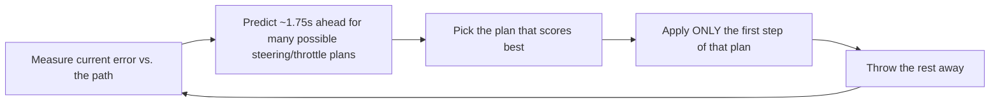
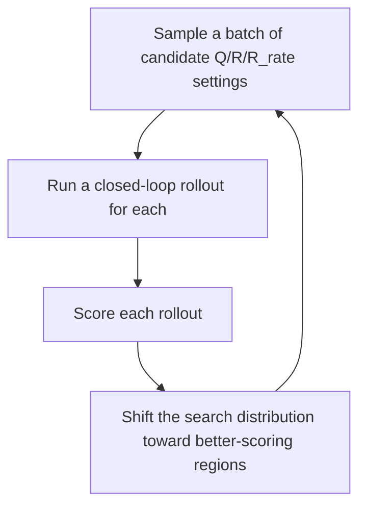
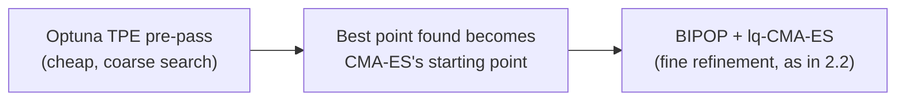
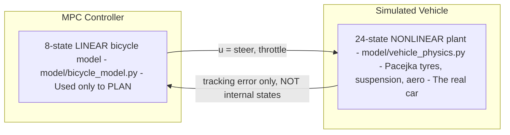

# Junior Project: MPC Path Tracking Controller

**Designer:** Martin Jin
**Design leader:** N/A
**CTO:** N/A
**Supervisor:** N/A
**Timeline:** 20/06/2026 - 20/07/2026

**THIS DOCS PAGE IS STILL A WORK IN PROGRESS.**

---

## Skills you will learn

- How an MPC controller works, from the maths behind it to the actual code.
- How to use the MPC controller in this repo.
- The key features built into this specific implementation (adaptive gain scheduling, etc).
- How to tune the MPC controller by hand, and how to use the automatic tuner instead.
- How to run the MPC controller live in the FSDS simulator for validation.

---

## Overview

At the start of this project, the car only had a Stanley controller — a "reactive" controller that steers based only on the car's heading/lateral error right now, at this exact instant. It never looks ahead. That has two real consequences:

- **It can't go as fast** — it doesn't know what's coming up, so it has to drive conservatively everywhere just in case.
- **It can't turn early into a sudden corner** — it only reacts once the error already exists, not before.

An MPC (Model Predictive Control) controller fixes this by planning ahead. Every tick, it asks "if I did X for the next second or so, where would I end up, and how well would that track the path?" for lots of possible X, and picks the best one. This lets it brake before a corner it can see coming, and carry more speed on a straight it knows stays straight.

MPC also has two other advantages over Stanley:

- **Respects physical limits properly** — it will never ask for more steering angle than the rack can physically provide.
- **"Good driving" is tunable, not hard-coded** — defined through a cost function's weights, rather than a fixed set of reactive rules.

The trade-off is complexity and computation cost: solving an optimisation problem 20 times a second, instead of simple trigonometry.

### What this project delivers

- **A working MPC controller**, takes in odometry (position, heading, speed) and outputs a throttle + steering command.
- **A working 2D simulator**, used to visualise and test the controller, and to run the offline tuner against. (This is a separate, lightweight simulator from FSDS, see [FSDS vs. This Repo's Simulator](#fsds-vs-this-repos-simulator) below.)
- **A working auto-tuner**, the controller's cost function has ~9 numbers that need tuning for it to drive well; this searches for good values automatically instead of by hand.
- **Working ROS 2 nodes**, drop-in replacements for the old Stanley controller nodes in the FSDS/planning stack, so the MPC can be validated against the real simulator.
- **Documentation**, the repo [README](https://github.com/Martin-Jin/fsae_MPCTest) and this docs page.

---

## Index

1. [How the MPC Controller Works](#1-how-the-mpc-controller-works)
   - [1.1 The Big Idea: Receding Horizon Control](#11-the-big-idea-receding-horizon-control)
   - [1.2 What the Controller Tracks (The State Vector)](#12-what-the-controller-tracks-the-state-vector)
   - [1.3 The Prediction Model](#13-the-prediction-model)
   - [1.4 The Cost Function](#14-the-cost-function)
   - [1.5 The Solver](#15-the-solver)
   - [1.6 Special Features: Adaptive Gain Scheduling, Delay Compensation, Speed Gating](#16-special-features-adaptive-gain-scheduling-delay-compensation-speed-gating)
2. [Tuning the Controller](#2-tuning-the-controller)
   - [2.1 Why an Automatic Tuner?](#21-why-an-automatic-tuner)
   - [2.2 How the Tuner Works (CMA-ES)](#22-how-the-tuner-works-cma-es)
   - [2.3 The Optuna Pre-Search Warm Start](#23-the-optuna-pre-search-warm-start)
   - [2.4 How a Run Gets Scored](#24-how-a-run-gets-scored)
   - [2.5 Running the Tuner](#25-running-the-tuner)
   - [2.6 Manual Tuning Guide](#26-manual-tuning-guide)
   - [2.7 Key Settings Reference](#27-key-settings-reference)
   - [2.8 Adding a New Test Track](#28-adding-a-new-test-track)
3. [FSDS vs. This Repo's Simulator](#3-fsds-vs-this-repos-simulator)
4. [The Two Vehicle Models: MPC's Model vs. the Simulator's Plant](#4-the-two-vehicle-models-mpcs-model-vs-the-simulators-plant)
   - [4.1 Why a Linear Model, When the Real Car Is Nonlinear?](#why-a-linear-model-when-the-real-car-is-nonlinear)
   - [4.2 A Second, Separate Blindness: the Linear Model Can't See the Road Bend — and the Nonlinear MPC That Fixes It](#42-a-second-separate-blindness-the-linear-model-cant-see-the-road-bend--and-the-nonlinear-mpc-that-fixes-it)
5. [Vehicle Physics, Explained](#5-vehicle-physics-explained)
   - [5.1 The 24-State Plant Model](#51-the-24-state-plant-model)
   - [5.2 Tyres and Slip, Explained](#52-tyres-and-slip-explained)
   - [5.3 Suspension and Weight Transfer, Explained](#53-suspension-and-weight-transfer-explained)
   - [5.4 Aerodynamics, Rolling Resistance, and Actuator Lag](#54-aerodynamics-rolling-resistance-and-actuator-lag)
6. [Running the Simulator (GUI)](#6-running-the-simulator-gui)
7. [Manual Drive Mode](#7-manual-drive-mode)
8. [Running Against the Real FSDS Simulator](#8-running-against-the-real-fsds-simulator)
   - [8.1 Driving a Precomputed Track Instead of the Live Planner](#81-driving-a-precomputed-track-instead-of-the-live-planner)
9. [Module Reference](#9-module-reference)

---

## 1. How the MPC Controller Works

### 1.1 The Big Idea: Receding Horizon Control

Every 1/20th of a second (20 Hz), the controller does this:



The key trick is steps D and E: even though the controller plans a whole 1.25-second sequence, it only ever uses the very first command from that plan, then immediately re-plans from scratch next tick. This is called **receding horizon control**.

Why this matters: the controller's internal model of the car is a simplification of the real physics (see [Section 4](#4-the-two-vehicle-models-mpcs-model-vs-the-simulators-plant)). Replanning every tick is what makes MPC robust to that — any prediction error gets caught and corrected on the very next tick, 20 times a second.

### 1.2 What the Controller Tracks (The State Vector)

The controller doesn't track the car's raw (X, Y) position on the map. Instead, it tracks **error relative to the path**, this keeps its behaviour the same no matter where on the track the car happens to be.

$$
x = [\,e_y,\ \dot{e}_y,\ e_\psi,\ \dot{e}_\psi,\ e_v,\ e_a,\ \delta_{act},\ a_{act}\,]
$$

| # | Symbol | Plain English | Units |
|---|---|---|---|
| 0 | $e_y$ | How far sideways off the path centreline the car currently is | m |
| 1 | $\dot{e}_y$ | How fast that sideways error is changing | m/s |
| 2 | $e_\psi$ | How wrong the car's heading is compared to the path direction | rad |
| 3 | $\dot{e}_\psi$ | The car's yaw rate (how fast its heading is spinning) | rad/s |
| 4 | $e_v$ | How far off the car's speed is from the target speed | m/s |
| 5 | $e_a$ | Unused placeholder (kept for structural consistency only) | m/s² |
| 6 | $\delta_{act}$ | Where the steering actuator has *actually* reached so far (it lags behind commands) | rad |
| 7 | $a_{act}$ | Where the throttle/brake actuator has *actually* reached so far | m/s² |

States 6 and 7 exist because a real steering rack or throttle doesn't snap instantly to a new value — it eases toward it (a "first-order lag"). Tracking the actuator's actual current position, not just the last command sent, lets the model predict the car's motion more accurately.

**How the error is actually measured — the Frenet frame:**

- Every tick, the code finds the closest point on the path to the car's current position.
- It then measures the sideways distance and heading difference from there.
- This "how far along the path, how far off to the side" framing is called a **Frenet-frame** conversion — the standard approach for any controller whose whole job is staying close to a curve.

### 1.3 The Prediction Model

The car is modelled as a **bicycle model**, one wheel on the front axle, one on the rear, both on the centreline, instead of four separate wheels. This is the standard simplification used in vehicle control: it captures the two things that matter for path tracking (how the front wheel steers, and how the whole car rotates/slides) while staying simple enough to solve 20 times a second.

Every linear model in control theory has the same general form:

$$
\dot{x} = A \cdot x + B \cdot u
$$

Read this as: *"the rate of change of the state (ẋ) is some fixed mixture of the current state (x) plus some fixed mixture of the current command (u)."* $A$ and $B$ are just tables of numbers saying how much of each state feeds into the rate of change of every other state.

Two different physical assumptions are blended together to build $A$:

**Below 1 m/s, kinematic model** (pure geometry, like pushing a shopping trolley):

$$
\dot{e}_y = v_x \cdot e_\psi \qquad\qquad \dot{e}_\psi = \frac{v_x \cdot \delta_{act}}{L}
$$

At very low speed the tyres haven't built up real cornering grip yet, so the car turns purely by geometry (standard Ackermann steering) — a longer wheelbase $L$ turns more slowly for the same steering angle.

**Above 2.5 m/s, dynamic model** (tyre grip dominates):

$$
\ddot{e}_y = -\frac{2C_f+2C_r}{m v_x}\dot{e}_y + \frac{2C_f+2C_r}{m}e_\psi + \frac{-2C_f l_f+2C_r l_r}{m v_x}\dot{e}_\psi + \frac{2C_f}{m}\delta_{act}
$$

$$
\ddot{e}_\psi = \frac{-2C_f l_f+2C_r l_r}{I_z v_x}\dot{e}_y + \frac{2C_f l_f-2C_r l_r}{I_z}e_\psi - \frac{2C_f l_f^2+2C_r l_r^2}{I_z v_x}\dot{e}_\psi + \frac{2C_f l_f}{I_z}\delta_{act}
$$

Where:

- $C_f$/$C_r$ — front/rear cornering stiffness (how much sideways force a tyre makes per radian of slip)
- $l_f$/$l_r$ — distance from the car's centre of mass to each axle
- $m$ — mass
- $I_z$ — yaw inertia (resistance to spinning, like a figure skater's arms out vs. in)

The $1/v_x$ terms exist because at higher speed the same amount of sideways drift produces a *smaller* slip angle, so grip builds up more gradually.

**Blending the two:**

$$
\alpha = \text{clip}\left(\frac{v_x - 1.0}{2.5 - 1.0},\ 0,\ 1\right) \qquad A_c = (1-\alpha)A_{kin} + \alpha A_{dyn}
$$

$\alpha$ ramps linearly from 0 to 1 between 1 m/s and 2.5 m/s. Below 1 m/s it's pure kinematic, above 2.5 m/s it's pure dynamic, in between it's a proportional mix. This avoids a sudden jump in predicted behaviour right at the switch-over speed.

**From continuous to discrete (Zero-Order Hold):** the equation above, $\dot{x}=A_c x + B_c u$, describes an instant rate of change — a speedometer reading, not a per-tick step. But the controller only makes one decision every $dt = 0.05\text{s}$ and holds the command fixed until the next tick ("zero-order hold" on the input — it holds at a constant value, order zero, between updates, rather than ramping or curving).

What the solver actually needs is the one-step version, $x[k{+}1] = A_d x[k] + B_d u[k]$: given the state and the (held-constant) command, what state does that produce exactly $dt$ seconds later?

**Zero-Order Hold (ZOH)** answers that by solving the continuous equation exactly, assuming $u$ is frozen for the whole $dt$ window, which produces new matrices $A_d$/$B_d$ folding in that time step:

$$
\exp\!\left(\begin{bmatrix}A_c & B_c\\0&0\end{bmatrix}dt\right)=\begin{bmatrix}A_d & B_d\\0&I\end{bmatrix}
$$

This matrix exponential is the standard closed-form trick for solving a linear ODE exactly over a fixed interval — the code doesn't approximate it step-by-step, it computes $A_d$/$B_d$ directly from $A_c$/$B_c$/$dt$ once per tick (`scipy.linalg.expm` under the hood).

Because the input actually *is* held constant by the controller between ticks (it only issues one command per $dt$), ZOH isn't an approximation here — it's exact. That makes it more accurate than a simpler method like Euler integration, which assumes the rate of change stays constant over the step and builds up error every tick.

**A common misconception, worth stating explicitly: the MPC does not "see" the path curving ahead.** It is tempting to picture the controller as looking at the upcoming corner and planning to turn early because it can see the bend coming. That is not what the equations above actually do.

Look again at $A_{kin}$/$A_{dyn}$: every term in them describes how the state ($e_y$, $e_\psi$, etc.) evolves *in response to the current state and the chosen control input* — for example $\dot{e}_y = v_x \cdot e_\psi$ says "if the car's heading is already off, lateral error will grow", and the $\delta_{act}$ terms say "steering changes future heading error." None of them contain $\kappa$ (the actual curvature of the real path ahead). So if the car is currently sitting dead-centre and pointed straight along the path ($e_y \approx 0$, $e_\psi \approx 0$) and holds the steering wheel at zero, the model's own prediction for all $N$ future steps is *also* $e_y \approx 0$, $e_\psi \approx 0$ — flat, no matter how sharply the real path bends 20 metres ahead. The model has nothing in it that represents "the road itself is turning away from the car"; it only knows how a control input changes the error state, never how the *reference* itself changes shape over the horizon.

This is exactly why the "adaptive gain scheduling" features (`adaptive_Q_lookahead` etc., see [architecture.md](architecture.md#adaptive-gain-scheduling-controllermodel_utilspy)) exist at all: they scan the real path geometry ahead (a genuine lookahead, done outside the QP) and use it to make an *existing* tracking error more expensive to leave uncorrected — Q[0,0]/Q[2,2] get boosted approaching a corner, R[0,0] gets relaxed to make steering cheaper. But reweighting a cost cannot manufacture an error that isn't there yet: if $e_y \approx e_\psi \approx 0$ on the approach (the car is still exactly on the still-straight section of the path), there is nothing for those boosts to act on, and the QP's genuinely optimal answer stays "keep going straight" until the car has physically entered the curved section and picked up real curvature/heading error the state vector can see. Live telemetry has shown exactly this pattern: the lookahead-driven cost multipliers move correctly and early, while the commanded steering angle itself stays near zero for over a second, only starting to ramp once the car is already inside the bend.

**An attempted fix on 2026-08-12** (`curvature_forcing_enabled` / `CURVATURE_FORCING_ENABLED`) tried injecting the precomputed path's own curvature into the dynamics as a forcing term over the horizon: $-v_x\cdot\kappa(s_k)\cdot dt$ added to the predicted $e_\psi$ at each step $k$, using the path's actual curvature at the arc-length position the car is predicted to reach by step $k$ (see `_curvature_horizon_profile` in `mpc_core.py`). The idea was sound — give the model a term that predicts heading/lateral error growing on its own as a modelled straight-line car approaches a real bend, something a plain reweighting of $Q$/$R$ can never do — and a first, single-scenario synthetic test looked like it worked (steering leaned toward a bend before any tracking error existed).

**It was disabled the same day after closer testing showed it doesn't actually work.** Adding a term to the *dynamics constraint* ($x_{k+1} = Ax_k + Bu_k + w_k$) means it becomes part of the same equation the QP is choosing the cheapest possible trajectory through — the solver isn't "informed that the road bends," it is handed an extra disturbance term and is free to decide the cheapest way to respond to it anywhere across the whole 35-step horizon. At the physically-correct forcing size, the model's own natural error-decay (the $e_\psi$ row loses about 5% of its value every 50 ms step, independent of anything else) ate the forcing almost as fast as it was added, so the resulting steering command barely moved (well under 1°, weaker than ordinary sensor noise) — no real early turn-in resulted. Trying to compensate by making the forcing bigger made things actively worse: past a certain size, the *cheapest* predicted trajectory the QP could find involved steering hard away from the corner for the first several tenths of a second, then snapping back — an artifact of the optimizer, not of the road. Only an unrealistically large forcing (about 20× the physically correct size) restored the right direction, by which point the steering command was pinned at its hard limit throughout, which is not useful anticipation. The term is disabled (kept in the code for a future attempt) — a working version would need to change what the *reference* the car is being compared against looks like, rather than adding a disturbance to the same equation the optimizer is minimizing cost over.

This means the underlying limitation described above — the MPC does not manufacture a tracking error ahead of a corner it hasn't reached yet — was still open as of that attempt.

**A different fix, tried 2026-08-12, changes the reference instead of the dynamics** (`use_precomputed_heading_profile`, live ROS 2 controller only). Instead of telling the QP's *prediction* about the road bending ahead — which, as above, just hands the solver a disturbance it is free to exploit however is cheapest across the whole horizon — this precomputes a heading TARGET for every waypoint on a known/recorded track, offline, before the car ever drives it (`tuner/tools/raceline_optimizer.py`'s `build_shaped_heading_profile`). At each waypoint, the target already leads the path's true geometric heading by however much the car can *actually* achieve turning between here and the next waypoint, given the speed it's planned to be going (using the same $v/(l_f+l_r)\cdot\delta_{max}$ relationship $A_{kin}$ already uses for its own yaw-rate row) — so a corner taken slowly gets proportionally more lead per metre than one taken fast, since there's more time available per metre at lower speed.

The key difference from the forcing-term attempt: this doesn't add anything to the horizon's dynamics at all. It changes what $e_\psi$ *already equals* the moment the QP starts solving — the car's current heading compared against a target that's already looking a little further down the track, exactly as if the car had genuinely drifted off a straight reference. There's no future obligation for the solver to schedule around, so the "cheapest trick is to steer the wrong way first, then correct" failure mode above cannot occur here: synthetic testing (a realistic corner-entry ramp, several speeds) showed the resulting steering command move directly and monotonically toward the target, with no wrong-direction dip. A first version of this idea used a fixed lookahead distance instead of scaling by achievable yaw rate, and that version failed differently — as little as 8 m of fixed lead was enough to snap steering to full lock immediately on a realistic corner, at every speed tested, which is why the achievable-yaw-rate scaling is essential, not a refinement.

This is genuinely narrower in scope than the forcing-term idea, though: it only works for a track that's fully known and mapped ahead of time (the shaping happens once, offline, before the lap starts) — a car exploring a new track live, driving off the planner's own SLAM-built centreline, has no future path to precompute a lead into, so this still doesn't touch that case. See `planning_control_sync.md`'s "Precomputed shaped heading-lead profile" section for the full mechanism and an important caveat: on the track this was first tested against, the lead ends up active across almost the entire lap rather than only near corners, because that particular track has very few genuinely straight sections. As of this writing it is implemented and offline-validated but not yet tested on the live car.

### 1.4 The Cost Function

Each solve minimises, over the predicted horizon of $N$ steps:

$$
\min \sum_i \lVert\sqrt{Q}\odot x_i\rVert^2 \;+\; \sum_i \lVert\sqrt{R}\odot u_i\rVert^2 \;+\; \sum_i \lVert\sqrt{R_{rate}}\odot \Delta u_i\rVert^2 \;+\; W_{slack}\lVert\text{slack}\rVert^2
$$

In plain English, three things are being penalised at once:

| Term | Plain English |
|---|---|
| $Q$ (state cost) | How far off the path the car is predicted to be, over the whole plan |
| $R$ (input cost) | How much steering/throttle effort is being used |
| $R_{rate}$ (rate cost) | How jerky/abrupt the commands are, tick to tick |
| Slack | A soft penalty for crossing a ±3.5 m lane boundary, allowed only as a last resort |

**Why the lane boundary needs slack at all.** The bound is `e_y <= 3.5 + slack` (and symmetrically for `-3.5`) rather than a plain hard `e_y <= 3.5`. The reason is feasibility, not tuning: `x_0` is pinned to the *measured* state by the hard constraint above, so if the car is already outside the corridor right now (e.g. recovering from an off-track excursion), a plain hard bound would demand `x_0 <= 3.5` while `x_0 == e_{y,\text{measured}} = 4.0`, say — two constraints that directly contradict each other, with no feasible solution at all.

The solver would return nothing, not even a "best effort" trajectory. `slack` absorbs that contradiction (it can grow to cover however far outside the corridor the car currently is), and the large `W_slack = 10000` weight then pressures the solver to shrink it back toward zero as fast as the dynamics allow. See [architecture.md](architecture.md#L911) for the full explanation.

Subject to hard constraints that can never be broken:

$$
x_0 = x_{\text{measured}} \qquad x_{i+1} = A_d x_i + B_d u_i \qquad u_{min} \le u_i \le u_{max}
$$

$Q$, $R$, and $R_{rate}$ are diagonal matrices, one number per state/input, controlling how much the solver cares about minimising that particular thing relative to the others. **These are exactly the numbers the tuner searches for** (see [Section 2](#2-tuning-the-controller)).

**What's actually inside each `∑‖√Q ⊙ x‖²` term.** $Q$, $R$, and $R_{rate}$ are diagonal (one weight per state/input, no cross-terms), so `⊙` (elementwise multiply) followed by squaring the norm just means: take each state, multiply it by its own weight, square it, and add up all 8 (or 2, for the input terms). Written out per step $i$, with $x_i = [e_y, \dot{e}_y, e_\psi, \dot{e}_\psi, e_v, e_a, \delta_{act}, a_{act}]$:

$$
\lVert\sqrt{Q}\odot x_i\rVert^2 = Q_0 e_y^2 + Q_1 \dot{e}_y^2 + Q_2 e_\psi^2 + Q_3 \dot{e}_\psi^2 + Q_4 e_v^2 + Q_5 e_a^2 + Q_6 \delta_{act}^2 + Q_7 a_{act}^2
$$

Same pattern for the input cost, with $u_i = [\text{steer}_i, \text{accel}_i]$, and the rate cost, with $\Delta u_i = u_i - u_{i-1}$:

$$
\lVert\sqrt{R}\odot u_i\rVert^2 = R_0\,\text{steer}_i^2 + R_1\,\text{accel}_i^2 \qquad\qquad \lVert\sqrt{R_{rate}}\odot \Delta u_i\rVert^2 = R_{rate,0}(\Delta\text{steer}_i)^2 + R_{rate,1}(\Delta\text{accel}_i)^2
$$

**Why the cost can only ever go up as errors grow, never down:**

- Every term is a non-negative weight times a *squared* quantity.
- Squaring removes the sign — drifting 2 m left of the path costs exactly the same as drifting 2 m right — and makes the term grow the further from zero you go.
- Every weight in `Q_diag`/`R_diag`/`R_rate_diag`/`W_slack` is non-negative (the tuner only ever searches multiplicative scale factors on top of a non-negative starting template, see [Section 2.2](#22-how-the-tuner-works-cma-es)), so adding a non-negative weight times a non-negative square to a running total can only push it up, never down.
- Net effect: more tracking error, more control effort, or jerkier commands always costs more, never less.
- This "sum of non-negative squares" shape is also exactly what makes the whole problem convex — and convex is what lets a QP solver find the guaranteed best answer instead of getting stuck on a locally-good-but-not-actually-best one (see [Section 1.5](#15-the-solver)).

### 1.5 The Solver

The cost function above is **quadratic** (everything is squared), and every constraint is **linear**. A quadratic cost with linear constraints is called a **Quadratic Program (QP)** — a well-studied category of problem with fast, purpose-built, off-the-shelf solvers already available. This is deliberate: it's *why* the cost function is built with squared terms rather than something more exotic, and it's what keeps the whole problem inside this fast-to-solve category.

**This is exactly where the model's linearity earns its keep.** The constraint $x_{i+1} = A_d x_i + B_d u_i$ is only linear because $A_d$/$B_d$ come from the linear bicycle model in [Section 1.3](#13-the-prediction-model), not the nonlinear 24-state plant. If that constraint used the plant's real Pacejka tyre curves instead:

- The problem would stop being a QP and become a much harder **nonlinear program (NLP)**.
- No guaranteed global optimum.
- Slower general-purpose solvers — tens to hundreds of milliseconds, rather than 1-5ms.
- A real risk of the solver not converging in time for the next 50ms tick.

Using a linear model is what makes it possible to solve this problem fast enough, and predictably enough, to run 20 times a second on modest hardware — see [Section 4](#4-the-two-vehicle-models-mpcs-model-vs-the-simulators-plant) for the full linear-vs-nonlinear tradeoff this buys.

You do not need to write a solver yourself. This repo uses:

- **[OSQP](https://osqp.org/)** (primary), via the `cvxpy` Python library. Exploits sparsity and supports *warm-starting* (reusing last tick's answer as this tick's starting guess), which is what makes solving fast enough 20 times a second, typically 1-5 ms per solve.
- **[Clarabel](https://clarabel.org/)** (fallback), a slower but more numerically robust interior-point solver, only invoked if OSQP fails outright.
- If both fail, the simulator holds the previous command; the live controller instead applies a full brake, since that's the safer default on real hardware.

```python
import cvxpy as cp
# ... build cost + constraints as shown above ...
prob = cp.Problem(cp.Minimize(cost), constraints)
prob.solve(solver=cp.OSQP, warm_start=True, eps_abs=1e-5, max_iter=8000)
```

**The "parameterised" trick:** rebuilding this whole expression from scratch every tick would be ~10x slower than necessary. Instead:

1. The problem is built **once**, using `cp.Parameter` placeholders instead of plain numbers.
2. Every subsequent tick just updates the parameter *values* (new $A_d$, $B_d$, $x_0$, weights).
3. The same compiled problem is re-solved with those new values.

See `controller/optimiser.py`'s `init_parameterized_mpc()` / `solve_mpc()` for the exact implementation.

> Note the `eps_abs=1e-5, max_iter=8000` above is the default used for interactive/GUI solves.
> The offline tuner runs with a separate, deliberately looser tolerance
> (`ROLLOUT_EPS`/`ROLLOUT_MAX_ITER` in `settings.py`) since it runs thousands of rollouts and a
> slightly looser tolerance there has negligible effect on the resulting weights but a real
> effect on tuning time, see [Section 2.7](#27-key-settings-reference).

### 1.6 Special Features: Adaptive Gain Scheduling, Delay Compensation, Speed Gating

The tuned $Q$/$R$/$R_{rate}$ weights are optimised for one "average" operating point. Two small functions rescale $R$ and $R_{rate}$ **every tick** to compensate for known, predictable ways the car's needs change with speed and cornering, without needing a separate tuned weight set for every situation.

**Steering gets more conservative at higher speed** (`adaptive_R_scaling`):

$$
\text{steer\_scale} = 1 + \frac{1.5\,v_x}{6.0+v_x} \qquad(\to 1.0 \text{ at } v_x{=}0,\ \to 2.5 \text{ as } v_x\to\infty)
$$

At higher speed the same steering angle produces much more lateral acceleration ($a_{lat}\approx v_x^2\kappa$), so the same steering command is more destabilising. This is a saturating ("Hill function") curve rather than a straight ramp specifically so steering cost never exceeds 2.5x base, the controller is never fully locked out of steering even at very high speed.

**Smoothness penalty relaxes in tight corners** (`adaptive_R_rate`):

$$
\text{scale} = \min\Big(\underbrace{\max\!\left(0.625,\ \tfrac{1}{1+3|\kappa|}\right)}_{\text{"during" — current curvature}},\ \underbrace{\max\!\left(0.85,\ \tfrac{1}{1+4\,\kappa_{\max}}\right)}_{\text{"entering" — lookahead curvature}}\Big)
$$

In a straight, the full smoothness penalty applies (discourage unnecessary jitter). In a tight corner, the penalty is floored, enough softening to let the controller make the fast steering changes a tight corner genuinely needs, without ever letting the rate cost vanish completely (which would allow arbitrarily rapid oscillation).

- There are actually *two* floors here, combined by taking whichever is more aggressive (`min`): one driven by the curvature the car is turning through *right now* ($\kappa$, from the car's own yaw rate — see `curvature_estimate`), and a shallower one driven by $\kappa_{\max}$, the sharpest curvature seen in a forward scan of the path ahead (see **corner anticipation**, below) — so the cost is already softening slightly *before* the car reaches a corner, not just once it's already turning.
- **Tuning note:** the during-floor (0.625) was raised from an earlier 0.55 after a live run with the entering-floor at 0.85 showed steering oscillating through zero several times a second mid-corner while tracking error stayed small — under-damped steering-rate hunt, not a tracking problem, so the fix was *less* softening while actually turning, not more lateral authority.

> Both functions return a **copy** of the base matrix, your tuned weights in `settings.py` are
> never permanently modified, only scaled on top of, fresh, every tick.

**Softening the lateral-error cost near the centreline** (`adaptive_Q_scaling`, **enabled by default since 2026-08-09**, to match the live controller):

$$
\text{scale} = \begin{cases} \text{floor} & |e_y| \le e_{y,lo} \\ \text{floor} + (1-\text{floor})\frac{|e_y|-e_{y,lo}}{e_{y,hi}-e_{y,lo}} & e_{y,lo} < |e_y| < e_{y,hi} \\ 1.0 & |e_y| \ge e_{y,hi} \end{cases}
$$

- **The idea:** a quadratic cost pulls toward zero error with the same proportional strength no matter how small the error already is, which can feed a correct-overcorrect cycle right where the controller should be settling onto the line instead of still correcting. Softening `Q[e_y]` when already close reduces that pull.
- **Motivation:** a live-only symptom (steering reversal rate rising as `|e_y|` got *smaller*) that has **not** been reproduced offline — the offline recorded-map rollout shows the opposite trend. Re-validate against a live log before trusting this long-term.

**Suppressing steering hunt on straights** (`steer_rate_anti_hunt`, **enabled by default since 2026-08-09**): `adaptive_R_rate` above only ever *softens* the steering-rate cost, and only in corners. This function instead *stiffens* it, up to a 6× boost, when the car is simultaneously nearly straight ($\kappa$ near zero), already close to the centreline ($|e_y|$ small), *and* already pointed the right way ($|e_\psi|$ small):

$$
\text{scale} = 1 + (6.0-1)\cdot\underbrace{\tfrac{1}{1+60|\kappa|}}_{\text{boost}_\kappa}\cdot\underbrace{\tfrac{1}{1+30|e_y|}}_{\text{boost}_{e_y}}\cdot\underbrace{\tfrac{1}{1+23|e_\psi|}}_{\text{boost}_{e_\psi}}
$$

- Each of the three factors fades toward 1.0 independently as its own input grows, so the full 6× only kicks in when the car is straight, centred, *and* aligned all at once, never as a hard on/off switch.
- **Why $e_\psi$:** $\kappa$ and $e_y$ alone can't tell "genuinely straight and settled" apart from "geometrically straight but still pointed the wrong way after exiting a corner" — without it, exactly the steering correction the car needs in that second case would get made artificially expensive.
- This is the "should be settled, not still adjusting" regime neither of the other two gain-scheduling functions targets, and it composes on top of `adaptive_R_rate`'s output rather than replacing it.

**A dead end worth knowing about** (`adaptive_R_rate`'s `enable_in_corners` flag, renamed from `disable_in_corners` after its polarity was found to be the opposite of what the name suggested): setting it `False` *undoes* the curvature-based softening once past a small cornering threshold, restoring the full unscaled rate cost. Tried once and reverted the same day — it made cornering lag noticeably worse, most likely because the discontinuous cost jump at the threshold destabilises the QP's warm-start on ticks straddling it. Left in the code (on by default — the setting that keeps softening active) as a documented reason not to re-try it casually, not as a feature to enable.

**Anticipating corners before you're in them** (`adaptive_Q_lookahead`, enabled by default but still experimental/not validated): every function above reacts to curvature the car is *at right now*. This one instead scans a speed-scaled stretch of path ahead of the car (about 3–17 m, depending on speed) for the sharpest curvature coming up, $\kappa_{\max}$, and uses it to reshape $Q$ *before* the car ever drifts off-line approaching that corner:

- **Approaching**: boosts $Q_{e_y}$ (up to 2×) and $Q_{e_\psi}$ (up to 1.5×) so the controller commits to steering early, and *relaxes* $Q_{r}$ (yaw rate, down to 0.5×) so a normally-high straight-line yaw-rate penalty doesn't itself make turn-in feel sluggish.
- **Exiting**: keeps a heading-error boost active for a few metres after the sharpest point, tapering off, scaled by how sharp the corner actually was.
- **On a genuinely clear straight**: does the opposite — softens $Q_{e_y}$ slightly and nudges $Q_{e_\psi}$/$Q_r$ up a little, to keep the car pointed straighter and calm residual wander.

**Why not just use $\kappa_{\max}$ directly?** Real corners span such a wide range of radii that a plain curve like the ones above turns out badly scaled — a gentle sweeper and a tight corner both land in the flat, barely-responding part of the curve, so turning up the boost ceiling barely changes anything. For example:

| Corner | Raw curvature | Boost reached |
|---|---|---|
| Gradual sweeper (R=40 m) | κ=0.025 | 17% |
| Typical corner (R=12 m) | κ=0.083 | 40% |

- **The fix:** score corners by **demand** instead of raw curvature — roughly, "how much of the car's available grip at this speed does this corner actually need" (formally, $\kappa_{\max}$ divided by the tightest curvature the car could hold at its current speed before FSDS's cornering-acceleration ceiling binds).
- A demand near 1.0 means "this corner needs everything you've got right now" — and because that's true whether the corner is a gentle sweeper taken fast or a tight hairpin taken slow, one set of boost constants works for both instead of needing a different threshold per corner shape (`ADAPTIVE_Q_DEMAND_NORMALISED`, on by default — set `False` to compare against the old raw-curvature curve).

**A second wrinkle — long U-turns:** everything above keys off *peak* curvature, but a long, gradual U-turn can have an unremarkable peak curvature (it's a big, gentle arc) while still demanding a huge total change of direction — exactly what peak curvature is bad at seeing.

- **Fix:** the lookahead scan also totals up the accumulated heading change over the whole window. Once that passes 60° of turning within the lookahead distance, an *extra* boost kicks in on top of everything else (up to 1.6× on $Q_{e_y}$/$Q_{e_\psi}$, down to 0.6× on $Q_r$), ramping to full strength by 120°.
- **Known limit:** this only helps *before* the corner, while the steering wheel still has room to turn more. On the log that motivated it, the car was already pinned at the full steering stop for over a second mid-corner, so no amount of extra $Q$ boost could have added steering that didn't exist — that residual case needs a slower entry speed, not more cost-function cleverness.

**The same idea for steering effort, not just $Q$** (`steer_effort_straight_boost`, experimental): a matching straight-line boost on $R_{\delta}$ itself (not its rate of change — that's `steer_rate_anti_hunt` above) — up to 1.5× more expensive to hold *any* steering angle at all on a clear straight, fading back to baseline sharply as soon as a corner appears in the lookahead window.

**Why "scan ahead every tick" at all, when the track doesn't move?** Everything above approximates "which corner, how far into/past it" from local curvature, re-derived from scratch every single tick — because in general the path *can* move (the live planner rebuilds it from SLAM as the car drives, on an unmapped track). But when the tracked path is a fixed, precomputed one instead (a recorded lap, driven again), the whole path is already a known array before the car ever starts moving — so corner identity doesn't need to be *approximated* at all; it can be computed exactly, once, at load time. `use_precomputed_corner_map` (live ROS 2 controller only, `mpc_core.py`'s `CornerMap`/`_segment_corners`, added 2026-08-12) does exactly this for that one case: it fixed a real, confirmed bug where the exit-heading boost above decayed back to baseline purely by *distance* travelled since the corner's peak, with no way to tell "corner's over" apart from "still mid-recovery from a bigger-than-usual heading error." This doesn't replace the live-scan approach explained above — it's a parallel, exact alternative that only applies when the path is genuinely fixed in advance; the live-planner case still needs the approximation, for exactly the reason given at the start of this note.

**Compensating for real, unmeasured delay** (live ROS 2 controller only, `mpc_core.py`'s `predict_ahead()`): imagine the pose the controller just received is actually 3 ticks (0.15 s) old by the time it gets solved against — the car has already moved and turned since that measurement was taken, so planning as if it's still *there* means planning against the wrong starting point.

- **Offline vs. live:** the offline simulator can assume a fixed, known delay (`DELAY_STEPS` in `settings.py`) because it controls the whole loop. The real car can't — perception, planning, control and actuation latency add up to something unknown and time-varying.
- **Fix:** every solve is told how old its pose actually is (from that message's own timestamp, not when the callback happened to fire), works out how many recent commands haven't taken effect on the car yet, and rolls its internal error state forward through exactly those commands before solving — so it plans against where the car will actually be, not where it was 0.15 s ago.
- **Why smoothed first:** the raw age measurement is noisy (ordinary control-loop jitter), so it's low-pass filtered and only allowed to change the resulting whole-step count once the smoothed value has clearly crossed into the next step. Otherwise the "how many steps behind are we" count would flicker every tick and inject its own disturbance into the very thing it's trying to fix.

See [architecture.md's delay-compensation section](architecture.md#adaptive-gain-scheduling-controllermodel_utilspy) for the exact filtering/hysteresis constants.

**Slowing down when the car isn't tracking well** (`tracking_error_speed_gate`, both live controller nodes): `curvature_speed()` only looks at the *shape* of the road ahead — it has no idea whether the car is actually near that road right now. This gate watches the lateral and heading tracking error and scales the target speed down (with a floor, so the car never loses so much speed it can't steer itself back) once either error grows large. Paired with a limiter on how fast the speed target is allowed to *rise* (braking requests are never delayed, only "speed up" is capped), so a momentary bad reading can't spike the target back up the very next tick.

---

## 2. Tuning the Controller

### 2.1 Why an Automatic Tuner?

$Q$, $R$, and $R_{rate}$ have 9 tunable numbers between them (`Q_diag[0:5]`, `R_diag[0:2]`, `R_rate_diag[0:2]`). Hand-tuning 9 interacting numbers by trial and error, across multiple corner shapes, is slow and doesn't scale — a change that helps one corner type can hurt another. `tuner/offline_tuner.py` searches for good values automatically instead, by running thousands of simulated laps and minimising a single composite score.

### 2.2 How the Tuner Works (CMA-ES)

**CMA-ES** (Covariance Matrix Adaptation Evolution Strategy) is a derivative-free, black-box optimiser. It's the right tool here because the objective, "how well did the car drive?", is noisy, non-convex, and has no usable gradient — you can't analytically differentiate "how smooth did the steering feel" with respect to a cost weight, the way you could with a simple curve-fitting problem.



Rather than searching raw weight values, it searches **multiplicative scale factors** in `[0.1, 10.0]` applied to a starting template. This keeps the search well-behaved regardless of the template's starting magnitude, and specifically allows a weight to be turned *down* below its starting point, not just up.

This project specifically uses `cma.fmin_lq_surr2`, layering two extra techniques on top of plain CMA-ES:

| Technique | What it does | Why |
|---|---|---|
| **BIPOP restarts** | Alternates "large" restarts (bigger population, broad exploration) with "small" restarts (local refinement) | Escapes local minima while still exploiting promising regions |
| **Surrogate assistance** ("lq" = local quadratic) | Fits a cheap approximate model to recent candidates; only genuinely promising ones get a real, expensive rollout | Roughly 3-10x more effective search coverage for the same rollout budget |

Every candidate is tested across a library of synthetic corner shapes (hairpins, chicanes, slaloms, etc — see `VALIDATION_SUITE` in `settings.py`), from both a perfect starting position and a slightly-off starting position (to also test recovery, not just perfect tracking). The final objective for one candidate combines all of these tests as:

$$
\text{objective} = 0.7 \times \text{weighted\_mean(scores)} + 0.3 \times \text{quantile(scores, TAIL\_QUANTILE)}
$$

The 30% tail term exists so the tuner can't find a setting that looks great *on average* by driving one corner shape perfectly and another badly — every shape in the suite has to be reasonably good, not just the average.

`TAIL_QUANTILE` (default `0.8`) replaced a plain "worst score" on 2026-08-06. A DNF adds a flat +3.0, so taking the single worst task let **one** unlucky run out of ten shift the objective by ~0.9 and drown out all twelve driving-quality metrics — a sensible hand-picked setting was measured ranking 3rd-worst of six, below two deliberately-bad settings, purely because one of its ten tests DNF'd. Using the ~2nd-worst instead means one bad test still hurts a lot, but two bad tests hurt much more. Set it to `1.0` to get the old behaviour back.

### 2.3 The Optuna Pre-Search Warm Start

CMA-ES on its own always starts its search from the same fixed point: the geometric midpoint of each weight's allowed range. It then has to spend part of its own budget just figuring out which general area of the 9-dimensional search space looks promising, before it can start refining within it.

`tuner/offline_tuner.py` now has an optional pre-search step that runs first:

1. A short pass using **Optuna's TPE sampler** (Tree-structured Parzen Estimator) — a cheaper, more sample-efficient method for narrowing down "which general area is promising", though it doesn't refine as precisely as CMA-ES does.
2. CMA-ES then starts from the Optuna pass's best result instead of the fixed midpoint.

This tends to leave more of CMA-ES's own budget free for fine refinement instead of coarse search.



- Controlled by `USE_OPTUNA_PRESEARCH` in `settings.py` (defaults to `True`). Set it `False` to skip the pre-pass entirely and fall back to the original fixed-midpoint start.
- The pre-pass gets its own separate mini-budget, `OPTUNA_PRE_PASS_EVALS`, computed as roughly 10% of `MAX_EVALS`, not carved out of `MAX_EVALS` itself. The two phases run one after another, so total wall-clock time is roughly the sum of both.
- Requires the `optuna` package (`pip install optuna`) — it isn't otherwise a dependency of this repo.
- Console output shows the pre-pass's trial count, best score, and duration first, then the usual CMA-ES generation-by-generation progress. The final summary breaks out Optuna vs. CMA-ES timing separately.
- `tuning history.txt` records whether a run used the Optuna pre-pass, and if so, its trial count and best result, alongside the tuned weights — see [Section 2.4](#24-how-a-run-gets-scored) for the rest of what gets logged.

### 2.4 How a Run Gets Scored

Every rollout, whether from the tuner, or from **Show Metrics**/**Benchmark All Paths** in the GUI, is scored through the exact same code (`sim/scoring.py`), so a GUI run and an offline tuning run always produce comparable numbers.

This now extends to the **real car** too. The ROS 2 control package carries a verbatim copy of `sim/scoring.py` (`fsae_control/scoring.py`), and `telemetry_logger.py` accumulates the same 13 metrics every control step, writing the finished score as a `#`-commented header on top of the run's CSV. So a number off the car is directly comparable to a number out of the tuner.

When a precomputed speed profile is loaded (the normal live-driving setup), `telemetry_logger.py`'s `LapProgressTracker` now also derives real `progress`/`reached_end`/`time_bonus` from the car's position against that path, so a finished run is scored properly instead of every run being pinned at the `13.0` DNF ceiling (fixed 2026-08-11 — see [`planning_control_sync.md`](planning_control_sync.md)'s "Live/offline score parity" section for the mechanism).

One caveat remains: the car still can't measure `offtrack` (needs ground-truth track edges), and a run against the live planner topic instead of a precomputed profile has no known path end either — either case leaves `score_is_partial=1` in the header; and see [`planning_control_sync.md`](planning_control_sync.md) for the delay/perception differences that still make the simulator easier than reality.

**The 13 raw metrics**, accumulated every simulation step:

| # | Metric | What it measures, in plain English |
|---|---|---|
| 0 | `rmse` | Combined tracking error ($1.2\,e_y^2+0.4\,e_\psi^2$, root-mean-squared). The single most important signal, how far off the path, on average. |
| 1 | `yaw_rms` | How much the car's heading wobbled/oscillated overall |
| 2 | `smooth_rms` | How jerky the steering/throttle changes were, step to step (a failed solve adds a flat +5.0 penalty) |
| 3 | `steer_rms` | Overall steering effort used |
| 4 | `accel_rms` | Overall throttle/brake effort used |
| 5 | `max_steering` | The single largest steering command in the whole run |
| 6 | `steering_sat_ratio` | How often steering was pinned within 95% of its max limit |
| 7 | `jerk_rms` | Smoothness *of the smoothness*, how abruptly the rate of change itself changed |
| 8 | `max_yaw_rate` | The fastest the car's heading was ever spinning |
| 9 | `steering_reversal_rms` | How large the car's steering direction flip-flops were, magnitude-weighted (RMS of each reversal's swing size) rather than a flat per-flip count — a tiny trim wiggle counts for almost nothing while a large aggressive swing dominates, so a twisty path needing lots of small direction changes isn't scored the same as genuine "hunting"/indecisive control. The raw flip-flop count and its per-step rate are still reported separately, informational only |
| 10 | `peak_lateral_error` | The single worst sideways error at any point, a safety-margin check, independent of the average |
| 11 | `speed_rmse` | How well actual speed tracked the target speed |
| 12 | `accel_reversal_rms` | The same magnitude-weighted reversal construction as `steering_reversal_rms` (metric 9), applied to the throttle/brake command instead of steering — without it, nothing in the score discourages `a_cmd` oscillating back and forth across zero, even though the same chatter concern applies to accel/brake as to steering. Keyword-only with a default, so older positional callers written before this metric existed keep working unmodified |

**Combining into one score:**

```python
quality = SCORE_WEIGHTS @ (metrics / METRIC_SCALES)               # normalised weighted sum

# STEP 1 — did the run even count?  Crash / off-track / didn't finish = FAILED
if dnf or offtrack:   return CONSTRAINT_FLOOR + penalty * (1 - progress)
if not reached_end:   return CONSTRAINT_FLOOR + DNF_PENALTY * (1 - progress)

# STEP 2 — main question: how much slower than physically possible was it?
time_cost = 1.0 - time_bonus          # time_bonus = optimal_lap_time / actual_time

# STEP 3 — tie-breaker: how smoothly did it drive?
score = TIME_OBJECTIVE_WEIGHT * time_cost + QUALITY_WEIGHT * quality
if inaccurate_count > 0:
    score += abs(score) * min(5, inaccurate_count) * 0.1           # capped at 50%
```

**Why it's three steps and not one sum (changed 2026-08-06).** Adding
everything into a single weighted total has a mathematical limit: some good
behaviours are simply unreachable no matter what weights you pick. We measured
it — a set of gains that deliberately "hunted" (wobbled the steering constantly)
still scored *better* than a sensible set, because it hugged the line more
tightly and that was the biggest term. Changing weights couldn't fix it.

The three steps fix it by asking three different kinds of question:

1. **A crash is not a price.** It used to just add `+3.0`, which meant a run
   that tracked the line well enough could effectively *pay for* crashing. Now
   a failed run is put in a separate band above `CONSTRAINT_FLOOR` that no
   amount of good driving can climb out of. (It still scores slightly better
   for getting further before failing, so the tuner can tell "crashed at the
   first corner" from "crashed near the end".)
2. **Lap time is the real goal**, and it's now in meaningful units:
   `time_cost = 0.15` means "took about 18% longer than this car could
   physically manage on this track". This is what stops the hunting cheat —
   wobbling the steering doesn't make you faster, so now it only costs.
3. **Smoothness is the tie-breaker**, deciding between two similarly-fast laps
   rather than deciding the winner outright.

One subtlety: completion is judged by `reached_end`, not `progress`. `progress`
is computed by a search that stops just short of the final path point, so even
a perfect lap reports about 0.90 — thresholding on it would have marked every
successful run a failure.

- **`METRIC_SCALES`** (in `settings.py`) is a 13-entry array of "what counts as a normal amount of this". Each metric is divided by its entry **before** being weighted. This is what makes a weight mean what it says.

  Why it exists: the 13 metrics have wildly different natural sizes (`steering_reversal_rms` ~0.007, `speed_rmse` ~2.5). Without normalising, a metric's real influence is *weight × typical magnitude*, not weight — a metric with a nominally large weight but a tiny typical magnitude can end up contributing almost nothing to the score, effectively making the objective single-metric in practice no matter how the weights are set.

  So: to change **priority**, change `SCORE_WEIGHTS`. To correct for a metric's typical size having genuinely shifted, change `METRIC_SCALES`. Two separate jobs.

- **`SCORE_WEIGHTS`** (in `settings.py`) is the 13-entry array of how much each metric above matters, applied *after* normalisation. It's kept summing to `1.0`, which now carries real meaning: a run with every metric sitting exactly at its reference scale scores exactly `1.0` before bonuses and penalties.
- **Completion/time bonuses** are subtracted (i.e. improve the score) for finishing the track at all, and for finishing it quickly.
- **DNF penalties** are added if the car didn't finish, with an extra penalty if it left the track — so the tuner can't "cheat" by driving slowly and carefully forever without ever finishing.
- **The inaccurate-solver penalty** inflates an already-computed score proportionally (up to +50% at 5+ occurrences) if the solver returned a not-fully-converged answer too often — still usable, but penalised, rather than thrown out outright.

**Lower is always better.** A good finishing run typically scores around **0.4 to 1.0**; anything **above 10.0** means the run crashed, left the track, or didn't finish.

> **Note on scale — it changed TWICE on 2026-08-06.** Originally the raw weighted
> sum was much smaller than the bonuses, so essentially every finishing run
> scored negative (roughly -0.5 to -0.3). Then `METRIC_SCALES` put the metric
> term on a comparable footing to the bonuses, and then the constrained 3-tier
> restructure replaced the bonus/penalty arithmetic entirely.
>
> | era | good completed run | failed run |
> |---|---|---|
> | original | ~-0.5 to -0.3 | +3.0 added, could be out-earned |
> | + `METRIC_SCALES` | ~-0.3 to +0.3 | same |
> | + 3-tier (current) | **~0.4 to 1.0** | **>= 10.0, unreachable from below** |
>
> All three are different functions. **Do not compare a score across any of
> these boundaries in either direction** — a bigger number is not a worse car.
> See the closed-book header in `tuning history.txt`.

**Where to find results — `tuning history.txt`.** Every tuning run automatically appends:

- Timestamp, the three weight arrays (copy-pasteable), duration, the tuner's own score, and the git commit hash.
- The score weights and bonus/penalty weights actually used for that run — recording these alongside the score means an older logged run stays interpretable even after `SCORE_WEIGHTS` itself changes later.
- Whether the Optuna pre-pass ran, and if so, its trial count and best result.
- An `Overall score` field, left blank for you to fill in by hand once you've actually tested those weights in FSDS — the offline score is a good guide but doesn't perfectly predict real-world performance, so this file is where the two get reconciled over time.

> **⚠️ Entries before 2026-08-06 are a closed book.** Everything logged above
> the `COMPARABLE HISTORY RESUMES HERE` marker in `tuning history.txt` was
> produced under a different combination of planner, scoring function and
> tuner configuration, so:
>
> - **Tuner scores are not comparable across those entries** — they measure
>   different functions. The apparent improving trend is partly the ruler
>   changing, not better driving.
> - **Those Q/R gain sets can't be used as validation data**, because a gain
>   set tuned against a different objective is a sample from a different
>   problem.
> - **Every one of those entries has `Overall score = Haven't been tested`** —
>   none was ever reconciled against FSDS, which is what the field above was
>   for. That reconciliation is the single most valuable thing you can do.
>
> Note the bullet above this box promises recorded score weights keep old runs
> interpretable. That only works if they're recorded *every* run — in practice
> only the last two entries have them, which is a large part of why the rest
> are closed. When you log a run, also record the planner mode
> (`USE_PLANNER`) and the tuner configuration, not just the commit hash: the
> hash identifies the code but doesn't make it visible at a glance what
> changed underneath.

### 2.5 Running the Tuner

```bash
pip install numpy scipy matplotlib cvxpy cma
pip install cvxpy[osqp] cvxpy[clarabel]

cd /path/to/project
python -m tuner.offline_tuner
```

It uses all CPU cores minus one, and prints progress once per generation. With the Optuna pre-search on (the default), you'll see its trial-by-trial progress first, then the tuner's strategy banner, then CMA-ES's own generation-by-generation progress:

```
[Offline Tuner] Optuna TPE pre-pass: 250 trials...
[Offline Tuner] Optuna pre-pass done in 42.1s | best score: 0.3021
[Offline Tuner] Strategy: BIPOP + lq-CMA-ES (surrogate-assisted)
[lq-CMA-ES] gen    5 | true_evals    90 | gen_best 0.2341 | overall_best 0.1892 | sigma 6.123e-01
```

You can safely stop early with **Ctrl+C** — it finishes the current generation, then reports the best weights found so far rather than exiting uncleanly. On completion it prints:

```
Replace your gui/simulation.py weights with:
Q_diag      = [9.35, 22.2, 18.9, 49.8, 10.8, 0.0, 0.0, 0.0]
R_diag      = [49.3, 45.4]
R_rate_diag = [50.0, 49.6]
```

**Apply the result to both places** (they are not linked, and must be kept in sync by hand):

1. `settings.py`, `Q_diag`, `R_diag`, `R_rate_diag`
2. `fsds_simulator/control/fsae_control/fsae_control/mpc_core.py`, the same three arrays hardcoded inside `MPCController.__init__` (the live ROS 2 controller is a standalone module on purpose, with zero simulator dependencies)

### 2.6 Manual Tuning Guide

You generally shouldn't hand-edit individual `Q`/`R`/`R_rate` entries — they interact with each other, so a change that looks like an improvement for one corner can quietly break another. Prefer running the tuner. If you do need to nudge something by hand:

- **Change one number at a time**, by no more than 20-30%, then re-test. Small changes can have surprisingly large effects because they interact.
- **Test against multiple corner shapes**, not just the one you're currently looking at, use **Benchmark All Paths** in the GUI, not just **Show Metrics** on a single run.
- **Watch for these specific symptoms** and roughly what to look at:

| Symptom | What to check |
|---|---|
| Car oscillates left-right, especially at low speed | `R_rate` too low (steering allowed to change too abruptly), or too much weight on $e_y$ relative to $\dot e_y$ |
| Car cuts corners short / understeers into apexes | `Q[e_y]` too low relative to `Q[e_psi]`, or corner speed target is too high for the tyre grip assumed |
| Car is sluggish to accelerate / stuck at low speed | `R[accel]` too high, or `COASTING_SCALE`/friction in `vehicle_physics.py` needs adjusting first |
| Solver frequently fails / returns `OPTIMAL_INACCURATE` | See [Section 2.7](#27-key-settings-reference), usually a weight-scaling or solver-tolerance issue, not a driving-behaviour issue |
| Good on one path, terrible on another | You're overfitting to one corner shape, add more paths to `VALIDATION_SUITE` and re-run the tuner rather than hand-patching |

### 2.7 Key Settings Reference

All of these live in `settings.py`, with a full plain-English explanation as a comment directly above each one in the file itself, **read those comments before changing anything.** This is a quick-reference summary.

| Setting | What it does | Typical adjustment |
|---|---|---|
| `N_HORIZON` | How many 0.05s steps ahead the MPC plans (35 = 1.75s look-ahead). Must match `N_horizon` in `gui/simulation.py` and `N` in `mpc_core.py` | ±5 steps at a time |
| `USE_PLANNER` | Test with the full simulated cone-perception pipeline (`True`), or the perfect/precomputed reference path and speed profile (`False`, default, also faster) | Leave `False` (matches the live ROS side's `path_map_path` mode) unless you specifically want to test perception/planner mistakes |
| `DELAY_STEPS` | Simulated command lag, for robustness testing. `rollout_core.py` predicts the state forward through the commands already queued (`predict_ahead()`) before solving, so raising this doesn't cause the large-oscillation/DNF behaviour it used to | Adjust as needed for the robustness scenario you're testing |
| `DELAY_JITTER_STEPS` | How *wrong* the car's guess about its own lag is allowed to be. `DELAY_STEPS` on its own is compensated perfectly, which the real car can never manage — it works the lag out from a timestamp, and its control loop doesn't tick perfectly evenly. Default `0.2` matches what was measured on the real car | Leave at `0.2`. Set `0.0` only if you want the old, optimistic behaviour |
| `DELAY_JITTER_SEED` | Keeps the above repeatable, so two candidate weight sets are graded against the identical run of bad luck | Leave alone |
| `SLAM_NOISE_ENABLED` | Off by default. When on, adds jitter + slow drift to the pose the controller/planner *see* (the plant and the score itself stay on ground truth) — models the real car's ZED-odometry/`cone_mapper` error, which FSDS's own ground-truth-relaying `sim_perception` doesn't have | Enable to test robustness to localisation noise, not for normal tuning runs |
| `SLAM_POS_JITTER_STD` / `SLAM_YAW_JITTER_STD` | Per-step white noise on the estimated pose (2 cm / 0.3°) — the component that provokes steering chatter | Leave alone unless specifically investigating chatter sensitivity |
| `SLAM_POS_DRIFT_STD` / `SLAM_YAW_DRIFT_STD` / `SLAM_DRIFT_TAU` | Slow wandering drift (5 cm / 0.5°, 5 s time constant) that self-corrects rather than random-walking away forever — mimics SLAM behaviour between loop closures | Leave alone |
| `SLAM_NOISE_SEED` | Same fairness rationale as `DELAY_JITTER_SEED` | Leave alone |
| `MAX_FAILS` | Consecutive solver failures before a run is abandoned as DNF | 1-2 at a time, default 5 |
| `OFFTRACK_LIMIT` | Lateral error beyond which the car is "off track" | Don't edit directly, change `TRACK_HALF_WIDTH` in `sim/sim_track.py` instead |
| `DT` | Simulation timestep, 0.05s = 20Hz | Don't change unless the real controller's timer rate changes too |
| `ROLLOUT_EPS` / `ROLLOUT_MAX_ITER` | Solver tolerance/iteration cap **during tuning only** (looser = faster, negligible accuracy cost) | Factor of 2-10x at a time |
| `MAX_EVALS` | Total true-rollout budget for one tuning run (2500 by default) | Double/halve to meaningfully change tuning time |
| `USE_OPTUNA_PRESEARCH` / `OPTUNA_PRE_PASS_EVALS` | Whether the tuner runs a cheap Optuna warm-start pass before CMA-ES, and its own budget (roughly 10% of `MAX_EVALS`, on top of it, not carved out of it) | See [Section 2.3](#23-the-optuna-pre-search-warm-start) |
| `PATH_N_POINTS` | How finely each synthetic test track is resampled | 200-500 at a time |
| `SCORE_WEIGHTS` | The 13-entry "what does good driving mean" array (see [2.4](#24-how-a-run-gets-scored)). Kept summing to roughly 1.0 by convention | Move 0.01-0.03 from one weight to another |
| `VALIDATION_SUITE` | Which synthetic corner shapes the tuner actually scores against | Add/remove one at a time, watch tuning time change |
| `COMPLETION_BONUS_WEIGHT` / `TIME_BONUS_WEIGHT` | **No longer used by the score** (kept for logging fields only). Finishing is now a hard requirement, and speed is the main objective rather than a bonus | Don't — change `TIME_OBJECTIVE_WEIGHT` / `QUALITY_WEIGHT` instead |
| `TIME_OBJECTIVE_WEIGHT` / `QUALITY_WEIGHT` | How much the score cares about lap time vs. smooth driving | 0.05 at a time on `QUALITY_WEIGHT` |
| `CONSTRAINT_FLOOR` / `COMPLETION_THRESHOLD` | The line between "this run counts" and "this run failed" | Rarely; raise the floor only if good scores ever approach 10.0 |
| `DNF_PENALTY` / `DNF_OFFTRACK_PENALTY` | How much worse a crash is than simply not finishing. Now scales position *within* the failed band, rather than being added to a normal score | 0.5-1.0 at a time |
| `FAST_TEST_MODE` | Shrinks everything for a ~1 minute smoke-test after a code change. **Never** paste weights tuned with this on into `Q_diag` etc, it's a correctness check, not a real tuning result | `True` only for quick dev iteration |

### 2.8 Adding a New Test Track

1. In `tuner/offline_tuner.py`, open `build_synthetic_paths()`.
2. Build your segments: `_make_arc(cx, cy, radius, start_deg, end_deg, n)` for constant-radius corners, `np.linspace(...)` for straights.
3. Concatenate the segment arrays and pass them through `_resample_path(wx, wy)`.
4. Add the resulting tuple to the `paths` dictionary under a new key.
5. *(Optional)* Add that key to `VALIDATION_SUITE` in `settings.py` if you want the tuner to actually optimise against it.

---

## 3. FSDS vs. This Repo's Simulator

These are **two different simulators** used for two different jobs — easy to conflate, so here's the direct comparison:

| | **This repo's 2D simulator** (`gui/simulation.py`) | **FSDS** (Formula Student Driverless Simulator) |
|---|---|---|
| What it is | A lightweight, from-scratch 2D matplotlib simulation | The official, full 3D Unreal-Engine-based driverless competition simulator |
| Vehicle model | The 24-state nonlinear plant in `model/vehicle_physics.py` | Unreal Engine's own physics (via AirSim) |
| Speed | Runs a full closed-loop rollout in seconds | Runs in (roughly) real time, full 3D rendering |
| Purpose | Fast iteration, and the **only** thing the offline tuner runs against (thousands of rollouts) | Final, realistic validation of the live ROS 2 controller before/instead of the real car |
| How the controller connects | Directly, in-process (`sim/rollout_core.py`) | Over ROS 2 topics, via the `fsae_control` package's controller nodes talking to the rest of the `fsae_planning` stack |
| Cone data | Statically placed along the path (`sim_track.place_cones()`) or perfect reference path | Comes from FSDS's own simulated perception/track layout |

The important guarantee: both the 2D simulator and the live FSDS-connected controller run through **numerically matched implementations** (`sim/rollout_core.py` and `control_utils.MPCController`/`mpc_core.MPCController` are kept in deliberate parity, see `docs/planning_control_sync.md`). This is *why* weights tuned offline in the fast 2D simulator transfer directly to FSDS without needing to be re-tuned there.

---

## 4. The Two Vehicle Models: MPC's Model vs. the Simulator's Plant

This project deliberately runs **two different vehicle models at once** — this mismatch is not a bug, it's the whole point.



- **The MPC's internal model** (Section [1.3](#13-the-prediction-model)) is a simplified, linear 8-state bicycle model. It has to be simple, because the solver evaluates it many times per second inside an optimisation loop.
- **The plant** (`model/vehicle_physics.py`) is the detailed, nonlinear 24-state "ground truth" — real tyre curves, suspension, weight transfer, aerodynamics. This is what the car "actually" does in the simulation.

### Why a linear model, when the real car is nonlinear?

Every real vehicle is nonlinear — tyre grip saturates, weight shifts under braking, drag scales with speed squared. None of that is a straight-line relationship. So it's fair to ask why the controller's internal model throws all of that away and pretends the car behaves linearly. The short answer: a linear model is not more *accurate*, it's what makes the optimisation problem solvable fast enough to be useful at all.

**What "linear" and "nonlinear" mean here, for the MPC's own model:**

- The MPC's internal prediction model (`Ad`, `Bd` from [Section 1.3](#13-the-prediction-model)) is **linear** because every entry of those matrices is a single fixed number — the next state is always "this state times a fixed multiplier, plus that state times a fixed multiplier, ..." added up.
- Double the current heading error, and its contribution to the predicted lateral error exactly doubles, no matter what speed or slip angle the car happens to be at.
- That rigid, fixed-multiplier structure is exactly what a Quadratic Program (QP) solver requires — and exactly what the real plant doesn't have (see [Section 5.2](#52-tyres-and-slip-explained) for a concrete example of the plant's own curved, nonlinear tyre behaviour).
- If the MPC instead tried to plan against equations whose multipliers depend on the current state — e.g. tyre force that bends and saturates as slip angle grows — the relationship connecting state `x_{i+1}` to `x_i` and `u_i` would no longer be a fixed-multiplier sum, and the optimisation would stop being a QP and become a much harder **nonlinear program (NLP)**.

Here's the actual tradeoff this buys:

| | **Linear model** (what the MPC uses to plan) | **Nonlinear model** (what the plant actually is) |
|---|---|---|
| **Pros** | Solvable as a convex QP with a guaranteed global optimum (see [Section 1.5](#15-the-solver)). Fast and predictable, 1-5ms per solve, so it reliably fits inside the 50ms control budget. Can be "parameterised" once and re-solved with new numbers each tick (see [Section 1.5](#15-the-solver)'s parameterised-problem trick), a large chunk of why it's fast enough at all. | Captures the real physics: tyre saturation, load-dependent grip, weight transfer, drag. Far more accurate far from the model's small-signal assumptions, e.g. at the edge of grip, hard braking into a corner, or very low/very high speed. |
| **Cons** | Only accurate near the operating point it was linearised around — quietly gets worse the further the car strays from "normal" driving (very low speed, very high slip, near the tyre's grip limit). This project works around the worst of it with the kinematic/dynamic blend in [Section 1.3](#13-the-prediction-model), but that's a patch, not a full fix. | Turns the optimisation into an NLP: no guaranteed global optimum, no standard fast off-the-shelf solver, and solve times that can balloon unpredictably — exactly the property you don't want when a fresh answer is due every 50ms no matter what. |

**Why this project picked linear anyway:**

- MPC's whole safety net is re-planning from scratch every single tick (the receding-horizon idea from [Section 1.1](#11-the-big-idea-receding-horizon-control)).
- Because of that, the model doesn't need to be perfectly accurate over the full 1.75s horizon — any prediction error the linear model makes just shows up as extra tracking error on the *next* measurement, and gets corrected again next tick.
- What the model absolutely cannot do is fail to produce an answer, or produce one too slowly — a missed deadline means driving blind for that tick.
- Net trade: a small, bounded loss of prediction accuracy for a large, guaranteed win in solve speed and reliability. Given the re-planning safety net already forgives the accuracy loss, that trade is a clear win here.
- This is also exactly why the 24-state nonlinear plant still exists — it's used as the simulated "real car" to test against, not as something the controller ever tries to solve against directly.

**Critically, the controller never sees the plant's 24 internal states directly.** It only receives the tracking error computed from the plant's global position each tick — exactly like a real controller only has GPS/odometry, not X-ray vision into the tyres. This closed-loop feedback, re-planning every 50ms, is what makes MPC robust to the gap between its simple internal model and the much more complex real car: any misprediction just shows up as tracking error next tick and gets corrected.

> If you ever import new real tyre test data into `vehicle_physics.py`, you **must** also
> recompute `Cf`/`Cr` (used by the MPC's *internal* model) to match the new curve's initial slope
>, otherwise the controller's internal picture of the car quietly stops matching the physics it's
> actually driving, which shows up as degraded tracking with no obvious cause. See
> `docs/architecture.md`'s "If you import new tyre data" note.

### 4.2 A second, separate blindness: the linear model can't see the road bend — and the nonlinear MPC that fixes it

Section 4.1 was about tyres being nonlinear (grip saturates, forces bend as slip
angle grows). This is a **different** limitation, about the *geometry* of the
path itself, and it exists even with perfect, linear tyres.

**The problem, in one sentence:** the controller's prediction model has no idea
the road is about to bend, until the car is already partway around the bend.

Here's why. The MPC tracks *errors* relative to the path — how far sideways
(`e_y`), and how much its heading is off (`e_psi`) — not the car's raw
position. That's a good design choice (Section 1.2), but it has a hidden
consequence: the model that predicts how those errors evolve
(`x_{i+1} = A·x_i + B·u_i`, Section 1.3) only knows how the CAR moves. It has
no term at all for "and the reference path itself is turning away from
whatever direction the car is currently pointed." If you do the maths (or just
watch it happen): put the car exactly on the centreline, heading exactly the
right way (`e_y = 0`, `e_psi = 0`), with a sharp corner 10 metres ahead. Ask
the model to predict 1.75 seconds into the future assuming the car does
nothing. It predicts... `e_y = 0`, `e_psi = 0` — forever. Nothing in the model
says otherwise, because nothing in the model represents the path bending.

That sounds like it shouldn't matter — surely the controller notices the error
building up and reacts? It does, but only *after* the car is already
partway into the corner and the error is no longer zero. By then it's playing
catch-up on a corner it could, in principle, have seen coming. This shows up
as **late turn-in**: the car keeps going straight for too long, then has to
crank on a lot of steering all at once to catch up, which is both slower and
harder on the tyres than committing early and turning in smoothly.

**Why not just tell the model about the upcoming corner directly?** This was
tried several ways during this project (documented in the live repo's
`late_turn_in_investigation.md`, Parts 2/7/15, if you want the full story) —
feeding the path's curvature into the model as an extra input, or shifting
the cost function's target ahead of time. All of them shared the same failure
mode: they told the solver about a correction it would need to make **later**,
at some future step in its plan, while leaving it completely free to choose
*when* within that plan to actually make it. Given that freedom, the solver
sometimes found it "cheaper" (in total squared-error terms) to steer briefly
the **wrong way first**, then swing back — a worse, backwards-feeling result
than doing nothing extra at all. The lesson: bolting a curvature signal onto
a model that fundamentally doesn't have a concept of "the path is turning"
is a trap, not a fix.

**The actual fix needs the path's bend built into the model's equations
themselves, not tacked onto the outside of them — which means abandoning the
QP.** This project's live ROS 2 side (not this offline repo) has a second
controller for exactly this, `nmpc_core.py`'s `NMPCController`, switched on
with a flag (`use_nmpc`, off by default). Concretely, it changes *which
quantity the model tracks progress with*: instead of the car's raw x/y
position, its state includes **`s`, the distance travelled along the path
itself** — and the path's curvature at that distance, `kappa(s)`, is looked
up and fed straight into the equation for how heading error evolves:

```
e_psi_dot = r - kappa(s) * s_dot     <-- this term is what the linear model is missing
```

Because `s` is now something the model predicts forward (via the car's own
predicted speed), a bend at some future distance along the path is
automatically "seen" by the prediction the moment it's within the horizon —
there's no separate signal to inject, and so no separate freedom for the
solver to defer paying for it. This is genuinely a **nonlinear** model now
(that equation multiplies two state-dependent quantities, `kappa(s)` and
`s_dot`, together — no longer "state times fixed number"), so it can't be
solved as one convex QP the way Section 1.5 describes. It's solved instead by
repeatedly re-linearising around the model's own predicted trajectory and
solving a sequence of QPs that converge toward the true nonlinear optimum
(this scheme is called **Sequential Quadratic Programming**, SQP) — more
expensive per tick than one convex QP, but still fast enough: measured around
9 ms per tick on this project's hardware, comfortably inside the 50 ms budget,
versus a linear QP's roughly 1-5 ms.

Does it help? Tested offline (identical cost-function weights, identical
simulated vehicle, same track, so it's an honest apples-to-apples comparison):
steering saturation (pinning at the mechanical limit, the classic symptom of
"reacting too late") dropped from 12.5% of ticks to 0.8%, and the car started
turning into every single corner tested earlier than the linear controller did
— by 25 metres, on average, on the harder corners. It has not yet been tested
on the real/simulated FSDS car, only in this offline pipeline.

| | **Linear MPC** (Sections 1-4.1, this project's main controller) | **Nonlinear MPC** (`use_nmpc`, live ROS 2 side only) |
|---|---|---|
| Sees the tyre curve bend? | No (Section 4.1) | No — same linear tyre assumption, this is a separate axis |
| Sees the ROAD bend ahead? | **No** — predicts `e_y`/`e_psi` staying at 0 forever if they start at 0 | **Yes** — `kappa(s)` is part of the equations, not bolted on |
| Solved as | One convex QP per tick | A sequence of QPs (SQP), re-solved to convergence per tick |
| Solve time (measured) | ~1-5 ms | ~9 ms mean, ~12 ms p95 |
| Where it lives | `model/bicycle_model.py` (this repo) + `mpc_core.py` (live) | `nmpc_core.py` (live ROS 2 side only — no offline copy in this repo yet) |


---

## 5. Vehicle Physics, Explained

*(This section summarises `docs/vehicle_physics_guide.md`, read that file for the full version.)*

### 5.1 The 24-State Plant Model

The plant tracks 24 numbers describing the car's complete physical situation at any instant. States 0-7 deliberately match the MPC's own 8 states (position, heading, speed, actuator lag) so other code can read "where is the car / how fast" without any conversion; states 8-23 are extra detail the simple controller model doesn't track at all.

| # | State | What it's really telling you |
|---|---|---|
| 0-1 | `X`, `Y` | Where the car is on the map |
| 2 | `psi` | Which way the car is **pointing** (its heading), not necessarily which way it's **moving** (think of a car sliding sideways through a corner) |
| 3 | `vx` | Forward speed along the car's own nose-to-tail axis, "what the speedometer reads" |
| 4 | `vy` | Sideways speed across the car. Non-zero `vy` means the car is sliding |
| 5 | `r` | Yaw rate, how fast the heading is rotating. High `r` with little actual turning = spinning out, not cornering cleanly |
| 6 | `delta_act` | The steering angle the front wheels are **actually** at right now, after the small rack response delay |
| 7 | `a_act` | The acceleration/braking actually being delivered right now, after drivetrain response delay |
| 8, 9 | `omega_RL`, `omega_RR` | Rear wheel spin speeds (these are the driven wheels) |
| 22, 23 | `omega_FL`, `omega_FR` | Front wheel spin speeds (free-rolling, not driven) |
| 10-13 | `z_FL`...`z_RR` | How compressed/extended each corner's suspension currently is |
| 14-17 | `dz_FL_dt`...`dz_RR_dt` | How fast each corner's suspension is currently moving (what the dampers react to) |
| 18-21 | `Fy_FL_rlx`...`Fy_RR_rlx` | The actual sideways grip force each tyre is currently producing (see [5.2](#52-tyres-and-slip-explained), this "relaxes" toward a target rather than jumping instantly) |

### 5.2 Tyres and Slip, Explained

A tyre doesn't grip like a rigid block on sandpaper — its rubber contact patch physically deforms before it actually slides. Because of that, grip force isn't a simple constant × weight; it depends on **how much the tyre is being asked to slip**, in a curved, nonlinear way.

There are two kinds of slip:

- **Slip angle ($\alpha$)** — the angle between where the tyre is *pointed* and where it's actually *travelling*. Produces **sideways** grip force (the force that turns the car). The more the car slides sideways relative to where the tyre points, the more sideways grip it generates, up to a point. Push past the tyre's limit and **it stops turning as effectively as the steering angle alone would suggest**, because the tyre is now sliding rather than gripping.
- **Slip ratio ($\kappa$)** — the mismatch between wheel spin speed and actual ground speed (spinning faster = wheelspin under power, spinning slower = lockup under braking). Produces **forward/backward** grip force (the force that accelerates or brakes the car).

This project uses the **Pacejka "Magic Formula" (MF94)** curve, a formula fitted to real tyre test-rig data, to convert slip into force:

$$
F_y = \mu \cdot F_z \cdot \sin\!\big(C\cdot\arctan(B\alpha - E(B\alpha-\arctan(B\alpha)))\big)
$$

| Coefficient | Plain English | Effect of increasing it |
|---|---|---|
| $B$ (stiffness) | How sharply grip ramps up from zero slip | Grip builds faster for small slip, more responsive, twitchier feel |
| $C$ (shape) | How rounded vs. peaked the curve top is | Higher = flatter, more forgiving peak |
| $D$ (peak) | The maximum grip multiplier available | Higher = more overall traction |
| $E$ (curvature) | Shape past the peak | More negative = grip falls off more sharply once past the limit (typical for a racing slick) |
| $S_v$, $S_h$ | Small real-tyre construction offsets | Minor asymmetry, usually near zero |

$\mu$ (peak friction) is further reduced by **load sensitivity** — a heavily loaded tyre (like the outside front tyre mid-corner) doesn't grip proportionally as well as its extra weight alone would suggest.

**This is the concrete "nonlinear" in "nonlinear plant":**

- Near $\alpha = 0$, the Pacejka curve above is *approximately* a straight line through the origin — its slope there is exactly the linear cornering-stiffness ($C_f$/$C_r$) the MPC's own internal model assumes holds everywhere (see [Section 4](#4-the-two-vehicle-models-mpcs-model-vs-the-simulators-plant)).
- Push slip angle out past roughly 5-8° (typical of a car near its cornering limit), and the real curve visibly bends over: each extra degree of slip buys noticeably less extra grip than the last.
- Past its peak ($D$), the tyre saturates and can even lose force — the classic "sliding" feeling of a tyre that's broken traction.
- A fixed-multiplier (linear) model has no way to represent that bend — it just keeps extrapolating the same straight line forever, which is exactly why the MPC's internal picture of the car quietly stops matching reality at high slip.

**Tyre relaxation:** real grip doesn't appear instantly when slip angle changes — the contact patch needs to physically travel roughly one "relaxation length" before the force catches up. This shows up as states 18-21 above: the actual, lagged force chasing a freshly-computed target each sub-step. In practice: **a very sudden steering input doesn't produce full grip immediately** — there's a small, physically realistic delay before the car actually responds.

**The friction ellipse:** a tyre has one shared, finite grip budget, not two separate pools for sideways and forward/backward force. Using grip for braking leaves less available for cornering, and vice versa — this is why braking hard *while* cornering hard is a classic way to lose the car. It's modelled explicitly: whatever fraction of grip is spent on `Fx` directly reduces how much `Fy` is still available that instant.

### 5.3 Suspension and Weight Transfer, Explained

Each corner of the car has a simulated spring + damper + anti-roll bar:

- **Springs** hold the car up and push back proportionally to how compressed they are.
- **Dampers** resist how *fast* the suspension moves (this is what stops the car bouncing forever after a bump).
- **Anti-roll bars (ARBs)** link the left and right sides together, resisting the car leaning in a corner by transferring load from the compressing (outside) wheel to the extending (inside) wheel.

**Why this matters for driving performance:** under braking or hard cornering, weight physically shifts between corners of the car (braking shifts weight forward; cornering shifts it to the outside). Tyre grip depends on how much weight (`Fz`) is on that tyre, so this weight transfer directly changes how much grip is available at each corner, moment to moment. That's exactly what makes braking-while-cornering, or trail-braking into a corner, behave realistically — rather than the car just having one fixed "turns this well" number.

### 5.4 Aerodynamics, Rolling Resistance, and Actuator Lag

- **Aerodynamic drag** opposes forward motion, scaling with speed squared — this is what caps top speed on a long straight.
- **Downforce** (front/rear split) pushes the car down into the road at speed, which — via the weight-transfer/grip relationship above — increases available cornering grip at higher speed. Braking pitches the nose down, shifting some of this downforce forward.
- **Rolling resistance** is a small constant drag force always present while moving — this is why the car coasts to a stop with no throttle/brake input, rather than rolling forever.
- **Actuator lag** — a real steering rack or throttle doesn't reach a commanded value instantly; it eases toward it over a short time constant. This is the same lag tracked in states 6/7 above, and it's why the MPC's model (Section [1.3](#13-the-prediction-model)) explicitly includes `delta_act`/`a_act` as their own states rather than assuming commands take effect immediately.

---

## 6. Running the Simulator (GUI)

`gui/simulation.py` is the interactive matplotlib GUI: draw or load a path,
run one closed-loop MPC rollout, then scrub through the result frame by
frame (vehicle trail, MPC horizon prediction, live telemetry panel) and
score it (**Show Metrics** for the 13-metric breakdown, see
[2.4](#24-how-a-run-gets-scored); **Benchmark All Paths** to check a weight
set generalises across all 10 synthetic corner shapes rather than only the
one you happened to test).

For the full step-by-step (install commands, drawing vs. loading a path,
initial-condition sliders, etc.), see
[developer_guide.md's Running the Simulator](developer_guide.md#running-the-simulator)
— kept there, not duplicated here, since it's the canonical how-to.

---

## 7. Manual Drive Mode

`gui/manual_drive.py` lets you drive the same 24-state nonlinear plant
directly with a keyboard, no MPC, no scoring, purely open-loop human
control — useful for building intuition for the car's handling limits by
feel, sanity-checking a track/cone layout, or generating a "how would a
human drive this" reference trace to compare against an MPC run on the
same path.

For the run command, controls, and workflow, see
[developer_guide.md's Manual Drive Mode](developer_guide.md#manual-drive-mode).

---

## 8. Running Against the Real FSDS Simulator

The live ROS 2 side of this project lives as a proper ROS 2 package, `fsae_control`, under `fsds_simulator/control/fsae_control/`, rather than the old set of loose files this section used to describe. It ships three selectable console-script controllers plus a shared bridge node, wired together in `fsds_simulator/common/fsae_bringup/launch/control.launch.py`:

| Executable | Backing file | What it does |
|---|---|---|
| `controller` (`controller:=stanley`, the default) | `stanley_controller.py` | The active reactive Stanley controller — publishes `cmd_vel`, routes through `fsds_bridge` like `mpc_controller` does |
| `mpc_controller` (`controller:=mpc`) | `mpc_controller.py` (uses `mpc_core.MPCController`) | Publishes only steering through the shared `cmd_vel` interface; `fsds_bridge` computes throttle/brake itself from a simple speed-error loop, the same way it does for Stanley |
| `mpc_controller_standalone` (`controller:=mpc_standalone`) | `mpc_controller_standalone.py` (also uses `mpc_core.MPCController`) | Publishes `fs_msgs/ControlCommand` directly using the MPC's own throttle/brake output unchanged — the one that preserves the offline-tuned longitudinal behaviour from `tuner/offline_tuner.py`/`gui/simulation.py`, since both of those also drive the plant with the MPC's own commanded acceleration (see `sim/rollout_core.py`) |

`fsds_bridge` converts the shared `cmd_vel` interface into `fs_msgs/ControlCommand`, and owns GO-gating plus cone-proximity e-braking for both `stanley` and `mpc` modes. The `mpc_standalone` controller owns all of that itself instead, since it talks to FSDS directly — so `fsds_bridge` is skipped automatically when `controller:=mpc_standalone` is selected (running both would leave `fsds_bridge`'s output unused, and race the standalone node for the same output topic).

For the full topic map (including the perception→planning chain upstream of
the controller), see
[developer_guide.md's Topic map for the control node](developer_guide.md#simulator-integration)
— kept there as the canonical version, not duplicated here. In short:
`mpc_controller_standalone` subscribes to the planner's centreline, the
car's pose/odometry, the race-start signal, and cone-proximity detections,
and publishes `fs_msgs/ControlCommand` directly. It does **not** subscribe
to a separate desired-speed topic — it computes `desired_speed` itself
every tick from the current path via `control_utils.curvature_speed()`.

**Control loop phases** (`mpc_controller_standalone.py`'s `_control_loop`):

1. **Hold at start line** — full brake until `/fsds/signal/go` is received.
2. **Stale-path/pose emergency brake** — full brake + controller reset if no fresh trajectory has arrived within the timeout, the trajectory has fewer than 2 points, or a SLAM pose hasn't arrived yet.
3. **Normal MPC solve** — `MPCController.compute()`.
4. **Cone-proximity brake override** — hard-overrides throttle/brake (not steering) if a fused cone is inside a dynamic corridor directly ahead. Resets the controller once after a short duration of continuous braking, re-arming once the brake clears.
5. **Telemetry logging** (optional) — logs the *final*, post-override command.
6. **Publish.**

For the full from-scratch Windows/WSL/Docker setup (cloning FSDS, building the ROS 2 bridge, installing the solver stack inside the container, rebuilding after edits, etc.), see `docs/developer_guide.md#simulator-integration` in the repo — it's a long, mechanical set of steps kept there rather than duplicated here.

### 8.1 Driving a Precomputed Track Instead of the Live Planner

`mpc`/`mpc_standalone` can also skip the live planner entirely and track a
precomputed path/speed CSV recorded from an earlier lap — useful for
isolating controller/plant tracking error from planner-induced path error,
or for driving a known track at its (offline-computed) minimum-time line
instead of the planner's live centreline. Each such track lives in its own
`tracks/<name>/` directory (cone map + two exported CSVs) inside the
separate `fsae_planning` repo — so FSDS + `fsae_planning` alone can drive
any already-recorded track with no `fsae_MPCTest` checkout needed. Switching
which one the car drives is one variable — `TRACK=` near the top of
`ros2/launch_all.sh`.

Full record → export → drive steps, the CSV format, and every launch arg
involved: `docs/developer_guide.md`'s
[Recording, exporting and driving a track](developer_guide.md#recording-exporting-and-driving-a-track)
— kept there as the canonical version rather than duplicated here.

---

## 9. Module Reference

| File | What it's for |
|---|---|
| `gui/simulation.py` | Interactive GUI, draw/load a path, run one rollout, scrub through it, view scores |
| `gui/manual_drive.py` | Keyboard-driven open-loop drive mode, no controller involved |
| `sim/rollout_core.py` | The single shared closed-loop rollout loop used by both the GUI and the tuner |
| `sim/scoring.py` | The 13-metric accumulation and composite score, single source of truth |
| `sim/speed_profile.py` | Curvature-based target speed for a given path |
| `sim/sim_track.py` | Cone placement + simulated perception/planning (mirrors the ROS 2 nodes) |
| `model/bicycle_model.py` | Builds the MPC's linear 8-state internal model (Section [1.3](#13-the-prediction-model)) |
| `model/vehicle_physics.py` | The 24-state nonlinear "ground truth" plant (Section [5](#5-vehicle-physics-explained)) |
| `controller/optimiser.py` | The QP formulation and OSQP/Clarabel solve (Section [1.5](#15-the-solver)) |
| `controller/model_utils.py` | Adaptive gain scheduling, delay/noise-related gain features (Section [1.6](#16-special-features-adaptive-gain-scheduling-delay-compensation-speed-gating)) |
| `tuner/offline_tuner.py` | The CMA-ES auto-tuner, Optuna pre-search, and synthetic path library (Section [2](#2-tuning-the-controller)) |
| `tuner/performance_stats.py` | Powers Show Metrics / Benchmark All Paths |
| `settings.py` | All project-level tuning/scoring/DNF configuration |
| `planning/*` | Shared cone-sorting/boundary/path-building code (from the `fsae_planning` repo) |
| `fsds_simulator/control/fsae_control/fsae_control/mpc_core.py`, `control_utils.py`, `mpc_controller.py`, `mpc_controller_standalone.py`, `stanley_controller.py`, `fsds_bridge.py`, `telemetry_logger.py` | The live ROS 2 controller package for FSDS (Section [8](#8-running-against-the-real-fsds-simulator)) |
| `fsds_simulator/` (`common/`, `perception/`, `planning/`) | Full staging mirror of the rest of the live ROS 2 workspace (messages, bringup/launch, perception, planning) — see [docs/planning_control_sync.md](planning_control_sync.md) |
