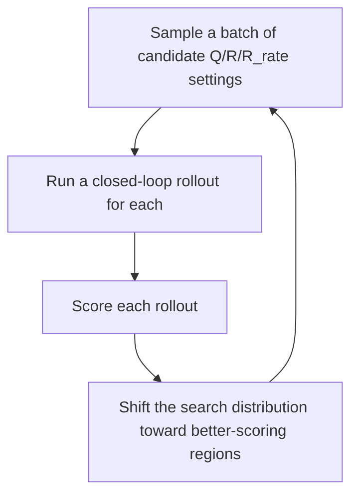
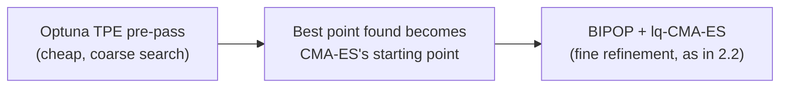
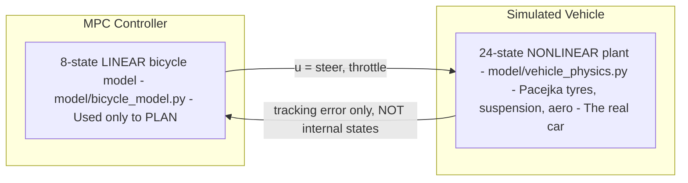

# Junior Project: MPC Path Tracking Controller

**Designer:** Martin Jin
**Design leader:** N/A
**CTO:** N/A
**Supervisor:** N/A
**Timeline:** 20/06/2026 - 20/07/2026

**THIS DOCS PAGE IS STILL A WORK IN PROGRESS.**

---

## Skills you will learn

- How an MPC controller works, from the maths behind it to the actual code.
- How to use the MPC controller in this repo.
- The key features built into this specific implementation (adaptive gain scheduling, etc).
- How to tune the MPC controller by hand, and how to use the automatic tuner instead.
- How to run the MPC controller live in the FSDS simulator for validation.

---

## Overview

At the start of this project, the car only had a Stanley controller. It worked, but it's a "reactive" controller, it only steers based on the car's current heading error and lateral error, right now, at this exact instant. It never looks ahead. That has two real consequences:

- **It can't go as fast**, because it doesn't know what's coming up, so it has to drive conservatively everywhere just in case.
- **It can't turn early into a sudden corner**, because it only reacts once the error already exists, not before.

An MPC (Model Predictive Control) controller fixes this by planning ahead. Every tick, it asks "if I did X for the next second or so, where would I end up, and how well would that track the path?", for lots of possible X, and picks the best one. This lets it brake before a corner it can see coming, and carry more speed on a straight it knows stays straight.

MPC also handles the car's physical limits properly (it will never ask for more steering angle than the rack can physically provide), and lets us define exactly what "good driving" means through a tunable cost function, rather than a fixed set of reactive rules. The trade-off is complexity and computation cost, it's solving an optimisation problem 20 times a second instead of doing simple trigonometry.

### What this project delivers

- **A working MPC controller**, takes in odometry (position, heading, speed) and outputs a throttle + steering command.
- **A working 2D simulator**, used to visualise and test the controller, and to run the offline tuner against. (This is a separate, lightweight simulator from FSDS, see [FSDS vs. This Repo's Simulator](#fsds-vs-this-repos-simulator) below.)
- **A working auto-tuner**, the controller's cost function has ~9 numbers that need tuning for it to drive well; this searches for good values automatically instead of by hand.
- **Working ROS 2 nodes**, drop-in replacements for the old Stanley controller nodes in the FSDS/planning stack, so the MPC can be validated against the real simulator.
- **Documentation**, the repo [README](https://github.com/Martin-Jin/fsae_MPCTest) and this docs page.

---

## Index

1. [How the MPC Controller Works](#1-how-the-mpc-controller-works)
   - [1.1 The Big Idea: Receding Horizon Control](#11-the-big-idea-receding-horizon-control)
   - [1.2 What the Controller Tracks (The State Vector)](#12-what-the-controller-tracks-the-state-vector)
   - [1.3 The Prediction Model](#13-the-prediction-model)
   - [1.4 The Cost Function](#14-the-cost-function)
   - [1.5 The Solver](#15-the-solver)
   - [1.6 Special Features: Adaptive Gain Scheduling](#16-special-features-adaptive-gain-scheduling)
2. [Tuning the Controller](#2-tuning-the-controller)
   - [2.1 Why an Automatic Tuner?](#21-why-an-automatic-tuner)
   - [2.2 How the Tuner Works (CMA-ES)](#22-how-the-tuner-works-cma-es)
   - [2.3 The Optuna Pre-Search Warm Start](#23-the-optuna-pre-search-warm-start)
   - [2.4 How a Run Gets Scored](#24-how-a-run-gets-scored)
   - [2.5 Running the Tuner](#25-running-the-tuner)
   - [2.6 Manual Tuning Guide](#26-manual-tuning-guide)
   - [2.7 Key Settings Reference](#27-key-settings-reference)
   - [2.8 Adding a New Test Track](#28-adding-a-new-test-track)
3. [FSDS vs. This Repo's Simulator](#3-fsds-vs-this-repos-simulator)
4. [The Two Vehicle Models: MPC's Model vs. the Simulator's Plant](#4-the-two-vehicle-models-mpcs-model-vs-the-simulators-plant)
   - [4.1 Why a Linear Model, When the Real Car Is Nonlinear?](#why-a-linear-model-when-the-real-car-is-nonlinear)
5. [Vehicle Physics, Explained](#5-vehicle-physics-explained)
   - [5.1 The 24-State Plant Model](#51-the-24-state-plant-model)
   - [5.2 Tyres and Slip, Explained](#52-tyres-and-slip-explained)
   - [5.3 Suspension and Weight Transfer, Explained](#53-suspension-and-weight-transfer-explained)
   - [5.4 Aerodynamics, Rolling Resistance, and Actuator Lag](#54-aerodynamics-rolling-resistance-and-actuator-lag)
6. [Running the Simulator (GUI)](#6-running-the-simulator-gui)
7. [Manual Drive Mode](#7-manual-drive-mode)
8. [Running Against the Real FSDS Simulator](#8-running-against-the-real-fsds-simulator)
9. [Module Reference](#9-module-reference)

---

## 1. How the MPC Controller Works

### 1.1 The Big Idea: Receding Horizon Control

Every 1/20th of a second (20 Hz), the controller does this:


The key trick is step D and E: even though the controller plans a whole 1.25-second sequence, it only ever uses the very first command from that plan, then immediately re-plans from scratch next tick. This is called **receding horizon control**, and it's what makes MPC robust even though its internal model of the car is a simplification of the real physics, any prediction error gets caught and corrected on the very next tick, 20 times a second.

### 1.2 What the Controller Tracks (The State Vector)

The controller doesn't track the car's raw (X, Y) position on the map. Instead, it tracks **error relative to the path**, this keeps its behaviour the same no matter where on the track the car happens to be.

$$
x = [\,e_y,\ \dot{e}_y,\ e_\psi,\ \dot{e}_\psi,\ e_v,\ e_a,\ \delta_{act},\ a_{act}\,]
$$

| # | Symbol | Plain English | Units |
|---|---|---|---|
| 0 | $e_y$ | How far sideways off the path centreline the car currently is | m |
| 1 | $\dot{e}_y$ | How fast that sideways error is changing | m/s |
| 2 | $e_\psi$ | How wrong the car's heading is compared to the path direction | rad |
| 3 | $\dot{e}_\psi$ | The car's yaw rate (how fast its heading is spinning) | rad/s |
| 4 | $e_v$ | How far off the car's speed is from the target speed | m/s |
| 5 | $e_a$ | Unused placeholder (kept for structural consistency only) | m/s² |
| 6 | $\delta_{act}$ | Where the steering actuator has *actually* reached so far (it lags behind commands) | rad |
| 7 | $a_{act}$ | Where the throttle/brake actuator has *actually* reached so far | m/s² |

States 6 and 7 exist because a real steering rack or throttle doesn't snap instantly to a new value, it eases toward it (a "first-order lag"). Tracking the actuator's actual current position, not just the last command sent, lets the model predict the car's motion more accurately.

**How the error is actually measured:** every tick, the code finds the closest point on the path to the car's current position, then measures the sideways distance and heading difference from there. This is called a **Frenet-frame** conversion, describing "where am I" as "how far along the path, and how far off to the side" instead of raw map coordinates. It's the standard approach for any controller whose whole job is staying close to a curve.

### 1.3 The Prediction Model

The car is modelled as a **bicycle model**, one wheel on the front axle, one on the rear, both on the centreline, instead of four separate wheels. This is the standard simplification used in vehicle control: it captures the two things that matter for path tracking (how the front wheel steers, and how the whole car rotates/slides) while staying simple enough to solve 20 times a second.

Every linear model in control theory has the same general form:

$$
\dot{x} = A \cdot x + B \cdot u
$$

Read this as: *"the rate of change of the state (ẋ) is some fixed mixture of the current state (x) plus some fixed mixture of the current command (u)."* $A$ and $B$ are just tables of numbers saying how much of each state feeds into the rate of change of every other state.

Two different physical assumptions are blended together to build $A$:

**Below 1 m/s, kinematic model** (pure geometry, like pushing a shopping trolley):

$$
\dot{e}_y = v_x \cdot e_\psi \qquad\qquad \dot{e}_\psi = \frac{v_x \cdot \delta_{act}}{L}
$$

At very low speed the tyres haven't built up real cornering grip yet, so the car turns purely by geometry (standard Ackermann steering), a longer wheelbase $L$ turns more slowly for the same steering angle.

**Above 2.5 m/s, dynamic model** (tyre grip dominates):

$$
\ddot{e}_y = -\frac{2C_f+2C_r}{m v_x}\dot{e}_y + \frac{2C_f+2C_r}{m}e_\psi + \frac{-2C_f l_f+2C_r l_r}{m v_x}\dot{e}_\psi + \frac{2C_f}{m}\delta_{act}
$$

$$
\ddot{e}_\psi = \frac{-2C_f l_f+2C_r l_r}{I_z v_x}\dot{e}_y + \frac{2C_f l_f-2C_r l_r}{I_z}e_\psi - \frac{2C_f l_f^2+2C_r l_r^2}{I_z v_x}\dot{e}_\psi + \frac{2C_f l_f}{I_z}\delta_{act}
$$

Where $C_f$/$C_r$ are front/rear cornering stiffness (how much sideways force a tyre makes per radian of slip), $l_f$/$l_r$ are the distances from the car's centre of mass to each axle, $m$ is mass, and $I_z$ is yaw inertia (resistance to spinning, like a figure skater's arms out vs. in). The $1/v_x$ terms exist because at higher speed the same amount of sideways drift produces a *smaller* slip angle, so grip builds up more gradually.

**Blending the two:**

$$
\alpha = \text{clip}\left(\frac{v_x - 1.0}{2.5 - 1.0},\ 0,\ 1\right) \qquad A_c = (1-\alpha)A_{kin} + \alpha A_{dyn}
$$

$\alpha$ ramps linearly from 0 to 1 between 1 m/s and 2.5 m/s. Below 1 m/s it's pure kinematic, above 2.5 m/s it's pure dynamic, in between it's a proportional mix. This avoids a sudden jump in predicted behaviour right at the switch-over speed.

**From continuous to discrete:** the equation above describes an instant rate of change, but the controller only makes one decision every $dt = 0.05\text{s}$ and holds it. Converting $\dot{x}=A_c x + B_c u$ into the one-step form $x[k{+}1] = A_d x[k] + B_d u[k]$ is done via **Zero-Order Hold (ZOH)**, the mathematically exact discretisation for a system where the input is held constant between updates (exactly how MPC applies its commands):

$$
\exp\!\left(\begin{bmatrix}A_c & B_c\\0&0\end{bmatrix}dt\right)=\begin{bmatrix}A_d & B_d\\0&I\end{bmatrix}
$$

This is more accurate than a simpler method like Euler integration, which builds up error at every step.

### 1.4 The Cost Function

Each solve minimises, over the predicted horizon of $N$ steps:

$$
\min \sum_i \lVert\sqrt{Q}\odot x_i\rVert^2 \;+\; \sum_i \lVert\sqrt{R}\odot u_i\rVert^2 \;+\; \sum_i \lVert\sqrt{R_{rate}}\odot \Delta u_i\rVert^2 \;+\; W_{slack}\lVert\text{slack}\rVert^2
$$

In plain English, three things are being penalised at once:

| Term | Plain English |
|---|---|
| $Q$ (state cost) | How far off the path the car is predicted to be, over the whole plan |
| $R$ (input cost) | How much steering/throttle effort is being used |
| $R_{rate}$ (rate cost) | How jerky/abrupt the commands are, tick to tick |
| Slack | A soft penalty for crossing a ±3.5 m lane boundary, allowed only as a last resort |

Subject to hard constraints that can never be broken:

$$
x_0 = x_{\text{measured}} \qquad x_{i+1} = A_d x_i + B_d u_i \qquad u_{min} \le u_i \le u_{max}
$$

$Q$, $R$, and $R_{rate}$ are diagonal matrices, one number per state/input, controlling how much the solver cares about minimising that particular thing relative to the others. **These are exactly the numbers the tuner searches for** (see [Section 2](#2-tuning-the-controller)).

**What's actually inside each `∑‖√Q ⊙ x‖²` term.** Because $Q$, $R$, and $R_{rate}$ are diagonal (one weight per state/input, no cross-terms), the `⊙` (elementwise multiply) followed by squaring the norm just means: take each state, multiply it by its own weight, square it, and add up all 8 (or 2, for the input terms). Written out per step $i$, with $x_i = [e_y, \dot{e}_y, e_\psi, \dot{e}_\psi, e_v, e_a, \delta_{act}, a_{act}]$:

$$
\lVert\sqrt{Q}\odot x_i\rVert^2 = Q_0 e_y^2 + Q_1 \dot{e}_y^2 + Q_2 e_\psi^2 + Q_3 \dot{e}_\psi^2 + Q_4 e_v^2 + Q_5 e_a^2 + Q_6 \delta_{act}^2 + Q_7 a_{act}^2
$$

Same pattern for the input cost, with $u_i = [\text{steer}_i, \text{accel}_i]$, and the rate cost, with $\Delta u_i = u_i - u_{i-1}$:

$$
\lVert\sqrt{R}\odot u_i\rVert^2 = R_0\,\text{steer}_i^2 + R_1\,\text{accel}_i^2 \qquad\qquad \lVert\sqrt{R_{rate}}\odot \Delta u_i\rVert^2 = R_{rate,0}(\Delta\text{steer}_i)^2 + R_{rate,1}(\Delta\text{accel}_i)^2
$$

**Why the cost can only ever go up as errors grow, never down:** every one of these terms is a non-negative weight times a *squared* quantity. Squaring means the sign of the error doesn't matter, drifting 2 m left of the path costs exactly the same as drifting 2 m right of it, and it also means the number itself only gets bigger the further from zero you go. Since every weight in `Q_diag`/`R_diag`/`R_rate_diag`/`W_slack` is non-negative (the tuner only ever searches multiplicative scale factors on top of a non-negative starting template, see [Section 2.2](#22-how-the-tuner-works-cma-es)), adding a non-negative weight times a non-negative square to a running total can only push that total up, never down. So more tracking error, more control effort, or jerkier commands always costs more, never less. This "sum of non-negative squares" shape is also exactly what makes the whole thing convex, and convex is what lets a QP solver find the guaranteed best answer instead of getting stuck on a locally-good-but-not-actually-best one (see [Section 1.5](#15-the-solver)).

### 1.5 The Solver

The cost function above is **quadratic** (everything is squared), and every constraint is **linear**. A quadratic cost with linear constraints is called a **Quadratic Program (QP)**, a well-studied category of problem with fast, purpose-built, off-the-shelf solvers already available. This is deliberate: it's *why* the cost function is built with squared terms rather than something more exotic, it's what keeps the whole problem inside this fast-to-solve category.

**This is exactly where the model's linearity earns its keep.** The constraint $x_{i+1} = A_d x_i + B_d u_i$ is only linear because $A_d$/$B_d$ come from the linear bicycle model in [Section 1.3](#13-the-prediction-model), not the nonlinear 24-state plant. If that constraint used the plant's real Pacejka tyre curves instead, the whole problem would stop being a QP and would become a much harder **nonlinear program (NLP)**, no guaranteed global optimum, slower general-purpose solvers (think tens to hundreds of milliseconds rather than 1-5ms), and a real risk of the solver not converging in time for the next 50ms tick. Using a linear model is what makes it possible to solve this problem fast enough, and predictably enough, to run 20 times a second on modest hardware, see [Section 4](#4-the-two-vehicle-models-mpcs-model-vs-the-simulators-plant) for the full linear-vs-nonlinear tradeoff this buys.

You do not need to write a solver yourself. This repo uses:

- **[OSQP](https://osqp.org/)** (primary), via the `cvxpy` Python library. Exploits sparsity and supports *warm-starting* (reusing last tick's answer as this tick's starting guess), which is what makes solving fast enough 20 times a second, typically 1-5 ms per solve.
- **[Clarabel](https://clarabel.org/)** (fallback), a slower but more numerically robust interior-point solver, only invoked if OSQP fails outright.
- If both fail, the simulator holds the previous command; the live controller instead applies a full brake, since that's the safer default on real hardware.

```python
import cvxpy as cp
# ... build cost + constraints as shown above ...
prob = cp.Problem(cp.Minimize(cost), constraints)
prob.solve(solver=cp.OSQP, warm_start=True, eps_abs=1e-5, max_iter=8000)
```

**The "parameterised" trick:** rebuilding this whole expression from scratch every tick would be ~10x slower than necessary. Instead, the problem is built **once** using `cp.Parameter` placeholders instead of plain numbers; every subsequent tick just updates the parameter *values* (new $A_d$, $B_d$, $x_0$, weights) and re-solves the same compiled problem. See `controller/optimiser.py`'s `init_parameterized_mpc()` / `solve_mpc()` for the exact implementation.

> Note the `eps_abs=1e-5, max_iter=8000` above is the default used for interactive/GUI solves.
> The offline tuner runs with a separate, deliberately looser tolerance
> (`ROLLOUT_EPS`/`ROLLOUT_MAX_ITER` in `settings.py`) since it runs thousands of rollouts and a
> slightly looser tolerance there has negligible effect on the resulting weights but a real
> effect on tuning time, see [Section 2.7](#27-key-settings-reference).

### 1.6 Special Features: Adaptive Gain Scheduling

The tuned $Q$/$R$/$R_{rate}$ weights are optimised for one "average" operating point. Two small functions rescale $R$ and $R_{rate}$ **every tick** to compensate for known, predictable ways the car's needs change with speed and cornering, without needing a separate tuned weight set for every situation.

**Steering gets more conservative at higher speed** (`adaptive_R_scaling`):

$$
\text{steer\_scale} = 1 + \frac{1.5\,v_x}{6.0+v_x} \qquad(\to 1.0 \text{ at } v_x{=}0,\ \to 2.5 \text{ as } v_x\to\infty)
$$

At higher speed the same steering angle produces much more lateral acceleration ($a_{lat}\approx v_x^2\kappa$), so the same steering command is more destabilising. This is a saturating ("Hill function") curve rather than a straight ramp specifically so steering cost never exceeds 2.5x base, the controller is never fully locked out of steering even at very high speed.

**Smoothness penalty relaxes in tight corners** (`adaptive_R_rate`):

$$
\text{scale} = \max\!\left(0.35,\ \frac{1}{1+3\kappa}\right) \qquad(\to 1.0 \text{ on a straight},\ \to 0.35 \text{ floor at high curvature})
$$

In a straight, the full smoothness penalty applies (discourage unnecessary jitter). In a tight corner, the penalty is floored at 35% of base, enough softening to let the controller make the fast steering changes a tight corner genuinely needs, without ever letting the rate cost vanish completely (which would allow arbitrarily rapid oscillation).

> Both functions return a **copy** of the base matrix, your tuned weights in `settings.py` are
> never permanently modified, only scaled on top of, fresh, every tick.

---

## 2. Tuning the Controller

### 2.1 Why an Automatic Tuner?

$Q$, $R$, and $R_{rate}$ have 9 tunable numbers between them (`Q_diag[0:5]`, `R_diag[0:2]`, `R_rate_diag[0:2]`). Hand-tuning 9 interacting numbers by trial and error, across multiple different corner shapes, is slow and doesn't scale, a change that helps one corner type can hurt another. `tuner/offline_tuner.py` searches for good values automatically by running thousands of simulated laps and minimising a single composite score.

### 2.2 How the Tuner Works (CMA-ES)

**CMA-ES** (Covariance Matrix Adaptation Evolution Strategy) is a derivative-free, black-box optimiser. It was chosen because the objective here, "how well did the car drive?", is noisy, non-convex, and has no usable gradient; you can't analytically differentiate "how smooth did the steering feel" with respect to a cost weight the way you could with, say, a simple curve-fitting problem.



Rather than searching raw weight values, it searches **multiplicative scale factors** in `[0.1, 10.0]` applied to a starting template, this keeps the search well-behaved regardless of the template's starting magnitude, and specifically allows a weight to be turned *down* below its starting point, not just up.

This project specifically uses `cma.fmin_lq_surr2`, layering two extra techniques on top of plain CMA-ES:

| Technique | What it does | Why |
|---|---|---|
| **BIPOP restarts** | Alternates "large" restarts (bigger population, broad exploration) with "small" restarts (local refinement) | Escapes local minima while still exploiting promising regions |
| **Surrogate assistance** ("lq" = local quadratic) | Fits a cheap approximate model to recent candidates; only genuinely promising ones get a real, expensive rollout | Roughly 3-10x more effective search coverage for the same rollout budget |

Every candidate is tested across a library of synthetic corner shapes (hairpins, chicanes, slaloms, etc, see `VALIDATION_SUITE` in `settings.py`), from both a perfect starting position and a slightly-off starting position (to also test recovery, not just perfect tracking). The final objective for one candidate combines all of these tests as:

$$
\text{objective} = 0.7 \times \text{weighted\_mean(scores)} + 0.3 \times \max(\text{scores})
$$

The 30% worst-case term exists specifically so the tuner can't find a setting that looks great *on average* by driving one corner shape perfectly and another one badly, every corner shape in the suite has to be reasonably good, not just the average.

### 2.3 The Optuna Pre-Search Warm Start

CMA-ES on its own always starts its search from the same fixed point, the geometric midpoint of each weight's allowed range, and has to spend part of its own budget just figuring out which general area of the 9-dimensional search space looks promising before it can start refining within it.

`tuner/offline_tuner.py` now has an optional pre-search step that runs first: a short pass using **Optuna's TPE sampler** (Tree-structured Parzen Estimator), a cheaper, more sample-efficient method for narrowing down "which general area is promising", though it doesn't refine as precisely as CMA-ES does. CMA-ES then starts from the Optuna pass's best result instead of the fixed midpoint, which tends to leave more of CMA-ES's own budget free for fine refinement instead of coarse search.



- Controlled by `USE_OPTUNA_PRESEARCH` in `settings.py` (defaults to `True`). Set it `False` to skip the pre-pass entirely and fall back to the original fixed-midpoint start.
- The pre-pass gets its own separate mini-budget, `OPTUNA_PRE_PASS_EVALS`, computed as roughly 10% of `MAX_EVALS`, not carved out of `MAX_EVALS` itself. The two phases run one after another, so total wall-clock time is roughly the sum of both.
- Requires the `optuna` package (`pip install optuna`), it isn't otherwise a dependency of this repo.
- When running, you'll see extra lines in the tuner's console output covering the pre-pass's own trial count, its best score, and how long it took, followed by the usual CMA-ES generation-by-generation progress. The final summary at the end breaks out Optuna vs. CMA-ES timing separately.
- `tuning history.txt` also now records whether a given run used the Optuna pre-pass, and if so, how many trials it ran and what its best result was, alongside the tuned weights, see [Section 2.4](#24-how-a-run-gets-scored) for the rest of what gets logged.

### 2.4 How a Run Gets Scored

Every rollout, whether from the tuner, or from **Show Metrics**/**Benchmark All Paths** in the GUI, is scored through the exact same code (`sim/scoring.py`), so a live run and an offline tuning run always produce comparable numbers.

**The 12 raw metrics**, accumulated every simulation step:

| # | Metric | What it measures, in plain English |
|---|---|---|
| 0 | `rmse` | Combined tracking error ($1.2\,e_y^2+0.4\,e_\psi^2$, root-mean-squared). The single most important signal, how far off the path, on average. |
| 1 | `yaw_rms` | How much the car's heading wobbled/oscillated overall |
| 2 | `smooth_rms` | How jerky the steering/throttle changes were, step to step (a failed solve adds a flat +5.0 penalty) |
| 3 | `steer_rms` | Overall steering effort used |
| 4 | `accel_rms` | Overall throttle/brake effort used |
| 5 | `max_steering` | The single largest steering command in the whole run |
| 6 | `steering_sat_ratio` | How often steering was pinned within 95% of its max limit |
| 7 | `jerk_rms` | Smoothness *of the smoothness*, how abruptly the rate of change itself changed |
| 8 | `max_yaw_rate` | The fastest the car's heading was ever spinning |
| 9 | `steering_reversal_rate` | How often the steering direction flip-flopped, as a per-step rate rather than a raw count, so it stays comparable across runs of different lengths, a sign of "hunting"/indecisive control |
| 10 | `peak_lateral_error` | The single worst sideways error at any point, a safety-margin check, independent of the average |
| 11 | `speed_rmse` | How well actual speed tracked the target speed |

**Combining into one score:**

```python
score = SCORE_WEIGHTS @ metrics                                   # weighted sum of the 12 metrics
score -= COMPLETION_BONUS_WEIGHT * progress + TIME_BONUS_WEIGHT * time_bonus
if dnf:       score += DNF_PENALTY
if offtrack:  score += DNF_OFFTRACK_PENALTY
if inaccurate_count > 0:
    factor = min(5, inaccurate_count) * 0.1                        # capped at 50%
    score += abs(score) * factor
```

- **`SCORE_WEIGHTS`** (in `settings.py`) is the 12-entry array of how much each metric above matters. It's kept summing to roughly `1.0` so the composite score's overall scale stays stable and comparable across tuning runs, though it's a convention enforced by the code's comments rather than a hard runtime check, the only runtime assertion is that the array has exactly 12 entries.
- **Completion/time bonuses** are subtracted (i.e. improve the score) for finishing the track at all, and for finishing it quickly.
- **DNF penalties** are added if the car didn't finish, with an extra penalty specifically if it left the track, so the tuner can't "cheat" by driving slowly and carefully forever without ever actually finishing.
- **The inaccurate-solver penalty** inflates an already-computed score proportionally (up to +50% at 5+ occurrences) if the solver returned a not-fully-converged answer too often, still usable, but penalised, rather than thrown out outright.

**Lower is always better.** A good finishing run typically scores around **-0.5 to -0.3** - negative because the bonuses usually outweigh the (small, well-tuned) metric costs.

**Where to find results:** every tuning run automatically appends to `tuning history.txt`, timestamp, the three weight arrays (copy-pasteable), duration, the tuner's own score, and the git commit hash, plus, as of a more recent change, the score weights and bonus/penalty weights actually used for that run, and whether the Optuna pre-pass ran (and if so, its trial count and best result). Recording the weights alongside the score means an older logged run stays interpretable even after `SCORE_WEIGHTS` itself changes later. The `Overall score` field is left blank for you to fill in by hand once you've actually tested those weights in FSDS, the offline score is a good guide but doesn't perfectly predict real-world performance, so this file is where the two get reconciled over time.

### 2.5 Running the Tuner

```bash
pip install numpy scipy matplotlib cvxpy cma
pip install cvxpy[osqp] cvxpy[clarabel]

cd /path/to/project
python -m tuner.offline_tuner
```

It uses all CPU cores minus one, and prints progress once per generation. With the Optuna pre-search on (the default), you'll see its trial-by-trial progress first, then the tuner's strategy banner, then CMA-ES's own generation-by-generation progress:

```
[Offline Tuner] Optuna TPE pre-pass: 250 trials...
[Offline Tuner] Optuna pre-pass done in 42.1s | best score: 0.3021
[Offline Tuner] Strategy: BIPOP + lq-CMA-ES (surrogate-assisted)
[lq-CMA-ES] gen    5 | true_evals    90 | gen_best 0.2341 | overall_best 0.1892 | sigma 6.123e-01
```

You can safely stop early with **Ctrl+C**, it finishes the current generation, then reports the best weights found so far rather than exiting uncleanly. On completion it prints:

```
Replace your gui/simulation.py weights with:
Q_diag      = [9.35, 22.2, 18.9, 49.8, 10.8, 0.0, 0.0, 0.0]
R_diag      = [49.3, 45.4]
R_rate_diag = [50.0, 49.6]
```

**Apply the result to both places** (they are not linked, and must be kept in sync by hand):

1. `settings.py`, `Q_diag`, `R_diag`, `R_rate_diag`
2. `fsds_simulator/control/fsae_control/fsae_control/mpc_core.py`, the same three arrays hardcoded inside `MPCController.__init__` (the live ROS 2 controller is a standalone module on purpose, with zero simulator dependencies)

### 2.6 Manual Tuning Guide

You generally shouldn't hand-edit individual `Q`/`R`/`R_rate` entries, they interact with each other, so a change that looks like an improvement for one corner can quietly break another. Prefer running the tuner. If you do need to nudge something by hand:

- **Change one number at a time**, by no more than 20-30%, then re-test. Small changes can have surprisingly large effects because they interact.
- **Test against multiple corner shapes**, not just the one you're currently looking at, use **Benchmark All Paths** in the GUI, not just **Show Metrics** on a single run.
- **Watch for these specific symptoms** and roughly what to look at:

| Symptom | What to check |
|---|---|
| Car oscillates left-right, especially at low speed | `R_rate` too low (steering allowed to change too abruptly), or too much weight on $e_y$ relative to $\dot e_y$ |
| Car cuts corners short / understeers into apexes | `Q[e_y]` too low relative to `Q[e_psi]`, or corner speed target is too high for the tyre grip assumed |
| Car is sluggish to accelerate / stuck at low speed | `R[accel]` too high, or `COASTING_SCALE`/friction in `vehicle_physics.py` needs adjusting first |
| Solver frequently fails / returns `OPTIMAL_INACCURATE` | See [Section 2.7](#27-key-settings-reference), usually a weight-scaling or solver-tolerance issue, not a driving-behaviour issue |
| Good on one path, terrible on another | You're overfitting to one corner shape, add more paths to `VALIDATION_SUITE` and re-run the tuner rather than hand-patching |

### 2.7 Key Settings Reference

All of these live in `settings.py`, with a full plain-English explanation as a comment directly above each one in the file itself, **read those comments before changing anything.** This is a quick-reference summary.

| Setting | What it does | Typical adjustment |
|---|---|---|
| `N_HORIZON` | How many 0.05s steps ahead the MPC plans (25 = 1.25s look-ahead). Must match `N_horizon` in `gui/simulation.py` and `N` in `mpc_core.py` | ±5 steps at a time |
| `USE_PLANNER` | Test with the full simulated cone-perception pipeline (`True`), or the perfect reference path (`False`, faster) | Leave `True` unless you specifically want faster driving-feel-only iteration |
| `DELAY_STEPS` | Simulated command lag, for robustness testing. `rollout_core.py` now predicts the state forward through the commands already queued (`predict_ahead()`) before solving, so the large-oscillation behaviour that used to make this unsafe to raise is fixed, it's been validated across a range of delay values | Adjust as needed for the robustness scenario you're testing |
| `MAX_FAILS` | Consecutive solver failures before a run is abandoned as DNF | 1-2 at a time, default 5 |
| `OFFTRACK_LIMIT` | Lateral error beyond which the car is "off track" | Don't edit directly, change `TRACK_HALF_WIDTH` in `sim/sim_track.py` instead |
| `DT` | Simulation timestep, 0.05s = 20Hz | Don't change unless the real controller's timer rate changes too |
| `ROLLOUT_EPS` / `ROLLOUT_MAX_ITER` | Solver tolerance/iteration cap **during tuning only** (looser = faster, negligible accuracy cost) | Factor of 2-10x at a time |
| `MAX_EVALS` | Total true-rollout budget for one tuning run (2500 by default) | Double/halve to meaningfully change tuning time |
| `USE_OPTUNA_PRESEARCH` / `OPTUNA_PRE_PASS_EVALS` | Whether the tuner runs a cheap Optuna warm-start pass before CMA-ES, and its own budget (roughly 10% of `MAX_EVALS`, on top of it, not carved out of it) | See [Section 2.3](#23-the-optuna-pre-search-warm-start) |
| `PATH_N_POINTS` | How finely each synthetic test track is resampled | 200-500 at a time |
| `SCORE_WEIGHTS` | The 12-entry "what does good driving mean" array (see [2.4](#24-how-a-run-gets-scored)). Kept summing to roughly 1.0 by convention | Move 0.01-0.03 from one weight to another |
| `VALIDATION_SUITE` | Which synthetic corner shapes the tuner actually scores against | Add/remove one at a time, watch tuning time change |
| `COMPLETION_BONUS_WEIGHT` / `TIME_BONUS_WEIGHT` | Reward for finishing / finishing quickly | 0.1-0.2 / 0.05-0.1 at a time |
| `DNF_PENALTY` / `DNF_OFFTRACK_PENALTY` | Flat penalty for not finishing / for leaving the track specifically | 0.5-1.0 at a time |
| `FAST_TEST_MODE` | Shrinks everything for a ~1 minute smoke-test after a code change. **Never** paste weights tuned with this on into `Q_diag` etc, it's a correctness check, not a real tuning result | `True` only for quick dev iteration |

### 2.8 Adding a New Test Track

1. In `tuner/offline_tuner.py`, open `build_synthetic_paths()`.
2. Build your segments: `_make_arc(cx, cy, radius, start_deg, end_deg, n)` for constant-radius corners, `np.linspace(...)` for straights.
3. Concatenate the segment arrays and pass them through `_resample_path(wx, wy)`.
4. Add the resulting tuple to the `paths` dictionary under a new key.
5. *(Optional)* Add that key to `VALIDATION_SUITE` in `settings.py` if you want the tuner to actually optimise against it.

---

## 3. FSDS vs. This Repo's Simulator

These are **two different simulators** used for two different jobs, it's easy to conflate them, so here's the direct comparison:

| | **This repo's 2D simulator** (`gui/simulation.py`) | **FSDS** (Formula Student Driverless Simulator) |
|---|---|---|
| What it is | A lightweight, from-scratch 2D matplotlib simulation | The official, full 3D Unreal-Engine-based driverless competition simulator |
| Vehicle model | The 24-state nonlinear plant in `model/vehicle_physics.py` | Unreal Engine's own physics (via AirSim) |
| Speed | Runs a full closed-loop rollout in seconds | Runs in (roughly) real time, full 3D rendering |
| Purpose | Fast iteration, and the **only** thing the offline tuner runs against (thousands of rollouts) | Final, realistic validation of the live ROS 2 controller before/instead of the real car |
| How the controller connects | Directly, in-process (`sim/rollout_core.py`) | Over ROS 2 topics, via the `fsae_control` package's controller nodes talking to the rest of the `fsae_planning` stack |
| Cone data | Statically placed along the path (`sim_track.place_cones()`) or perfect reference path | Comes from FSDS's own simulated perception/track layout |

The important guarantee: both the 2D simulator and the live FSDS-connected controller run through **numerically matched implementations** (`sim/rollout_core.py` and `control_utils.MPCController`/`mpc_core.MPCController` are kept in deliberate parity, see `docs/planning_control_sync.md`). This is *why* weights tuned offline in the fast 2D simulator transfer directly to FSDS without needing to be re-tuned there.

---

## 4. The Two Vehicle Models: MPC's Model vs. the Simulator's Plant

This project deliberately runs **two different vehicle models at once**, and this mismatch is not a bug, it's the whole point.



- **The MPC's internal model** (Section [1.3](#13-the-prediction-model)) is a simplified, linear 8-state bicycle model. It has to be simple, because the solver evaluates it many times per second inside an optimisation loop.
- **The plant** (`model/vehicle_physics.py`) is the detailed, nonlinear 24-state "ground truth" - real tyre curves, suspension, weight transfer, aerodynamics. This is what the car "actually" does in the simulation.

### Why a linear model, when the real car is nonlinear?

Every real vehicle is nonlinear, tyre grip saturates, weight shifts under braking, drag scales with speed squared. None of that is a straight-line relationship. So it's fair to ask why the controller's internal model throws all of that away and pretends the car behaves linearly. The short answer: a linear model is not more *accurate*, it's what makes the optimisation problem solvable fast enough to be useful at all. Here's the actual tradeoff:

| | **Linear model** (what the MPC uses to plan) | **Nonlinear model** (what the plant actually is) |
|---|---|---|
| **Pros** | Solvable as a convex QP with a guaranteed global optimum, see [Section 1.5](#15-the-solver). Fast and predictable, 1-5ms per solve, so it reliably fits inside the 50ms control budget. Can be "parameterised" once and just re-solved with new numbers each tick (see the parameterised-problem trick in 1.5), which is a large chunk of why it's fast enough at all. | Captures the real physics: tyre saturation, load-dependent grip, weight transfer, drag. Far more accurate far from the model's small-signal assumptions, e.g. at the edge of grip, hard braking into a corner, or very low/very high speed. |
| **Cons** | Only accurate near the operating point it was linearised around, it quietly gets worse the further the car strays from "normal" driving (very low speed, very high slip, near the tyre's grip limit). This project works around the worst of it with the kinematic/dynamic blend in [Section 1.3](#13-the-prediction-model), but that's a patch, not a full fix. | Turns the optimisation into a nonlinear program (NLP), no guaranteed global optimum, no standard fast off-the-shelf solver, and solve times that can balloon unpredictably, exactly the property you don't want when a fresh answer is due every 50ms no matter what. |

**Why this project picked linear anyway:** MPC's whole safety net is re-planning from scratch every single tick (the receding-horizon idea from [Section 1.1](#11-the-big-idea-receding-horizon-control)). Because of that, the model doesn't need to be perfectly accurate over the full 1.25s horizon, any prediction error the linear model makes just shows up as a bit of extra tracking error on the *next* measurement, and gets corrected again next tick. What the model absolutely cannot do is fail to produce an answer, or produce one too slowly, since a missed deadline means driving blind for that tick. A linear model trades a small, bounded loss of prediction accuracy for a large, guaranteed win in solve speed and solve reliability, and given the re-planning safety net already forgives the accuracy loss, that trade is a clear win here. This is also exactly why the 24-state nonlinear plant still exists, it's used as the simulated "real car" to test against, not as something the controller ever tries to solve against directly.

**Critically, the controller never sees the plant's 24 internal states directly.** It only receives the tracking error computed from the plant's global position each tick, exactly like a real controller only has GPS/odometry, not X-ray vision into the tyres. This closed-loop feedback loop, re-planning every 50ms, is what makes MPC robust to the gap between its simple internal model and the much more complex real car, any misprediction just shows up as tracking error next tick and gets corrected.

> If you ever import new real tyre test data into `vehicle_physics.py`, you **must** also
> recompute `Cf`/`Cr` (used by the MPC's *internal* model) to match the new curve's initial slope
>, otherwise the controller's internal picture of the car quietly stops matching the physics it's
> actually driving, which shows up as degraded tracking with no obvious cause. See
> `docs/architecture.md`'s "If you import new tyre data" note.

---

## 5. Vehicle Physics, Explained

*(This section summarises `docs/vehicle_physics_guide.md`, read that file for the full version.)*

### 5.1 The 24-State Plant Model

The plant tracks 24 numbers describing the car's complete physical situation at any instant. States 0-7 deliberately match the MPC's own 8 states (position, heading, speed, actuator lag) so other code can read "where is the car / how fast" without any conversion; states 8-23 are extra detail the simple controller model doesn't track at all.

| # | State | What it's really telling you |
|---|---|---|
| 0-1 | `X`, `Y` | Where the car is on the map |
| 2 | `psi` | Which way the car is **pointing** (its heading), not necessarily which way it's **moving** (think of a car sliding sideways through a corner) |
| 3 | `vx` | Forward speed along the car's own nose-to-tail axis, "what the speedometer reads" |
| 4 | `vy` | Sideways speed across the car. Non-zero `vy` means the car is sliding |
| 5 | `r` | Yaw rate, how fast the heading is rotating. High `r` with little actual turning = spinning out, not cornering cleanly |
| 6 | `delta_act` | The steering angle the front wheels are **actually** at right now, after the small rack response delay |
| 7 | `a_act` | The acceleration/braking actually being delivered right now, after drivetrain response delay |
| 8, 9 | `omega_RL`, `omega_RR` | Rear wheel spin speeds (these are the driven wheels) |
| 22, 23 | `omega_FL`, `omega_FR` | Front wheel spin speeds (free-rolling, not driven) |
| 10-13 | `z_FL`...`z_RR` | How compressed/extended each corner's suspension currently is |
| 14-17 | `dz_FL_dt`...`dz_RR_dt` | How fast each corner's suspension is currently moving (what the dampers react to) |
| 18-21 | `Fy_FL_rlx`...`Fy_RR_rlx` | The actual sideways grip force each tyre is currently producing (see [5.2](#52-tyres-and-slip-explained), this "relaxes" toward a target rather than jumping instantly) |

### 5.2 Tyres and Slip, Explained

A tyre doesn't grip like a rigid block on sandpaper, its rubber contact patch physically deforms before it actually slides. Because of that, grip force isn't a simple constant x weight; it depends on **how much the tyre is being asked to slip**, in a curved, non-linear way.

There are two kinds of slip:

- **Slip angle ($\alpha$)**, the angle between where the tyre is *pointed* and where it's actually *travelling*. This produces **sideways** grip force, the force that turns the car. In plain terms: the more the car is sliding sideways relative to where the tyre points, the more (up to a point) sideways grip it generates, but push past the tyre's limit and **it stops turning as effectively as the steering angle alone would suggest**, because the tyre is now sliding rather than gripping.
- **Slip ratio ($\kappa$)**, the mismatch between wheel spin speed and actual ground speed (spinning faster = wheelspin under power, spinning slower = lockup under braking). This produces **forward/backward** grip force, the force that accelerates or brakes the car.

This project uses the **Pacejka "Magic Formula" (MF94)** curve, a formula fitted to real tyre test-rig data, to convert slip into force:

$$
F_y = \mu \cdot F_z \cdot \sin\!\big(C\cdot\arctan(B\alpha - E(B\alpha-\arctan(B\alpha)))\big)
$$

| Coefficient | Plain English | Effect of increasing it |
|---|---|---|
| $B$ (stiffness) | How sharply grip ramps up from zero slip | Grip builds faster for small slip, more responsive, twitchier feel |
| $C$ (shape) | How rounded vs. peaked the curve top is | Higher = flatter, more forgiving peak |
| $D$ (peak) | The maximum grip multiplier available | Higher = more overall traction |
| $E$ (curvature) | Shape past the peak | More negative = grip falls off more sharply once past the limit (typical for a racing slick) |
| $S_v$, $S_h$ | Small real-tyre construction offsets | Minor asymmetry, usually near zero |

$\mu$ (peak friction) is further reduced by **load sensitivity**, a heavily loaded tyre (like the outside front tyre mid-corner) doesn't grip proportionally as well as its extra weight alone would suggest.

**Tyre relaxation**, real grip doesn't appear instantly when slip angle changes; the contact patch needs to physically travel roughly one "relaxation length" before the force catches up. This shows up as states 18-21 above, the actual, lagged force, chasing a freshly-computed target each sub-step. In practice this means: **a very sudden steering input doesn't produce full grip immediately**, there's a small, physically realistic delay before the car actually responds.

**The friction ellipse**, a tyre has one shared, finite grip budget, not two separate pools for sideways and forward/backward force. Using grip for braking leaves less available for cornering, and vice versa, this is why braking hard *while* cornering hard is a classic way to lose the car, and it's modelled explicitly: whatever fraction of grip is spent on `Fx` directly reduces how much `Fy` is still available that instant.

### 5.3 Suspension and Weight Transfer, Explained

Each corner of the car has a simulated spring + damper + anti-roll bar:

- **Springs** hold the car up and push back proportionally to how compressed they are.
- **Dampers** resist how *fast* the suspension moves (this is what stops the car bouncing forever after a bump).
- **Anti-roll bars (ARBs)** link the left and right sides together, resisting the car leaning in a corner by transferring load from the compressing (outside) wheel to the extending (inside) wheel.

**Why this matters for driving performance:** under braking or hard cornering, weight physically shifts between corners of the car (braking shifts weight forward; cornering shifts it to the outside). Since tyre grip depends on how much weight (`Fz`) is on that tyre, this weight transfer directly changes how much grip is available at each corner, moment to moment, which is exactly what makes braking-while-cornering, or trail-braking into a corner, behave realistically rather than just being a fixed "the car turns this well" number.

### 5.4 Aerodynamics, Rolling Resistance, and Actuator Lag

- **Aerodynamic drag** opposes forward motion, scaling with speed squared, this is what caps top speed on a long straight.
- **Downforce** (front/rear split) pushes the car down into the road at speed, which, via the weight-transfer/grip relationship above, increases available cornering grip at higher speed. Braking pitches the nose down, shifting some of this downforce forward.
- **Rolling resistance** is a small constant drag force always present while moving, this is why the car coasts to a stop with no throttle/brake input, rather than rolling forever.
- **Actuator lag**, a real steering rack or throttle doesn't reach a commanded value instantly; it eases toward it over a short time constant. This is the same lag tracked in states 6/7 above, and it's why the MPC's model (Section [1.3](#13-the-prediction-model)) explicitly includes `delta_act`/`a_act` as their own states rather than assuming commands take effect immediately.

---

## 6. Running the Simulator (GUI)

```bash
pip install numpy scipy matplotlib cvxpy cma
pip install cvxpy[osqp] cvxpy[clarabel]

cd /path/to/project
python -m gui.simulation
```

**Workflow:**

1. **Get a path onto the map**, either draw one (click-drag, min. 6 points, auto-splined), or click **Load Test Path** to cycle through the 10 built-in synthetic corner shapes.
2. **(Optional) set initial conditions**, sliders for starting the car offset sideways (±4 m) or pointing the wrong way (±30°), to test recovery behaviour rather than always starting perfectly on-line.
3. **Click Start Sim**, runs the full closed-loop rollout (not live-animated; can take a few seconds for a long path).
4. **Scrub through it**, drag the **Time** slider to replay frame by frame: vehicle trail, the cyan MPC horizon prediction, and a live telemetry panel (speed, position, heading, tracking error, commands).
5. **Score it**, **Show Metrics** prints the full 12-metric breakdown to console (see [2.4](#24-how-a-run-gets-scored)); **Benchmark All Paths** runs every synthetic path 3x each and prints a per-path table, to check a weight set generalises rather than only working on whatever you happened to test.
6. **Reset Environment** to clear everything and start over.

---

## 7. Manual Drive Mode

`gui/manual_drive.py` lets you drive the same 24-state nonlinear plant directly with a keyboard, no MPC, no scoring, purely open-loop human control. Useful for:

- Building intuition for the car's handling limits by feel
- Sanity-checking a track/cone layout looks right
- Generating a "how would a human drive this" reference trace to compare against an MPC run on the same path

```bash
python -m gui.manual_drive
```

**Controls:** `W`/`S` throttle/brake, `A`/`D` steer left/right, `SPACE` full brake (overrides throttle). Inputs ramp toward the held key's target rather than snapping instantly, so it feels analog rather than on/off.

**Workflow:** **Load Test Path** (cycles the same synthetic library, places cones) then **Start Driving** (spawns the plant at the path's start pose), drive, then **Reset**.

---

## 8. Running Against the Real FSDS Simulator

The live ROS 2 side of this project now lives as a proper ROS 2 package, `fsae_control`, under `fsds_simulator/control/fsae_control/`, rather than the old set of loose files this section used to describe. It ships three selectable console-script controllers plus a shared bridge node, wired together in `fsds_simulator/common/fsae_bringup/launch/control.launch.py`:

| Executable | Backing file | What it does |
|---|---|---|
| `controller` (`controller:=stanley`, the default) | `stanley_controller.py` | The original reactive Stanley controller, kept as a structural reference |
| `mpc_controller` (`controller:=mpc`) | `mpc_controller.py` (uses `mpc_core.MPCController`) | Publishes only steering through the shared `cmd_vel` interface; `fsds_bridge` computes throttle/brake itself from a simple speed-error loop, the same way it does for Stanley |
| `mpc_controller_standalone` (`controller:=mpc_standalone`) | `mpc_controller_standalone.py` (also uses `mpc_core.MPCController`) | Publishes `fs_msgs/ControlCommand` directly using the MPC's own throttle/brake output unchanged, this is the one that preserves the offline-tuned longitudinal behaviour from `tuner/offline_tuner.py`/`gui/simulation.py`, since both of those also drive the plant with the MPC's own commanded acceleration (see `sim/rollout_core.py`) |

`fsds_bridge` converts the shared `cmd_vel` interface into `fs_msgs/ControlCommand` and owns GO-gating plus cone-proximity e-braking for both `stanley` and `mpc` modes. The `mpc_standalone` controller owns all of that itself instead, since it talks to FSDS directly, so `fsds_bridge` is skipped automatically when `controller:=mpc_standalone` is selected (running both would just have `fsds_bridge`'s output go unused, and race the standalone node for the same output topic).

**Topic map** (for `mpc_controller_standalone`, the mode that matches this repo's offline-tuned behaviour):

```
/fsae/planning/selected_trajectory  -> mpc_controller_standalone   (planner centreline, geometry_msgs/PoseArray)
/fsae/slam/car_position             -> mpc_controller_standalone   (x,y + yaw, geometry_msgs/PoseStamped)
/fsds/testing_only/odom             -> mpc_controller_standalone   (speed + yaw-rate feedback, nav_msgs/Odometry)
/fsds/signal/go                     -> mpc_controller_standalone   (race start, fs_msgs/GoSignal)
/fsae/perception/cone_detection     -> mpc_controller_standalone   (proximity e-brake, fsae_interfaces/ConeDetection)
mpc_controller_standalone           -> /fsds/control_command       (fs_msgs/ControlCommand)
```

Note: like the old setup, the controller does **not** subscribe to a separate desired-speed topic, it computes `desired_speed` itself every tick from the current path via `control_utils.curvature_speed()`.

**Control loop phases** (`mpc_controller_standalone.py`'s `_control_loop`):

1. **Hold at start line**, full brake until `/fsds/signal/go` is received.
2. **Stale-path/pose emergency brake**, full brake + controller reset if no fresh trajectory has arrived within the timeout, the trajectory has fewer than 2 points, or a SLAM pose hasn't arrived yet.
3. **Normal MPC solve**, `MPCController.compute()`.
4. **Cone-proximity brake override**, hard-overrides throttle/brake (not steering) if a fused cone is inside a dynamic corridor directly ahead. Resets the controller once after a short duration of continuous braking, re-arming once the brake clears.
5. **Telemetry logging** (optional), logs the *final*, post-override command.
6. **Publish.**

For the full from-scratch Windows/WSL/Docker setup (cloning FSDS, building the ROS 2 bridge, installing the solver stack inside the container, rebuilding after edits, etc.), see `docs/developer_guide.md#simulator-integration` in the repo, it's a long, mechanical set of steps and is kept there rather than duplicated here.

---

## 9. Module Reference

| File | What it's for |
|---|---|
| `gui/simulation.py` | Interactive GUI, draw/load a path, run one rollout, scrub through it, view scores |
| `gui/manual_drive.py` | Keyboard-driven open-loop drive mode, no controller involved |
| `sim/rollout_core.py` | The single shared closed-loop rollout loop used by both the GUI and the tuner |
| `sim/scoring.py` | The 12-metric accumulation and composite score, single source of truth |
| `sim/speed_profile.py` | Curvature-based target speed for a given path |
| `sim/sim_track.py` | Cone placement + simulated perception/planning (mirrors the ROS 2 nodes) |
| `model/bicycle_model.py` | Builds the MPC's linear 8-state internal model (Section [1.3](#13-the-prediction-model)) |
| `model/vehicle_physics.py` | The 24-state nonlinear "ground truth" plant (Section [5](#5-vehicle-physics-explained)) |
| `controller/optimiser.py` | The QP formulation and OSQP/Clarabel solve (Section [1.5](#15-the-solver)) |
| `controller/model_utils.py` | Adaptive gain scheduling (Section [1.6](#16-special-features-adaptive-gain-scheduling)) |
| `tuner/offline_tuner.py` | The CMA-ES auto-tuner, Optuna pre-search, and synthetic path library (Section [2](#2-tuning-the-controller)) |
| `tuner/performance_stats.py` | Powers Show Metrics / Benchmark All Paths |
| `settings.py` | All project-level tuning/scoring/DNF configuration |
| `planning/*` | Shared cone-sorting/boundary/path-building code (from the `fsae_planning` repo) |
| `fsds_simulator/control/fsae_control/fsae_control/mpc_core.py`, `control_utils.py`, `mpc_controller.py`, `mpc_controller_standalone.py` | The live ROS 2 controller package for FSDS (Section [8](#8-running-against-the-real-fsds-simulator)) |
| `fsds_simulator/stanley_controller/*` | The old Stanley controller, kept only as a structural reference, not active |
