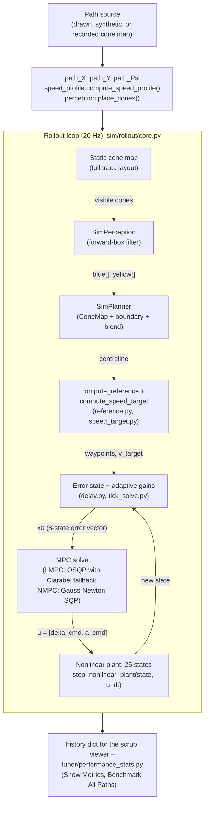
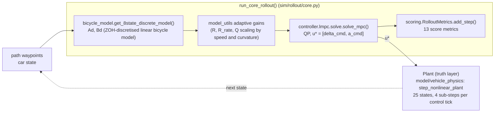
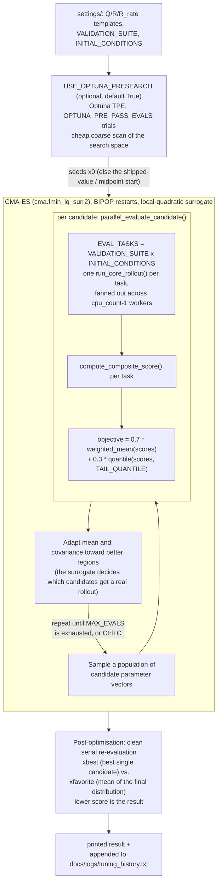

# Architecture: Closed Loop, Controllers, Tuner and Score

How the offline side fits together: one rollout function drives the plant with a controller, a scorer turns the run into one number, and a tuner searches controller weights against that number.

This doc covers the offline (`fsae_MPCTest`) side. File-level detail is in [offline_sim.md](../modules/offline_sim.md). The live ROS 2 side is in [fsds/](../fsds/integration_guide.md). For what "offline" and "FSDS" mean and how far each can be trusted, see [glossary.md](glossary.md). To operate the tools, see [offline_guide.md](../guides/offline_guide.md).

Two MPC controllers exist, chosen by one flag (`USE_NMPC` offline, `use_nmpc` live). The linear time-varying MPC ([lmpc.md](../controllers/lmpc.md)) is the offline default. The Frenet-frame nonlinear MPC ([nmpc.md](../controllers/nmpc.md)) is the alternative. The live launch script currently sets `USE_NMPC=true`, so a live run uses the NMPC even though both dataclass and offline defaults are off.

## Contents

1. [One rollout function serves the GUI, the tuner and the checks](#one-rollout-function-serves-the-gui-the-tuner-and-the-checks)
2. [The plant and the MPC do not share a state vector](#the-plant-and-the-mpc-do-not-share-a-state-vector)
3. [Perception and planning can be simulated](#perception-and-planning-can-be-simulated)
4. [Sim-to-real fault models sit inside the rollout](#sim-to-real-fault-models-sit-inside-the-rollout)
5. [Live nodes and their offline counterparts](#live-nodes-and-their-offline-counterparts)
6. [The tuner searches multiplicative weight scales](#the-tuner-searches-multiplicative-weight-scales)
7. [The composite score puts constraints above time above quality](#the-composite-score-puts-constraints-above-time-above-quality)
8. [Where configuration lives](#where-configuration-lives)

## One rollout function serves the GUI, the tuner and the checks

**What it does.** `run_core_rollout()` in `sim/rollout/core.py` runs one closed-loop drive at 20 Hz (`settings.DT = 0.05`). Each tick it measures tracking error, picks a reference and speed target, solves the MPC, pushes the command through a delay queue, steps the plant and adds the step to the score accumulator.

**Why one function.** The GUI, the headless tuner and the recorded-map check all call it. A path driven in the GUI and the same path benchmarked by the tuner therefore score identically. Two implementations would drift apart silently.

| caller | how it calls the rollout |
|---|---|
| `gui/simulation.py` (`simulate_closed_loop`) | `want_history=True`, returns the full step-by-step history for the scrub viewer |
| `tuner/offline_tuner.py` (`run_headless_rollout`) | `want_history=False`, scoring only, thousands of runs |
| `tuner/validation/recorded_map_rollout.py` | replays a recorded map and prints the live-vs-offline comparison table |

The same loop also exists live as the ROS 2 controller node. The live side cannot import the offline code, so the two are kept numerically identical by hand. See [offline_live_parity.md](offline_live_parity.md).

The diagram shows the case `USE_PLANNER = True`, where the car only sees a path rebuilt from cones. With `USE_PLANNER = False` (the default) the perception and planner boxes are skipped and the true reference path is tracked directly.



### Termination checks

A rollout ends on the first of these. All but the last mark a DNF (did not finish).

| condition | value | source |
|---|---|---|
| reached the path end | last two points, or within 3 m of the end and past 90% of the points | `sim/rollout/core.py` |
| solver failed on consecutive ticks | `MAX_FAILS = 5` | `settings/general.py` |
| stall | under 3.0 m of progress in any rolling 60-step (3 s) window | `STALL_CHECK_INTERVAL`, `STALL_MIN_DISTANCE` |
| off track | true `\|e_y\| > OFFTRACK_LIMIT` = 2.275 m (1.3 times the 1.75 m half width) | `settings/general.py` |

Scoring uses the true tracking error against ground truth, not the controller's possibly mislocalised belief. With `continue_after_dnf=True` a stall or off-track event flags the DNF but the rollout keeps running, which gives a full-lap comparison for diagnosis.

## The plant and the MPC do not share a state vector

**Plain version.** The car being simulated (the plant) is a detailed model with tyres, suspension and wheels. The controller predicts with a much smaller model of tracking error. They are different vectors with different meanings, so index `i` in one is not index `i` in the other. The gap between the two models is what makes feedback necessary.



| | plant (`model/vehicle_physics/state.py`) | LMPC prediction model (`model/bicycle_model.py`) |
|---|---|---|
| length | 25 (`N_STATES`) | 8 |
| meaning | global pose `X, Y, psi`, body velocities `vx, vy`, yaw rate `r`, lagged steering and acceleration, four wheel speeds, four suspension positions and velocities, four tyre lateral forces, the lateral-acceleration ceiling state `IDX_ALAT_LIM` | tracking errors `e_y, e_y_dot, e_psi, e_psi_dot, e_v`, an unused `e_a`, lagged steering `delta_act`, lagged acceleration `a_act` |
| indices 0-7 | `X, Y, psi, vx, vy, r, delta, a_act` | `e_y, e_y_dot, e_psi, e_psi_dot, e_v, e_a, delta_act, a_act` |

Indices 0 to 5 differ in meaning. Indices 6 and 7 hold the lagged steering and lagged acceleration in both vectors, which is a coincidence of layout, not a shared definition. `model/vehicle_physics/tracking.py` (`plant_to_tracking_error`) converts plant state and reference into the error vector the controller sees. Always index the plant through the `IDX_*` names, never by number.

The NMPC uses its own state layout (`controller/nmpc/layout.py`), described in [nmpc.md](../controllers/nmpc.md).

Plant parameters and the tyre model are in [vehicle_physics.md](vehicle_physics.md). The MPC's cost, constraints and solver are in [lmpc.md](../controllers/lmpc.md).

## Perception and planning can be simulated

`USE_PLANNER` (in `settings/general.py`) picks the reference the controller tracks.

- **`False` (default).** The controller tracks the true precomputed path. Faster, and isolates controller behaviour from planner mistakes.
- **`True`.** The controller sees only a path rebuilt from cones, one step at a time, the way the real car builds it. `SimPerception` (`sim/perception.py`) and `SimPlanner` (`sim/planner.py`) mirror the two live nodes closely enough that a bug reproduced with `USE_PLANNER=True` is a perception or planning bug, not a simulator artefact. Use it to test the controller against a noisy, incrementally built path. Leave it off for pure weight tuning.

**`SimPerception`: what the car can see.** Each step it filters the full static cone map to a forward box in the car's frame: further than `MIN_AHEAD` (0.5 m), closer than `LOOK_AHEAD` (25 m), within `LOOK_WIDE` (10 m) to either side. Cones appear only as the car approaches, not all at once. The live `sim_perception.py` node keeps the same box but also publishes every cone inside an omni-directional `look_radius` (25 m). `SimPerception` has no omni radius, so cones beside or just behind the car are visible live and invisible offline. This is a known parity gap.

**`SimPlanner`: turning cones into a path.** Each step it:

1. Adds the newly visible cones to a persistent `ConeMap` (`planning/cone_map.py`), which de-duplicates repeat sightings.
2. Rebuilds a centreline from all accumulated cones with `build_path_walls()`, falling back to `build_local_path()` (a cone-midpoint heuristic) when it fails, typically with too few cones.
3. Blends the fresh centreline with the previous one (`blend_paths()`, an exponential moving average, `PLANNER_PATH_BLEND = 0.4`), because a from-scratch rebuild each step would make the path jump.

The tracked centreline starts incomplete near the back of the visible cones and firms up as the car advances. `SimPlanner` emits path only. Speed targets come from `speed_profile.curvature_speed()` run over the reconstructed centreline, as live. The planner's smoothing, radius, horizon and blend constants (`PLANNER_*` in `settings/planner.py`) mirror the `centerline_planner` block of `fsae_params.yaml`. The centreline curvature-spike defect in the planner is described in [simulator_fidelity.md](simulator_fidelity.md).

## Sim-to-real fault models sit inside the rollout

Four separate mechanisms make the offline controller's inputs less clean. They fail differently and none substitutes for another.

| mechanism | what it changes | settings |
|---|---|---|
| fixed delay | delays a pose that is still fresh every tick by `DELAY_STEPS` | `DELAY_STEPS = 1` |
| delay jitter | perturbs only the controller's belief about the lag | `DELAY_JITTER_STEPS = 0.2` |
| pose-feed hold | repeats the last pose so the controller is briefly blind | `POSE_HOLD_*` |
| SLAM and cone noise | jitter and drift on the pose, jitter on cones | `SLAM_NOISE_ENABLED`, `CONE_NOISE_ENABLED`, both off |

**Pose-feed hold.** `PoseFeedHold` (`sim/sensor_noise.py`, used by the rollout) is a two-state Markov chain over fresh and held ticks. A hold starts with probability `POSE_HOLD_PROB` (0.05) and lasts a geometric number of ticks (`POSE_HOLD_MEAN_TICKS = 2.1`, capped at `POSE_HOLD_MAX_TICKS = 5`). The whole estimated state is frozen, not just position, and perception and planning are skipped for the duration because on the car the planner is triggered by the pose.

Live telemetry motivated it. Two runs on the same track and weights, differing in how badly the pose feed stalled, gave:

| | normal run | failed run |
|---|---|---|
| fresh-pose rate | 18.9 Hz | 6.4 Hz |
| repeated ticks | 5.3% | 60.7% |
| longest hold | 5 ticks (0.25 s) | 20 ticks (0.99 s) |
| peak `pose_age_s` | 347 ms | 1242 ms |

In the failed run the pose froze for about 1 s at 14 m/s, roughly 17 m travelled blind, and the car spun on resume. The source log for this table is not recorded in `docs/logs/`, so the figures are not re-verified. The defaults are fitted to the normal run.

Pose hold does not close the sim-to-real gap. Steering saturation stays far below live even with it firing correctly. See [simulator_fidelity.md](simulator_fidelity.md) for the measured gap and what has been ruled out.

## Live nodes and their offline counterparts

This table describes the live/FSDS side (`fsae_planning`) against what the offline sim uses in its place.

| live ROS 2 node or file | offline equivalent |
|---|---|
| `sim_perception.py` | `sim/perception.py` `SimPerception` (active when `USE_PLANNER=True`) |
| `centerline_planner.py` | `sim/planner.py` `SimPlanner` (active when `USE_PLANNER=True`) |
| `cone_map.py`, `boundary.py`, `path_utils.py`, `cone_sorting.py` | `planning/` (same algorithms, imports rewritten, shared helper split into `planning/geometry.py`) |
| `lmpc/` package (`controller.py`, `predict.py`, `adaptive_gains.py`, `constants.py`) | `controller/lmpc/`, `model/bicycle_model.py`, `controller/model_utils.py` |
| `nmpc/` package | `controller/nmpc/` (one module per live module) |
| `mpc/mpc_controller.py` with `standalone_output=true` | `sim/rollout/core.py` rollout loop (same design) |
| `telemetry/scoring.py` | `sim/scoring.py` (verbatim copy apart from inlined constants) |
| `cone_recorder.py` | `sim/track_io.py` and the GUI's Load Recorded Track (the recorder writes what the loader reads) |

`stanley_controller.py` is the live Stanley controller, mirrored so the staging copy can stand up the full stack. The tuner and offline sim only drive the MPC controllers. See [stanley.md](../controllers/stanley.md) for its steering law.

## The tuner searches multiplicative weight scales

`tuner/offline_tuner.py` searches the MPC cost weights automatically by running many closed-loop rollouts and minimising one score. Run it with `python -m tuner.offline_tuner` from `fsae_MPCTest/`.



### The search space is 9 scales plus 5 NMPC values

The vector has two parts.

- **Head, 9 multiplicative scales**, one per tunable diagonal entry: `TUNABLE_Q_IDX = [0,1,2,3,4]`, `TUNABLE_R_IDX = [0,1]`, `TUNABLE_R_RATE_IDX = [0,1]`. Each entry is `vec[j] * template[i,i]`. Bounds are `[0.1, 10.0]` (one decade either way), except `Q_BOUNDS[0]` (lateral error) which starts at `1.0`. At a lower floor CMA-ES found weight sets that collapsed the lateral-error cost while heading-rate cost climbed, letting heading error grow before the car turned in. The scoring did not punish this enough, so the floor is a guard, not a fix.
- **Tail, 5 absolute NMPC values** (`TUNABLE_NMPC`): `rjerk_delta` (1 to 400), `corner_factor_k` (8 to 60), `rrate_zone_boost_straight` (1 to 4), `rrate_zone_ease_approach` (0.1 to 1.5), `rrate_zone_floor_corner` (0.05 to 1). They cannot use the template mechanism because they are not diagonal entries. They only matter when `USE_NMPC=True` is set before the tuner imports `settings`. Under the LTV-QP they are ignored and waste search dimensions. Emptying `TUNABLE_NMPC` restores the 9-parameter search.

Multiplicative scales keep the problem dimensionally consistent whatever the template's magnitude, and a floor below 1 lets the tuner reduce a weight rather than only raise it.

**Starting point.** The head starts at the geometric midpoint `sqrt(lower * upper)`, which is 1.0 for `[0.1, 10.0]` (template weights unscaled). The tail starts at the shipped `settings` values, so generation 0 evaluates the current car. If `USE_OPTUNA_PRESEARCH` is on, the Optuna result replaces `x0`.

### Optuna pre-search seeds CMA-ES

`USE_OPTUNA_PRESEARCH` (default `True`) runs a short Optuna TPE (Tree-structured Parzen Estimator) search first, with `OPTUNA_PRE_PASS_EVALS` trials (150, which is 10% of `MAX_EVALS = 1500`). This budget is on top of, not carved out of, `MAX_EVALS`. TPE is cheaper and coarser than CMA-ES. The point is to find a promising region so more of the CMA-ES budget goes to local refinement.

The pre-pass reuses the same objective and worker pool as CMA-ES and runs trials sequentially (`n_jobs=1`), since each trial already fans out across every core. It honours the same Ctrl+C flag (`_stop_requested`). Its result is written to the history file with the run's weights. It needs the optional `optuna` package.

Entries above the `COMPARABLE HISTORY RESUMES HERE` marker in `docs/logs/tuning_history.txt` are not comparable to each other or to later runs. The scoring weights, the scoring and simulation stack, and the pre-search all changed across that marker. The header of that file lists the causes.

### CMA-ES is a derivative-free search

CMA-ES (Covariance Matrix Adaptation Evolution Strategy) needs only a way to run a rollout and read a score. That fits here: the objective is noisy and has no clean formula from weight to score.

Each generation it keeps a Gaussian cloud over candidates, samples a population, scores each with a real rollout, and shifts the cloud toward better regions, learning which directions in weight space matter. The tuner uses `cma.fmin_lq_surr2`, with two additions.

- **BIPOP restarts.** Large restarts (population doubles each time, `incpopsize=2`) alternate with small restarts (local refinement). `max_restarts = 7` caps the session. The value is a round number, not measured.
- **Local-quadratic surrogate.** A cheap quadratic fitted to recent candidates predicts scores, so only promising candidates (plus a periodic sample to keep the surrogate honest) get a real rollout. The tuner's own note puts this at roughly 3 to 10 times fewer real rollouts.

Initial step size is `sigma0 = 0.65` with per-dimension spread `CMA_stds = 0.23 * log(upper/lower)`. For a decade-wide dimension that is about 1.06 in log space, wide enough to explore, not so wide that early generations are wasted. The search is bounded (`bounds` option), and `CMA_active=True` adds the active negative-covariance update.

### Every candidate is scored on a suite of tasks

`EVAL_TASKS` is the cross-product of `VALIDATION_SUITE` (currently 5 synthetic corner paths: spiral, sudden turn, hairpin, FS corner, micro slalom) and `INITIAL_CONDITIONS`: a nominal start, and a perturbed start (`ey0 = 0.2 m`, `epsi0 = 0.05 rad`) that forces weights which also recover from a bad start. That is 10 tasks per candidate, run in parallel across `cpu_count - 1` workers.

```
objective = 0.7 * weighted_mean(scores) + 0.3 * quantile(scores, TAIL_QUANTILE)
```

The tail term stops CMA-ES from finding weights that average well by driving one corner shape perfectly and another badly. `TAIL_QUANTILE` (0.8) replaced a hard `max()`. With the flat DNF penalty, `max()` let one unlucky task out of ten swing the objective by about 0.9 and drown the twelve continuous quality metrics. A plausible hand-picked gain set once ranked third-worst of six, below two deliberately pathological sets, because a single one of its ten tasks DNF'd. That is a discontinuous, high-variance signal for CMA-ES. A high quantile keeps the intent, punish weights that fail badly somewhere, and needs more than one bad task before it dominates. `TAIL_QUANTILE = 1.0` restores the old `max()` exactly.

### The final answer comes from a clean serial comparison

After the budget is spent (or on Ctrl+C), two candidates are re-evaluated serially, outside the noisy parallel pool.

- **`xbest`** is the best single candidate seen.
- **`xfavorite`** is the mean of the final search distribution, usually more robust than one lucky sample.

The lower score is printed and appended to `docs/logs/tuning_history.txt` (path `TUNING_HISTORY_PATH` in the tuner). The printed diagonals and the history entry carry `Q`, `R` and `R_rate` only. The five NMPC tail values found by a search are not printed or logged.

## The composite score puts constraints above time above quality

One implementation, `sim/scoring.py`, scores every rollout: the tuner, the GUI's Show Metrics and Benchmark All Paths, and (as a verbatim copy) live runs. See [offline_live_parity.md](offline_live_parity.md) for how the live copy is kept identical.

### The 13 metrics

`RolloutMetrics.add_step()` accumulates them once per tick. `finalize()` normalises them, mostly to RMS values.

| # | metric | what it measures |
|---|---|---|
| 0 | `rmse` | tracking error: `1.2*e_y^2 + 0.4*e_psi^2`, root-mean-squared over the run. The main quality signal. |
| 1 | `yaw_rms` | `sqrt(mean(0.8*r^2))` over the true yaw rate `r`. Penalises a heading that wobbles. |
| 2 | `smooth_rms` | RMS of step-to-step control change. A failed solver step adds a flat +5.0 to the sum. |
| 3 | `steer_rms` | RMS steering command, overall steering effort. |
| 4 | `accel_rms` | RMS acceleration and brake command, overall longitudinal effort. |
| 5 | `max_steering` | largest steering command issued. |
| 6 | `steering_sat_ratio` | fraction of steps with steering within 95% of `max_steer`, how often the controller is pinned. |
| 7 | `jerk_rms` | RMS of the second difference of control, catches abrupt changes in how fast commands change. |
| 8 | `max_yaw_rate` | fastest yaw rate reached. |
| 9 | `steering_reversal_rms` | magnitude-weighted RMS of steering sign flips (beyond a 0.02 rad noise gate): `sqrt(sum(swing^2) / n)`, `swing = \|u\| + \|u_prev\|` at the flip. A small trim wiggle contributes almost nothing and a large swing dominates, which separates controller hunting from a twisty path that legitimately needs more direction changes. A flat flip count cannot. Raw count and rate are reported as informational fields (`steering_reversals`, `steering_reversal_rate`). |
| 10 | `peak_lateral_error` | worst `\|e_y\|` at any point, a safety margin independent of the average. |
| 11 | `speed_rmse` | RMS of `v_actual - v_target`. |
| 12 | `accel_reversal_rms` | the same construction as metric 9 applied to `a_cmd`, with a 0.02 m/s^2 gate. Without it nothing discourages `a_cmd` oscillating across zero. Keyword-only with a default so older callers still work. |

### Three tiers, not one sum

```python
quality = SCORE_WEIGHTS @ (metrics / METRIC_SCALES)             # normalised weighted sum

# Tier 1: hard constraints. Infeasible runs land above CONSTRAINT_FLOOR
if dnf or offtrack:
    return CONSTRAINT_FLOOR + (DNF_PENALTY + offtrack*DNF_OFFTRACK_PENALTY) * (1 - progress)
if not reached_end:
    return CONSTRAINT_FLOOR + DNF_PENALTY * (1 - progress)

# Tier 2: primary objective, how much slower than physically possible
time_cost = clip(1.0 - time_bonus, 0, 1)   # time_bonus = optimal_lap_time / actual_time

# Tier 3: quality shapes the result, it does not drive it
score = TIME_OBJECTIVE_WEIGHT * time_cost + QUALITY_WEIGHT * quality
if inaccurate_count > 0:
    score += abs(score) * min(5, inaccurate_count) * 0.1        # capped at +50%
```

Current constants: `CONSTRAINT_FLOOR = 10.0`, `DNF_PENALTY = 3.0`, `DNF_OFFTRACK_PENALTY = 3.0`, `TIME_OBJECTIVE_WEIGHT = 1.0`, `QUALITY_WEIGHT = 0.35`, `COMPLETION_THRESHOLD = 0.98`. `SCORE_WEIGHTS` has 13 entries summing to 1.0 (the tuner asserts it).

**Why three tiers.** A weighted sum can only reach solutions on the convex hull of the trade-off surface. Where that surface is non-convex, as vehicle dynamics normally is, whole regions of good behaviour are unreachable by any weight vector. Measured: a deliberately hunting gain set outscored a sane one purely by tracking the line more tightly, and kept winning after `METRIC_SCALES` made the smoothness terms bite. Re-weighting cannot fix that, because the hunting set is better on the dominant term.

- **Constraints are not prices.** A flat +3.0 DNF penalty on the metric axis would let a tight-tracking run buy its way out of a crash. Infeasible runs sit strictly above `CONSTRAINT_FLOOR`, and no quality score lifts them out. Within the band, score still improves with `progress`, so the optimiser keeps a gradient.
- **The objective is time in real units.** `time_bonus` is `optimal_lap_time / actual_time` (`speed_profile.optimal_lap_time()`), so `time_cost = 0.15` means the lap took about 18% longer than physically possible. Hunting cannot buy lap time, so it only costs.
- **`reached_end` decides completion, not `progress`.** `progress` comes from a bounded nearest-index search that stops short of the last point, so a fully completed run reports about 0.90. Thresholding on `progress` would mark every success infeasible. `COMPLETION_THRESHOLD` is only a fallback for callers that cannot supply `reached_end`. Live, a run against a precomputed speed profile supplies it through `LapProgressTracker`. A run against the live planner topic has no known path end and falls back to the threshold.
- **`COMPLETION_BONUS_WEIGHT` (0.5) and `TIME_BONUS_WEIGHT` (0.25) are not read by the score.** Completion is a precondition and time is the objective. Both constants are kept in `settings/scoring.py` and inlined in the live scorer so CSV headers and the history file keep their fields. Neither has any effect on a score.

`METRIC_SCALES` divides each metric by a reference magnitude before weighting, so `SCORE_WEIGHTS` expresses priority and not unit conversion. Without it a metric's influence is `weight * typical magnitude`. Measured before it was added, all ten non-tracking metrics together contributed +0.0064 against a tracking term of -0.2649, so the score was effectively single-objective. `tuner/performance_stats.py` prints each metric's effective contribution (`weight * metric / scale`) and share, which makes this visible in a benchmark report. Scores logged under an earlier `METRIC_SCALES` or `SCORE_WEIGHTS` are not comparable to current ones.

**Reading a score.** Lower is better. A finishing run scores `time_cost + 0.35 * quality`. Both terms are non-negative, so finishing scores are positive. A run with every metric exactly at its reference scale has `quality = 1.0`. The DNF band starts at 10.0. See [tuning.md](../guides/tuning.md) for tuning `SCORE_WEIGHTS` and `METRIC_SCALES`.

The inaccurate-solver factor (up to +50% at 5 or more `OPTIMAL_INACCURATE` solves in one rollout) is `score + abs(score)*factor`, not a flat add, so it scales with the score and never turns a good finishing run into DNF territory.

## Where configuration lives

| what | where |
|---|---|
| tuning knobs, weights, DNF and scoring constants | the `settings/` package (`general`, `noise`, `planner`, `lmpc`, `nmpc`, `solver`, `scoring`). Consumers use `import settings; settings.X`, so a runtime `setattr` override reaches them |
| vehicle physics (mass, geometry, tyres, suspension, aero, actuator limits, lateral-acceleration ceiling) | `model/vehicle_physics/params.py`, see [vehicle_physics.md](vehicle_physics.md) |
| the MPC's internal linear model | `model/bicycle_model.py`, reading `Cf`, `Cr`, `tau_delta`, `tau_a`, `lf`, `lr`, `m`, `Iz` from the same `VehicleParams` |
| the live counterparts of the weights | `mpc_params.py`, `nmpc_params.py`, `fsae_params.yaml`, see [offline_live_parity.md](offline_live_parity.md) |

`max_steer`, `max_accel` and `max_accel_brake` in `VehicleParams` feed the MPC's hard QP constraints directly, so a changed actuator limit propagates to the controller on the offline side. Replacing the Pacejka tyre coefficients with measured data also requires recomputing the linear cornering stiffnesses `Cf` and `Cr` the MPC uses, via `C_eff ≈ mu * Fz_nominal * B * C * D`. Skipping that leaves the prediction model quietly mismatched to the plant, with no error raised.

For solver and search settings (`ROLLOUT_EPS`, `ROLLOUT_MAX_ITER`, `MAX_EVALS`, `PATH_N_POINTS`, `FAST_TEST_MODE`) see `settings/solver.py` and [offline_guide.md](../guides/offline_guide.md). `ROLLOUT_EPS` and `ROLLOUT_MAX_ITER` are looser than the live solver's for faster mass evaluation.
