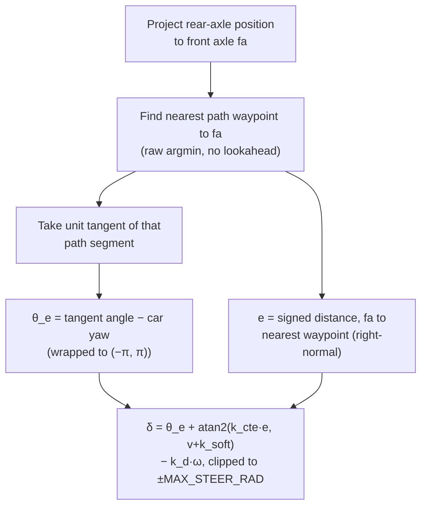

# The Stanley Controller

Reference for the third selectable controller, `stanley_controller.py`
(`control_utils.StanleyController`), chosen by the launch arg
`controller:=stanley`. Unlike [`lmpc.md`](lmpc.md) and [`nmpc.md`](nmpc.md),
this repo's own tuner and offline simulator never drive against Stanley —
it exists in `fsds_simulator/` purely so that mirror can stand up the full
live stack, see `architecture.md`'s "Second controller" section. This doc
covers it anyway because live changes have started landing on it (see
"Speed-target smoothing" below), and because untangling what it shares with
the MPC path (`curvature_speed()`, `tracking_error_speed_gate()`) from what
is Stanley-specific needs to be written down somewhere.

For the two MPC controllers, see [`lmpc.md`](lmpc.md) and [`nmpc.md`](nmpc.md).
For the worked-by-hand arithmetic behind `e_y`/`e_psi`, see
[`error_state_reference.md`](error_state_reference.md) — Stanley computes
both directly (not via a state-space model) but reports them in the same
sign convention so a Stanley log and an MPC log plot on the same axis.

## Table of Contents

1. [What Stanley is, in one line](#what-stanley-is-in-one-line)
2. [The steering law](#the-steering-law)
3. [Where speed comes from](#where-speed-comes-from)
4. [What Stanley does NOT have, compared to the MPC controllers](#what-stanley-does-not-have-compared-to-the-mpc-controllers)
5. [Speed-target smoothing, added 2026-09-16](#speed-target-smoothing-added-2026-09-16)
6. [Sign conventions and telemetry parity](#sign-conventions-and-telemetry-parity)

---

## What Stanley is, in one line

**Plain version:** Stanley looks at how far sideways the car's front wheels
are from the path and how much its heading disagrees with the path's
direction, and turns the steering wheel proportionally to both — no
prediction, no optimisation, just a formula evaluated fresh every tick.

Contrast with the MPC controllers: `MPCController`/`NMPCController` predict
several seconds ahead and solve for the input sequence that minimises a cost
over that whole horizon. Stanley has no model of the future and no horizon —
it is a pure feedback law on the *current* geometric relationship between car
and path (Thrun et al., DARPA Grand Challenge 2005). It is far simpler to
reason about and far cheaper to compute, at the cost of the anticipation an
MPC gets from its prediction model.

## The steering law

```
δ = θ_e + arctan(k_cte · e / (v + k_soft)) - k_d · ω
```

| term | meaning |
|---|---|
| `θ_e` | heading error: path tangent angle minus car yaw (rad), positive when the path turns left relative to the car |
| `e` | cross-track error: signed lateral distance from the front axle to the nearest path point (m), positive when the axle is to the RIGHT of the path |
| `v` | car speed (m/s) |
| `k_soft` | speed-softening constant (m/s); prevents the arctan term from saturating steering at near-zero speed, where a tiny `e` would otherwise demand full lock |
| `k_cte` | cross-track gain; higher corrects lateral error faster but oscillates on a fast straight |
| `k_d · ω` | yaw-rate damper (added on top of the textbook formula); subtracts damping proportional to the car's own current yaw rate |

Implementation, `control_utils.StanleyController.compute()`
(`control/fsae_control/fsae_control/control_utils.py`):

1. Project the control point from the car's rear-axle position to the front
   axle: `fa = car_pos + wheelbase * [cos(yaw), sin(yaw)]`. Stanley is
   defined at the front axle, not the car's reference point.
2. Find the nearest path waypoint to `fa` by a raw `argmin` over Euclidean
   distance — no lookahead, no smoothing local to this step.
3. Take the unit tangent of the path segment leaving that waypoint (or
   entering it, at the last waypoint) as the local path direction.
4. `θ_e` = that tangent's angle minus car yaw, wrapped to `(-π, π)`.
5. `e` = signed distance from `fa` to the nearest waypoint, projected onto
   the path's right-normal (positive when the axle is right of the path).
6. Assemble `δ` per the formula above, clip to `±MAX_STEER_RAD`.



**Why the yaw-rate damper exists.** The textbook cross-track term alone has
no memory of how fast the heading is already changing, so it overshoots on
a correction and induces a left-right sway. Subtracting `k_d · ω` (yaw rate,
positive = turning left) reduces `δ` exactly when the car is already
swinging in the commanded direction, damping the oscillation the plain
formula would otherwise produce. This is the primary fix for that sway, not
a minor refinement.

**Why the nearest-point search has no lookahead.** Unlike `curvature_speed()`
below, which deliberately resamples and smooths a scan window to reject
per-frame path noise, the steering law's own `e`/`θ_e` computation is a raw
nearest-point/tangent read on the live path, unmodified. This means a single
noisy re-fit tick can shift the nearest index or tangent directly into a
steering-angle spike — there is no local averaging standing between the
live planner's frame-to-frame wiggle and the steering command. See "Speed-target
smoothing" below for why this matters in combination with `curvature_speed()`.

## Where speed comes from

Stanley does not compute speed itself — it calls the same
`control_utils.curvature_speed()` the MPC controllers fall back to when no
precomputed profile is loaded, or `precomputed_speed_at()` against the same
kind of `speed_profile.csv` when one is (`map_path` ROS param, mirroring
`mpc_controller.py`'s identical parameter — a Stanley run and an MPC run on
the same track are guaranteed the same speed target when both use the same
`map_path`, differing only in steering behaviour). See
`docs/reference/control_mechanisms.md`'s "Dynamic speed cap" section and
`curvature_speed()`'s own docstring for the scan-window/braking-distance
mechanism; it is not repeated here since it is not Stanley-specific.

## What Stanley does NOT have, compared to the MPC controllers

Stanley is deliberately much smaller than either MPC controller. As of
writing, before the fix below, it had none of the following that
`mpc_controller.py` has always had around the same shared
`curvature_speed()` output:

- No rate limiting on `curvature_speed()`'s tick-to-tick fall
  (`V_CURV_FALL_RATE`).
- No `tracking_error_speed_gate()` call at all — nothing scaled speed down
  when tracking was already bad.
- No rate limiting on the composed target's rise
  (`SPEED_TARGET_RISE_RATE`).
- No fixed control-loop timer: `mpc_controller.py` runs `_control_step` off
  a 20 Hz timer (`CONTROL_HZ`) decoupled from pose arrival; Stanley's
  `_control_step` fires directly from `_pose_cb`, once per incoming
  `/fsae/slam/car_position` message. This is a structural difference, not a
  bug, but it means any smoothing added to Stanley cannot assume a fixed
  tick period the way `mpc_controller.py`'s constants (expressed as `X /
  CONTROL_HZ`) do.
- No stale-path/emergency-brake handling: `mpc_controller.py` resets its
  solver and forces a brake when the path is stale or pose is missing
  (`PATH_TIMEOUT`, `path_stale`); Stanley's `_control_step` only early-returns
  when the path has fewer than 2 points, with no timeout-based staleness
  check. Not addressed by the fix below — flagged here as a known gap, not
  fixed since it wasn't the reported symptom.

## Speed-target smoothing, added 2026-09-16

**Symptom.** Live testing (no precomputed speed profile, live planner
active) produced a spin-out within the first few seconds of a run: steering
oscillated between near-full-left and full-right lock within about 1.5
seconds while the car was still accelerating, heading error grew past 30
degrees, and the car crashed. Both curvature spikes and the underlying
cause are documented in `docs/logs/planner_only_speed_target_oscillation.md`
— the live planner re-fits the centreline every tick, and the result carries
a few centimetres of lateral wiggle that survives `curvature_speed()`'s own
internal denoising often enough to swing its output several m/s in a single
50 ms tick, even on a straight.

**Why Stanley was worse than MPC here, not just equally exposed.** MPC
already absorbed this noise (see below); Stanley took `curvature_speed()`'s
raw return value straight into the drive command, AND its own steering law
reads the identical unsmoothed live path for `e`/`θ_e` (see "The steering
law" above). A single bad re-fit tick could therefore spike the speed
target down and the steering angle simultaneously, with nothing in Stanley
to absorb either — matching the observed correlated event exactly.

**Fix.** `stanley_controller.py` now ports the same three safeguards
`mpc_controller.py` already applies around `curvature_speed()`'s output,
active only in the live (no precomputed profile) branch:

- **`V_CURV_FALL_RATE`** (7.0 m/s²) — rate-limits how fast `curvature_speed()`'s
  raw output may fall tick-to-tick, since the function itself carries no
  memory of its previous value.
- **`tracking_error_speed_gate(self._stanley.last_e_y, self._stanley.last_e_psi)`**,
  itself rate-limited by **`GATE_RATE_LIMIT`** (2.0 /s, either direction) —
  scales the speed target down once tracking error grows, so a controller
  that is already off-line is not simultaneously told to go faster.
- **`SPEED_TARGET_RISE_RATE`** (7.0 m/s²) — bounds the final composed
  target's rise, seeded from the car's actual current speed on the first
  tick so a standing start does not jump straight to the full target.

Because Stanley has no fixed-frequency timer (see above), all three limiters
are expressed against a measured `dt` between ticks
(`time.perf_counter()`-based), not a `CONTROL_HZ`-derived constant the way
`mpc_controller.py`'s are. All rate-limiter state
(`_v_curv_prev`/`_gate_prev`/`_v_des_prev`/`_last_tick_time`) resets to
`None` whenever the path becomes too short to track, mirroring
`mpc_controller.py`'s equivalent reset on its own stale-path branch, so a
fresh start after a lost path never inherits a rate limit computed against a
now-meaningless previous tick.

The precomputed-speed-profile branch (`precomputed_speed_at()`) is
unaffected — none of the three limiters apply there, matching
`mpc_controller.py`'s identical exemption (that branch is not re-derived
from a noisy live path, so there is nothing to smooth).

**Status: live-tested once, 2026-09-16, on a full recording lap of
`comp_test_map_2`** (`fsae_logs/stanley_control_20260916-081934.csv`). The
car reached a corner with `e_y` growing to -1.03 m and `e_psi` to 24 deg,
steering saturating at the 25 deg lock, then recovered and finished the lap
normally — a materially better outcome than the pre-fix run on the same
track family, which spun out under similar tracking-error growth. One run
is not exhaustive validation; treat this as a first positive signal, not a
closed investigation, and re-check on further tracks/conditions before
treating it as fully proven the way `dynamic_speed_cap()` has been.

## Sign conventions and telemetry parity

`StanleyController.compute()` deliberately re-signs its own internal
cross-track error before exposing it: `e` (used inside the formula) is
positive when the front axle is to the *right* of the path, but
`self.last_e_y = -e` — the same convention `mpc_core.py`'s
`last_telemetry['e_y']` uses (positive = left/CCW) — so a Stanley run's CSV
and an MPC run's CSV can be plotted on the same axis with no manual sign
flip. `θ_e` needs no such flip; it already matches (positive = path turns
left of car) in both controllers. This parity is why
`tracking_error_speed_gate()` above can consume `self._stanley.last_e_y`/
`last_e_psi` directly, unmodified, despite that function having been written
against `mpc_core.py`'s telemetry dict in the first place.
